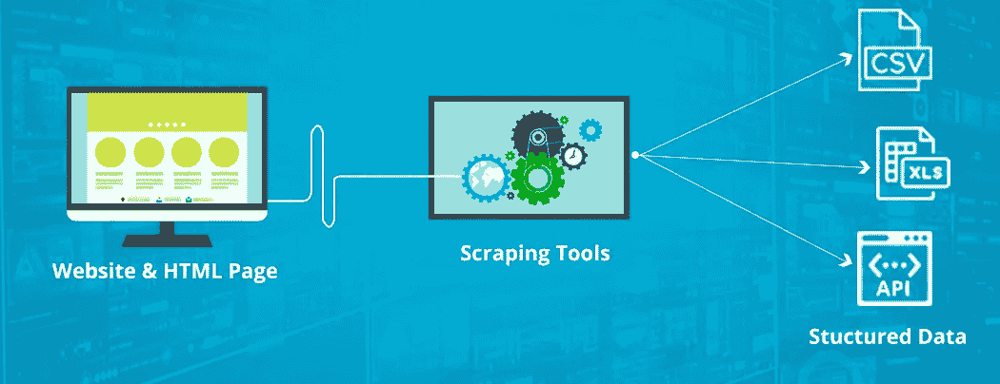
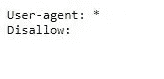
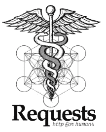
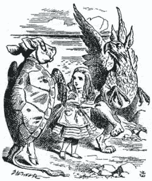
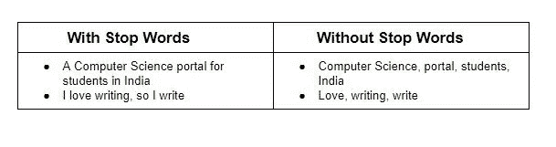
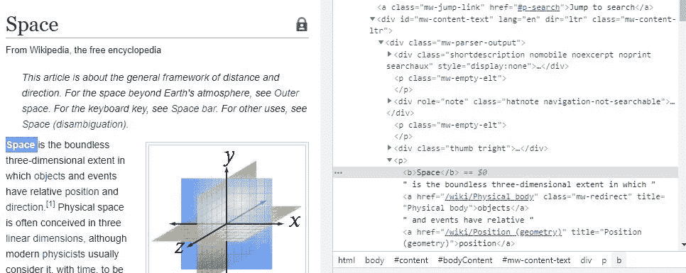

# 用美丽的声音抓取维基百科

> 原文：<https://medium.datadriveninvestor.com/web-scraping-wikipedia-with-beautifulsoup-a5d5fe6454ee?source=collection_archive---------5----------------------->

Photo by [Sergey Pesterev](https://unsplash.com/@sickle?utm_source=unsplash&utm_medium=referral&utm_content=creditCopyText) on [Unsplash](https://unsplash.com/s/photos/waterfall?utm_source=unsplash&utm_medium=referral&utm_content=creditCopyText)

# 介绍

想象一下，你被分配了一项任务，从互联网上提取大量数据，并需要在更短的时间内以良好的格式组织这些数据。手动浏览每个页面并获取数据会花费很多时间。有什么方法可以让我们的工作变得更简单，在结构化的格式中变得更快捷？嗯，网络抓取是答案。

互联网上有大量的信息，这是一种非结构化的格式。如果我们可以收集这些信息，并以结构化的格式进行排列，这些数据可以用于许多分析目的，也可以从数据中获得洞察力。在本教程中，我将向你展示如何从维基百科中删除数据

# 什么是网页抓取？

Web 抓取用于从互联网中提取非结构化数据，并将其存储为结构化格式。这可以由人或机器人来完成。

网页抓取的一些应用包括

1.  网络搜集可用于从网站上收集企业或个人的联系方式。
2.  网络抓取用于从 Twitter 等社交媒体网站收集数据，以发现流行趋势。
3.  网络抓取用于从网站收集大量数据，并对这些数据进行分析，用于进行研发。

# 网络抓取合法吗？

有些网站允许抓取网页，有些网站不允许。要知道一个网站是否允许网络抓取，我们需要查看网站的 robots.txt 文件。要找到 robots.txt，我们需要输入 URL 并添加“/robots.txt”。例如，如果我们想放弃 vizagfood.com，在 URL 框中输入[https://www.vizagfood.com/robots.txt](https://www.vizagfood.com/robots.txt)。在这里，我们有三个访问类别。在第一种情况下，我们可以访问所有数据，而在第二种情况下，我们不能访问数据，在最后一种情况下，我们只能访问部分数据。

Access types

这里的 section 代表不被抓取的部分。就 vizagfood.com 而言，robots.txt 包含以下内容:

这意味着我们可以抓取这个网站上的所有部分。

# 网页抓取是如何工作的？

当您运行代码时，会向您提到的作为输入 URL 的 URL 发送一个请求。作为对请求的响应，服务器发送数据并允许您阅读 HTML 页面。然后，代码解析 HTML 或 XML 页面，找到数据并提取出来。

# 我们要用什么工具？

我们将使用 Python 模块 requests 和 BeautifulSoup。

python 模块“Requests”将允许我们发送 HTTP 请求来获取 HTML 文件。

请求文件的链接:【https://requests.readthedocs.io/en/master/ 

Requests Module

网络抓取最常用的库之一是“BeautifulSoup”。它用于解析 HTML 或 XML 文件。它创建有助于轻松提取数据的解析树。

链接到 BeautifulSoup 文档:[https://www.crummy.com/software/BeautifulSoup/bs4/doc/](https://www.crummy.com/software/BeautifulSoup/bs4/doc/)

BeautifulSoup module

“urllib”模块是 python 的 URL 处理模块。它用于获取 URL。这是一个包含不同模块的包，用于打开和读取文件，解析 URL 和解析 robots.txt 文件

# 先决条件

*   python3
*   要求
*   beautifulsoup4

# 我们来编码吧！

# 导入必要的库

在这里，我们导入执行 Web 报废所需的必要库。上面讨论了一些库，如 urlib、beautiful soup(bs4 ),其余的在下面讨论。

*   NLTK 代表自然语言工具包。它包含让机器理解人类语言并以适当的响应回复人类语言的包。记号化、标点符号、字符计数和单词计数是其中的一部分。
*   一个*正则表达式*是一个特殊的字符序列，它可以帮助你匹配或查找其他字符串或字符串集模块“re”在 Python 中提供了对正则表达式的完全支持
*   停用词是搜索引擎已经被编程忽略的常用词(例如“the”、“a”、“an”、“in”)

上面几行用于读取 URL，这里 soup 是一个解析的 HTML 数据，我们将把页面内容转换成一个 BeautifulSoup 对象，这将允许我们解析 HTML 标签。然后，我们需要找出哪些 HTML 标签包含文章的文本。

 [## 不管准备好了没有，革命就在我们面前|数据驱动的投资者

### “对于技术如何影响我们的生活和重塑经济，我们必须形成全面的全球共识……

www.datadriveninvestor.com](https://www.datadriveninvestor.com/2019/02/12/ready-or-not-the-revolution-is-upon-us/) 

为此，我们将使用谷歌浏览器中的 Inspect 工具。打开我们需要抓取的文章，在页面上点击右键，从下拉菜单中选择 Inspect。这将显示如下所示的工具:

点击上面的小箭头按钮，找到与你在页面上看到的任何内容相对应的 HTML 标签。当您将鼠标悬停在页面上想要选择的文本(在本例中是文章的文本)上时，您将看到哪些 HTML 标签用于标识该文本。

当我们检查维基百科中的空间网站时，我们正在对维基百科页面执行网络抓取，所有的文本数据都存储在

标签中，即段落标签中。我们的目标是获取

标签中的内容并检索它。从解析后的 soup 对象中，我们应用“find_all”方法来获取

标签中的内容，我们将把它附加到文本中。

# 预处理数据

我们使用正则表达式过滤掉不必要的内容。这有助于我们从内容中删除数字，删除空格，也有助于将大写转换为小写。

在“sent_tokenize”方法的帮助下，我们可以将收集到的文本转换成句子。本教程的 Github 库可以在这里找到:

 [## ajaymuktha/网络搜集

### 通过网络搜集从维基百科收集数据

github.com](https://github.com/ajaymuktha/WebScraping) 

恭喜你！，您刚刚学会了如何从维基百科中删除数据。暂时就这样吧！我希望你喜欢这篇文章。

参考:

 [## 美丽的汤:用 Python——真正的 Python——构建一个 Web 刮刀

### 在本教程中，你将走过网页抓取过程的主要步骤。你将学习如何写剧本…

realpython.com](https://realpython.com/beautiful-soup-web-scraper-python/)  [## 从 Web 读取数据:Web 抓取和正则表达式

### 在这一章中，你将学习如何从网络服务器中读取数据。urllib 模块允许您从…下载数据

www.summet.com](https://www.summet.com/dmsi/html/readingTheWeb.html)