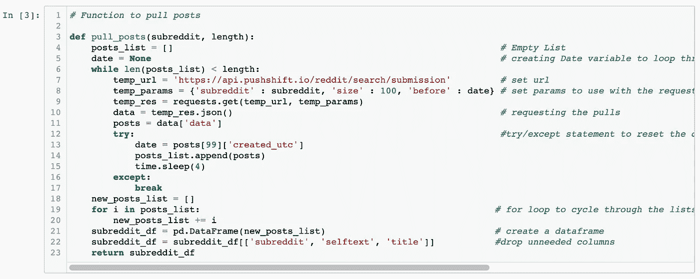
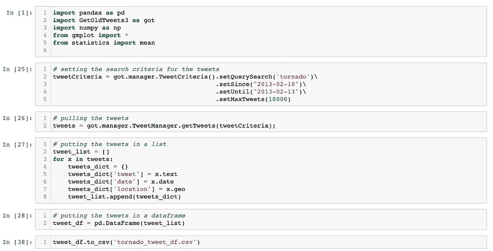

# 使用 Python 进行 Web 抓取第 1 部分:我的经验的高级解释

> 原文：<https://medium.datadriveninvestor.com/web-scraping-with-python-part-1-a-high-level-explanation-of-what-ive-learned-5401d46fbec2?source=collection_archive---------13----------------------->

现在是午夜，我已经是第三次轮班回到我原来的服务领域工作了。如果你读过我以前的文章，你就会知道我在三月份被一家酒店的总经理解雇了。长话短说，我现在回来在另一家酒店做夜间审计员，这似乎是一项临时任务。我已经有近两个月没有写任何关于我的数据科学之旅的东西了。这篇文章的主题是网络搜集。

在我的数据科学沉浸式训练营期间，当我们准备为一个项目开发一个模型来预测 Reddit 上特定帖子的来源时，我们被介绍到了 web 抓取。在这些课程中，我们简要介绍了 HTML，然后使用 Beautiful Soup 来执行我们的抓取。对于这个特定的项目，我使用 Pushshift API 从两个子编辑中抓取信息。遇到的限制包括每次请求只能收集 100 个帖子，这对于训练模型来说是不够的。为了解决这个问题，我创建了一个函数，其中包括使用“时间”包来实现 2 秒钟的等待时间；while 循环，为函数运行一定次数的迭代；和一个变量，用于在最后一次收集帖子时重新开始下一次迭代。每次循环迭代时，我都用最后一篇文章的 UTC(在抓取中收集的)替换变量的值。我使用这个变量来确定从哪里开始下一次迭代。最终，我能够使用下图中的函数为我的特定项目收集所有数据。

Python code for using Pushshift API (Chris Johnson)

在接下来的几周里，我唯一的网络抓取经验就是使用 API 和现有的包。下一次我使用 webs craping 是为了一个项目，该项目使用 twitter 数据建立一个模型来检测特定的 tweet 是否与自然灾害有关。为了这个项目，我和我的时间将测试几种不同的工具，包括 [Twint](https://github.com/twintproject/twint) 、 [Tweepy](https://www.tweepy.org/) 和 [GetOldTweets3](https://pypi.org/project/GetOldTweets3/) 。这些工具都提供了本质上相同的产品，让我可以从 twitter 上抓取推文。他们共享相同的功能，允许我们使用特定的关键词、地点、日期等来抓取推文。最终，我们能够使用类似于下面 GetOldTweets3 的代码，为我们的项目收集三种不同类型的灾难的 tweet 数据。

Python code for using GetOldTweets3 (Chris Johnson)

如果你对当我遇到一个 web 抓取项目时会发生什么感兴趣，我没有像上面那样的 API 或库，请留意。我将在本周晚些时候发布我从零开始编写网络抓取项目的经历，好家伙，这是一次有趣而令人兴奋的冒险。