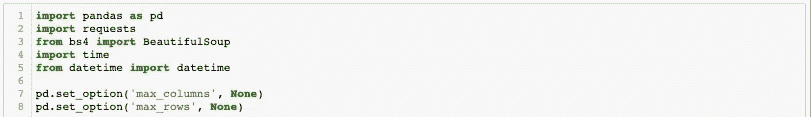
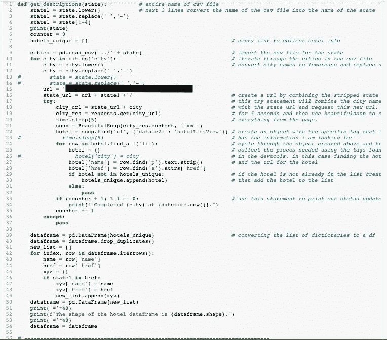
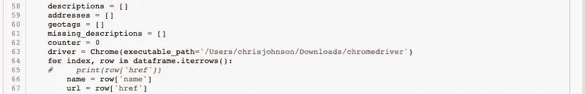
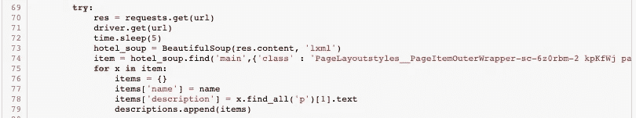
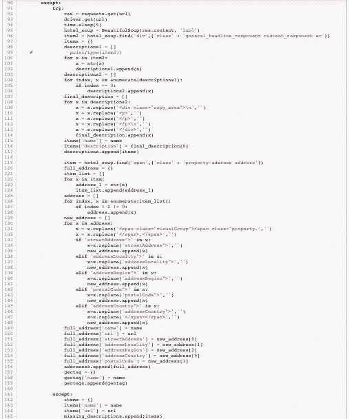
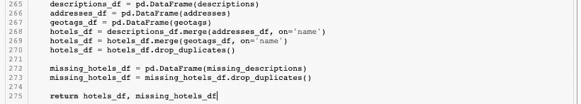
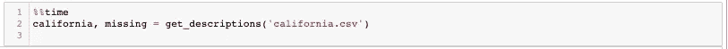

# 使用 Python 进行 Web 抓取第 2 部分:脱离训练轮

> 原文：<https://medium.datadriveninvestor.com/web-scraping-with-python-part-2-the-training-wheels-come-off-f9a63f55de56?source=collection_archive---------7----------------------->

正如我所承诺的，这是我的网络抓取故事的第二部分。到目前为止，我的网络抓取经验是使用 API 和包装器从不同的网站收集我想要的东西，然而，在这次冒险中，我发现这些工具不可用。当我接近数据科学团队的尾声时，我开始着手我的顶点项目。我决定创建一个酒店推荐系统，从用户生成的文本输入中生成推荐，并将其与酒店网站上的文本描述进行比较。因为我的项目从世界上一些最大的酒店公司搜集了超过 21，000 个酒店网站。在这篇文章中，我将描述我在其中一家公司的经历，使用 Chrome 网络浏览器和[相关开发工具](https://developers.google.com/web/tools/chrome-devtools)，以及 [Beautifulsoup](https://www.crummy.com/software/BeautifulSoup/bs4/doc/) 。我原本计划在这篇文章中介绍我对硒的使用，但是由于这篇文章的长度，我将把它放在一篇额外的文章中。

Trial and Error

***从这个项目中最大的收获是网页抓取和为特定项目创建代码是这个项目独有的。它需要反复试验，花费时间和精力来执行所有的检查以获得正确的代码。但是，与我手动收集 5，200 家酒店的数据所花费的时间相比，投入的时间根本不算什么。***

Imports used for this project.

在我的项目开始时，我发现没有现成的 API、工具或数据集可用；我也无法像猫途鹰那样收集所有酒店的聚合网站。所以我会从头开始。我们写网络抓取代码的课程包括从一个没有太多格式的静态网站抓取数据；但是，我在真实应用中的第一次尝试是一家酒店公司，并没有遵循这种格式。在创建我的第一个网络抓取代码时，我玩了好几天。我将不得不尝试几种不同的获取正确标签的方法。退一步说，这是一次令人沮丧的经历，但我坚持了下来。最终，我能够创建一个代码，该代码将接受一个州的城市列表的 CSV 文件。遍历城市列表，将这些城市与一个基本 URL 连接起来，创建一个 URL 来请求访问酒店网站上的城市页面。一旦进入这个页面，Beautifulsoup 就会收集页面上的所有信息。下一步是从 soup 中创建一个对象，这样我就可以收集该城市所有酒店的名称和 URL。使用 href 标签，我可以创建字典，并将字典添加到酒店列表中，最终创建酒店名称和 URL 的数据帧。哒哒！现在我已经成功地收集了我需要的所有信息……开始收集我真正需要的其他信息。

Collecting my Hotel Names and URLs

现在我有了酒店名称的数据框架，更具体地说是它们的 URL，我可以遍历这些 URL，并在每个酒店网站上使用 Beautifulsoup 来收集我需要的信息。我决定收集每个酒店的文本描述、地址和地理坐标；所以我为每一个都创建了空列表。我还将创建一个空列表来收集我的代码无法处理的酒店，以便我可以在以后尝试它们。

Setting up my empty lists to collect the information, and iterating through the hotel list.

我将开始这篇文章的剩余部分:在得到我想要的代码并在整个州运行它之后，我发现我用作代码模板的页面只是这个特定酒店公司使用的网站的一个版本；也因此没能收集到很多酒店。有了这些信息，我重新编写了代码来实现一组 try/except 语句，再次经历了试错阶段。第一个网站模板将用于 try 部分，第二个网站模板将用于 except 部分，并在 except 语句中设置新的 try/except。最终，如果对第二个网站模板的抓取不成功，那么我将在一个列表中收集酒店名称和 URL，以查找缺失的酒店。

 [## 用 Python |数据驱动投资者进行股票价格时间序列预测简介

### 在这个简单的教程中，我们将看看如何将时间序列模型应用于股票价格。更具体地说，一个…

www.datadriveninvestor.com](https://www.datadriveninvestor.com/2020/07/07/introduction-to-time-series-forecasting-of-stock-prices-with-python/) 

我将遍历 DataFrame 的每一行，并使用一组 try/except 语句来收集上面列出的特性。与前面的实例一样，Beautifulsoup 将收集每个网站上的信息，然后我指示它创建对象来收集我想要的特定信息。这需要从网站上研究代码，并找到不同的元素，其中包含我正在寻找的属性。在这个实例中，我创建了一个名为“hotel_soup”的 Beautifulsoup 对象，然后为了收集描述，我从“main”元素创建了一个名为“item”的对象，搜索由“p”表示的段落的第二个实例，并收集文本。我遍历“item”来寻找段落中的这个元素。我创建了一个名为“items”的空字典来保存描述，并包含一个酒店名称的键/值对，供以后合并数据帧时使用。下面是收集描述的代码片段。对于代码的地址和地理编码部分，我遵循相同的步骤。

如上所述，我在第一组 try/except 语句的 except 部分中创建了第二组 try/except 语句。正如您将在下面的截图中看到的，这部分的代码可以说要复杂得多。与我的第一次尝试一样，我创建了一个名为“hotel_soup”的 Beautifulsoup 对象，并在我希望收集描述片段的特定点从 soup 创建了一个“item2”。我再次创建一个名为“items”的空字典，但是，这个特定的网站模板有大量的文本描述，所以我将遍历我创建的对象，并将每个实例追加到一个名为“descriptions1”的空列表中。然后我遍历这个列表，删除列表中长度小于 3 个字符的条目。最后，我清除所有 HTML 残余的文本，并添加到一个名为“final_description”的新列表中。我在“items”字典中为描述和酒店名称创建了一个键/值对，并在继续讨论地址和地理编码部分之前将字典添加到描述列表中。我再次对地址执行相同的步骤，并为地理编码创建一个空字典，因为这个网站模板上没有这个功能。正如下面承诺的代码，正如你所看到的，与第一个网站模板相比，这是一个更复杂的代码，其中还包括清理字符串。最后，我结束了第二组 try/except 语句，在遗漏的酒店列表中添加了一个仅包含酒店名称和酒店 URL 的字典。

现在我已经收集了所有的信息，最后一步是将字典列表转换成我可以用于我的项目的数据框架。在这种情况下，我有四个列表；描述、地址、地理标签和丢失的酒店。我将前三个列表分别传递给它们的 on pandas 数据帧，然后将前两个列表合并，然后将第三个列表合并到新的合并数据帧中，形成最终的数据帧，名为“hotels_df”。合并时，我在“名称”列上进行合并。最后，我执行了一个 drop_duplicates 以防万一。对于丢失的酒店，我遵循相同的步骤。然后我返回两个数据帧。值得注意的一点是，我学到了艰难的方法，当我在函数末尾返回两个项目时，我需要将两个项目设置为函数相等，否则它将无法正常执行，您可能会在意识到错误之前损失数小时的时间和工作。

Creating DataFrames from all of the data collected.

Since the function returns two items, I need to set two items equal to the function.

我知道这可能很难理解，但是，这是经验的象征。正如开头提到的，这是一个每个网站和每个项目都独特的过程。祝第一次从事网络抓取项目的人好运，这将是一个挑战，但我希望你会发现完成后会像我一样有所收获。我还将在另一家酒店公司的网站上写一篇关于我使用 Selenium 的额外文章。

## 访问专家视图— [订阅 DDI 英特尔](https://datadriveninvestor.com/ddi-intel)