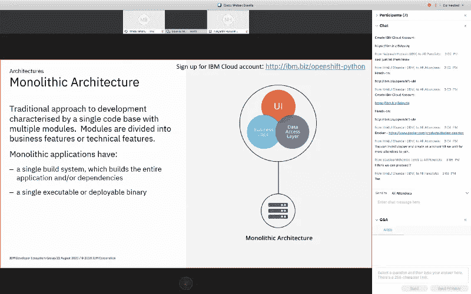

# 网络研讨会:使用 Red Hat Universal Base Image 在 OpenShift 上部署一个示例货币兑换应用程序(2020 年 8 月 22 日)

> 原文：<https://medium.datadriveninvestor.com/webinar-english-deploy-a-sample-currency-exchange-app-to-openshift-using-red-hat-universal-base-2e1f6a936547?source=collection_archive---------20----------------------->

2020 年 8 月 22 日，南非云开发者倡导者 Sbusiso Mkhombe & UAE 云开发者倡导者 [Mridul Bhandari](https://medium.com/u/843b501ef781?source=post_page-----2e1f6a936547--------------------------------) 举办了一场网络研讨会，主题是如何使用 Red Hat Universal Base Image 在 OpenShift 上部署一个货币兑换示例应用程序。

总共有 5 名与会者，包括来自 MEA 的开发人员和学生。网上研讨会以向观众介绍 [IBM Developer](https://medium.com/u/262975298e3a?source=post_page-----2e1f6a936547--------------------------------) 系列的欢迎辞开始，分为两个主要部分。第一部分是向观众简要介绍架构、虚拟机、容器、RedHat OpenShift，另一部分是代码模式。

第一部分由 Sbusiso Mkhombe 领导。他解释了不同的架构，虚拟机和容器之间的区别，以及 RedHat OpenShift。

 [## 用 Python |数据驱动投资者进行股票价格时间序列预测简介

### 在这个简单的教程中，我们将看看如何将时间序列模型应用于股票价格。更具体地说，一个…

www.datadriveninvestor.com](https://www.datadriveninvestor.com/2020/07/07/introduction-to-time-series-forecasting-of-stock-prices-with-python/) 

网络研讨会的第二部分由 Mridul Bhandari 主持，旨在使用 Red Hat Universal Base Image 向 OpenShift 部署一个示例货币兑换应用程序。他首先向与会者展示如何在本地部署 Docker 映像。然后他解释了什么是 UBI 和不同的基础图像。然后将应用部署到 RedHat OpenShift 集群。

在网上研讨会结束时，与会者被介绍给了 [IBM 开发人员](https://medium.com/u/262975298e3a?source=post_page-----2e1f6a936547--------------------------------)资源。许多与会者对网上研讨会表现出积极的反馈和赞赏。

链接到下面的代码模式:[https://developer . IBM . com/technologies/containers/patterns/deploy-to-open shift-4-red hat-universal-base-image](https://developer.ibm.com/technologies/containers/patterns/deploy-to-openshift-4-redhat-universal-base-image)

链接到 GitHub 库:[https://github.com/mridulrb/python-ubi-openshift](https://github.com/mridulrb/python-ubi-openshift)

**访问专家视图—** [**订阅 DDI 英特尔**](https://datadriveninvestor.com/ddi-intel)