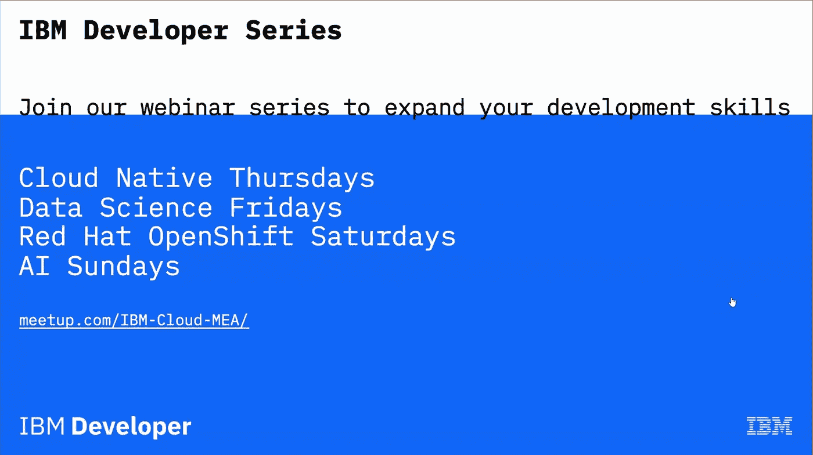

# 网络研讨会:使用 IBM Watson Studio 预测贷款资格(2020 年 9 月 6 日)

> 原文：<https://medium.datadriveninvestor.com/webinar-predict-loan-eligibility-using-ibm-watson-studio-6th-september-2020-2941a165457c?source=collection_archive---------16----------------------->

2020 年 9 月 6 日，南非云开发倡导者 Sbusiso Mkhombe 和阿联酋云开发倡导者 [Mridul Bhandari](https://medium.com/u/843b501ef781?source=post_page-----2941a165457c--------------------------------) 举办了一场网络研讨会，主题是如何建立一个预测模型来预测申请人是否能够偿还贷款公司。

共有 10 名与会者，包括来自 MEA 的开发人员和学生。网上研讨会以欢迎辞开始，向观众介绍了 [IBM Developer](https://medium.com/u/262975298e3a?source=post_page-----2941a165457c--------------------------------) 系列，并分为两个主要部分，其中一部分向观众简要介绍了人工智能和 Cloud Pak for Data。

第一部分由 Sbusiso Mkhombe 领导。斯布西索通过引入人工智能开始了它。然后他解释了人工智能阶梯、 [IBM Data Science](https://medium.com/u/65869e402efe?source=post_page-----2941a165457c--------------------------------) 、Cloud Pak for Data &及其架构，以及一些用例。

网络研讨会的第二部分由 Mridul Bhandari 主持，旨在创建一个 [IBM SPSS 软件](https://medium.com/u/11a7e3e45e5?source=post_page-----2941a165457c--------------------------------)和一个 [IBM Watson](https://medium.com/u/368d6fdd39f?source=post_page-----2941a165457c--------------------------------) 机器学习模型。使用的数据集由 [Analytics Vidhya](https://medium.com/u/d346391a83fb?source=post_page-----2941a165457c--------------------------------) 提供。在 SPSS Modeler 中，首先，使用 IBM Analytics[分析](https://medium.com/u/712bf3892bd1?source=post_page-----2941a165457c--------------------------------)添加、准备&数据集。然后，配置变量类型，建立贝叶斯网络模型，评估性能。然后将机器学习模型保存为可用于部署的评分分支。

 [## 千禧一代和 z 世代。租来的衣服听起来比贷款更性感|数据驱动的投资者

### 随着年轻消费者对分享或租赁商品和服务的偏好超过购买，全球商业正在…

www.datadriveninvestor.com](https://www.datadriveninvestor.com/2020/04/28/millennials-and-generation-z-a-rented-dress-sounds-sexier-than-a-loan/) 

在网上研讨会结束时，与会者被介绍给了 [IBM 开发人员](https://medium.com/u/262975298e3a?source=post_page-----2941a165457c--------------------------------)资源。许多与会者对网上研讨会表现出积极的反馈和赞赏。

链接到后面的代码模式:[https://developer . IBM . com/tutorials/predict-loan-eligibility-using-jupyter-notebook-IBM-SPSS-modeler/](https://developer.ibm.com/tutorials/predict-loan-eligibility-using-jupyter-notebook-ibm-spss-modeler/)

GitHub 资源库的链接:[https://GitHub . com/mridulrb/Predict-loan-eligibility-using-IBM-Watson-Studio](https://github.com/mridulrb/Predict-loan-eligibility-using-IBM-Watson-Studio)

**访问专家视图—** [**订阅 DDI 英特尔**](https://datadriveninvestor.com/ddi-intel)