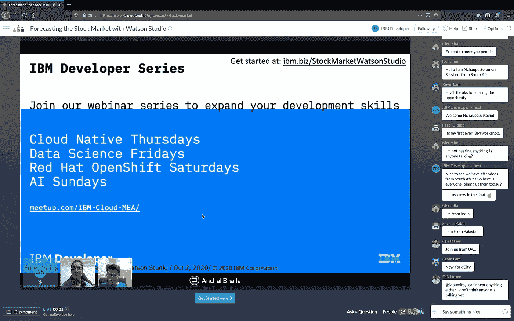

# 网络研讨会:用沃森工作室预测股市(2020 年 10 月 2 日)

> 原文：<https://medium.datadriveninvestor.com/webinar-predicting-the-stock-market-with-watson-studio-2nd-october-2020-4609bed56fd6?source=collection_archive---------19----------------------->

 [## 用 Watson Studio - Crowdcast 预测股市

### 立即注册参加 IBM 开发人员在 Crowdcast 上的活动，该活动计划于 2020 年 10 月 2 日星期五下午 3:00 GST 开始。

www.crowdcast.io](https://www.crowdcast.io/e/forecast-stock-market) 

2020 年 10 月 2 日，数据和人工智能技术专家 [Anchal Bhalla](https://medium.com/u/7f1cbb04238?source=post_page-----4609bed56fd6--------------------------------) &阿联酋云开发者倡导者 [Mridul Bhandari](https://medium.com/u/843b501ef781?source=post_page-----4609bed56fd6--------------------------------) 与 Watson Studio 进行了一场关于预测股市的网络研讨会。

共有 38 名与会者，包括来自 MEA 的开发人员和学生。网上研讨会以向观众介绍 [IBM Developer](https://medium.com/u/262975298e3a?source=post_page-----4609bed56fd6--------------------------------) 系列的欢迎辞开始，分为两个主要部分，一部分向观众简要介绍数据科学、机器学习& Quandl，另一部分是代码模式。

第一部分由 Anchal Bhalla 领导。安查尔首先介绍了数据科学。然后，她解释了数据科学家、数据工程师和数据分析师之间的区别。其次是数据科学循环、数据分析类型、机器学习、机器学习过程、机器学习类型& Quandl API。

 [## 收盘，但没有雪茄-股票市场目标在停滞的 COVID 救济中创新高|数据驱动…

### 专家聊天程序:一个协作市场，在这里人们可以和能够解决他们问题的专家聊天。是……

www.datadriveninvestor.com](https://www.datadriveninvestor.com/2020/08/18/close-but-no-cigar-stock-market-targets-record-highs-amidst-stalled-covid-relief/) 

网上研讨会的第二部分由 Mridul Bhandari 主持，旨在预测股票市场。他首先向与会者展示了如何在 IBM Cloud 上实例化 Watson Studio 并创建云对象存储。然后，他使用 Quandl API 从 API 中检索数据，将挖掘的数据作为资产导入到 Watson Studio 项目中，使用 Data Refinery 净化数据，使用 [IBM SPSS 软件](https://medium.com/u/11a7e3e45e5?source=post_page-----4609bed56fd6--------------------------------) Modeler Flow 进行预测，使用 Watson 机器学习部署 Modeler Flow 模型，并验证存储在 WML 中的模型。

在网上研讨会结束时，与会者了解了 IBM Cloud Pak for Data 和 IBM 开发人员资源。许多与会者对网上研讨会表现出积极的反馈和赞赏。

*   事件记录:[https://www.crowdcast.io/e/forecast-stock-market](https://www.crowdcast.io/e/assistant-chatbot)
*   幻灯片:[https://mridulrb.github.io/watson-stock-market-predictor/#/](https://mridulrb.github.io/watson-stock-market-predictor/#/)
*   跟着一起动手:【https://ibm.biz/StockMarketWatsonStudioLab 
*   GitHub 资源库:【https://github.com/mridulrb/watson-stock-market-predictor 
*   调查:[https://www.surveymonkey.com/r/JHT3L8Y](https://www.surveymonkey.com/r/JHT3L8Y)
*   IBM 云注册链接:[http://ibm.biz/StockMarketWatsonStudio](http://ibm.biz/StockMarketWatsonStudio)
*   Meetup 页面:[https://www.meetup.com/IBM-Cloud-MEA/events/](https://www.meetup.com/IBM-Cloud-MEA/events/)

## 访问专家视图— [订阅 DDI 英特尔](https://datadriveninvestor.com/ddi-intel)