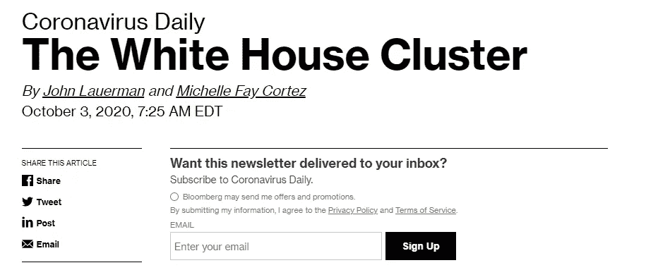
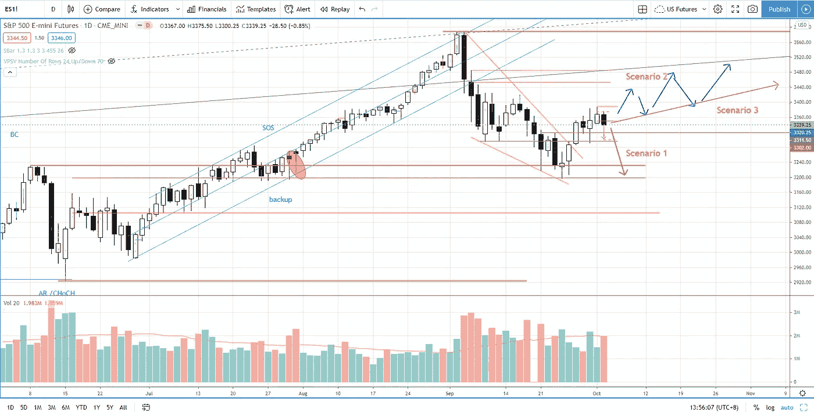
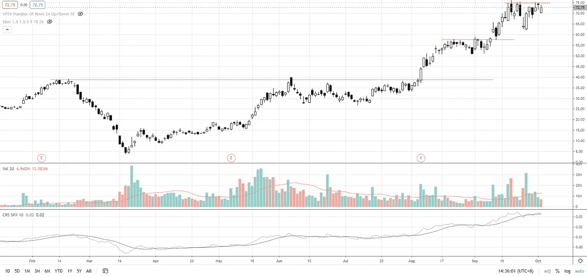

# 第 40 周市场综述——白宫集群将如何影响标准普尔 500？

> 原文：<https://medium.datadriveninvestor.com/week-40-market-roundup-how-will-the-white-house-cluster-affecting-s-p-500-f40952ee7657?source=collection_archive---------19----------------------->

在第 39 周的市场总结中，我提到了 4 个可能预示标准普尔 500 股市见底的迹象，上周结果是看涨，因为标准普尔 500 在摆脱楔形下跌模式后保持了涨幅，尽管周五特朗普被新冠肺炎测试为阳性，波动性有所增加。

虽然仅根据新闻，标准普尔 500 没有跌破周五 3300 点的关键支持，但新冠肺炎有一个[白宫集群](https://www.bloomberg.com/news/newsletters/2020-10-03/the-white-house-cluster)，未来几周可能会有更多关于这个特定集群的负面新闻，同时许多人都在关注 2020 年 11 月 3 日美国大选的关键事件。因此，从现在到美国大选，我们可以预计，由于受到选举、新冠肺炎和经济的不确定性的惊吓，股市的波动性将会上升。

让我们用基于价格和交易量的图表来处理波动性。

**场景 1:更多利空消息，市场下跌**

如果标准普尔 500 跌破 3300，下一个防御水平是 3200-3230。如果 3200 点被突破，看跌级别将升级，需要重新评估。

**情景 2:更多利空消息，市场保持/上涨**

与上周五(2020 年 10 月 2 日)的价格走势类似，市场情绪看跌，许多交易员猜测跌破 3300 点。供应随着波动性增加，但市场保持住了波动，并在美国市场收复了部分失地。

标准普尔 500 将有更多的价格波动，并在 3200-3600 的交易区间内爬上担忧之墙。

**情景 3:没有太多利空消息，市场保持/上涨**

当标准普尔 500 在 3200-3600 的交易区间内缓慢攀升时，波动性随着供应的减少而稳定下来。

基于价格结构和供应水平，我仍然倾向于情景 2 & 3。

Photo by Author — Ming Jong Tey

如果你还没有或者想回顾一下上周是如何展开的，以及你的准备和分析，请看下面的上周市场分析视频系列。上周的重点内容包括如何从假突破中获利，如何以高胜率交易突破，使用成交量分析的上升和下降楔形模式交易，等等:

**股票观察清单——马来西亚**

VS(VS 工业 BHD)——正如上周所料，VS 继续攀升。2.13 是支撑。如果支撑保持住，上升趋势有望延续。

JHM (JHM 联合 BHD)——JHM 仍然缺乏高质量的需求来推高价格。支撑在 1.5，阻力在 1.76，1.9。

收入(收入组 BERHAD)-需求和供应都很差。突破 1.2 可能会启动向 1.3 的反弹。支撑位在 1.13。

front kn(BHD front ken 公司)——交易区间在 3.25–3.8 之间。

FPGROUP (FOUNDPAC GROUP BERHAD) —供应已耗尽。波动性低，这是一个看涨的特征。需要品质需求推高价格去测试 1.07 接着是 1.2。

MI(MI techno vation BERHAD)——测试交易区间上限 4.4，被拒绝。仍在 3.7-4.4 之间的交易区间内。

自动测试设备(ATE)组的强势股 A 股日前爆发，拉出大量供给。4.5–4.75 是多头进场的支撑区和吸货区间。

Photo by Author — Ming Jong Tey

**库存观察清单—美国**

MSFT(微软)——MSFT 仍在 198-216 的交易区间内。上周的涨势很弱。到目前为止，供应水平仍然很高，这对于看涨的情况来说是没有建设性的。

FB(FACEBOOK)——观察反应如何展开，以测试 240-250 的支撑。

SE (SEA Limited) —交易范围在 130–164 之间。这是一只强于市场表现的股票。

JD(JD.com)—支持度为 72。突破 78 上方可以看 JD 去测试 86。

NET(cloud flare)——可能在电阻附近经历供给吸收。突破 43 可以看到净测试 45。目前就在补给区内。

LVGO(Li vongo HEALTH)——供应水平低，交易区间在 111–150 之间。潜在供应吸收正在进行中。可能要测试 150。

普顿(PELOTON)——正如上周所料，普顿突破 100 点，再次创下历史新高。支撑位在 98。

巴巴(阿里巴巴集团控股)——巴巴突破 280 上方，可能测试 299。

BTG(B2GOLD CORP)——BTG 仍在 6-7.5 的交易区间内。

FSLY(FASTLY INC .)——正如上周所料，FSLY 测试了 102 个拒绝尾巴。可能的供应吸收到位。很有可能突破 102 上方，挑战 116。

SQ(SQUARE INC .)——正如上周所料，SQ 突破 158 点，测试 169 点。很可能再次创下历史新高。

应用程序(DIGITAL TURBINE INC .)——应用程序在周五再次创下历史新高。预计还会有更多的上涨空间。

股票 Y，如第 39 周所述，是 AVGO(博通公司)。目前它在 345-375 之间窄幅交易。

自 2020 年 3 月以来从 5 到 70 的高贝塔股票 X 是另一个多袋者。它可能会突破，并在突破 75 的阻力后继续攀升。

Photo by Author — Ming Jong Tey

研究他们的图表，你会发现他们在价格结构和交易量方面很有趣。

# 资源

**每周市场展望&最佳交易建议**直达您的收件箱:【https://www.tradeprecise.com/】T4

**专业免费**制图平台:创建账户→【www.TradingView.com 

**非美国居民？** ( **马来西亚、新加坡**、澳大利亚、新西兰、欧洲等……):[点击此处，存款 2000 新加坡元](https://ji.hn/sgtiger)即可获得**免费股票(价值 100 美元++ &老虎经纪**的欢迎礼物)

美国居民？[点击此处，当您存入 1500 美元](https://ji.hn/ustradeup)时，就有机会在 TradeUP 上获得一份**免费的 AMZN 股票(价值 3000++美元** ) & **欢迎礼物**

**无限制访问媒体文章** —加入以下:[https://priceactiontrading.medium.com/membership](https://priceactiontrading.medium.com/membership)

# 进一步阅读

 [## 这些银行股逆势而上——建行、凯德、EBC、TBBK、ISBC

### 过去两周，金融板块尤其是银行股跑赢大盘。当纳斯达克领先的时候…

medium.datadriveninvestor.com](/these-banking-stocks-buck-the-trend-ccb-cade-ebc-tbbk-isbc-d95c608692f0)  [## 凯西·伍德警告市场即将调整——标准普尔 500 价格走势分析

### 在 2020 年 12 月 18 日对彭博的采访中，方舟投资公司的首席执行官兼首席信息官凯西·伍德警告说…

medium.datadriveninvestor.com](/cathie-wood-warns-market-correction-soon-price-action-analysis-on-s-p-500-7e621e013310)  [## 大头针，快照，TWTR 跑赢市场-准备暴涨？

### 上周，当市场正在调整时，大多数股票都受到了重创。然而，大头针，快照和 TWTR…

medium.datadriveninvestor.com](/pins-snap-twtr-outperform-market-ready-to-skyrocket-ef8dddb6c025) 

披露:如果您点击本文中的链接进行购买或开立账户，并将所需金额存入推荐的经纪人账户，我们将免费为您赚取佣金。

免责声明:本演示中的信息仅用于教育目的，不应作为投资建议。