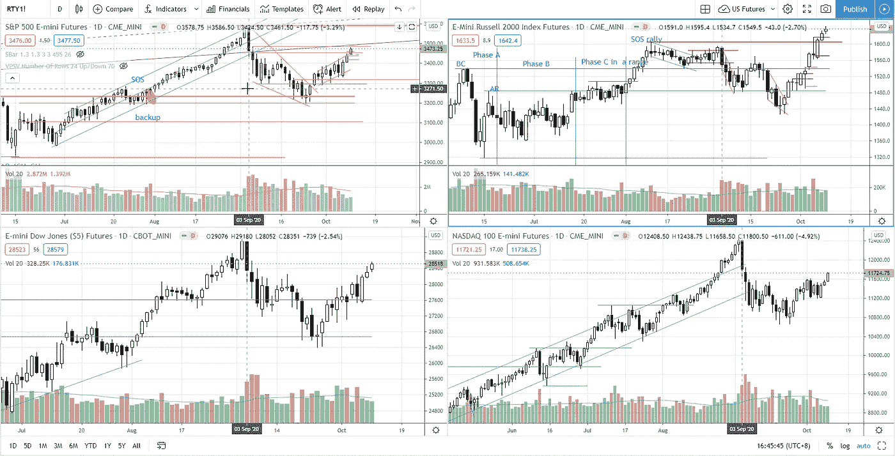
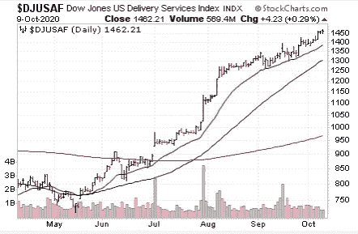

# 第 41 周市场综述——创历史新高对标准普尔 500 可行吗？

> 原文：<https://medium.datadriveninvestor.com/week-41-market-roundup-is-all-time-high-feasible-for-s-p-500-5f1b877aa7b0?source=collection_archive---------17----------------------->

股市普遍攀升，罗素 2000 指数领涨，纳斯达克在四大指数中落后。在[第 40 周的市场总结中，我分析了 3 种可能的情况](/week-40-market-roundup-how-will-the-white-house-cluster-affecting-s-p-500-f40952ee7657),而我倾向于第二种和第三种，这是基于价格结构和供需的看涨情况，尽管白宫新冠肺炎小组预测了看跌情绪。我随后在我的视频中更新了 2020 年 10 月 8 日 T2 股市的走向，以及如何为我假设的情况寻求确认。

如下图所示，罗素 2000 指数(右上)已经收复了自 2020 年 9 月 2 日市场调整以来的所有失地，而标准普尔 500、道琼斯指数收复了近 2/3 的失地。

Photo by Author — Ming Jong Tey

尽管由于 Trump 拒绝在大选结束前继续就新冠肺炎救助计划进行谈判，2020 年 10 月 6 日出现了相对具有威胁性的抛售，但市场仍然能够快速复苏。标准普尔 500 目前正在测试 3480 点的阻力区，一旦突破阻力区，可能会测试历史最高水平。

除了罗素 2000，我想分享一个行业组是跑赢市场。这些群体中可能存在一些潜在的交易机会，如 DJUSAF(道琼斯美国交割服务指数)。重点股票:EXPD，ATSG，FDX，UPS。

Photo by Author — Ming Jong Tey

如果你正在交易突破，你会想看看我的简单而有效的技术，这将增加你的胜率——看下面的视频:

**股票观察名单—马拉西亚**

VS(VS . S INDUSTRY BHD)——供应一直在减少，同时在一个较浅的范围内盘整。有可能达到 2.43 的历史高点。

JHM (JHM 盘整 BHD)——随着供应量的减少，对称三角形形态(顶点形成)即将成熟并突破。突破 1.78 可能会让 JHM 测试 2.0。

front kn(BHD front ken CORPORATION)——随着波动性的增加，供应量一直在减少，这是股票的看涨特征。突破 3.75 可能会让 FRONTKN 测试 4.0 甚至更高。

FP GROUP(found PAC GROUP BERHAD)——在测试 1.07 的阻力后，供应已经出现。需要突破 1.07 才能挑战 1.20 的更高阻力。

MI (MI TECHNOVATION BERHAD) —价格结构类似于 FRONTKN。仍在 3.7-4.4 之间的交易区间内。很有可能挑战破历史高点 4.65。

在第 40 周中提到的股票 A 是 PENTA(BHD 的 PENTAMASTER 公司)。供应在达到历史最高水平后出现。目前它正在吸收供应，并可能回调以测试 5.0 的支撑位。

**库存观察清单—美国**

MSFT(微软)——如果突破 217 点，MSFT 可能会测试 230 点。支撑位在 198。

FACEBOOK——交易区间在 250-279 之间。

SE(SEA Limited)——这支强劲的股票再次突破历史高点。只要 165 的支撑位被守住，SE 就会走高。

JD(JD.com)——刚刚爆发了 78。京东很可能考 86。

NET(cloud flare)——创历史新高。如果能守住 42 支撑位，它将会走高。

LVGO(Li vongo HEALTH)——潜在供应吸收正在进行中。有可能测试并突破 150 上方。

PTON(PELOTON)——创历史新高。支持度在 100。气候上涨很容易被修正。注意看跌棒的变化来阻止上涨。

巴巴(阿里巴巴集团控股)——上周提到的目标(299)已经实现。支撑位在 282，267。

BTG(B2GOLD CORP)-突破 7 可能会让 BTG 测试 7.5。

FSLY(FASTLY INC)——创历史新高。支撑位在 118，103。

SQ(SQUARE INC)——创历史新高。支撑位在 170，158。

APPS(DIGITAL TURBINE INC)——APPS 仍然保持在 35 的支持之上。预计会有更多的上升空间。

AVGO(博通公司)——AVGO 创历史新高。预计会进一步上涨。

第 40 周提到的股票 X 是 PENN (PENN NATIONAL GAMING INC .)。宾大还在矫正模式。支撑位在 58–62。

研究他们的图表，你会发现他们在价格结构和交易量方面很有趣。

# 资源

**每周市场展望&最佳交易建议**直达您的收件箱:【https://www.tradeprecise.com/】T4

**专业免费**制图平台:创建账户→[www.TradingView.com](https://bit.ly/2U2Femd)

**非美国居民？** ( **马来西亚、新加坡**、澳大利亚、新西兰、欧洲等……):[点击此处，存款 2000 新加坡元](https://ji.hn/sgtiger)即可获得**免费股票(价值 100++美元&老虎经纪**的欢迎礼物)

美国居民？[点击此处，当您存入 1500 美元](https://ji.hn/ustradeup)时，就有机会在 TradeUP 上获得一份**免费的 AMZN 股票(价值 3000++美元** ) & **欢迎礼物**

**从媒体获取无限文章** —加入以下:[https://priceactiontrading.medium.com/membership](https://priceactiontrading.medium.com/membership)

# 进一步阅读

 [## 大头针，快照，TWTR 跑赢市场-准备暴涨？

### 上周，当市场正在调整时，大多数股票都受到了重创。然而，大头针，快照和 TWTR…

medium.datadriveninvestor.com](/pins-snap-twtr-outperform-market-ready-to-skyrocket-ef8dddb6c025)  [## ARK Invest 的 Cathie Wood 预测基因组股表现优于特斯拉？

### 方舟投资公司的首席执行官凯西·伍德预测，最大的上涨惊喜可能来自基因组股票，尤其是…

medium.datadriveninvestor.com](/ark-invests-cathie-wood-predicts-genomic-stocks-outperform-tesla-b67f3c4bbc68)  [## 被低估的高成长股——EVO、EMBRAC、FTCH、MWK、OPEN、SKLZ、UPST

### 2021 年第 2 周市场回顾

medium.datadriveninvestor.com](/underhyped-high-growth-stocks-evo-embrac-ftch-mwk-open-sklz-upst-5105abd20143) 

披露:如果您点击本文中的链接进行购买或开立账户，并将所需金额存入推荐的经纪人账户，我们将免费为您赚取佣金。

免责声明:本演示中的信息仅用于教育目的，不应作为投资建议。