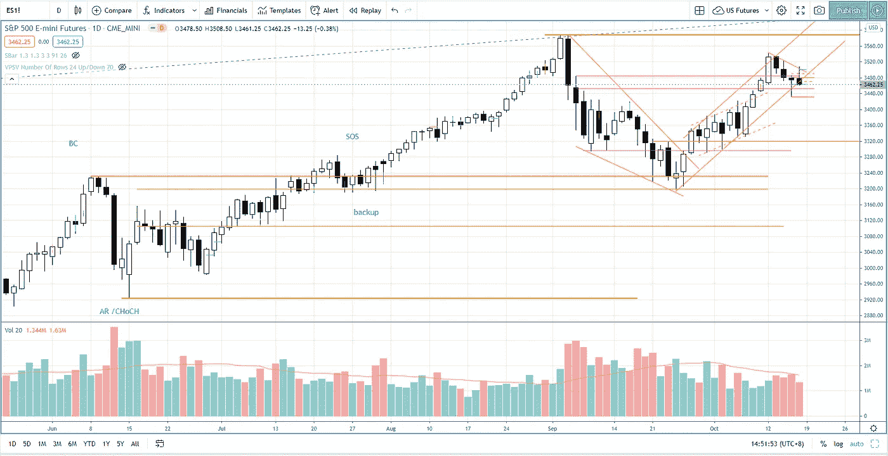
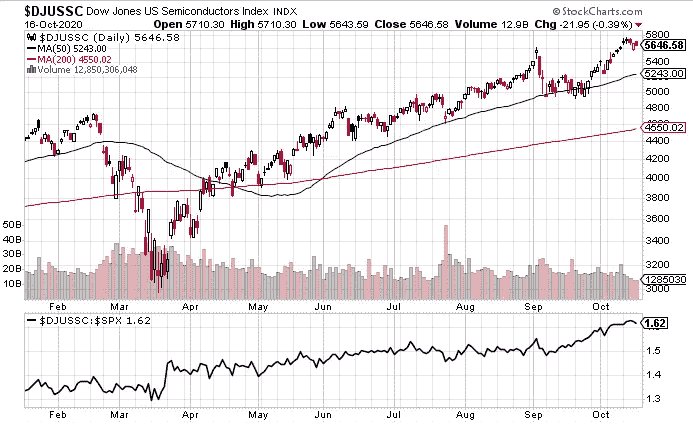

# 第 42 周股市综述——聚焦半导体集团

> 原文：<https://medium.datadriveninvestor.com/week-42-market-roundup-95de7d14396f?source=collection_archive---------10----------------------->

在气候上涨触及上行通道的超买以及测试 3500-3550 的供应区后，上周出现了回调。在第 41 周市场综述中，我提到了测试标准普尔 500 指数历史最高水平的可能性，我仍然支持这一点，因为:

*   上周标准普尔 500 市场的反应是供应略有增加，但结果还不具有威胁性，表明一些买盘进入市场，以阻止价格进一步下跌。
*   第 41 周的上升势头仍可能推动市场测试历史高点，判断第 42 周的回调和供应水平。

Photo by Author — Ming Jong Tey

第 41 周提及的道琼斯美国快递服务指数仍优于市场，提及的股票如 EXPD、ATSG、FDX、UPS 继续反弹。

# 行业研究小组—道琼斯美国半导体指数(DJUSSC)

本周我想分享半导体指数(DJUSSC ),因为它已经连续数周表现优异。就价格结构而言，它打破了历史高点，回调仍在展开。之前的反弹突破了历史最高水平，这可能是强势反弹的迹象，当前的回调是在启动上涨阶段之前完成结构的测试。

一些有趣的股票值得关注:AOSL(Alpha and Omega Semiconductor ltd .)、TSM(台湾半导体制造公司)、SWKS (Skyworks Solutions Inc .)、ON (ON Semiconductor Corp .)、IFNNY(英飞凌科技股份公司)。我不能把我观察的所有股票都包括进来，所以一定要看看这个组里的其他大牌和有趣的股票。

Photo by Author — Ming Jong Tey

想过什么时候是退出交易的最佳时机吗？当你决定何时退出交易时，记得想想我在视频中解释的一件事。看看下面的视频:

# **股票观察名单—马拉西亚**

VS(VS 工业 BHD)——正如上周日所料，VS 创下历史新高。支撑位在 2.4。

JHM(BHD JHM 盘整)——正如上周日对对称三角形形态的突破所预期的那样，JHM 突破并收于 1.89。

FRONTKN(BHD front ken CORPORATION)——突破 3.75 可能会让 front kn 测试 4.0 甚至更高。

FP GROUP(found PAC GROUP BERHAD)——试图突破 1.07 上方阻力，反应立即展开。需要跌破 1.07 才能挑战 1.20 的更高阻力。

MI(MI techno vation BERHAD)——正在测试 4.65 的历史高点。

PENTA(BHD penta master 公司)——阻力在 5.36。它可能会继续上升。

# **股票观察名单—美国**

MSFT(微软)——当 217 点的支撑位能够守住时，MSFT 应该测试 233 点。

FB(FACEBOOK)——试图突破 280 上方，但吸引一些供应。更多的时间花在 250-279 之间的交易区间。

SE (SEA Limited) —在 162-165 的反应模式下测试支撑。供应一直在减少。SE 可能会走高。

JD(JD.com)——随着供应量的增加，它几乎测试了 86。很可能挑战 86.4 的历史高点。

NET(cloud flare)——上周一，NET 上涨了 23%，是表现最好的一天。短期交易范围在 54-62 之间。

LVGO(Li vongo HEALTH)——LVGO 在 150 测试了阻力，并有轻微回调。它可能会突破阻力，并趋向更高。

普顿(PELOTON)——上周，普顿没有放缓脚步的迹象。然而，上周五供应激增，这可能是字符栏的变化，以阻止上涨。跌破 127 将启动回调以寻找支撑。113–120 是一个支持区域。

阿里巴巴(阿里巴巴集团控股)——相对健康的供应创下历史新高。巴巴预计会走高。

BTG(B2GOLD CORP)-突破 7 可能会让 BTG 测试 7.5。

2020 年 10 月 15 日，FSLY 经历了最大的下跌，下跌了 27%。但仍在 74–118 交易区间内。需要密切监控供应水平和价格行为，以判断这是否是一种分销结构。

SQ(SQUARE INC)——在创下历史新高后，SQ 仅有一次小幅回调。它可能会上升。

APPS(DIGITAL TURBINE INC .)—继续保持上升趋势，支持率为 37、35。

AVGO(博通公司)——在创下历史新高后，AVGO 处于反应模式，测试 375 点的支撑。如果支撑保持住，它将会走高。

PENN(PENN NATIONAL GAMING INC .)——它将测试 75 的阻力。支撑位在 57-63。

# 资源

**每周市场展望&最佳交易建议**直达您的收件箱:【https://www.tradeprecise.com/】T2

【www.TradingView.com】专业免费制图平台:创建账户→ [制图平台](https://bit.ly/2U2Femd)

**非美国居民？** ( **马来西亚、新加坡**、澳大利亚、新西兰、欧洲等……):[点击此处，存款 2000 元](https://ji.hn/sgtiger)即可获得**免费股票(价值 100++ &美元)老虎经纪**的欢迎礼物

美国居民？[点击此处，当您存入 1500 美元](https://ji.hn/ustradeup)时，就有机会在 TradeUP 上获得一份**免费的 AMZN 股票(价值 3000++美元** ) & **欢迎礼物**

**从媒体获取无限文章** —加入以下:[https://priceactiontrading.medium.com/membership](https://priceactiontrading.medium.com/membership)

# 进一步阅读

 [## 大头针，快照，TWTR 跑赢市场-准备暴涨？

### 上周，当市场正在调整时，大多数股票都受到了重创。然而，大头针，快照和 TWTR…

medium.datadriveninvestor.com](/pins-snap-twtr-outperform-market-ready-to-skyrocket-ef8dddb6c025)  [## 摇摆交易的顶级仙股——HNRG、QEP、SNDL，告诉[巨大的上涨潜力]

### 找出这 4 只最便宜的股票——HNRG、QEP、SNDL，告诉他们基于回调可以进行摇摆交易…

medium.datadriveninvestor.com](/top-penny-stocks-for-swing-trading-hnrg-qep-sndl-tell-huge-upside-potential-b4937a3ce955)  [## 市场修正，泡沫还是崩盘？标准普尔 500 价格行为分析

### 标准普尔 500 期货(es)昨日因供应激增下跌 2.5%，跌破上行通道。这是正常的…

medium.datadriveninvestor.com](/market-correction-bubble-or-crash-s-p-500-price-action-analysis-6f26e6698dbc) 

披露:如果您点击本文中的链接进行购买或开立账户，并将所需金额存入推荐的经纪人账户，我们将免费为您赚取佣金。

免责声明:本演示中的信息仅用于教育目的，不应作为投资建议。