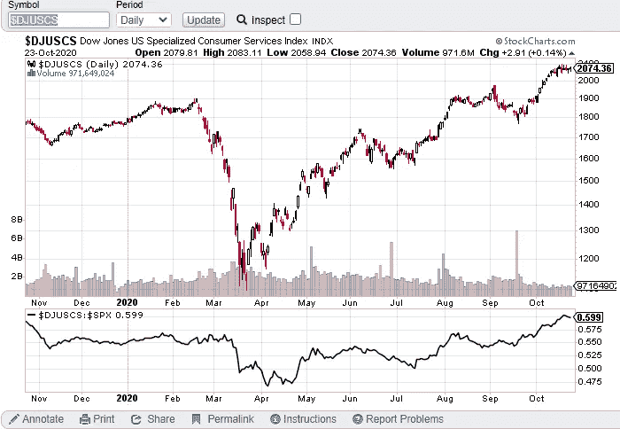

# 第 43 周股市综述——聚焦专业消费者服务集团

> 原文：<https://medium.datadriveninvestor.com/week-43-stock-market-roundup-specialized-consumer-services-group-in-focus-9a08ac728007?source=collection_archive---------11----------------------->

自从第 42 周股市综述中提到的回调展开以来，上周标准普尔 500 期货已经显示出一些变化:

*   向下推力的缩短表明向下动力正在减弱。
*   2020 年 10 月 22 日，如果标准普尔 500 能够在 3450-3460 点上方以及 3500 点阻力区附近向上运行，那么一个弹簧动作(又名假突破)可能会将它置于一个反转位置。
*   2020 年 10 月 23 日供应减少，收盘接近高点，这是另一个看涨信号。

参考我下面的视频来**详细了解 S & P 500 市场的变化**。

**行业研究小组——道琼斯美国专业消费者服务指数(DJUSCS)**

自 2020 年 5 月以来，道琼斯美国专业消费者服务指数(DJUSCS)的表现一直优于标准普尔 500 指数，如下图所示。

Photo by Author — Ming Jong Tey

它在 2020 年 10 月打破了历史高点，并在近两周内一直通过一个浅幅盘整。供应一直在减少，这是一个持续上升趋势的看涨特征。

从价格结构和交易量来看，这里有一些有趣的股票值得关注:CLCT (Collectors Universe，Inc .)、MELI (MercadoLibre Inc .)、ROL (Rollins，Inc .)、MTCH (Match Group，Inc .)。

# **股票观察名单—马拉西亚**

VS(VS . BHD 工业)——回调进行中。支撑位在 2.2–2.3。

JHM (JHM 合并 BHD)——供应在 2020 年 10 月 23 日出现了拒绝尾巴。如果 1.77 的支撑能够守住，JHM 有望突破 2.0。

front kn(BHD front ken 公司)——供应在 2020 年 10 月 23 日出现了拒绝尾巴。如果 3.6 处的支撑能守住，FRONTKN 有望突破 4.0 上方。

FP GROUP(found PAC GROUP BERHAD)—1.07 仍然是一个强阻力位。直接支撑在 1.0。

MI (MI TECHNOVATION BERHAD) —随着供应的出现，打破了历史新高。支撑位在 4.3–4.6。

PENTA(BHD penta master 公司)——供应吸收过程中打破历史新高。PENTA 有望走高。

# 股票观察列表—美国

MSFT(微软)——目前正在测试 217 点的支持区域。突破 218 点可能是测试 225 点的反转信号。

FB(FACEBOOK)——突破 278 阻力上方。FB 有望挑战之前的摆动高点 305。

SE(SEA Limited)——SE 仍在测试 165 处的阻力转向支撑区。

JD(JD.com)——如果 79 点的直接支撑能够守住，JD 可能会测试 87 点的前期高点。

NET (CLOUDFLARE) — NET 仍处于供应减少的回调模式。支撑位在 55 和 53。

LVGO(LIVONGO HEALTH)——如果 133 的即时支撑位能够守住，LVGO 很有可能突破 150 的阻力。

PTON(PELOTON)——正如在第 42 周所预期的那样，上升趋势在 2020 年 10 月 16 日被字符栏的改变所阻止。PTON 正在测试支撑区 113–120。

阿里巴巴(阿里巴巴集团控股)——阿里巴巴的供应一直在减少。预计价格会上涨。

BTG(B2GOLD CORP)——需要突破 7.0 阻力位才能继续走高。

FSLY(FASTLY INC .)——过去一周下跌，目前正在测试 74 的支撑位。

SQ(SQUARE INC)——上周供应增加，推动 SQ 下跌，以测试 170 点的阻力转向支撑。

APPS(DIGITAL TURBINE INC)——供应略有增加，加上熊市结果，跌破 35 点的支撑位。下一个支撑位在 29。

AVGO(BROADCOM INC .)——需要守住 368 点的支撑位，才能恢复 AVGO 的涨势。否则很可能会测试区间的下限 346。

宾州(宾州国家博彩公司)——支持率为 57-63。直接阻力在 71。

# 资源

**每周市场展望&最佳交易建议**直达您的收件箱:【https://www.tradeprecise.com/】T2

【www.TradingView.com】专业免费制图平台:创建账户→ [制图平台](https://bit.ly/2U2Femd)

**非美国居民？** ( **马来西亚、新加坡**、澳大利亚、新西兰、欧洲等……):[点击此处，存款 2000 元](https://ji.hn/sgtiger)即可获得**免费股票(价值 100++ &美元)老虎经纪**的欢迎礼物

美国居民？[点击此处，当您存入 1500 美元](https://ji.hn/ustradeup)时，就有机会在 TradeUP 上获得一份**免费的 AMZN 股票(价值 3000++美元** ) & **欢迎礼物**

**从媒体获取无限文章** —加入以下:[https://priceactiontrading.medium.com/membership](https://priceactiontrading.medium.com/membership)

# 进一步阅读

 [## 摇摆交易的顶级仙股——HNRG、QEP、SNDL，告诉[巨大的上涨潜力]

### 找出这 4 只最便宜的股票——HNRG、QEP、SNDL，告诉他们基于回调可以进行摇摆交易…

medium.com](https://medium.com/datadriveninvestor/top-penny-stocks-for-swing-trading-hnrg-qep-sndl-tell-huge-upside-potential-b4937a3ce955)  [## ARK Invest 的 Cathie Wood 预测基因组股表现优于特斯拉？

### 方舟投资公司的首席执行官凯西·伍德预测，最大的上涨惊喜可能来自基因组股票，尤其是…

medium.com](https://medium.com/datadriveninvestor/ark-invests-cathie-wood-predicts-genomic-stocks-outperform-tesla-b67f3c4bbc68)  [## 凯西·伍德警告市场即将调整——标准普尔 500 价格走势分析

### 在 2020 年 12 月 18 日对彭博的采访中，方舟投资公司的首席执行官兼首席信息官凯西·伍德警告说…

medium.com](https://medium.com/datadriveninvestor/cathie-wood-warns-market-correction-soon-price-action-analysis-on-s-p-500-7e621e013310) 

披露:如果您点击本文中的链接进行购买或开立账户，并将所需金额存入推荐的经纪人账户，我们将免费为您赚取佣金。

免责声明:本演示中的信息仅用于教育目的，不应作为投资建议。