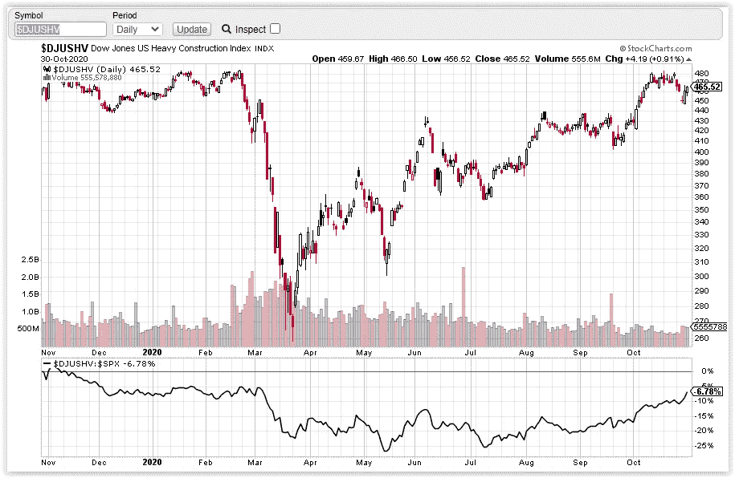

# 第 44 周股市综述——聚焦重型建筑集团

> 原文：<https://medium.datadriveninvestor.com/week-44-stock-market-roundup-heavy-construction-group-in-focus-eb454d0a51cf?source=collection_archive---------16----------------------->

尽管在第 43 周股市综述中发现了[的变化，但我等待的确认(3450 点以上的承诺)并没有出现。相反，就在阻力处发生了一次失败，我在 10 月 26 日的视频中提到过——](/week-43-stock-market-roundup-specialized-consumer-services-group-in-focus-9a08ac728007)[标普 500 的市场走向](https://www.youtube.com/watch?v=db8udFYU9ko)在哪里？

标准普尔 500 期货再次测试了 3200-3230 的支撑区域，这是之前的低点，也是通过 2020 年 6 月的买入高潮形成的支撑区域。10 月 28 日，标准普尔 500 出现大幅回调，进入超卖状态，随后向下推力缩短，并对 3200-3230 支撑区做出反应。【3330 上方需要承诺转为偏多。

自上周一(10 月 26 日)以来，市场已经暗示了下跌行情的开始，交易者有很多机会利用下跌趋势从一两次下跌中获利。观看下面的视频，了解如何通过识别市场弱点来交易突破以利用抛售:

**行业研究小组——道琼斯美国重型建筑指数(DJUSHV)**

自 2020 年 10 月以来，重型建筑指数(DJUSHV)开始跑赢标准普尔 500。指数目前正在测试阻力区。突破阻力位应该会加速上涨。

Photo by Author — Ming Jong Tey

与科技股不同的是，该集团内的许多股票仍处于初期的涨价阶段。从价格结构和交易量来看，这里有一些有趣的股票值得关注:FLR(福陆公司)、PWR(广达服务公司)、AMRC (AMERESCO INC .)、MTZ(马钢公司)。

# 库存观察清单——马来西亚

VS(VS . S 工业 BHD)——在市场反应期间保持相对良好。支撑在 2.1–2.2。

JHM (JHM 联合 BHD)——尽管供应低，需求的质量仍然很差。支撑位在 1.55–1.7。1.8 以上的承诺可以看到 JHM 测试 2.0。

FRONTKN(BHD front ken 公司)——供应高峰导致 front kn 下跌。支撑位在 3.25。

FP group——2020 年 10 月 6 日、15 日和 23 日的供应高峰，未能克服 1.07 的阻力，描绘了一幅看跌的画面。跌破 0.93 可能引发抛售。

MI(MI techno vation BERHAD)——对盈利做出反应的供应峰值将价格推回到交易区间。支撑位在 3.7。

PENTA(BHD penta master 公司)——在市场反应期间表现相对较好。支撑位在 4.7–5.0。

# 股票观察列表—美国

MSFT(微软)——根据市场反应进行调整。MSFT 在 198-217 的交易区间内。

FB(FACEBOOK)——FB 未能克服 284 的阻力。支撑位在 250。

SE(SEA Limited)——SE 从上行通道向下击穿。目前测试支撑区 153–160。

京东(JD.com)——京东在市场反应中表现良好。当市场反转向上时，它有望突破 86。

2020 年 10 月 12 日，53-55 的支撑被打破，目前正在测试动量棒。总的来说供应量很低。

LVGO(Li vongo HEALTH)——133 的支撑位仍在坚守。LVGO 很可能挑战 150 的摆高。

PTON(PELOTON)——PTON 处于类似于市场的修正模式。支持度在 100。

阿里巴巴(阿里巴巴集团控股)——与京东类似，阿里巴巴在市场反应期间表现良好。支撑位在 300。

BTG(B2 gold CORP)-BTG 修正了供应量的小幅增加，测试了 6.0 的支撑。交易范围在 6-7.0 之间。

FSLY(FASTLY INC .)——FSLY 跌破 74 点的支撑，这是疲软的迹象。若未能在 74 上方兑现承诺，FSLY 将出现更多卖盘，以测试下方支撑 40-50。

SQ(SQUARE INC)——供应在 2020 年 10 月 30 日达到峰值，大幅下跌，回到 160 点支撑下方。下一个支撑位在 135。

APPS(DIGITAL TURBINE INC)——正如在第 43 周提到的，APPS 测试了 29 点的支持，有一个长的需求尾巴。支持区在 25-29。

AVGO(BROADCOM INC .)——正如在第 43 周发现的那样，AVGO 在未能守住 368 点后测试了 346 点的支撑。

# 资源

**每周市场展望&最佳交易建议**直达您的收件箱:【https://www.tradeprecise.com/】T2

【www.TradingView.com】专业免费制图平台:创建账户→ [制图平台](https://bit.ly/2U2Femd)

**非美国居民？** ( **马来西亚、新加坡**、澳大利亚、新西兰、欧洲等……):[点击此处，存款 2000 元](https://ji.hn/sgtiger)即可获得**免费股票(价值 100++ &美元)老虎经纪**的欢迎礼物

美国居民？[点击此处，当您存入 1500 美元](https://ji.hn/ustradeup)时，就有机会在 TradeUP 上获得一份**免费的 AMZN 股票(价值 3000++美元** ) & **欢迎礼物**

**从媒体获取无限文章** —加入以下:[https://priceactiontrading.medium.com/membership](https://priceactiontrading.medium.com/membership)

# 延伸阅读:

 [## 市场修正，泡沫还是崩盘？标准普尔 500 价格行为分析

### 标准普尔 500 期货(es)昨日因供应激增下跌 2.5%，跌破上行通道。这是正常的…

medium.com](https://medium.com/datadriveninvestor/market-correction-bubble-or-crash-s-p-500-price-action-analysis-6f26e6698dbc)  [## 被低估的高成长股——EVO、EMBRAC、FTCH、MWK、OPEN、SKLZ、UPST

### 2021 年第 2 周市场回顾

medium.com](https://medium.com/datadriveninvestor/underhyped-high-growth-stocks-evo-embrac-ftch-mwk-open-sklz-upst-5105abd20143)  [## ARK Invest 的 Cathie Wood 预测基因组股表现优于特斯拉？

### 方舟投资公司的首席执行官凯西·伍德预测，最大的上涨惊喜可能来自基因组股票，尤其是…

medium.com](https://medium.com/datadriveninvestor/ark-invests-cathie-wood-predicts-genomic-stocks-outperform-tesla-b67f3c4bbc68) 

披露:如果您点击本文中的链接进行购买或开立账户，并将所需金额存入推荐的经纪人账户，我们将免费为您赚取佣金。

免责声明:本演示中的信息仅用于教育目的，不应作为投资建议。