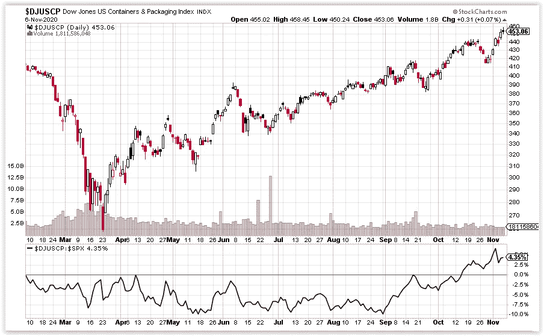
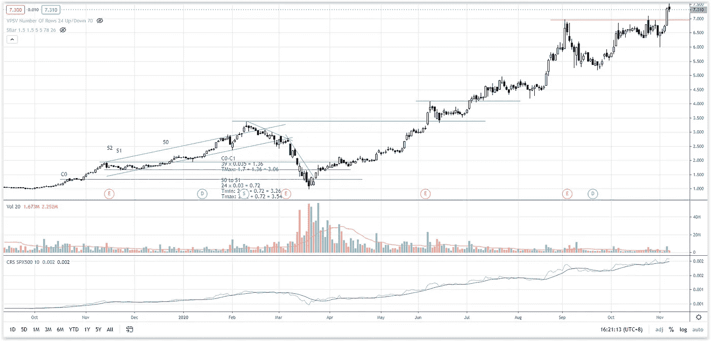
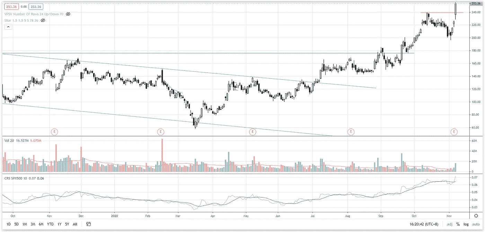

# 第 45 周集装箱和包装——强劲投机反弹的开始？

> 原文：<https://medium.datadriveninvestor.com/week-45-stock-market-roundup-containers-packaging-in-focus-1a1bac0a0946?source=collection_archive---------14----------------------->

在我的第 44 周股市综述中，在等待确认标准普尔 500 期货何时能在 3330 上方兑现看涨情景时，发现了一些可能的市场底部和反转迹象。上周，标准普尔 500 公布了自 2020 年 5 月以来的最佳表现周。在 2020 年 11 月 4 日选举后的计票中，波动性已经飙升，这表明供应吸收正在上升。

从长期来看，标准普尔 500 仍在 3200-3590 的交易区间内交易，这可能是一个基于供应减少的再积累结构。

从 2020 年 10 月 26 日至 30 日，供应的局部增加是否意味着威科夫阶段可能进入 C 阶段？实力标志(SOS)反弹之后是一次成功的后援行动，这是一个需要确认的事件。目前 SOS 集会仍在进行中。

最近波动性的增加无疑为日内交易者提供了更多的交易机会。在下面的视频中找出**键，在 S & P 500** 寻找伟大的日间交易机会(时间戳开始于 4:15):

**行业研究小组——道琼斯美国集装箱&包装指数(DJUSCP)**

容器和包装指数在 2020 年 9 月开始跑赢标准普尔 500，并从之前的高阻力波动中爆发，随后回调测试了阻力转向支撑，现在创下历史新高。

Photo by Author — Ming Jong Tey

这可能是一些集装箱和包装公司投机活动的开始吗？许多公司表现出供应减少的特征。可能会有轻松上行的潜力。从价格结构和交易量来看，以下是一些值得关注的股票:PKG(美国包装公司)、CCK(皇冠控股公司)、AMCR (AMCOR PLC)、CYRX(cry port 公司)、BLL (BALL CORP)

# 库存观察清单——马来西亚

供应一直在减少。它可能会上升。支撑在 2.1–2.2。

JHM (JHM 整合 BHD) —等待质量需求启动 2.0 以上的突破。支撑位在 1.55–1.7。

front kn(BHD front ken 公司)——front kn 应该尝试突破 3.8 的阻力。支撑位在 3.25。

FPGROUP — 0.93 支撑位持有。上周五是 FPGROUP 自 2020 年 9 月 15 日以来首次突破 1.07 阻力位。很有可能测试 1.2 的阻力。

MI(MI techno vation BERHAD)——交易区间仍在 3.7-4.7 之间。米很有可能在 4.7 再次挑战阻力。

PENTA(BHD penta master 公司)—支持 4.7–5.0 已经过测试。PENTA 很可能挑战 5.5 的阻力。

股票 A 创历史新高。如果它能保持在 7.0 以上，它应该会继续走高。

Photo by Author — Ming Jong Tey

# 股票观察列表—美国

MSFT(微软)——强劲的动能在 217 点的中间阻力上方形成缺口。MSFT 可能会达到 232 点的历史新高。

FB(FACEBOOK)——FB 的强劲势头应该允许它测试 304 的历史高点。支撑位在 250。

SE(SEA Limited)——SE 创历史新高。

JD(JD.com)——正如上周所料，当市场反转时，JD 突破 86 并创下历史新高。

NET (CLOUDFLARE) —网络点击量创历史新高。周五的供应高峰预计净进入盘整模式(如果不是反转修正的话)

PTON(PELOTON)——PTON 的交易区间预计在 109-139 之间。

阿里巴巴(阿里巴巴集团控股)——蚂蚁在香港和上海的停牌以及收益公告导致供应峰值跌破 300 点的支撑。供应吸收预计将在 280-300 之间窄幅波动。下一个支撑位在 268。

BTG(B2GOLD CORP)——交易区间在 6–7.0 之间。

FSLY(FASTLY INC .)——FSLY 跌破 74 点的支撑，这是疲软的迹象。目前正在测试电阻 74。如果 FSLY 未能在 74 上方兑现承诺，预计会有更多的抛售来测试 40-50 的较低支撑。

SQ(SQUARE INC)——SQ 创历史新高。在 2020 年 10 月 30 日出现大的熊市后，不会继续下跌。支撑位在 158-170。警惕 2020 年 11 月 6 日供应高峰时可能出现的反应。

应用程序(DIGITAL TURBINE INC .)——应用程序创历史新高。支持区在 25-29。

AVGO(BROADCOM INC .)——如果 AVGO 能在 374 点以上提交，它有望打破历史高点。

股票 X——创历史新高。至少一年的原因是供应减少。如果它能保持在 240 以上，它将继续走高。

Photo by Author — Ming Jong Tey

# 资源

**每周市场展望&最佳交易建议**直达您的收件箱:【https://www.tradeprecise.com/】T2

【www.TradingView.com】专业免费制图平台:创建账户→ [制图平台](https://bit.ly/2U2Femd)

**非美国居民？** ( **马来西亚、新加坡**、澳大利亚、新西兰、欧洲等……):[点击此处，存款 2000 元](https://ji.hn/sgtiger)即可获得**免费股票(价值 100++ &美元)老虎经纪**的欢迎礼物

美国居民？[点击此处，当您存款 1500 美元](https://ji.hn/ustradeup)时，有机会在 TradeUP 上获得一份**免费的 AMZN 股票(价值 3000++美元** ) & **欢迎礼物**

**从媒体获取无限文章** —加入以下:[https://priceactiontrading.medium.com/membership](https://priceactiontrading.medium.com/membership)

# 延伸阅读:

 [## 市场修正，泡沫还是崩盘？标准普尔 500 价格行为分析

### 标准普尔 500 期货(es)昨日因供应激增下跌 2.5%，跌破上行通道。这是正常的…

medium.com](https://medium.com/datadriveninvestor/market-correction-bubble-or-crash-s-p-500-price-action-analysis-6f26e6698dbc)  [## 2021 年这些绿色能源股会涨 400%-1300%吗？

### 2021 年第 3 周市场回顾

medium.com](https://medium.com/datadriveninvestor/will-these-green-energy-stocks-gained-400-1300-in-2021-3f7288227c76)  [## 被低估的高成长股——EVO、EMBRAC、FTCH、MWK、OPEN、SKLZ、UPST

### 2021 年第 2 周市场回顾

medium.com](https://medium.com/datadriveninvestor/underhyped-high-growth-stocks-evo-embrac-ftch-mwk-open-sklz-upst-5105abd20143) 

披露:如果您点击本文中的链接进行购买或开立账户，并将所需金额存入推荐的经纪人账户，我们将免费为您赚取佣金。

免责声明:本演示中的信息仅用于教育目的，不应作为投资建议。