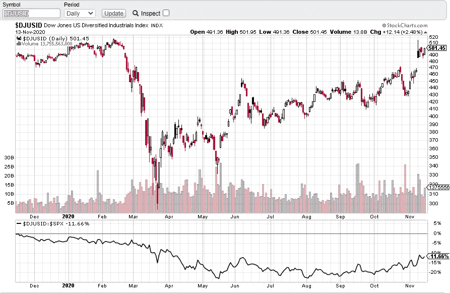

# 第 46 周标准普尔 500 股市综述——聚焦多元化产业

> 原文：<https://medium.datadriveninvestor.com/week-46-stock-market-s-p-500-roundup-diversified-industrials-in-focus-3d5a722e0468?source=collection_archive---------16----------------------->

正如第 45 周股市综述中提到的，上周标准普尔 500 打破历史新高，随后是**获利回吐，可能从纳斯达克转向道琼斯和罗素 2000** 。如果你仍然想知道上周一的交易量飙升和强烈的拒绝是否会对市场造成一些损害，请观看我的视频，我在视频中讨论了[如何寻求确认 a 市场抛售的开始](https://www.youtube.com/watch?v=F1_is0HNVoE)或只是在轮换中获利了结。

自从上周一的强烈拒绝，标准普尔 500 期货没有跟随下跌，这是一个看涨的信号。它可能会试图反弹，以测试 3668 点的历史高点，并在 3500 点获得直接支撑。

11 月 12 日，我在一篇交易评论中并排比较了**反向头肩底形态交易和如何从价格行为角度交易**(有成交量)。你交易的是头部&肩部形态还是双底等形态？一定要看下面的视频，因为理解价格运动背后的**原理，而不是简单地根据模式交易，这是至关重要的。**

**研究行业组——道琼斯美国多元化工业指数(DJUSID)**

自 2020 年 3 月以来，多元化工业指数一直落后。然而，自 2020 年 10 月以来，它的相对强度开始出现较高的高和较高的低形态。目前的轮动可能会进一步推动该行业中的一些强势股。

Photo by Author — Ming Jong Tey

从价格结构和交易量来看，这里有一些有趣的股票值得关注:强势股:HON(霍尼韦尔国际公司)、ETN(伊顿公司)；SWK(史丹利百得公司)、AME(阿美特克公司)等

# 库存观察清单——马来西亚

观看下面的马来西亚股票观察列表:

## 时间戳

*   [1:25](https://www.youtube.com/watch?v=LT2XRyyHwrs&t=85s) JHM (JHM 合并 BHD)
*   [4:29](https://www.youtube.com/watch?v=LT2XRyyHwrs&t=269s) VS (V.S 工业 BHD)
*   front kn(BHD front ken 公司)
*   米(米技术创新有限公司)
*   [9:42](https://www.youtube.com/watch?v=LT2XRyyHwrs&t=582s)PENTA(BHD 五达公司)
*   [12:00](https://www.youtube.com/watch?v=LT2XRyyHwrs&t=720s)UWC(UWC·伯哈德)

VS(VS . S 工业 BHD)——VS 在 2.25-2.56 之间的交易范围内。下一个支撑位在 2.1–2.2。

JHM(JHM BHD 盘整)——突破阻力位 2.0，创历史新高。支撑位在 1.9–2.0。停留在这一支撑位之上可以看到 JHM 的趋势更高。

front kn(BHD front ken 公司)支持级别:3.5，3.25。如果 FRONTKN 可以停留在支撑上方，它应该尝试测试 3.8。

MI (MI TECHNOVATION BERHAD) -交易区间仍在 3.7-4.7 之间。米很有可能在 4.7 再次挑战阻力。供应一直在减少，这是一个看涨的信号。

PENTA(BHD penta master 公司)——供应的增加导致 PENTA 再次测试 5.0 的支撑。观察到供应吸收，PENTA 可能挑战 5.5。

第 45 周提到的股票 A 是 UWC(UWC·伯哈德)。上周五，UWC 测试了阻力位，并创下历史新高。预计会进一步上涨。

# 股票观察列表—美国

观看下面的美国股票观察列表:

## 时间戳

*   [0:57](https://www.youtube.com/watch?v=da1Wf5K_c58&t=57s) MSFT(微软)
*   [2:36](https://www.youtube.com/watch?v=da1Wf5K_c58&t=156s) 脸书
*   [3:45](https://www.youtube.com/watch?v=da1Wf5K_c58&t=225s) SE(海洋有限公司)
*   [4:42](https://www.youtube.com/watch?v=da1Wf5K_c58&t=282s)JD(JD.com)
*   [5:26](https://www.youtube.com/watch?v=da1Wf5K_c58&t=326s) 网(云闪)
*   [7:05](https://www.youtube.com/watch?v=da1Wf5K_c58&t=425s) PTON (PELOTON 互动公司)
*   [8:22](https://www.youtube.com/watch?v=da1Wf5K_c58&t=502s) 巴巴(阿里巴巴集团控股)
*   BTG(B2 黄金公司)
*   FSLY(快速有限公司)
*   [14:18](https://www.youtube.com/watch?v=da1Wf5K_c58&t=858s) 广场公司
*   AVGO(博通公司)
*   罗库公司

MSFT(微软)——上周一和周二的获利回吐位于 210 点的中间支撑位。预计交易区间为 210–225。

FACEBOOK——在上周一和周二的获利回吐期间观察到了供应吸收。FB 有望挑战 300 的摆动高阻力。

SE(SEA Limited)——与 MSFT 和 FB 类似，在上周的获利回吐过程中观察到供应吸收。预计会有更高的上行目标。

JD(JD.com)—观察到供应吸收。JD 有望走高。

NET(cloud flare)——强势股之一跑赢大盘。预计净值将继续上涨。

PTON(PELOTON INTERACTIVE INC)——PTON 的强劲获利回吐目前正在测试 100 的支撑位。可能的交易范围在 90–110 之间。

阿里巴巴(阿里巴巴集团控股)——上周供应激增，抛售强劲。疲软的迹象出现在巴巴跌破 268 支撑。强劲的看跌势头可能推动巴巴测试下一个支撑位在 240-250。

BTG(B2GOLD CORP)——BTG 测试了 6.0 的支撑位。

FSLY(FASTLY INC .)——FSLY 的供应已经耗尽，高于 74 点支撑的承诺违反了上周提到的疲软迹象。第一阻力在 90 度。支撑位在 62。

SQ (SQUARE INC) —支撑位在 160-170 之间。预计 SQ 将测试 193 点的阻力。

AVGO(博通公司)——AVGO 的直接阻力在 388，而支撑位在 360。

第 45 周提到的股票 X 是 ROKU。上周获利回吐并没有对价格结构造成很大损害。ROKU 很可能测试 239 的阻力。

# 资源

**每周市场展望&最佳交易建议**直达您的收件箱:【https://www.tradeprecise.com/】T2

【www.TradingView.com】专业免费制图平台:创建账户→ [制图平台](https://bit.ly/2U2Femd)

**非美国居民？** ( **马来西亚、新加坡**、澳大利亚、新西兰、欧洲等……):[点击此处，存款 2000 元](https://ji.hn/sgtiger)即可获得**免费股票(价值 100++ &美元)老虎经纪**的欢迎礼物

美国居民？[点击此处，当您存入 1500 美元](https://ji.hn/ustradeup)时，就有机会在 TradeUP 上获得一份**免费的 AMZN 股票(价值 3000++美元** ) & **欢迎礼物**

**从媒体获取无限文章** —加入以下:[https://priceactiontrading.medium.com/membership](https://priceactiontrading.medium.com/membership)

# 延伸阅读:

 [## 火眼公司和太阳风公司被黑-网络安全股票牛市的开始？

### 2021 年第 1 周市场回顾

medium.com](https://medium.com/datadriveninvestor/fireeye-solarwinds-hacked-start-of-the-bull-run-for-cyber-security-stocks-31e99fd2b8c1)  [## ARK Invest 的 Cathie Wood 预测基因组股表现优于特斯拉？

### 方舟投资公司的首席执行官凯西·伍德预测，最大的上涨惊喜可能来自基因组股票，尤其是…

medium.com](https://medium.com/datadriveninvestor/ark-invests-cathie-wood-predicts-genomic-stocks-outperform-tesla-b67f3c4bbc68)  [## 凯西·伍德警告市场即将调整——标准普尔 500 价格走势分析

### 在 2020 年 12 月 18 日对彭博的采访中，方舟投资公司的首席执行官兼首席信息官凯西·伍德警告说…

medium.com](https://medium.com/datadriveninvestor/cathie-wood-warns-market-correction-soon-price-action-analysis-on-s-p-500-7e621e013310) 

披露:如果您点击本文中的链接进行购买或开立账户，并将所需金额存入推荐的经纪人账户，我们将免费为您赚取佣金。

免责声明:本演示中的信息仅用于教育目的，不应作为投资建议。