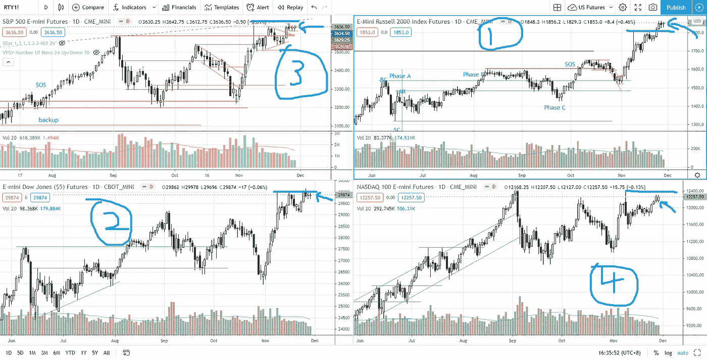
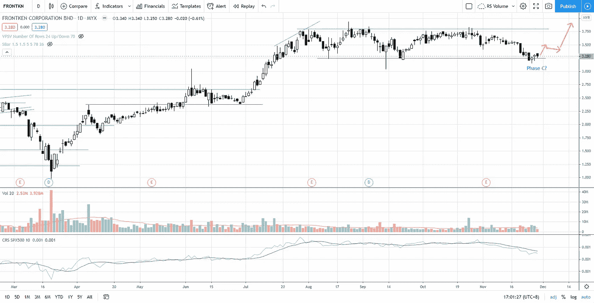

# 第 48 周标准普尔 500 股市综述&一只新的强劲动力股票

> 原文：<https://medium.datadriveninvestor.com/week-48-s-p-500-stock-market-roundup-new-strong-momentum-stock-dea860b59ee8?source=collection_archive---------15----------------------->

正如第 46 周股市综述中所述，从纳斯达克指数到罗素 2000 指数和道琼斯指数的轮动在过去两周已经得到证实。

Photo by Author — Ming Jong Tey

通过将当前价格与上图中 2020 年 11 月 9 日创造的波动高点(获利回吐的地方)进行比较，罗素 2000 指数表现最强，其次是道琼斯、标准普尔 500 和纳斯达克。**由于供应(从 11 月 9 日开始)已经被吸收，预计所有 4 个指数**都将继续上涨。

# 库存观察清单——马来西亚

VS(VS . S 工业 BHD)——VS 在 2.25-2.56 之间的交易范围内。下一个支撑位在 2.1–2.2。供应不足。

JHM (JHM 联合 BHD)——JHM 触及历史高点后，出现了少量获利回吐。2020 年 11 月 26 日，JHM 跌破 2 点支撑，对盈利做出反应。如果 JHM 保持在 1.77 的支撑位上方，它应该会恢复上升趋势。

front kn(BHD front ken 公司)——供应的增加试图突破 3.25 的支撑，随后两天买断该支撑。注意 FRONTKN 的供应减少，开始反弹的迹象，以突破 3.8。这可能是威科夫阶段的一个潜在阶段 C。

Photo by Author — Ming Jong Tey

MI(MI techno vation BERHAD)-交易区间仍在 3.7-4.7 之间。米会不会也在 C 阶段开始类似 FRONTKN 的强势反弹迹象？

PENTA(BHD penta master 公司)——5 点的支撑位未能守住。支撑位在 4.3–4.5。

UWC(UWC·伯哈德)——2020 年 11 月 5 日突破后，后援行动仍在进行中。直接支持在 7 点。总体而言，供应量较低，这有利于看涨。

# 股票观察列表—美国

观看下面的美国股票观察列表。第一只股票是在给我的订户的电子邮件中透露的。找出 MSFT，FB，SE，JD，NET，PTON，BABA，BTG，FSLY，SQ，AVGO，ROKU 在第 48 周发生了什么，以及价格行动交易和交易量价差分析接下来会发生什么。

## 时间戳

*   [0:18](https://www.youtube.com/watch?v=YNz_GtoQue0&t=18s) 强劲势头的股票
*   罗库公司
*   4:49 AVGO(博通公司)
*   [6:24](https://www.youtube.com/watch?v=YNz_GtoQue0&t=384s) SQ (SQUARE INC)
*   FSLY(快速有限公司)
*   BTG (B2GOLD CORP)
*   [11:26](https://www.youtube.com/watch?v=YNz_GtoQue0&t=686s) 巴巴(阿里巴巴集团控股)
*   [13:33](https://www.youtube.com/watch?v=YNz_GtoQue0&t=813s) 普顿(PELOTON 互动公司)
*   [14:45](https://www.youtube.com/watch?v=YNz_GtoQue0&t=885s) 网(CLOUDFLARE)
*   [16:21](https://www.youtube.com/watch?v=YNz_GtoQue0&t=981s)JD(JD.com)
*   [17:18](https://www.youtube.com/watch?v=YNz_GtoQue0&t=1038s) SE(海洋有限公司)
*   [19:03](https://www.youtube.com/watch?v=YNz_GtoQue0&t=1143s) 脸书
*   MSFT(微软)

# 资源

**每周市场展望&最佳交易建议**直达您的收件箱:[https://www.tradeprecise.com/](https://www.tradeprecise.com/)

**职业免费**制图平台:创建账户→[www.TradingView.com](https://bit.ly/2U2Femd)

**非美国居民？** ( **马来西亚、新加坡**、澳大利亚、新西兰、欧洲等……):[点击此处，存款 2000 新加坡元](https://ji.hn/sgtiger)即可获得**免费股票(价值 100++美元&老虎经纪**的欢迎礼物)

美国居民？[点击此处，当您存入 1500 美元](https://ji.hn/ustradeup)时，就有机会在 TradeUP 上获得一份**免费的 AMZN 股票(价值 3000++美元** ) & **欢迎礼物**

**从媒体获取无限文章** —加入以下:[https://priceactiontrading.medium.com/membership](https://priceactiontrading.medium.com/membership)

# 进一步阅读

 [## ARK Invest 的 Cathie Wood 预测基因组股表现优于特斯拉？

### 方舟投资公司的首席执行官凯西·伍德预测，最大的上涨惊喜可能来自基因组股票，尤其是…

medium.com](https://medium.com/datadriveninvestor/ark-invests-cathie-wood-predicts-genomic-stocks-outperform-tesla-b67f3c4bbc68)  [## 低估的可操作高成长股第 2 部分— FVRR、优步、PYPL、JMIA

### 这些高成长股很可能在几天内被触发。找出我的交易计划与进入和止损…

medium.com](https://medium.com/datadriveninvestor/underhyped-actionable-high-growth-stocks-part-2-fvrr-uber-pypl-jmia-b24183668d20)  [## 2021 年这些绿色能源股会涨 400%-1300%吗？

### 2021 年第 3 周市场回顾

medium.com](https://medium.com/datadriveninvestor/will-these-green-energy-stocks-gained-400-1300-in-2021-3f7288227c76) 

披露:如果您点击本文中的链接进行购买或开立账户，并将所需金额存入推荐的经纪人账户，我们将免费为您赚取佣金。

免责声明:本演示中的信息仅用于教育目的，不应作为投资建议。