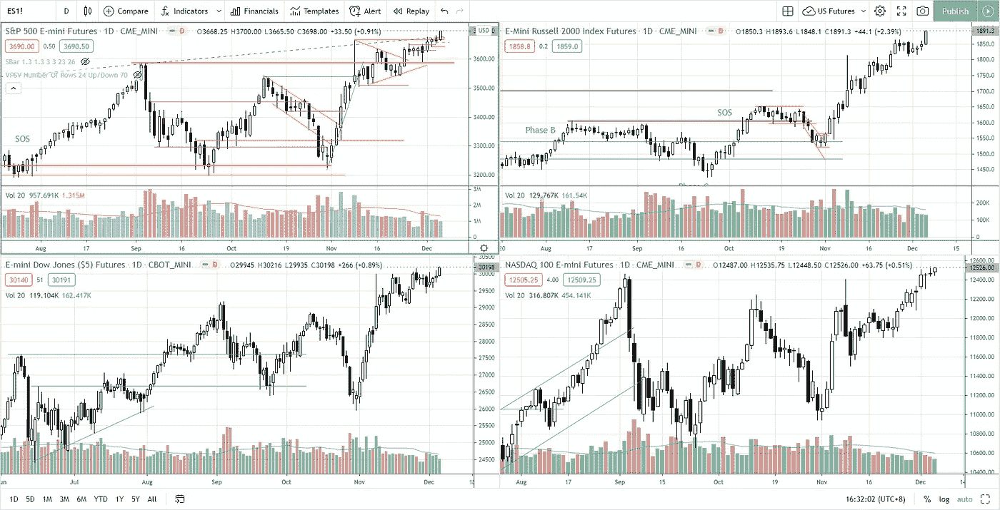
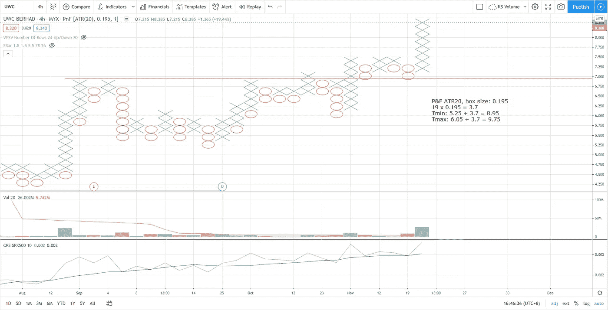

# 美国股票观察名单第 49 周— AMCR、ATSG、BLL、CLCT、美国、FDX、香港、纽约、MELI、澳门、安大略省、新加坡、台湾

> 原文：<https://medium.datadriveninvestor.com/week-49-s-p-500-stock-market-roundup-9e9b84683e6e?source=collection_archive---------4----------------------->

正如上周日第 48 周股市综述所说，“预计所有 4 个指数都将继续上行”，我们目睹了所有 4 个指数创下历史新高(包括落后的纳斯达克)。

Photo by Author — Ming Jong Tey

供应已经从 2020 年 9 月以来形成的重新累积交易区间中吸收，这反映在成交量签名中。预计将开始涨价阶段。

# 库存观察清单——马来西亚

VS (V.S INDUSTRY BHD) — VS 突破了重新积累的交易区间，创下历史新高。备份操作正在进行中。支撑位在 2.5–2.56。

JHM (JHM 整合 BHD)——JHM 似乎处于涨价阶段前的最后一个支撑点。支撑在 1.8-1.9。

FRONTKN(BHD front ken 公司)——随着需求的增加，front kn 从 3.25 的支撑反弹。应该会挑战 3.8 的阻力。注意这次反弹是否是强势反弹突破的标志。

MI(MI techno vation BERHAD)——MI 仍在交易区间 3.8–4.4 之间交易。MI 会不会效仿 FRONTKN 的类似动作？

PENTA(BHD penta master 公司)——随着需求的增加，PENTA 从中间支撑反弹，可能测试 5.5 的摆动高阻力。

UWC(UWC·伯哈德)——在突破之后紧接着是后备行动，UWC 开始了加价过程并创下历史新高。基于点数和图形计算的第一个目标在 9.0-9.7 之间。

Photo by Author — Ming Jong Tey

# 股票观察列表—美国

观看下面新的美股观察名单视频，基于 9 周前开始的选择性优于工业集团。

## 时间戳

*   [0:05](https://www.youtube.com/watch?v=aBWSEBf9fVU&t=5s) PDD(拼多多公司)
*   [1:45](https://www.youtube.com/watch?v=aBWSEBf9fVU&t=105s) AMCR (AMCOR PLC)
*   AME (AMETEK 公司)
*   AMRC(亚美利斯科公司)
*   [5:11](https://www.youtube.com/watch?v=aBWSEBf9fVU&t=311s) AOSL(阿尔法&欧米茄半导体有限公司)
*   ATSG(航空运输服务集团公司)
*   BLL(鲍尔公司)
*   [8:18](https://www.youtube.com/watch?v=aBWSEBf9fVU&t=498s) CCK(皇冠控股公司)
*   [9:03](https://www.youtube.com/watch?v=aBWSEBf9fVU&t=543s) CLCT(收藏家宇宙公司)
*   [10:36](https://www.youtube.com/watch?v=aBWSEBf9fVU&t=636s) CYRX(低温端口)
*   [11:36](https://www.youtube.com/watch?v=aBWSEBf9fVU&t=696s) ETN(伊顿公司)
*   EXPEDITORS 实习生华盛顿公司
*   FDX(联邦快递公司)
*   FLR(福陆公司)
*   HON(霍尼韦尔国际公司)
*   英飞凌科技股份公司
*   MELI(自由市场报)
*   MTCH (MATCH 集团公司)
*   [18:46](https://www.youtube.com/watch?v=aBWSEBf9fVU&t=1126s) 马斯特克公司
*   [19:26](https://www.youtube.com/watch?v=aBWSEBf9fVU&t=1166s) 上半导体(公司)
*   PKG(美国包装公司)
*   量子服务公司
*   ROL(罗林斯公司)
*   SWK(斯坦利·布莱克&德克尔公司)
*   SKYWORKS 解决方案公司
*   [23:43](https://www.youtube.com/watch?v=aBWSEBf9fVU&t=1423s) 台湾半导体制造公司
*   联合包裹服务公司

# 资源

**每周市场展望&最佳交易建议**直达您的收件箱:【https://www.tradeprecise.com/】T4

**专业免费**制图平台:创建账户→[www.TradingView.com](https://bit.ly/2U2Femd)

**非美国居民？** ( **马来西亚、新加坡**、澳大利亚、新西兰、欧洲等……):[点击此处，存款 2000 新加坡元](https://ji.hn/sgtiger)即可获得**免费股票(价值 100++美元&老虎经纪**的欢迎礼物)

美国居民？[点击此处，当您存入 1500 美元](https://ji.hn/ustradeup)时，就有机会在 TradeUP 上获得一份**免费的 AMZN 股票(价值 3000++美元** ) & **欢迎礼物**

**从媒体获取无限文章** —加入以下:[https://priceactiontrading.medium.com/membership](https://priceactiontrading.medium.com/membership)

# 延伸阅读:

 [## 低估的可操作高成长股第 2 部分— FVRR、优步、PYPL、JMIA

### 这些高成长股很可能在几天内被触发。找出我的交易计划与进入和止损…

medium.com](https://medium.com/datadriveninvestor/underhyped-actionable-high-growth-stocks-part-2-fvrr-uber-pypl-jmia-b24183668d20)  [## ARK Invest 的 Cathie Wood 预测基因组股表现优于特斯拉？

### 方舟投资公司的首席执行官凯西·伍德预测，最大的上涨惊喜可能来自基因组股票，尤其是…

medium.com](https://medium.com/datadriveninvestor/ark-invests-cathie-wood-predicts-genomic-stocks-outperform-tesla-b67f3c4bbc68)  [## 2021 年这些绿色能源股会涨 400%-1300%吗？

### 2021 年第 3 周市场回顾

medium.com](https://medium.com/datadriveninvestor/will-these-green-energy-stocks-gained-400-1300-in-2021-3f7288227c76) 

披露:如果您点击本文中的链接进行购买或开立账户，并将所需金额存入推荐的经纪人账户，我们将免费为您赚取佣金。

免责声明:本演示中的信息仅用于教育目的，不应作为投资建议。