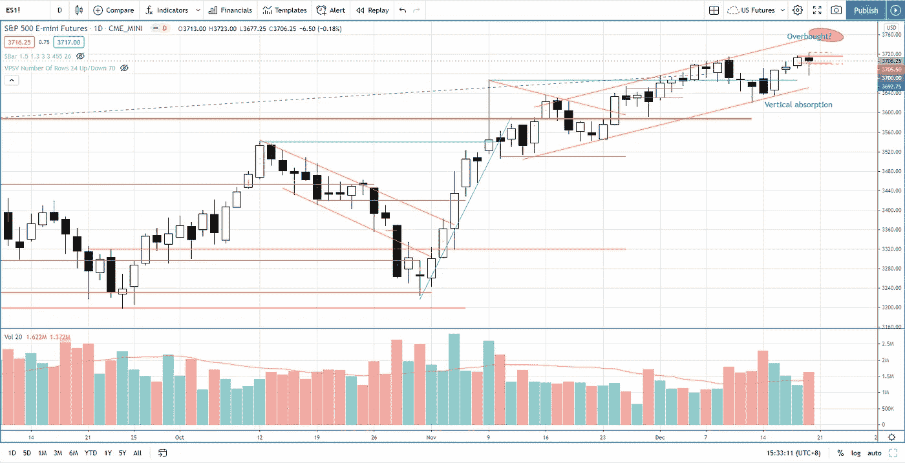

# 第 51 周标准普尔 500 股市综述——表现最佳的 9 只生物技术股票

> 原文：<https://medium.datadriveninvestor.com/week-51-s-p-500-stock-market-roundup-top-9-best-performing-biotechnology-stocks-826544927e9d?source=collection_archive---------11----------------------->

[第 50 周股市综述](https://priceactiontrading.medium.com/week-50-s-p-500-stock-market-roundup-stock-watchlist-update-b068799a3b23)中提到的指数在触及历史高点后的回调于 2020 年 12 月 14 日结束，2020 年 12 月 15 日出现垂直供应吸收，使标准普尔 500 指数再次测试历史高点。

Photo by Author — Ming Jong Tey

根据上面标准普尔 500 图所示的上升通道，在到达 3750 点之前仍有上升空间达到超买水平。3660-3670 的直接支持区域。

# 马来西亚手套行业(全球最大的手套制造商)

今年，由于新冠肺炎的需求达到历史最高水平，马来西亚手套行业的股价表现增长了数倍。全球最大的手套制造商 TopGlov (Top Glove Corporation Bhd)、SuperMax(SuperMax Corporation Bhd)、Harta (Hartalega Holdings Bhd)、Kossan(Kossan Rubber Industries Bhd)等四大手套公司在最近一个季度的收益同比增长了 4-30 倍。

这 4 只手套股票的股价表现在 5 月份爆发，在 2020 年 8 月达到峰值的 10 倍。尽管基本面支撑强劲，但我们还是来看看以下视频中 Topglov、Supermx、Harta 和 Kossan 的价格结构以及供需情况:

## 时间戳

*   [1:25](https://www.youtube.com/watch?v=OggFofFLLpQ&t=85s) 托普格洛夫(托普手套公司)
*   [9:48](https://www.youtube.com/watch?v=OggFofFLLpQ&t=588s)SuperMax(SuperMax 公司)
*   [13:10](https://www.youtube.com/watch?v=OggFofFLLpQ&t=790s) Harta (Hartalega 控股有限公司
*   [15:40](https://www.youtube.com/watch?v=OggFofFLLpQ&t=940s) 韩国橡胶工业公司

再积累还是分配？看起来像是基于图表的分布。

 [## 收盘，但没有雪茄-股票市场目标在停滞的 COVID 救济中创新高|数据驱动…

### 专家聊天程序:一个协作市场，在这里人们可以和能够解决他们问题的专家聊天。是……

www.datadriveninvestor.com](https://www.datadriveninvestor.com/2020/08/18/close-but-no-cigar-stock-market-targets-record-highs-amidst-stalled-covid-relief/) 

# 美国股票观察名单——生物技术领域表现最佳的 9 只股票

生物技术 ETF——IBB 自 2015 年 7 月以来建立了一个庞大的基金，它在 2020 年 12 月刚刚进入加价阶段。基于所建立的巨大事业，这可能是头寸交易或投资的最佳领域之一。从 IBB 交易所交易基金中，我挑选了股价表现(年初至今的表现范围为 260%-616%)排名前 9 位的股票(MRNA、TWST、MCRB、FATE、RARE、PACB、NTLA、SRRK)，并提取了一些我认为可能有助于在正确的组中挑选强候选人的信息。

观看下面的视频:

## 时间戳:

*   IBB(ISHARES Trust Nasdaq Biotechnology ETF)
*   [3:30](https://www.youtube.com/watch?v=NypjFM4-scQ&t=210s) MRNA(现代公司)
*   [5:07](https://www.youtube.com/watch?v=NypjFM4-scQ&t=307s) TWST (TWIST 生物科学公司)
*   [6:31](https://www.youtube.com/watch?v=NypjFM4-scQ&t=391s) MCRB
*   [7:50](https://www.youtube.com/watch?v=NypjFM4-scQ&t=470s) 命运(命运疗法)
*   [10:40](https://www.youtube.com/watch?v=NypjFM4-scQ&t=640s) 稀有(ULTRAGENYX 制药公司)
*   PACB(太平洋加州生物科学公司)
*   NTLA (INTELLIA THERAPEUTICS 公司)
*   学者石控股公司
*   [15:35](https://www.youtube.com/watch?v=NypjFM4-scQ&t=935s) RTY(罗素 2000 指数期货)
*   [16:18](https://www.youtube.com/watch?v=NypjFM4-scQ&t=978s) 基因或基因组革命——利益轮换

# 资源

**每周市场展望&最佳交易建议**直达您的收件箱:[https://www.tradeprecise.com/](https://www.tradeprecise.com/)

**职业免费**制图平台:创建账户→[www.TradingView.com](https://bit.ly/2U2Femd)

**非美国居民？** ( **、新加波**、澳洲、纽西兰、欧洲等……):[存款 2000 新币](https://ji.hn/sgtiger)即可获得**免费股票(价值 100 美元++ &老虎经纪公司的欢迎礼物**

美国居民？[点击此处，当您存入 1500 美元](https://ji.hn/ustradeup)时，就有机会在 TradeUP 上获得**份免费的 AMZN 股票(价值 3000++美元** ) & **份欢迎礼物**

**无限制访问媒体文章** —加入以下:[https://priceactiontrading.medium.com/membership](https://priceactiontrading.medium.com/membership)

# 进一步阅读

 [## 低估的可操作高成长股第 2 部分— FVRR、优步、PYPL、JMIA

### 这些高成长股很可能在几天内被触发。找出我的交易计划与进入和止损…

medium.com](https://medium.com/datadriveninvestor/underhyped-actionable-high-growth-stocks-part-2-fvrr-uber-pypl-jmia-b24183668d20)  [## 凯西·伍德警告市场即将调整——标准普尔 500 价格走势分析

### 在 2020 年 12 月 18 日对彭博的采访中，方舟投资公司的首席执行官兼首席信息官凯西·伍德警告说…

medium.com](https://medium.com/datadriveninvestor/cathie-wood-warns-market-correction-soon-price-action-analysis-on-s-p-500-7e621e013310)  [## ARKG ETF 中摇摆交易的三大小盘股——AQB、CLLS 和冲浪

### 从 ARK Invest 的 ARKG ETF 中找出三大小盘股——AQB、CLLS 和冲浪，它们有很大的潜力…

medium.com](https://medium.com/datadriveninvestor/top-3-small-cap-stocks-in-arkg-etf-for-swing-trading-aqb-clls-surf-8963bc4d5ef2) 

披露:如果您点击本文中的链接进行购买或开立账户，并将所需金额存入推荐的经纪人账户，我们将免费为您赚取佣金。

免责声明:本演示中的信息仅用于教育目的，不应作为投资建议。

## 访问专家视图— [订阅 DDI 英特尔](https://datadriveninvestor.com/ddi-intel)