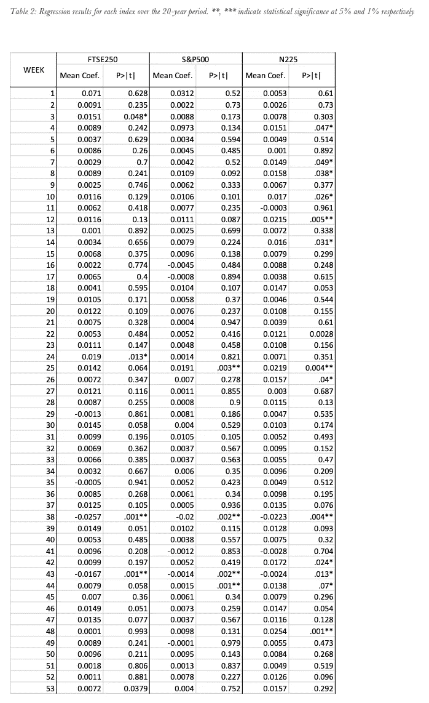
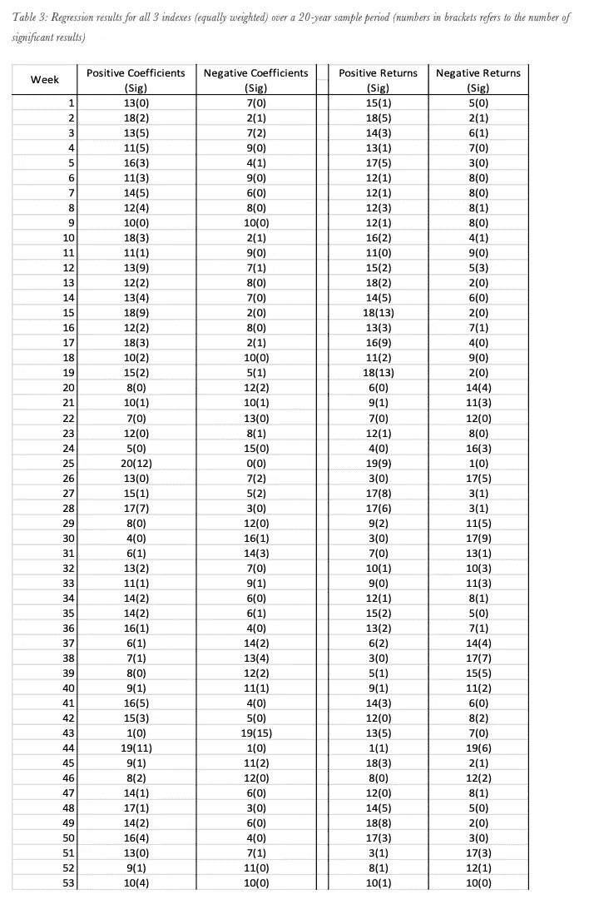
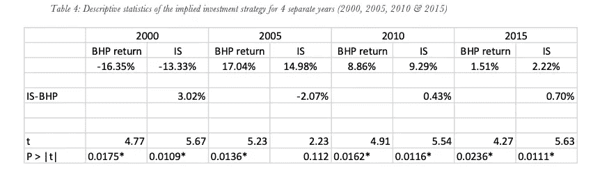

# 年度周效应:战胜市场的简单方法？

> 原文：<https://medium.datadriveninvestor.com/week-of-the-year-effect-16239e36f3af?source=collection_archive---------16----------------------->

*inserts a generic financial analysis photo*

最初这项研究是为我的理学硕士项目进行的，现已适用于培养基。原件获得了一个杰出的等级，并已被审查的准确性。我试图保留尽可能多的原创内容，但删除了一些更技术性的内容以及文献综述(没人真的想看)等。

自从 2020 年完成这篇论文以来，我完善并改变了这个策略。我已经在实时市场上实施了这一新策略，部分是由于 2021 年的疯狂开局，与指数收益相比，我已经获得了 20%以上的回报。

该研究旨在通过对基本日历效应的深入分析来击败市场指数回报。

## **简介**

有大量的研究发现了日历异常，每项研究得出的实证结果似乎都与更成熟的资产定价模型理论不一致。这些日历异常的例子包括但不限于星期几、月中的星期、年中的月份和一月效应

日历效应是许多不同利益相关者特别感兴趣的，尤其是投资者和分析师。如果一个日历异常被证明是重要的，那么它可以利用简单的算法来增加回报。一个重要的和已被证实的日历异常也质疑了有效市场假说，这进一步增加了对投资者和分析师的需求。

特别是，这项研究将着眼于一年中的一周效应，这似乎是日历异常领域的一个未触及的角落。将一年分为 53 周，有可能战胜简单的买入并持有策略吗？如果一个日历异常被发现是存在的和重要的，那么这暗示了一年中不同周之间的统计不同的回报。

本研究的主要目的是检验有效市场假说，并确定是否存在显著的日历异常。在此范围内，将分析世界上交易量最大的三个指数之间的异同。这项研究的另一个目的是发现一个未被探索的日历效应，一年中的星期效应。如前所述，如果发现存在这种异常，本研究将展示如何在隐含交易策略中利用这种异常来获得比简单投资方法更高的异常回报。

这项研究利用三大股指(富时 250 指数、S&P500 指数和 N225 指数)20 年间的 3141 个数据点，对日历效应的证据进行了深入研究。

## 方法学

为了能够评论是否存在年度周效应，我将重点关注 S&P500、富时 250 指数和日经 225 指数；将日历年分成 53 周。第一周从 1 月 1 日开始，到 1 月 7 日结束，第二周是 1 月 8 日至 14 日。因此，第 53 周，即一年中的最后一周，将是唯一包含少于七天的一周。如果第 7 天没有交易，因为是周末或假日，我将使用一周的最后一个交易日。

(我已经删除了所用的方程，但如果你感兴趣，这项研究主要围绕回归，使用 GARCH。)

## 数据

我的样本由三个股票指数的周收益率组成:富时 250、N225 和 S&P500。这些数据主要是通过雅虎财经和 WRDS 收集的，所有数据都与 Bloomberg.com 相互参照。这些数据是在 2000 年 1 月 1 日至 2019 年 12 月 31 日的 20 年间收集的。

对于 2019 年 4 月 30 日开始的第 18 周，没有 N225 指数回报的数据，因为该指数因日本 10 天假期而关闭。在所有索引中，第 53 周也有许多 null 结果，因为这一周的日期是周末。

## 结果

回归分析后，有 11 周，超过 3 个指数产生负回报，其中 6 个结果在 95%的置信水平上具有统计显著性。对于正的平均回报率，我们在 S&P500 指数的第 4 周看到最大值 0.0973；同样，这个结果并不显著。显著正预期收益(5%水平)的数量为 21，其中 10 个在 1%水平也是显著的，因此结果非常稳健。超过一半的重要结果(13 个)来自 N225 指数，而富时 250 指数和 S&P500 指数都取得了最少的重要结果(各 4 个)。

从表 2 中可以看出，对于所有三个指数来说，第 38 周是非常显著的，达到了 1%的水平。结果显示，所有指数在一周内的回报率至少为-2%。第 38 周，或 9 月 15 日至 21 日，与任何其他公布的异常现象不一致。虽然众所周知，第 38 周是 S&P500 指数中表现最差的一周，但这方面的数据或研究非常少(我将在另一篇文章中讨论)。

第 25 周是唯一一个与一个以上指数的显著结果一致的另一周，N225 和 S&P500 都具有显著正的预期平均回报率。6 月 17 日-24 日，同样没有研究这一周以及为什么它可能有显著的回报。缺乏文献的一个可能原因是，本周不符合任何前述的日历异常，因此不是大多数学术研究人员感兴趣的来源。

绝对值最高的 t-stat 来自第 38 周 FTSE250 的阴性结果，这在上面已经讨论过；以及 N225 中的第 48 周。这是两个最重要的结果，t-stat 值分别为 3.35 和 3.34。

从表 2 可以看出，最后一个引人注目的观察结果是，当周 43 和 44 有 6 个预期收益中的 5 个是显著的。由于第 43 周的所有预期收益都是负的，而第 44 周的所有预期收益都是正的，这将表明这里存在异常发生的有力证据。假设第 43 周从 10 月 22 日开始，第 44 周从 10 月 29 日开始。这一结果似乎与 5 月至 10 月和 SAD 异常一致。

下一张表(表 3)显示了每周正系数和负系数的总数，以及通过回归分析得出的 20 年间所有指数的回报。这是许多日历效应分析论文中的一种方法。显然，在过去 20 年中，任何一周的正系数平均数为 12.11，而负系数平均数为 7.89。当看回报率时，差距缩小了，20 年中任何一周的平均回报率为 11.68，20 年中平均有 8.26 年出现负回报。

表 3 中最突出的结果是第 25 周，在 20 年的测试中，有 20 年的系数为正，其中 12 年的结果在统计上显著性达到 5%的水平。本周还出现了 20 年中 19 年的正回报；其中 9 个是重要的。

和表 2 一样，另一个值得讨论的结果是第 43 周和第 44 周之间的关系。第 43 周在 20 年中有 19 年出现负系数，高水平的负系数达到 5%的显著水平。与第 43 周相反，第 44 周在 20 年中有 19 年的系数为正，其中 15 年的结果达到了 5%的显著水平。这再次与 5 月至 10 月和令人悲伤的异常现象相吻合。从表 3 中可以看出，所有其他负系数都难以获得任何有意义的显著性。

此外，对 20 年中每年 53 周的正回归系数比例进行 t 检验，如公式 4 所示。第 43 周和第 44 周的 t 值最高，均达到 4.02，表明在 5%和 1%的水平上具有较高的统计显著性。这支持了这一现象，不仅在一个指数中，而且在国际上超过 20 年的所有三个指数中都是一个强有力的发现。当我们查看表 3 中的回报结果时，可以清楚地看到，积极方面的显著结果的数量要多得多。最强的显著性出现在第 15 周和第 19 周，当看其他结果时，这两周并不突出。它们与第 45 周和第 49 周一起，见证了 20 年来最高的正回报，在此期间有 18 个正结果。

表 3 中另一个小但有趣的地方是，在 20 年的样本中，没有一周的回报是完全正或负的。然而，有一周，即第 25 周，系数都是正的。

似乎在一周之后，大部分系数的回报要么是正的，要么是负的，接下来的一周会有相反的反应。这似乎是一个有趣的特性，在系数和回报列中非常突出，可以作为进一步研究的领域。

表 3 的平均结果显示平均正系数为 12.11，平均负系数为 7.89。这清楚地表明，在过去的 20 年里，股票正回报和牛市更为常见。当您将系数的平均值与回报的平均值进行比较时，您可以看到回报之间的差异较小，在 20 年和 3 个指数中，正回报的平均值为 11.68，负回报的平均值为 8.26。

## 隐含战略

从数据和分析中，我们可以看出哪几周多头仓位最有利可图，哪几周空头仓位回报更高。显而易见，在第 43 周应该持有空头头寸，而在第 15、19、25 和 44 周应该持有多头头寸。因为这几周具有很高的显著性，并且大多数结果来自预测结果的 20 年样本。或者，可以在整个期间采用简单的买入并持有策略，从头到尾持有整个指数。这意味着 N225、FTSE250 和 S&P500 的股票指数将在 1 月 1 日等量引入，并在相应年份的 12 月 31 日出售。

相比之下，我们的隐含交易策略包括从 1 月 1 日到第 43 周(即 10 月 22 日)开始持有三个指数的多头头寸，在此期间将建立空头头寸。从第 44 周开始，这个空头头寸将变回多头头寸，直到 12 月 31 日，届时持有的资金将被套现。

表 4 将隐含交易策略(IS)的结果与传统的买入并持有策略(BHP)进行了比较。从一开始就很清楚，is 的回报高于甚至超过必和必拓，这清楚地表明，通过年度周效应战胜市场是可能的。

两种策略之间的最大差异出现在 2000 年，当时 is 和 BHS 之间有 3.02%的差距。有趣的是，当市场的总体趋势是做空市场时，就会出现这种情况，因此两种策略都受到市场方向的负面影响，因为在 53 周中的 52 周，两种策略都遵循相同的多头头寸。然而，这一周的策略变化导致了巨大的差异，与使用必和必拓相比，投资者的损失将减少 3%以上。

总体而言，很明显，与简单的买入并持有策略相比，投资者通过使用 is 可以增加回报。由于这种策略非常简单，并且只关注发生在第 43 周和第 44 周的明显的周效应，因此它包含了较小程度的趋同风险。特别是当与策略相比时，例如使用对一年中的一个月的影响的分析。“一年中的一周异常”开始和结束的速度非常快，这意味着交易者的收敛风险要小得多，利润在几天内就能实现，因此更有吸引力。

## 结论

总之，与简单的买入并持有策略相比，通过使用年度周效应分析的结果，有可能增加回报。

这项研究的关键发现是第 43 周和第 44 周的意义。这两个星期的 GARCH 分析得出了非常重要的结果，这是隐含策略的基础，应该成为任何进一步研究的焦点。第 43 周具有统计上显著的负系数，而第 44 周在分析的 20 年中有 19 年具有正系数。这种并列形成了隐含策略的基础，与买入并持有策略相比，该策略仅在一周内发生了变化——在第 43 周建立了空头头寸，然后在该年剩余时间内恢复为多头头寸。通过简单的分析，仅在这一周采用买入并持有策略，is 就能够在一年内击败必和必拓高达 3.2%。

这一结果足以通过证明日历异常来否定 EMH，这支持了本研究的目的，即确定数据中存在显著的日历异常。通过发现这种年度周效应及其对收益率的影响。

未来工作的一个领域是进一步探索通过 GARCH 分析检测到中等显著性的其他周。尤其是第 25 周，它在所有 20 年的数据中表现出正系数，以及第 38 周，它经历了所有三个指数的显著负回报— *表 2。*这将是进一步研究的理想一周，因为这将为 is 增加另一个变量，并可能通过实施另一个为期一周的空头头寸来增加回报。与必和必拓相比，通过在 IS 中全年实施两种不同的空头头寸，很可能会使回报增加一倍。这项研究缺乏包容性，这是一个明显的缺点，可以很容易地用更多的时间来纠正。

这项研究还发现了其他日历异常的痕迹，如 MTO 和 SAD。这两种异常都源于对第 43 周和第 44 周重要性的发掘。这两个日历异常在其他研究中也有发现，因此不是突破性的。然而，这是一个有趣而明显的效应，尽管这是一个有趣的异常现象，但在这项研究中没有进一步研究。一个可能需要进一步探索的领域。

总之，这项研究的所有目标都已实现，EMH 被证明是错误的，发现了明显的日历效应，并开发出了一种在四个随机年份中的三年击败必和必拓的 is。

这项研究的一个进一步研究的领域肯定是看为什么没有连续的积极或消极的显著相邻周。快速浏览一下数据就能看出这一点，而且这项研究确实简单地提到了这个想法。如果在相邻的几周之间碰巧有一个重要的模式，这可能会导致一个改进的信息系统，并且可能会对不符合这个新模式的其他日历异常进行审查。

在进行这项研究时，未来工作的一个有趣方向变得显而易见，即实施机器学习(ML)来创建更高产量的信息系统。通过使用这些数据，将有可能运行监督和非监督的最大似然算法，以期进一步击败必和必拓。这将是一个新的研究领域，有可能推动日历异常知识的增长。