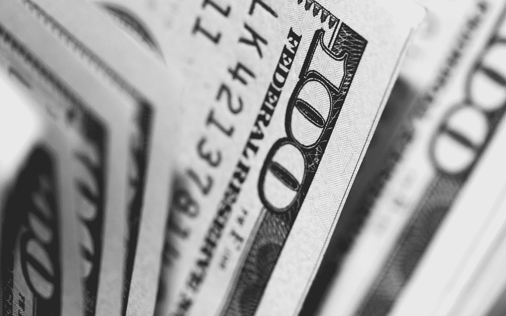
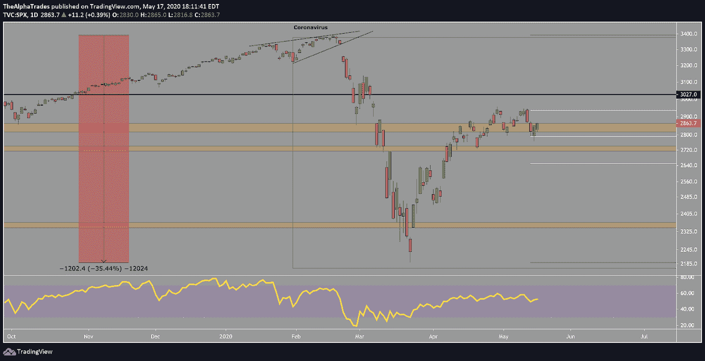
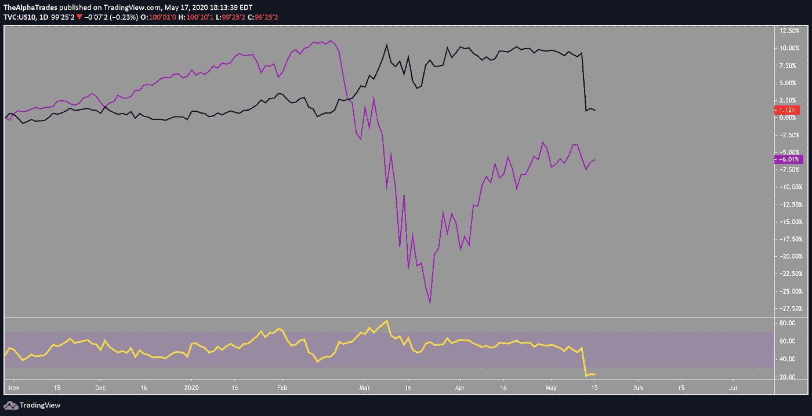

# 前花旗集团投资组合经理的每周股票分析

> 原文：<https://medium.datadriveninvestor.com/weekly-equities-analysis-with-a-former-citigroup-portfolio-manager-785d8ba4f79a?source=collection_archive---------5----------------------->

## 与奥斯汀阿什拉夫讨论美国股市的牛市与熊市。

今天，我们的分析师 Faisal 和 Amol 迎来了一位杰出的嘉宾，前花旗对冲基金经理 Austin Ashraf。我们将分析本周市场发生的事情，然后讨论阿什拉夫对美国股市的乐观看法。

本周初，我们为进入金融等价值板块做好了准备，但这些在早期被遗忘了。周一，摩根大通(JPM)和 T2 英格索兰公司(T3)等市场领军企业遭遇重大抛售。接近周末时，市场收盘时没有强劲到足以保证未来一两周出现任何形式的反弹。随着我们进入新的一周，价值股仍然有很多风险，无论是能源、工业还是金融。

费萨尔预计，未来几周医疗保健和科技板块将表现强劲。半导体类股本周走软，但整体软件龙头的表现应与医疗保健、生物技术、制药、医疗保险和医疗设备制造商一致。

S&P 500 this week, Source: Alpha Trades, LLC

> "我一生都是一名成长型投资者，主要投资于科技行业."

*以下摘自我们与阿什拉夫先生*的视频讨论。*请观看* [*视频*](https://bit.ly/equitiesMay17) *了解上下文。*

**Ashraf:** 金融类股处于一代人的谷底，但我看不到持有它们的任何理由，主要是因为今年是选举年。我认为利率不会从目前的水平上升太多，至少在未来几年内都是如此。美联储将尽一切努力保持低利率，所以虽然我不看好银行，但我也不是超级悲观。我想告诉大家的一件事是，大多数人不交易市场；他们交易股票。即使在经济低迷时期，当大部分市场都在下跌时，也有一些行业实际上表现得非常好。一些美国股票创下新高。尽管数据显示前景黯淡，鼓励投资者卖掉一切，把钱藏在床垫下，但仍有大量股票值得看涨。

# “成长型”股票的定义。

**Ashraf:** 成长型股票是那些即使在经济逆风的情况下，今年和明年的收益和收入也能增长 10%或更高的股票。当我在利率低于 1%，GDP 面临巨大压力的环境下寻找成长股时，两位数的增长很难实现。在我看来，即使在这种环境下也能有所作为的公司是 T2 超级成长股。

# 为什么美联储目前的干预对美国市场有利？

**阿什拉夫:**在我的交易生涯中，我从未见过美联储在选举年失去对市场的控制。重要的是要明白，在选举年，美联储将不惜一切代价稳定市场。如果美联储甚至暗示他们将提前购买股票和 ETF 等资产(为任何潜在的市场低迷提供支持)，争取时间直到经济自我修复，你可以假设注入经济的资金数量是没有限制的。我从经验中学到，与美联储唱反调永远不会有好结果。

# 你是否同意股票是人们赌公司价值的地方，而债券市场提供了经济潜在健康的真实画面？

10-Year US Treasury Bonds vs S&P 500, source: Alpha Trades, LLC

**Ashraf:** 毫无疑问，在 2008 年至 2009 年期间，人们更容易理解对金融市场造成的损害，人们能够对此进行贴现，围绕它建立一个模型，并计算最大风险。在 2020 年的流行病情景中，随着全球市场关闭，很难计算长期风险，直到我们有了类似疫苗的东西，并可以衡量市场对此的反应。就目前而言，债券市场正在争取时间。至少，情况开始好转。甚至邮轮公司也报告说，明年的预订量比上周增加了 600%。消费者信心指数略有改善，预期会下降的市场通胀实际上有所上升。我认为随着经济中信心的建立，债券将会反映这种积极性。

Stanley Druckenmiller 讨论了估值问题[现在比他职业生涯中的任何时候都更加捉襟见肘](https://www.cnbc.com/2020/05/12/risk-reward-for-stocks-is-maybe-as-bad-as-ive-seen-it-stanley-druckenmiller-says.html)，在此背景下，工业生产数据公布了[自 1919 年以来最糟糕的数据](https://www.telegraph.co.uk/business/2020/05/15/markets-live-latest-coronavirus-news-pound-euro-ftse-100/)。零售额也比预期下降了三倍，同时上周有近 300 万人申请失业救济。最后，正如奥斯汀提到的, [CPI 正处于自 2008 年 12 月](https://www.reuters.com/article/us-usa-economy-inflation/coronavirus-crisis-leads-to-largest-u-s-consumer-price-decline-since-2008-idUSKBN22O1WP)以来最严重的环比下降。

**Faisal:** 周五的零售和制造业数据相当糟糕，但有一个亮点——网上零售。该领域增长了约 22%，这表明了新技术的整体采用率。亚马逊市场已经存在了一段时间，但这种软件的结构价值，无论你是在谈论会计管理还是薪资软件，亚马逊的服务已经成为企业的必需品。整个市场的调整揭示了许多未来的赢家。我认为，即使在目前的估值水平下，购买一些这些获奖公司的股票也没问题，尽管大多数公司已经撤回了对 2021 年初的预期。估值是一个棘手的游戏，我认为，在决定投资哪些公司时，着眼于未来两三年更有好处。

**Ashraf:** 我同意浅显；五年期的收益能更好地反映一家公司的真实盈利能力。

标准普尔 500 指数中排名前五到七的公司占据了大约 40%的权重。除此之外，40%的标准普尔 500 公司的收入来自国际。只有少数公司在推动市场，如微软、苹果、亚马逊、脸书和强生公司，这些公司都涉足科技领域，这揭示了全球经济的什么问题，尤其是考虑到标准普尔 500 指数至少 40%的收入来自国际市场？

费萨尔:我从中可以得出的一点是，如果你是一个指数买家，这意味着你有很大的风险，因为如果这些顶级公司中的任何一家发布坏消息，它可能会拖累指数，即使指数中的其他公司恢复。同时，这些顶级股票在今天和未来市场中的优势是真实而持久的，因为它们已经成为远程工作和家庭娱乐的一个组成部分。

**阿什拉夫:**虽然现在全球前景并不乐观，但企业界并没有完全关闭；他们正在计划疫情另一边的世界会是什么样子。这些公司正在进行他们自己的内部审计，并说，“我们必须做些什么来利用这种情况？”许多公司不会成功，中小型公司有很多麻烦。一些较大的公司、规模较大且资金雄厚的公司将借此机会获得市场份额。他们将寻求获得提高生产率和降低成本的工具。看看那些提供工具来做到这一点的公司，微软就是其中之一。苹果将从中受益，因为他们将在不久的将来推出 5g 手机。像一个投资者或大公司的首席执行官那样思考，这就开始理解为什么你看到资金流入那些对技术创新和从家庭到公司的分配至关重要的公司。

# 短期与长期

**阿什拉夫:**投资者做出错误决策的原因之一是，他们没有考虑这些公司将如何使其长期收益增长正常化。增长目前看起来并不乐观，但五年后，持有这些股票有意义吗？像脸书这样的公司坐拥许多尚未货币化的资产，他们现在有机会重新关注那些不受当前经济状况影响甚至增强的业务。谷歌也是一样，它不仅仅是一个广告平台。谷歌是一家风险投资公司，他们投资组合中的创业公司比任何人都多。

股票现在可能被略微高估，但资金必须流向某个地方，投资者现在不想购买工业股，因为该行业的状况非常糟糕。他们不想拥有金融公司，因为金融公司没有好的商业模式。目前唯一有吸引力的行业是医疗保健，因为人们正在变老，他们将需要这些服务和技术。聪明的投资者正在寻找他们希望在未来五年拥有的宝石，并且现在可以以更低的价格购买。

像德鲁肯米勒和其他人这样的大狗都很悲观，但他们的投资组合到底是什么样的呢？我仍然有我所有的软件名称。我仍然拥有谷歌和微软，我认为这些其他投资者可能也在这样做。

# 由于美联储的刺激政策，股市在出现更大幅度的下行之前会有一个井喷的顶部吗？

这完全取决于市场领导者能否支撑住，他们已经过度扩张，可能会在这里盘整，小幅回调的可能性增加，但总体而言，技术上领导者继续推动市场上行的可能性更大。

**阿莫尔:**随着经济的重新开放，无论是德国、南韩还是休斯顿，人们都在为第二波感染做准备。这已经计入股价了吗？

**阿什拉夫:**在疫苗大规模生产之前，标准普尔 500 指数应该会保持在一个交易区间内，当它接近 3000 点时，我认为这有点过头了。即使你将未来几年的标准普尔收益正常化，它看起来也很昂贵。在选举之前，它可能会在 2700 到 3000 之间交易。随着市场中前所未有的流动性，这些市场已经准备好真正起飞，封锁和美联储注资的时间越长，我们将看到更多的创新出现，特别是在生物技术领域，以及一般的技术和医疗保健领域。医疗保健将永远改变。我对世界上正在发生的事情以及这场危机的另一面，比如说未来 10 到 20 年，会是什么样子感到兴奋。

# 我们可能在很长一段时间内都没有疫苗。几个月或几年的疫苗延迟会对社会产生怎样的影响？

Ashraf: 所有的病毒和疾病都是不同的，新冠肺炎的问题是它具有高度传染性，对我们的老龄人口尤其危险。如果人类齐心协力找到解决方案，通过竞争产生的创新有可能降低医疗成本，因此仍有可能带来一些好处。

# 特朗普下令从联邦养老基金中剥离中国股票。这将如何影响经济？

**费萨尔:**如果你开始看到阿里巴巴或京东等股票下跌 10%至 15%，我会认为这是一个买入机会。我认为中国采用技术的机会比美国更大，因为像亚马逊一样，一些大型科技公司关闭了重要的业务部门，同时重新专注于在最初封锁期间对中国至关重要的部分，如电子商务和送货。这些公司有机会通过创新脱颖而出。

# 新兴市场会是什么样子？

Ashraf: 全世界都深陷债务之中，而且大部分债务都是美元债务，所以新兴市场是我最不想投资的地方。我唯一想投资的地方是美国。政治家永远不会触及医疗保健或国防，因为这在政治上是危险的(记住，今年是选举年)。他们的最佳选择是推动增长，而增长将来自中国、印度甚至欧洲等新兴经济体。就在上周，川普告诉台湾半导体公司 TSMC，让[在美国这里](https://www.nytimes.com/2020/05/14/technology/trump-tsmc-us-chip-facility.html)建立他们的新工厂。

在接下来的四五年里，美国以外的全球经济增长将会放缓，而你将会看到美国的指数级增长。这是我们摆脱债务循环的唯一途径，所以作为投资者，我认为最大的机会仍然在美国。

**Amol:** 有计划将一些公司调回美国，美国可能会从一定程度的公司国有化中受益，因此，就业机会也会回流。但随着超过 3300 万人失业，在花了 11 年时间将衰退前的就业率提高到 COVID 崩溃前的水平后，企业破产和关闭。毫无疑问，在未来几年，即便是在全球债务和美元走强方面拥有诸多优势的美国经济，也会面临巨大压力。

Ashraf: 说得清楚一点，我展望未来 5 到 10 年，因为我们仍然不知道疫情的另一面是什么样子。美国的消费者习惯不可避免地会发生变化，但总的来说，一旦我们跨过 COVID 这道坎，消费者支出将会缓慢复苏。这是美国经济的一个独特时刻。举个例子，昂贵的 Peloton 自行车的销量正在飙升。这在典型的衰退中不会发生。

# 当花旗对冲基金经理是什么感觉？

阿什拉夫:我要告诉大家的一件事是，在股票市场上，钱是通过留在交易中而不是交易中赚来的。我希望我 40 年前就知道我现在知道的事情；我会更富有。

交易股票的成本非常高。找到合适的公司并坚持下去，不要在其中交易进出，或者至少有一个核心位置。如果价格下跌，你就多买一点，如果价格上涨，你就卖一点。但要抓住强劲增长的公司，因为它们是无价的资产。

不要羞于投资市场。市场看起来很可怕，大多数人把钱投资在房地产上，主要是他们的房子。如果每个人都知道他们房子的日常价值，他们就不会买房子了。

这是因为我们不知道我们的房子值多少钱，对房产价值的波动视而不见，这让人们觉得投资住宅或房地产更安全。在股市中，你看到你的资产价值每天都在波动，这对人们来说是一件非常情绪化的事情。然而，如果你坚韧不拔地持有你的资产度过好时光和坏时光，回报可能是巨大的。

# 从长期来看，谁更富有、更成功，是主动投资者还是被动投资者？

阿什拉夫:我已经在这个行业工作了将近 35 年，我*从未见过活跃的交易者富有退休。*

他们有一个好的运行，坏的运行留给他们健康状况不佳，吸烟和饮酒的问题。我的建议是研究和投资正确的公司，这将使你富有，并坚持一个游戏计划。市场将会出现巨大的波动，就像我们现在正在经历的一样，但经过一段时间后，增长将再次启动，其中一些公司将恢复到最初的增长水平，甚至超过预期。知道你拥有什么，为什么拥有它。我不能说我是完美的——即使经历了这么多，我仍然容易做出愚蠢的决定。当塞特亚·纳德拉接管微软时，他的远见给我留下了深刻的印象，当时股价大约是 35 美元，我买了。在一两周内，股票涨到了，我想是 45 或 47 美元，我卖掉了，尽管我知道他们正处于高速增长的初期。这在商业中经常发生。我想留给读者的一件事是**,如果你相信首席执行官的愿景，如果你相信公司的增长轨迹，坚持你的核心地位。**

# 你的投资组合里有什么？

Ashraf: 当我说我对市场持乐观态度时，我指的是我对某些行业持乐观态度。我用生物技术、软件和科技的名字来对冲我的投资组合，我做空工业股票。

**龙:**

*   微软(MSFT)
*   生物技术 ETF
*   动视暴雪(ATVI)
*   比特币(小仓位)

**简称:**

*   工业 ETF

# 费萨尔本周精选股票

*这不是理财建议；在做出任何投资决定之前，请咨询您的财务顾问。*

上周:长有机发光二极管，短拉夫劳伦。有机发光二极管本周下跌了 5%，但拉夫·劳伦下跌了 10%。

**一周之长:**迪士尼(DIS)

周五的这一次让我大吃一惊，我相信随着对病毒的乐观情绪增加，这一势头将会持续下去。尽管围绕他们的游乐园有很多负面因素，但我最终认为他们会从游轮公司那里学到东西，并找到在这个新环境中经营的方法。

**一周之内:**万豪度假酒店(VAC)

VAC 本周收盘下跌 8%，但周五表现强劲，上涨了 7%。我认为这是一个做空的机会。这家公司被高估了，应该在 55 到 65 美元之间。

# 奖金:奥斯汀·阿什拉夫的顶级股票

Illumina 是一家非常令人兴奋的公司，生产用于基因编辑和人类基因组研究的机器。像 Crispr (CRSP)和 Nvidia (NVDA)这样的公司在这个行业做着令人难以置信的工作。

*在我们的争执中，我们向 Advantage 会员发出了这只股票的警报，这只股票从警报发出后上涨了 4%。基因编辑领域有着巨大的价值。*

# 处于优势

感谢您成为这个社区的一员。如果你对这篇文章有共鸣，请[订阅不和谐服务器](https://bit.ly/2KJ1oor)。你将可以免费访问公共频道，在那里我们每天发布大量免费有用的内容。更多细节请看下面的视频。

Weekly Equities Analysis, Source: Alpha Trades, LLC

# 放弃

Alpha Trades，LLC 提供的信息不用于制定任何财务决策，也不是购买、持有和/或销售特定产品、数字资产或 ICO 的请求或建议。

访问我们的完整服务条款:[https://bit.ly/3faVeeV](https://bit.ly/3faVeeV)