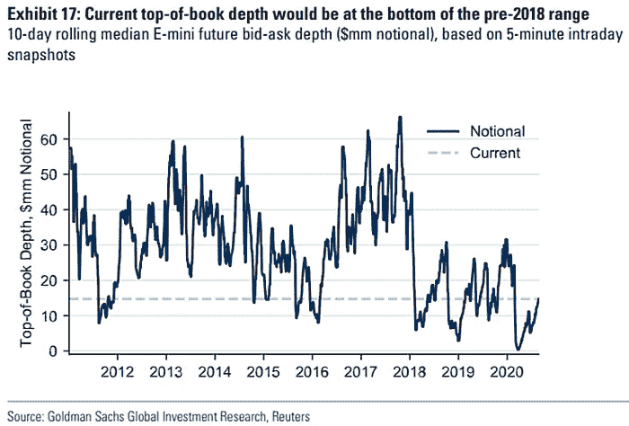
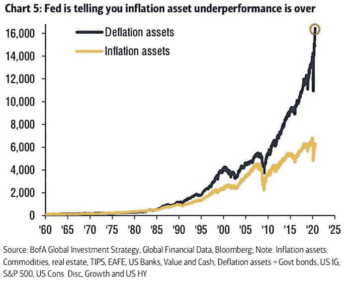

# 每周总结|市场、经济、加密

> 原文：<https://medium.datadriveninvestor.com/weekly-wrap-up-markets-economy-crypto-f5ff96f9293f?source=collection_archive---------28----------------------->

## 从上周到今天的重要新闻和评论。

我忍不住不断聚合有趣的新闻。非常感谢 Morning Brew 时事通讯、Alpha Trades 和比特币&市场社区，以及 Nugget 的新闻让我了解最新动态。

Do something…

# 秘密党员

 [## 以太坊经典受到一个月内第三次 51%的攻击

### 以太坊经典区块链周六晚上遭受了 51%的攻击，这是本月第三次这样的攻击，引起了…

www.coindesk.com](https://www.coindesk.com/ethereum-classic-blockchain-subject-to-yet-another-51-attack)  [## 向往金融推出以太坊金库；这就是看好 ETH | NewsBTC 的原因

### “渴望金融”现在允许人们通过其新产品“以太坊”来获得更高的收益

www.newsbtc.com](https://www.newsbtc.com/2020/08/31/yearn-finance-launches-ethereum-vaults-heres-why-its-bullish-for-eth/)  [## 自动化产量农业尚未上线|信任节点

### 你现在只需将你的 eth 发送给一个合同，合同将在 Maker 上打开 CDP，将那个 Dai 发送给一个 Curve…

www.trustnodes.com](https://www.trustnodes.com/2020/09/01/automated-yield-farming-yeth-goes-live)  [## 视察 YFI 和山药收获情况

### 8 月份，高产农业热潮飙升至历史新高。它的两个最大的故事和最克隆的合同已经…

medium.com](https://medium.com/etherscan-blog/inspecting-the-yfi-yam-harvest-b6924783bc38) 

常见问题解答—渴望.金融

 [## 常见问题解答

### 编辑描述

faq .向往.金融](https://faq.yearn.finance/#who-are-the-9-multisig-signers)  [## 美国国土安全部现在可以追踪隐私密码 Monero - Decrypt

### 加密货币情报公司 CipherTrace 今天宣布，它已经开发了一个工具集来跟踪 Monero (XMR)…

decrypt.co](https://decrypt.co/40284/us-homeland-security-can-now-track-privacy-crypto-monero)  [## 富达正在成为一只价值 1000 英镑的比特币大猩猩

### 昨天，富达向美国证券交易委员会(SEC)提交了创建一只新基金的文件…

www.forbes.com](https://www.forbes.com/sites/christopherbrookins/2020/08/27/fidelity-is-a-1000-pound-bitcoin-gorilla-in-the-making/#1f00f08a278f) 

# Web3 / D-Web /分散式 Web

 [## 增加数据存储空间的数据存储启动片

### 区块链数据存储和隐私初创企业 Sharder 希望增加其数据存储空间，因为它希望提供…

cointelegraph.com](https://cointelegraph.com/news/data-storage-start-up-sharder-to-increase-data-storage-space) 

" Sharder 提供跨多个区块链的文件安全存储."

**解说**:“不要睡在 D-Web 上”

什么是 D-Web？

 [## 分散式 web / dWeb -是什么？|黑客正午

### 这是一篇关于后区块链时代的新技术的文章。目前，我们生活在集中式服务器中…

hackernoon.com](https://hackernoon.com/decentralized-web-dweb-what-is-it-n86o32vf)  [## 加密价格、市值、图表和数据

### 加密价格、市值、图表和数据

加密价格、市值、图表和 dataonchainfx.com](https://onchainfx.com/sector/web3) 

# 海外和外汇

[太平洋投资管理公司称美元下跌只是从亚洲外汇开始获利——彭博](https://www.bloomberg.com/news/articles/2020-08-27/pimco-says-dollar-s-fall-is-just-starting-with-asia-fx-to-gain)

 [## 全球挑战美元桂冠，欧元将获得更多收益

### 欧洲复兴的共同货币看起来足够强大，足以引发人们谈论它将挑战美元的霸主地位。

www.bloombergquint.com](https://www.bloombergquint.com/global-economics/euro-revives-global-challenge-for-the-dollar-s-currency-crown) 

德国特别拨款 120 亿美元扩大危机就业支持——彭博

 [## 中国 4.1 万亿美元的公司债券市场可能会出现创纪录的违约

### 中国公司在 7 月份违约了 104 亿元人民币的票据，8 月份迄今为止也违约了大约同样的金额，开发商…

www.scmp.com](https://www.scmp.com/business/companies/article/3098498/defaults-chinas-us41-trillion-corporate-bond-market-could-hit) 

**解说** : ECB-coin？亚欧稳定币还是数字货币？

 [## 随着援助项目的终止，经济数据显示复苏将会暂停

### 经济的反弹显示出停滞的迹象。然后是提高失业福利和小企业贷款计划…

www.nytimes.com](https://www.nytimes.com/2020/08/21/business/economy/coronavirus-economic-recovery.html)  [## 印度从电信网络中削减华为设备

### 印度正逐步从其电信网络中淘汰华为和其他中国公司的设备，原因是…

www.ft.com](https://www.ft.com/content/55642551-f6e8-4f9d-b5ba-a12d2fc26ef9) 

# 经济“复苏”

 [## 标准普尔 500 正处于历史高点——这就是交易

### 虽然纳斯达克指数几个月前创下新高，但标准普尔 500 用了更长的时间才赶上。有道理…

www.thestreet.com](https://www.thestreet.com/investing/how-to-trade-the-sp-500-after-record-run-august-2020)  [## 尽管本季度表现出色，Salesforce 仍将裁员近 1000 人

### Salesforce 宣布了好于预期的收益，这使得该公司的股票飙升至历史新高

www.forbes.com](https://www.forbes.com/sites/ilkerkoksal/2020/08/31/salesforce-is-laying-off-nearly-a-1000-employee-in-spite-of-a-great-quarter/#11c846fe19f1) 

**评论** : Salesforce 在报告了一个伟大的季度并被纳入道琼斯指数后裁员 1000 多人，展示了社会经济的不平等。高管们获得了巨额奖金，公司回购股票的金额与他们接受政府救助的金额基本相当。(需要确认其中一些陈述)*

 [## 随着援助项目的终止，经济数据显示复苏将会暂停

### 经济的反弹显示出停滞的迹象。然后是提高失业福利和小企业贷款计划…

www.nytimes.com](https://www.nytimes.com/2020/08/21/business/economy/coronavirus-economic-recovery.html) 

“国会和特朗普总统没有显示出在另一项刺激协议上取得进展的迹象。”

 [## 鲍威尔讲话后美国通胀预期加速

### 在美联储主席杰罗姆·鲍威尔历史性的杰克逊之后，美国的通货膨胀预期已经加速

www.fxstreet.com](https://www.fxstreet.com/news/us-inflation-expectations-accelerate-after-powells-speech-202008310047)  [## 美联储批准改变通胀目标，开启更长时间的低利率时代

### 美联储批准了利率设定方式的重大转变，放弃了长期以来的…

www.wsj.com](https://www.wsj.com/articles/feds-powell-headlines-virtual-jackson-hole-economic-conference-11598486400) 

**解说**:鲍威尔的讲话暗示，如果他们没有目标，就不能追究他们的责任。BTC 到 10 万美元，黄金到 5000 美元？

# 住房危机

[美国待售房屋销售最高预测，为 2005 年以来最高——彭博](https://www.bloomberg.com/news/articles/2020-08-27/u-s-pending-home-sales-top-forecasts-at-highest-since-2005)

解说:可能是人们搬出市区的结果。

 [## "美国可能正面临历史上最严重的房地产危机."

### 结合脆弱的房主和租房者，COVID 驱动的住房流离失所有可能超过 GFC。

medium.com](https://medium.com/@13DResearch/the-united-states-may-be-facing-the-most-severe-housing-crisis-in-its-history-c1e8ceb7ff06) 

“今年有 3000 万到 4000 万美国人面临被驱逐的风险，约占所有租房家庭的 29%到 43%”

"大约有五分之一的房客无法按时支付 7 月份的房租。"

“根据斯托特·里修斯·罗斯的估计，在未来四个月内，美国可能会有超过 1160 万起驱逐案。”

"仅在波斯顿，自疫情开始以来，78%的驱逐申请都是在有色人种社区."

# 大石油被大科技取代

 [## Salesforce，Amgen 和 Honeywell 在对平均指数的重大调整中增加了道琼斯指数

### 道琼斯工业平均指数即将发生重大变化。S&P 道琼斯指数周一表示，三个新的…

www.cnbc.com](https://www.cnbc.com/2020/08/24/salesforce-amgen-and-honeywell-added-to-dow-in-major-shakeup-to-the-average.html)  [## 大油褪色了。大科技会吗？

### 这篇文章是科技时事通讯的一部分。你可以在这里注册在工作日收到它。不到十年前…

www.nytimes.com](https://www.nytimes.com/2020/08/31/technology/big-oil-faded-will-big-tech.html)  [## 无收银商店正在加油站、体育馆甚至灌篮店里出现

### 很快你可能会在任何地方发现类似 Amazon Go 的概念。万事达卡周五表示将加入…

www.cnet.com](https://www.cnet.com/news/cashierless-stores-are-popping-up-at-gas-stations-stadiums-and-even-dunkin/) 

# 闪崩来袭

 [## 标准普尔 500 电子迷你期货市场深度(流动性)

### 面向专业人士和个人的高级股票市场预测

www.isabelnet.com](https://www.isabelnet.com/sp-500-e-mini-futures-market-depth-liquidity/) 

" 标准普尔 500 电子迷你期货市场的流动性正在改善，但仍低于平均水平."

评论:散户投资者哄抬价格，但机构却踌躇不前。缺乏流动性可能导致 3 月份式的闪电崩盘/长期挤压

 [## 通货膨胀资产和通货紧缩资产

### 面向专业人士和个人的高级股票市场预测

www.isabelnet.com](https://www.isabelnet.com/inflation-assets-and-deflation-assets/) 

Inflation Assets Vs. Deflation Assets; Source: BofA

"通货膨胀资产表现不佳结束了吗？"

# 深潜

 [## 坎蒂隆效应:为什么华尔街得到了救助而你没有

### 嗨，欢迎来到 BIG，这是一份关于垄断政治的时事通讯。如果你想报名，你可以在这里报名。或者只是…

mattstoller.substack.com](https://mattstoller.substack.com/p/the-cantillon-effect-why-wall-street) 

> 在 18 世纪，这意味着你离国王和富人越近，你受益越多，离得越远，你受到的伤害越大。换句话说，货币不是中性的。这种普遍的观察，即货币印刷具有通过价格体系运作的分配后果，被称为“坎蒂伦效应”。
> 
> *——马特·斯托勒*

# 技术

 [## 埃隆·马斯克在演示 Neuralink 大脑植入物时小跑出去

### 埃隆·马斯克拿出三只猪来展示他的新 Neuralink 设备。一只名叫格特鲁德的猪有自己的大脑…

www.theverge.com](https://www.theverge.com/2020/8/28/21406143/elon-musk-neuralink-ai-pigs-demo-brain-computer-interface) 

“就像你脑袋里的钻头。”

这就是所有的信息转储。请在上面贴满回复，让它看起来像大学城的酒吧浴室，贴满了墙壁。只有有意义的评论。不好类比？