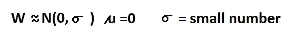
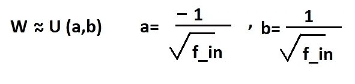
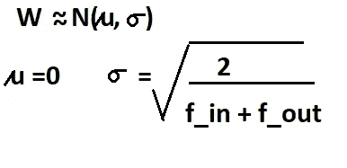
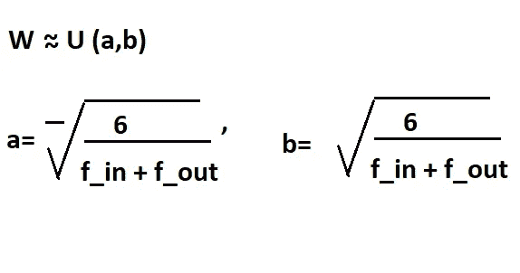
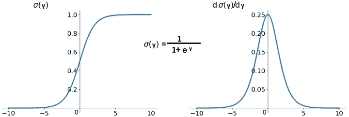
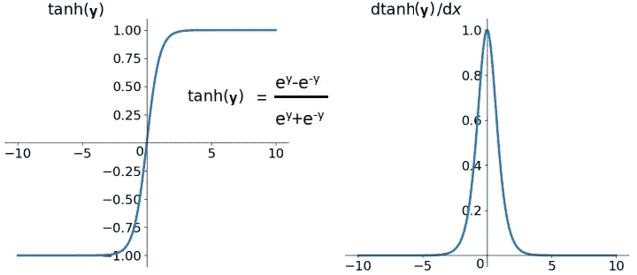
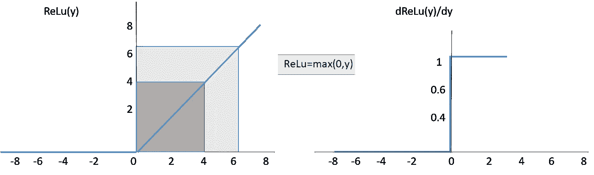
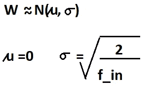
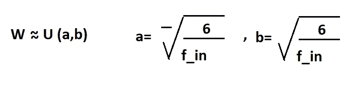

# 权重初始化技术

> 原文：<https://medium.datadriveninvestor.com/weight-initialization-techniques-5df62e9b41a1?source=collection_archive---------7----------------------->

## 什么最适合你


Image [Source](https://unsplash.com/photos/uc5Use-klm0)

权重负责单元之间的连接，在神经网络中，这些可以随机初始化，然后在[反向传播](https://towardsdatascience.com/neural-network-its-internal-functioning-and-uses-7adc4d37f3d8)中更新，以减少损失。

初始化权重之前，需要记住几件重要的事情:

**1)权重应该很小**，但不能太小，因为它会产生像[消失渐变问题](https://towardsdatascience.com/neural-network-its-internal-functioning-and-uses-7adc4d37f3d8)(消失为 0)这样的问题。也就是说，它将永远收敛到全局最小值。

权重不能太高，因为这会导致像爆炸梯度问题(模型的权重爆炸到无穷大)这样的问题，这意味着有很大的空间可用于搜索全局最小值，因此收敛变得很慢。

为了防止网络激活的梯度消失或爆炸，我们需要以下规则:

1.  激活的*意味着*应该为零。
2.  激活的*方差*应该在每一层保持相同。

**2)** 此外，如果这些将被初始化为零，他们将不会学到任何东西。

**3)** **权重应该有方差**，应该有一些均值，应该有一个标准差。

**几种权重初始化技术有:**

**1)正态或天真初始化** -在正态分布中，权重可以是正态或高斯分布的一部分，平均值为零，标准差为一个单位。



Image by Author

进行随机初始化，以使收敛不会达到错误的最小值。

在 Python 中，它是这样实现的

```
np.random.normal(loc=0.0, scale=1.0) * 0.01 #i.e a small number
```

在 Keras 中，它可以简单地写成超参数

```
kernel_initializer='random_normal'
#or
kernel_initializer=kernel_initializers.RandomNormal(mean=0.,stddev=1.)
```

**2)均匀初始化:**在权重的均匀初始化中，权重属于范围 a，b 中的均匀分布，a 和 b 的值如下:



Image by Author

无论何时使用[s 形](https://towardsdatascience.com/neural-network-its-internal-functioning-and-uses-7adc4d37f3d8)激活功能，Uniform 都能正常工作。

在喀拉斯，可以这样做

```
kernel_initializer=kernel_initializers.RandomUniform(minval=-0.05,maxval=0.05)
```

3) **Xavier/ Glorot 权重初始化:**

当正态分布应用于深度神经网络时，深度神经网络很难收敛到全局最小值，这意味着零均值和固定标准偏差。

当进行反向传播时，没有考虑正态分布情况下的权重变化，这导致太大或太小的激活值，这又分别导致爆炸梯度和消失梯度问题。

这个问题只会在更深层次的神经网络中增加。

为了克服这个问题，Xavier 初始化被引入。它保持每一层的方差不变。我们将假设我们的层的激活正态分布在零附近。

Glorot 和 Xavier 相信，如果他们在所有层中保持激活的变化，那么与使用 gap 更大的标准初始化相比，向前和向后收敛将更快。

与 [tanh、sigmoid](https://towardsdatascience.com/neural-network-its-internal-functioning-and-uses-7adc4d37f3d8) 激活功能配合良好。

[](https://www.datadriveninvestor.com/2020/11/19/how-machine-learning-and-artificial-intelligence-changing-the-face-of-ecommerce/) [## 机器学习和人工智能如何改变电子商务的面貌？|数据驱动…

### 电子商务开发公司，现在，整合先进的客户体验到一个新的水平…

www.datadriveninvestor.com](https://www.datadriveninvestor.com/2020/11/19/how-machine-learning-and-artificial-intelligence-changing-the-face-of-ecommerce/) 

**a)泽维尔正态分布**

在 Xavier 正态分布中，权重属于均值为零且标准差如下的正态分布:



Image by Author

在喀拉斯是这样做的

```
kernel_initializer=kernel_initializers.GlorotNormal(seed=None)
```

**b)泽维尔均匀分布**

在 Xavier 均匀分布中，权重属于 a 和 b 范围内的均匀分布，定义如下:



Image by Author

据说它与 [sigmoid 和 tanh activation](https://towardsdatascience.com/neural-network-its-internal-functioning-and-uses-7adc4d37f3d8) 功能配合得很好。



**Sigmoid** [Image by Author]



**tanh** [Image by Author]

在喀拉斯

```
kernel_initializer=kernel_initializers.GlorotUniform(seed=None)
```

**4) He-Initialization-** 当使用以零为中心且输出范围在-1，1 之间的激活函数(如 tanh 和 softsign)时，激活输出的平均值为 0，平均标准偏差约为 1。

但是，如果使用 ReLu 而不是 tanh，可以观察到，平均而言，它的标准偏差非常接近 2 的平方根除以输入连接。

明凯提出，当使用 Relu 激活时，权重以这种方式初始化，因为这种方法将较深神经网络的标准偏差保持在 1 左右。

这种权重初始化方法与 Relu 激活功能配合良好。



**Relu** [Image by Author]

**a)他正常初始化**

在 He-Normal 初始化方法中，权重属于正态分布，其中均值为零，标准差如下:



Image by Author

在 Keras 中，这可以作为超参数来完成

```
kernel_initializer=kernel_initializers.HeNormal(seed=None)
```

2 与 Relu 一起工作很好，即使一些神经网络被停用或死亡，权重仍然保持良好。

在 tanh 中使用 1，因为它足以表示重量。

**b)统一初始化:**

在均匀初始化中，权重属于均匀分布范围，如下所示:



Image by Author

在 Keras 中，它被称为内核初始化器

```
kernel_initializer=kernel_initializers.HeUniform(seed=None)
```

**结论**

我希望看完这篇博客后，你一定已经知道 tanh，Sigmoid 和 ReLu 哪种体重初始化更好了。虽然受到破坏，但这项任务对于神经网络的良好运行非常重要。通过对它的理解和新的研究，你可以选择最适合你的技术。在 keras 中，这个任务非常简单，只需要一个参数就可以调用。

感谢阅读！

*原载于 2020 年 12 月 11 日*[*【https://www.numpyninja.com】*](https://www.numpyninja.com/post/weight-initialization-techniques)*。*

## 访问专家视图— [订阅 DDI 英特尔](https://datadriveninvestor.com/ddi-intel)