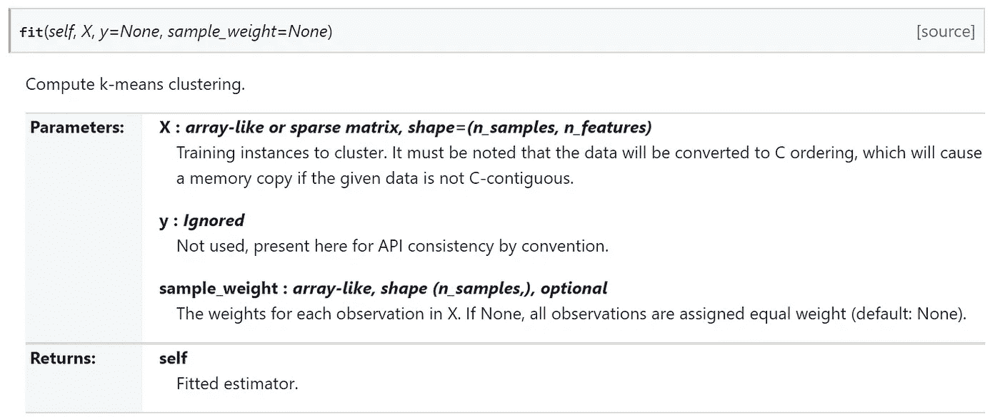
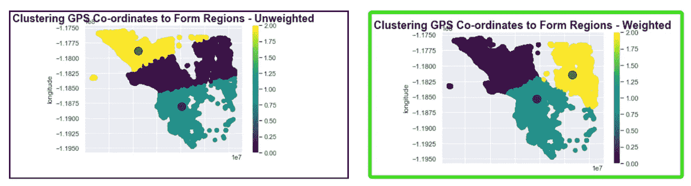
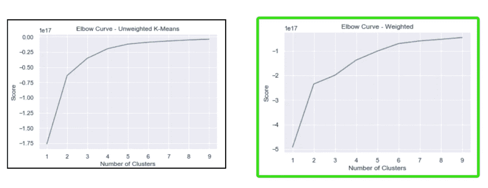
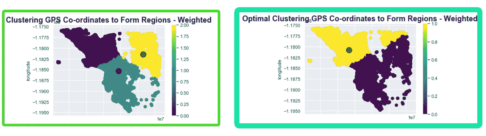

# GPS 坐标的加权 K 均值聚类 Python。

> 原文：<https://medium.datadriveninvestor.com/weighted-k-means-clustering-of-gps-coordinates-python-7c6270846163?source=collection_archive---------0----------------------->


这是我上一篇帖子的延续— [用 Python](https://medium.com/@joseph.magiya/clustering-gps-co-ordinates-forming-regions-4f50caa7e4a1) 聚类 GPS 坐标并形成区域。对 GPS 坐标进行聚类后，下一个问题是其他变量如何影响聚类。如果您正在处理销售数据，我们如何根据销售额和位置对区域进行聚类。

为此，我还使用了来自 [kaggle 的 Zillow Prize: Zillow 的房屋价值预测(Zestimate)](https://www.kaggle.com/c/zillow-prize-1/data) 的数据。我用的是‘properties _ 2016 . CSV’。**还是大！**

在这里，我们将基于以平方英尺为单位的地块面积来形成坐标。

我们上次看到的星团看起来像:


K-Means Clustering of GPS Coordinates — unweighted.

计算 K-Means——看下面的图片，我们可以传递权重和 2 个变量作为 x。所以我们将传递纬度和经度。

对于重量，我们可以传递批量大小



为了计算聚类中心和预测每个数据点的聚类，我们仍然可以使用权重和坐标。

[](https://www.datadriveninvestor.com/2020/02/19/cognitive-computing-a-skill-set-widely-considered-to-be-the-most-vital-manifestation-of-artificial-intelligence/) [## 认知计算——一套被广泛认为是……

### 作为它的用户，我们已经习惯了科技。这些天几乎没有什么是司空见惯的…

www.datadriveninvestor.com](https://www.datadriveninvestor.com/2020/02/19/cognitive-computing-a-skill-set-widely-considered-to-be-the-most-vital-manifestation-of-artificial-intelligence/) 

# 为了比较这种差异，我们需要使用 3(未加权的最佳聚类数)

```
kmeans = KMeans(n_clusters = 3, max_iter=1000, init ='k-means++')lat_long = X_weighted[X_weighted.columns[1:3]]
lot_size = X_weighted[X_weighted.columns[3]]
weighted_kmeans_clusters = kmeans.fit(lat_long, sample_weight = lot_size) # Compute k-means clustering.
X_weighted['cluster_label'] = kmeans.predict(lat_long, sample_weight = lot_size)centers = kmeans.cluster_centers_ # Coordinates of cluster centers.labels = X_weighted['cluster_label'] # Labels of each pointX_weighted.plot.scatter(x = 'latitude', y = 'longitude', c=labels, s=50, cmap='viridis')
plt.scatter(centers[:, 0], centers[:, 1], c='black', s=200, alpha=0.5)
plt.title('Clustering GPS Co-ordinates to Form Regions - Weighted',fontsize=18, fontweight='bold')
```

让我们比较一下结果，看看是否有什么不同



Unweighted vs Weighted v1.

集群中显然存在差异。

# 计算加权聚类的最佳数量-肘形曲线

对于集群，我们需要将纬度和经度作为 X 传递，将批量大小作为 sample_weight 传递。

```
K_clusters = range(1,10)kmeans = [KMeans(n_clusters=i) for i in K_clusters]lat_long = X_weighted[X_weighted.columns[1:3]]
lot_size = X_weighted[X_weighted.columns[3]]sample_weight = lot_sizescore = [kmeans[i].fit(lat_long, sample_weight = lot_size).score(lat_long) for i in range(len(kmeans))]plt.plot(K_clusters, score)
plt.xlabel('Number of Clusters')plt.ylabel('Score')plt.title('Elbow Curve = Weighted')plt.show()
```

这个结果和我们在没有任何权重的情况下对经纬度进行聚类时看到的结果不同。让我们把这些结果和前一个比较一下。



Elbow Curve — Weighted vs Unweighted

# 使用最佳聚类的加权聚类

```
kmeans = KMeans(n_clusters = 3, max_iter=1000, init ='k-means++')lat_long = X_weighted[X_weighted.columns[1:3]]
lot_size = X_weighted[X_weighted.columns[3]]
weighted_kmeans_clusters = kmeans.fit(lat_long, sample_weight = lot_size) # Compute k-means clustering.
X_weighted['cluster_label'] = kmeans.predict(lat_long, sample_weight = lot_size)centers = kmeans.cluster_centers_ # Coordinates of cluster centers.labels = X_weighted['cluster_label'] # Labels of each pointX_weighted.plot.scatter(x = 'latitude', y = 'longitude', c=labels, s=50, cmap='viridis')
plt.scatter(centers[:, 0], centers[:, 1], c='black', s=200, alpha=0.5)
plt.title('Clustering GPS Co-ordinates to Form Regions - Weighted',fontsize=18, fontweight='bold')
```

让我们比较一下结果



# 将结果与数据合并

```
X_weighted = X_weighted[['parcelid','cluster_label']]clustered_data = df.merge(X_weighted, left_on='parcelid', right_on='parcelid')
```

[这是 Github 回购的链接](https://github.com/JosephMagiya/Weighted-Location-Clustering)

# 感谢您的阅读——祝您好运！