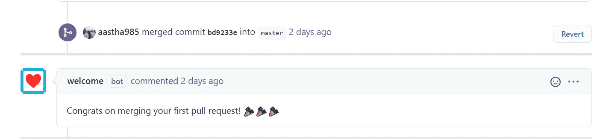

# 欢迎首次使用欢迎机器人为您的 GitHub Repo 投稿

> 原文：<https://medium.datadriveninvestor.com/welcome-first-time-contributors-to-your-github-repo-with-welcome-bot-93474758ac7e?source=collection_archive---------8----------------------->

## 欢迎使用的分步指南——用 probot 构建的 GitHub 应用程序

欢迎是一个机器人，鼓励首次贡献者开始为您的回购做出贡献。它为您的存储库增加了一个专业和受欢迎的外观，并且会鼓励试图开始这个项目的新用户。更重要的是。安装和上手都超级简单！

这里有一个逐步指南:

1.  转到 GitHub Apps，选择 Welcome app(或者直接转到这个[链接](https://github.com/apps/welcome)，在你想要欢迎贡献者的开源仓库中安装 bot。
2.  给机器人**读和写**拉请求和发布的权限。
3.  创建一个 **config.yml** 文件。

您可以按照以下步骤创建 config.yml 文件:

1.  要向在存储库中创建他们的**第一期**的用户发送定制消息，请添加以下代码:

自定义此消息，并添加指向您项目的投稿指南和行为准则的链接。

2.对于第一次**拉动请求**添加:

3.祝贺您的贡献者成功获得他们的第一个 PR 合并！

很简单，不是吗？根据您的项目定制消息，并添加尽可能多的表情符号、gif 和链接！编码快乐！

作弊代码:从我的 [GitHub](https://github.com/aastha985) 中派生出 [WelcomeBot 库](https://github.com/aastha985/WelcomeBot)。