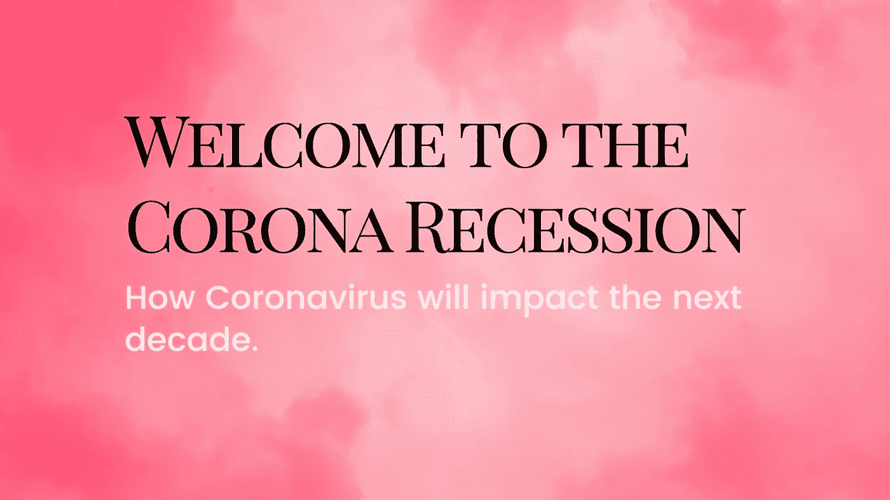
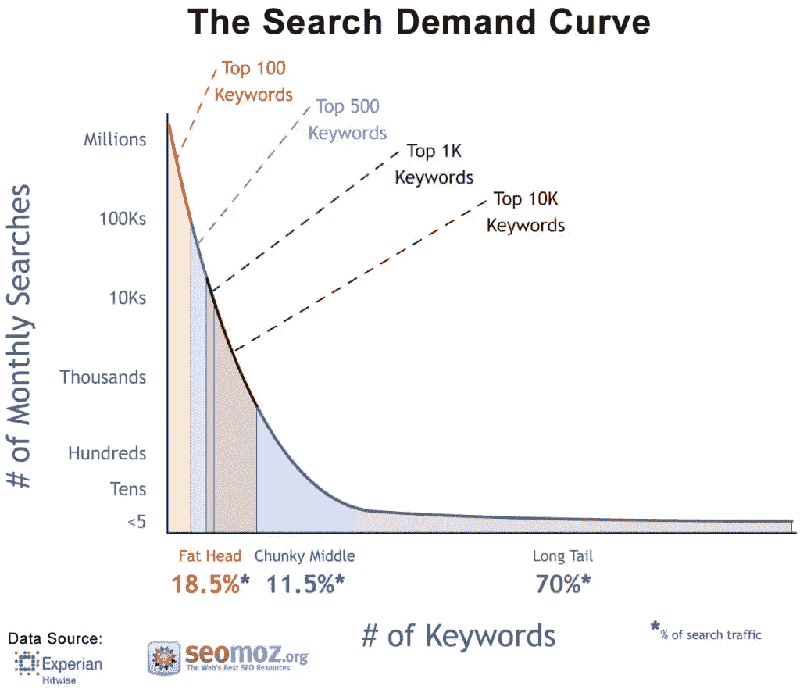
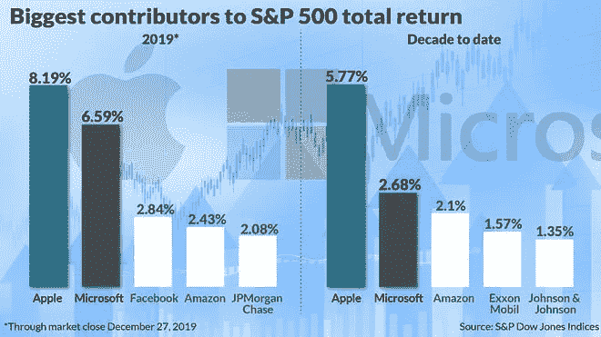
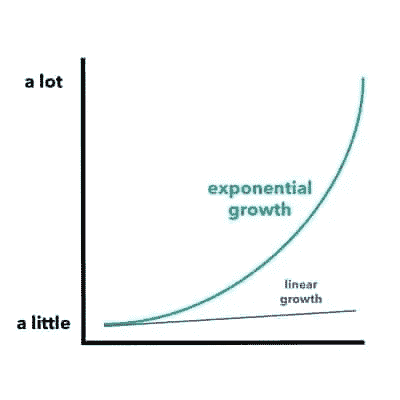
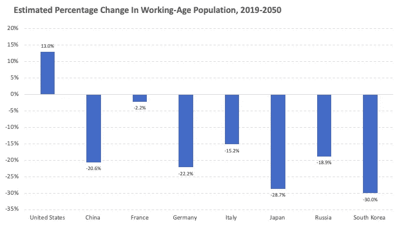
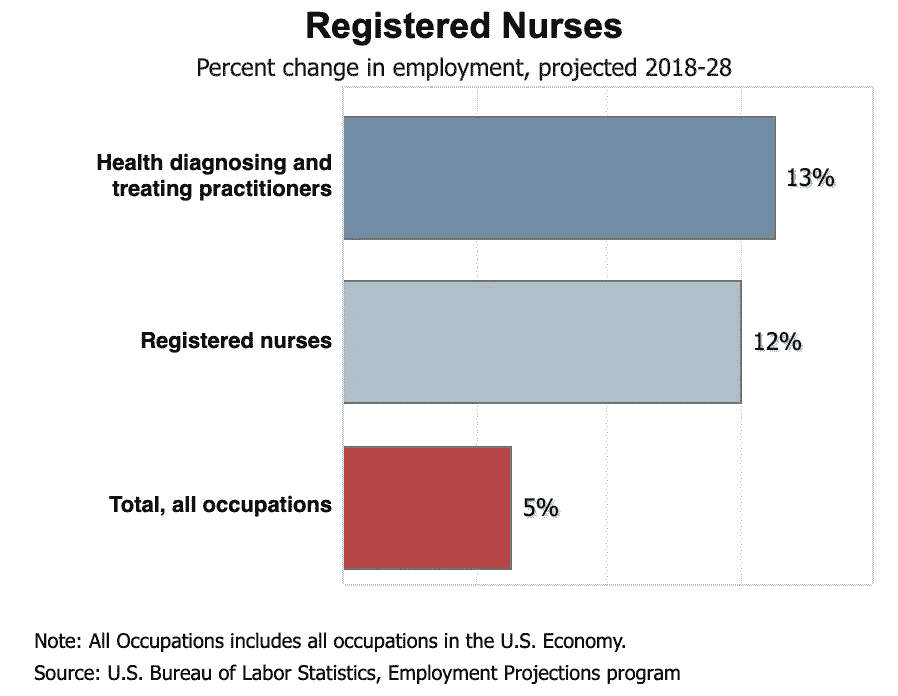

# 欢迎来到科罗纳衰退

> 原文：<https://medium.datadriveninvestor.com/welcome-to-the-corona-recession-5ff1b36c2ec0?source=collection_archive---------9----------------------->

## 冠状病毒将如何影响未来十年。

欢迎来到经济衰退，各位。我希望你一直在练习保持社交距离并保持安全，尤其是如果你属于高风险人群。

> *欢迎来到经济衰退，我们有一个危险的游戏
> 好事多有你想要的一切，但它的名字叫柯克兰
> 我们是可以找到你可能需要的任何东西的人
> 如果你有钱，我们有你的疾病*
> 
> *衰退，欢迎来到衰退
> 看着它带你走向你的顺 n-n-n-n-n-n-n 膝盖，膝盖*
> 
> *欢迎来到经济衰退混搭——病菌&玫瑰*

消费者支出每年约占美国经济的 70%。即使是“技术上”的小幅度下降也能解释全球衰退，而大幅度下降将等同于更严重的衰退。

 [## 总部位于瑞士的 ETP 进入加密交易市场|数据驱动的投资者

### 虽然金融市场几乎没有沉闷的时刻，特别是在引入…

www.datadriveninvestor.com](https://www.datadriveninvestor.com/2019/03/10/swiss-based-etp-enters-the-crypto-trading-market/) 

对于那些没有在 Twitter 上关注#CancelEverything 趋势的人，这里有一个关于取消的简要介绍:

*   NBA 和 NHL 常规赛延期
*   英超延期
*   几乎所有的公立和私立学校和大学都关闭了
*   大多数公司已经过渡到远程工作
*   进出特定地区的旅行已被禁止或限制
*   路易斯安那州的初选和其他选举初选都被推迟了
*   迪士尼乐园和百老汇已经关闭
*   大多数超过 250-500 人的集会已经被取消
*   所有主要的商务会议(SwSx)都被取消或转向虚拟会议
*   临时工、零售、小企业、航空公司等等都受到了严重影响
*   插入您最喜欢的爱好、事件或户外活动

当冠状病毒最终被终结的时候，它将会影响世界好几次。我指的不仅仅是现在或接下来的六个月，而是未来的几年(可能是几十年)。为什么我这么有信心这个疫情会有持久的影响？

# 长尾驱动一切

很简单，**长尾事件**塑造世界。它们不只是一次塑造了世界，而是产生了影响未来事件的涟漪效应。

长尾事件指的是统计分布，其中非常大的事件**很少发生，非常小的事件**非常多发生。让我们举一个你每天都在做的事情的例子——谷歌搜索。

前 10，000 个搜索关键词占大多数搜索，而有数十亿个关键词占其余谷歌搜索的 70%。Longtails，用更简单的话来说——极端的输入导致了异常多的结果。

你生活的很多方面都被长尾理论所影响。

在过去的十年里，排名前十的股票使[的股票市场总回报率上升了近 20%](https://www.marketwatch.com/story/these-2-stocks-dominated-sp-500-returns-in-2019-and-the-decade-2019-12-31) 。过去一年，排名前十的股票占总回报的近 30%。

仅苹果和微软就占了去年标准普尔 500 所有回报的近 15%。这就是被动投资如此受欢迎的原因——因为选择正确的股票极其困难。

风险投资是一个围绕尾部事件形成的行业，其中一半的创业投资预计会失败，一家公司(Stripe、Zoom、Lyft、Twilio)的回报可以回报整个公司的资金，甚至更多。

但这只是长尾的一个例子。其他尾部事件的影响甚至更大。例如，二战是[直接或间接](https://www.thebalance.com/world-war-ii-economic-impact-4570917)造成的:

*   各种技术创新
*   7000 万人的死亡和婴儿潮一代的诞生带来了巨大的人口变化
*   国家的重新划分
*   当前的资本主义世界观
*   美元作为世界储备货币的出现
*   世界银行、联合国、国际货币基金组织和北约等组织的建立。

一个事件改变了我们所知的这个星球上的生活。2008 年的金融危机也有类似的影响，尽管没有那么严重。金融危机改变了监管和选举，同时激发了政治运动和文化。**长尾驱动一切。**

# 最新的长尾理论:新冠肺炎

今天，我们面对的是一个呈指数增长的疫情，它已经让世界屈服了。我强调指数增长，是因为人脑很难理解指数增长。

嗯。我希望你在想，“这看起来有点熟悉谷歌搜索曲线，不是吗？”

是的，确实如此。我给你看这个不是为了吓唬你，而是为了挑起你现有的假设。似乎冠状病毒有望继续在全球占据主导地位。

有几个主要的想法/事件，冠状病毒(新冠肺炎)疫情可能会在明年和整个 21 世纪 20 年代产生影响。这里只是我脑海中的一些想法。

## 新社会运动的兴起

本周，美国联邦政府宣布了一项 1.5 万亿美元的刺激计划，该计划将贷款给银行以对抗新冠肺炎。还记得国家助学贷款有多少吗？[1.5 万亿美元](https://www.nerdwallet.com/blog/loans/student-loans/student-loan-debt/)。谁会为此不安呢？

今天，美联储宣布了另一项 7000 亿 T4 的量化宽松政策，并将利率降至接近于零，并取消了存款准备金率。从本质上讲，银行将能够获得数十亿美元的贷款，而无需支付任何定金和零利息。

政治和社会运动产生于危机。比特币越来越受欢迎，部分原因是金融危机后对全球金融业的不屑。“占领华尔街”运动始于 2011 年，也就是 2008 年崩盘的几年后。社会和政治运动需要时间。在繁荣时期，运动从来不会开始。在事情变得越来越糟之后，他们开始得很好。在人们集体起来要求更多之前，他们需要反复被践踏——有时使用暴力。

更直接的是，美国政治选举可能取决于特朗普政府对疫情的反应(或缺乏反应)。当一场全球健康危机在选举周期前爆发时，医疗保健是大部分美国人的头等大事，会发生什么？受冠状病毒影响最大的是老年人，你知道，他们喜欢投票。

一年后，人们将确定冠状病毒是你的政党在下一次选举中失败或获胜的原因。美国 2020 年总统将如何塑造世界？我的猜测是:急剧下降。长尾改变一切。

## 远程工作的兴起

现在每个公司都很偏僻。事件正在虚拟化。今年将是远程优先工作的巨大催化剂，因为公司必须在远程基础上雇用和配备员工。它可能最终证明远程工作可以为大多数职业工作。

我预计 Zoom 和其他视频会议将成为常态。商界将(希望)意识到很多会议并不是真正必要的。我可以做梦，不是吗？更具体地说，一旦冠状病毒过去，一些大公司将使其员工能够继续这样做。这将帮助员工搬到更便宜的城市，以获得更好的生活方式。

## 最大的财富再分配

现在是可怕的部分。数百万人将会死去。这个数字从 2500 万到 5000 万不等，取决于你从哪里看。我不是流行病学家，所以我不打算猜测。但是，可以肯定地说，数百万人(大部分是老年人)将在未来两年内死去。当然，数百万人的死亡会大幅降低全球经济，但它也有另一个后果——财富再分配。

根据[普华永道](https://www.pwc.com/us/en/industries/financial-services/library/managing-millennial-money.html) **，**千禧一代和 X 一代预计将在未来 30 年从他们婴儿潮一代的父母那里继承超过 30 **万亿**美元。我想可以肯定这个时间线被提前了。

如果你从事金融服务，这应该会让你感到害怕。千禧一代很可能会从父母的银行或投资机构转向其他行业。

Fintech >主要机构。罗宾汉> TD 美国贸易公司。加密>传统资产。

很难知道这种财富再分配的真正影响。千禧一代最终能买房吗？千禧一代会开始有更多的孩子吗？当医院达到最大容量时，真的有人想在疫情生孩子吗？

## 重新配置现代经济的人口变化

虽然千禧一代推迟一两年生孩子不会对全球人口结构产生明显的不利影响，但对于经历人口大幅减少的国家来说，还会有其他后果。

如果上限为真——全球将有数千万人死亡。我不是无情地这么说。如果这种情况发生，大多数人都会认识受到影响的人，这将造成人口结构的转变，从而重新配置现代经济。

这一点怎么强调都不为过。

婴儿潮一代的规模已经影响了选举和整个行业。中国、日本、韩国和欧洲部分国家有着相似的人口趋势。

下图显示了未来 30 年工作年龄人口的百分比变化。预计只有美国的劳动年龄人口会出现正增长。

预计日本和韩国在未来 30 年将失去超过 25%的劳动人口。让我们来看看人口变化是如何重塑经济的。随着全球人口年龄的增长，他们将需要护士等医疗专业人员。护理是一个高薪职业，预计在未来几十年将在全球范围内增长。

美国劳工统计局预计，从 2018 年到 2028 年，注册护士的就业将增长 12%(每年 210，400 个新职位)。

此外，退休社区市场[预计将以 9.7%的复合年增长率](https://www.marketwatch.com/press-release/nursing-care-market-global-industry-analysis-size-share-growth-trends-and-forecast-2019-2022-2019-05-03)增长。这只是人口统计学如何影响整个全球经济中一个行业的一个非常简单的例子**。想象一下所有其他受人口统计影响的行业、事件和运动。**

关键在于——如果这些国家失去了数百万人，那么这些后果(积极的或消极的)就会大大减少。

想象一下这样一个世界，冠状病毒不会杀死数百万人，而中国在照顾老年人口和少量劳动力方面遇到困难。这影响了中国与其他国家竞争的能力。现在，如果这个“问题”不再存在，他们可能能够更有效地与其他国家竞争。这或许是一个消极的展望，但却是一个关于冠状病毒如何从根本上改变全球经济的思想实验。

## 批判性思考者会做得很好

Zoom 会做得非常好。随着人们被美联储对银行和华尔街无休止的救助所激怒，比特币可能会获得更多的追随者。进行人们不愿进行的押注。建造每个人都需要的东西。换个角度思考。

## 制造业将变得更加国内化

全球供应链正遭到破坏。人们买不到卫生纸和其他消费品。更重要的是，许多国家无法制造病毒检测、药品和其他必要的物品。

受病毒影响最严重的国家将会记得这些短缺。他们将努力确保他们有能力保证他们自己的公民有关键的供应。一些国家甚至会补贴关键商品的生产，作为国家安全的一种分配。将会采取预防措施并颁布立法，以便我们能更好地准备下一次。

## 最后的想法:有些乐观

对于那些坚持到现在的人，我想分享一些乐观的看法。事情在好转之前可能会变得更糟。但最终，会好起来的。市场讨厌不确定性，不幸的是，我们可能会面临冠状病毒几个月的不确定性。最伟大的时刻、创新和变革都是在大动荡时期锻造的。事情会变好的，坚持住。

**Advancing Web 3.0** 是一份关于加密货币、分散金融( [DeFi](https://consensys.net/blog/news/2019-was-the-year-of-defi-and-why-2020-will-be-too/) )和塑造下一个互联网时代的技术的每周时事通讯。欢迎来到流血边缘。欢迎来到 Web 3。

关于作者:我是[梅森·奈斯特伦](https://twitter.com/masonnystrom)，一名作家，也是一名有抱负的天使投资人。之前，我在 ConsenSys 公司担任营销人员，主要负责 ConsenSys 公司及其投资组合公司的营销策略。在加入 ConsenSys 之前，我在 Gatecoin 担任业务分析师，这是第一家上市以太币的加密货币交易所，以太坊的本地加密货币。

*所表达的观点、信息和意见仅由作者个人所有，仅供参考，不作为买卖任何证券、加密资产或其他金融产品的建议或投资建议。*