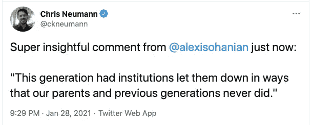

# 欢迎来到人民市场

> 原文：<https://medium.datadriveninvestor.com/welcome-to-the-peoples-market-d173b81b4e7c?source=collection_archive---------15----------------------->

## r/wallstreetbets 如何为初创公司和风投创造千载难逢的机会

Photo by [NeONBRAND](https://unsplash.com/@neonbrand?utm_source=unsplash&utm_medium=referral&utm_content=creditCopyText) on [Unsplash](https://unsplash.com/?utm_source=unsplash&utm_medium=referral&utm_content=creditCopyText)

抛开财务结果不谈，许多人认为 r/wallstreetbets x Robinhood 在 GameStop 上摊牌——从散户投资者与华尔街的[大卫和歌利亚对决](https://www.theguardian.com/business/2021/jan/27/gamestop-stock-market-retail-wall-street)，到[robin hood 的名字所表现出的虚伪](https://www.esquire.com/news-politics/a35350531/robinhood-stop-gamestop-trading/)，到[对该交易应用的行为罕见的两党谴责](https://www.vice.com/en/article/88ae5z/aoc-ted-cruz-agree-robinhood-gamestop-stock-ban-is-unacceptable?utm_content=1611856819&utm_medium=social&utm_source=VICE_facebook&fbclid=IwAR2V5NC_bEdZuV1X-8BV1vBWY29qcL-f62L3WIW23UFTawp18O2bk0AEOEM)。就在罗宾汉和其他经纪公司停止交易之前，我发表了我的最后一篇文章，金融市场的民主化。我的信息现在比以往任何时候都重要。

强大的力量正试图阻止散户投资者的崛起，但秘密已经泄露，她将置身事外。

> **我们生活在一个新时代，个体演员的力量*选择*通过充满表情符号的社交平台一起工作(💎 🙌)强大到足以和华尔街叫板。**

那么，我们是怎么走到这一步的？我们如何将这一势头引向积极的系统变革？我们如何才能找到最佳的创业机会，以确保这种新的权力动态持续下去？

# 散户投资者的崛起

2020 年，我们见证了零售经纪账户开户数量的大幅飙升。今年 3 月由新冠肺炎引发的股市下跌，为首次投资者打开了一个诱人的切入点，而数以千万计的居家公民则在寻找新的参与机会。2020 年 6 月的 SoFi/cent 研究调查发现，五分之一的受访者在疫情期间首次开始在数字平台上交易。

这些数字非常惊人。由[环球 X EFTS](https://www.globalxetfs.com/cio-corner/the-renewed-rise-of-the-retail-investor/#:~:text=As%20the%20number%20of%20retail,the%20market%20volume%20in%202019.) 报道的美国证券交易委员会(SEC) EDGAR 数据显示，查尔斯·施瓦布在 Q1 2019 年和 Q1 2020 年之间新开账户增加了 58%，TD Ameritrade 同期增加了 149%，而 E-Trade 则增长了 196%。

2020 年也是金融科技之年，2021 年已经很有可能占据这个位置。在线交易和个人金融技术正经历着一场大繁荣。Robinhood、Wealthfront、M1 金融和 Betterment 等科技公司正在成为家喻户晓的名字，而 Ellevest、Finhabits、The Beans、Public 和 LTSE 正在采取一种新的方法来实现金融包容性和可访问性。千禧一代和 Z 'ers 一代推动的新市场动态迫使传统机构经纪公司进行适应——许多公司现在提供零佣金交易，以与新兴公司竞争。

# *权力属于人民*

在 2020 年 3 月 18 日至 2020 年 4 月 28 日的 45 天内，超过 5000 万美国人失去了工作。在这 45 天里，美国 643 位亿万富翁的平均财富增加了 29%。此外，在全球金融危机期间成长起来的已经伤痕累累的千禧一代，华尔街的行动和最终的救助导致了对美国遗留制度的幻灭。GameStop 做空尝试不仅仅是为了获得回报，这并不奇怪。

Image via [Twitter](https://twitter.com/ckneumann/status/1354995149810487296?s=20)

传统媒体淡化甚至破坏了这些革命事件，用头条新闻谴责“[无聊的赌徒](https://www.nytimes.com/2020/06/14/business/sports-gamblers-stocks-virus.html)”或“[对金融机器的愤怒](https://www.bloomberg.com/opinion/articles/2021-01-27/gamestop-short-squeeze-is-rage-against-the-financial-machine)”。这些媒体没有抓住要点。

我们现在经历的是一种新发现的人民力量，散户投资者有能力推动市场。它是强大的，它是美丽的，它是解放的，它是可怕的。

正是[信息不对称时代的终结](https://www.bloomberg.com/news/articles/2021-01-29/short-sellers-face-end-of-an-era-as-rookies-rule-wall-street?sref=DMVm6kaD)让华尔街得以维持其在公共市场的垄断地位。这是知识、数据和访问的民主化。

# *人民市场的时代*

**公开市场投资是历史上最大的财富创造者之一。但是现实并不令人惊讶——并不是每个人生来就有平等的参与机会。这有许多复杂的原因，但一个重要的原因只是缺乏机会:缺乏获得教育、数据、知识共享和资源的机会。根据皮尤研究中心(Pew Research)的调查，不同的人口结构对股票市场的参与度有很大的不同——以白人为户主的家庭投资于股票市场的可能性几乎是黑人或西班牙裔成年人的两倍。教育水平也是股票所有权的一个主要预测因素——拥有学位的任何种族的人都更有可能投资。**

如果我们希望看到权力可持续地转移到更广泛、更多样化的投资者群体手中，我们需要工具让负责任的投资成为每个人的现实——无论专业知识、教育程度、种族、社会经济地位和性别如何。

虽然像 Robinhood 这样的金融科技应用程序肯定已经向更广泛的社区开放了市场准入，但在紧要关头，Robinhood 并没有实现他们“为所有人实现金融民主化”的使命声明。Robinhood 对 GameStop 混乱的反应是阻止然后限制用户购买 GameStop 股票。罗宾汉这样做的原因仍然是一个激烈辩论的话题，但他们的行为揭示了没有人，即使是一个筹集了数十亿美元的硅谷宠儿，也没有真正解决金融市场的可及性问题。

现在判断 Robinhood 是否经受住了用户的深度背叛还为时过早，但让我们给予应有的肯定。他们让更多散户投资者参与市场的创新方法，已经成为金融市场民主化斗争中的一块基石。

我们已经进入了人民市场的时代，我们需要创业公司和风投来迎接挑战。我们需要能够提供教育、市场、知识共享和积累财富的工具。最重要的是，这些工具需要负责任地构建和部署，以便民主化市场的新时代真正有利于参与者。

如果你是一家致力于解决方案的金融科技初创公司，我们来聊聊吧。

## 与[加比·斯科夫](https://medium.com/u/87600d155222?source=post_page-----d173b81b4e7c--------------------------------)合作撰写和研究。