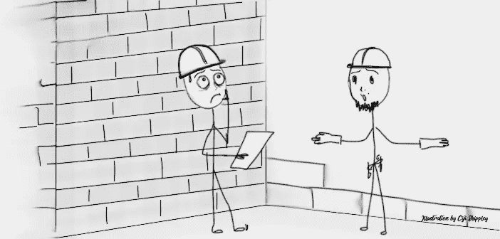

# 是的，当你绝望的时候，专注似乎是徒劳的:当创始人偷工减料的时候。

> 原文：<https://medium.datadriveninvestor.com/well-yeah-focusing-will-seem-unproductive-when-youre-desperate-when-founders-cut-corners-fcd4afe58617?source=collection_archive---------32----------------------->

## 你的品牌的 DNA 是假不了的！

Illustration provided by the author |“Let’s just finish it with bamboo and collect our money!”

绝望，就像所有的事情一样，有它的特点:它没有耐心，缺乏深度，并且经常让它的主人任由糟糕的决定摆布。

“现在就需要赚钱”成为你希望人们如何看待你的服务的推动力，对话不再是关于你理想客户的需求，而开始只关于你的需求。不要被愚弄了，看看它所有的血腥中的自我中心。

当你处于“一切都是为了我”的心态时，为你的良心制造一块“遮羞布”是很常见的，因为你知道你选择的是中饱私囊，而不是为决定信任你的人服务。因此，很自然地告诉自己这样的事情，“为了我的事业的长久，这一步是必要的”，“而事实上，这是你绝望时所必需的。

好吧，你猜怎么着，当你在任何形式的品牌中偷工减料时，它会成为别人判断你声称对客户的关心有多深的标尺。记住，品牌也是一种体验。这就是为什么像“你主张什么？”存在。但是，许多本地创始人尽管声称关心他们的客户，却因为更专注于赚钱而放弃了他们为客户策划的体验。

如果我们第一次见面，我所做的只是谈论我自己，而没有考虑询问你的需求，你不会认为我很自我吗？

这正是一个创始人偷工减料的表现，当他们…

# 1.创建受欢迎的内容，而不首先定义它们的知名度。

一件事出名就意味着[‘你在卖一件事’](https://cijishippley.medium.com/what-is-a-brand-message-what-is-a-no-cock-n-bull-brand-message-2de12b91ecc0)这种假设是当地创始人过早地涌向 Google Trends 等工具的原因。他们认为专注于他们提供的服务是一种财务障碍，而不是帮助他们的客户轻松保留他们所做的事情的方法。但是如果你曾经感觉在一个项目中被人忽视，你会明白为什么专注是重要的。这个人不能以你不是第一个想到的为借口。根据科学研究，[普通人一次只能保留 150 个有意义的联系](https://bbc.in/3peGL6j)。除此之外，你什么都不是。这进一步强调了为什么抓住要点如此重要:利用线上和线下的重要故事。

当你选择金钱而不是服务时:前一分钟你在帮助一个服务不足的市场完成某件特定的事情，下一分钟你就在向所有人传播善意。故事变得扭曲，听众不再理会你。

另一件显示你偷工减料的事情是…

# 2.使用丑陋和/或形状不良的图像

当你做了跑腿的工作来帮助人们期望你的作品有一定的视觉质量时，你的工作就是一直兑现这个承诺。

当我第一次开始使用社交媒体营销我的服务时，我不知道图像的标准尺寸。值得庆幸的是，我学得很快，现在这是我在为我使用的任何平台创建内容之前总是考虑的许多事情之一。

你呢？

你的图像是你的吗？根据适当平台的指导原则调整您的图像大小是否是优先事项？你会考虑你拍摄的灯光、构图、氛围和发布顺序吗？你的图片所强调的特定信息是什么？你有口信吗？你的视觉品牌通常使用什么样的字体和颜色？你的思想在这些地方吗，或者你让自己相信没有人关心那些事情？

只有当你的理想客户是第一位的时候，用户体验才是重要的。“从你现在的地方开始”我的脚。你最好学得快一点，为你的特写镜头做好准备，因为这是专业人士做的。如果你在找借口，那么你的心从来就没有在里面。如果这还不能让你相信你的优先事项被取消了，也许下一个话题会。

# 3.与营销有着不平衡的关系

我们做生意是为了赚钱，没错，但在营销活动和赚钱之间，有一个特定的部分是缺失的，当你提供服务时，首先需要发生，那就是亲情。

亲属关系是一种纽带，所有成功的服务型营销人员都与他们曾经接触过的所有理想客户有着这种纽带。根据你对你的理想客户所面临的问题的了解程度，你可以将这一点融入你的视觉品牌，并缩短你介绍自己和他们希望与你合作之间的时间。如果你给他们的只是你每周 15 分钟的时间，从逻辑上讲，你的内容不会赚钱。另一方面，认识你所服务的人不是偶然的，也不容易。你必须有目的地去建立这种关系。

你认为这些文章是如何发生的？我设计了一个过程，帮助我提取写作所需的信息(顺便说一句，我碰巧喜欢这样做)，进而有机地理解和联系我周围的人。

我曾经有一个客户分享了某人如何询问设计他们网站的人，他们(客户)回答说“要和她一起工作，你需要以某种方式思考。”想想她在相亲时的评论:你会故意把你知道不合适的人推荐给你在乎的人吗？

洞察某人的好恶是建立有意义的关系的有意组成部分。我当然不会把她推荐给不理想的人，因为我知道我们有相似的价值观。

我的观点是，没有蓝图，没有人能成功地建造任何具体的东西。任何事物都有阶段和过程，这是有原因的:一个事物支持另一个事物，如此等等。跳过它，总是有后果的。

我是 BrandTUB 的创始人和视觉品牌策略师