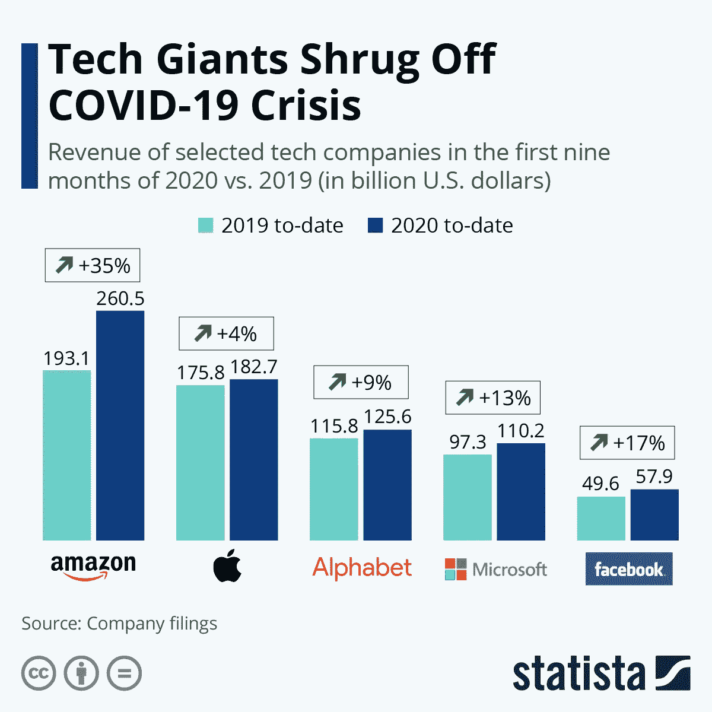

# 我们正在经历历史上最大的财富转移

> 原文：<https://medium.datadriveninvestor.com/were-living-through-the-biggest-wealth-transfer-in-history-3cc7814fd2f4?source=collection_archive---------3----------------------->

Photo by [Jamie Street](https://unsplash.com/@jamie452?utm_source=medium&utm_medium=referral) on [Unsplash](https://unsplash.com?utm_source=medium&utm_medium=referral)

我们正处于美国历史上，也许是世界历史上最大的财富转移之一。

许多在冠状病毒之前就已经有势头的趋势最终被大大加速了。

整个经济和劳动力正在重组，金融市场也在转变。

这也意味着在接下来的几年里，将会有大量的资金在经济中流动和易手。

能够驾驭潮流和趋势的人最终可能会获得成功。

许多人将以某种方式改变税收等级。

让我们来看看去年发生的一些重大事件，这些事件将为未来几年奠定基础。

# 2020 年的主要经济里程碑

## **全球关机**

这是一次史无前例的全球事件，几乎地球上的每个国家都颁布了某种形式的商业和政府运作大规模关闭以及严格的旅行限制。

整个全球经济以人类历史上从未出现过的方式嘎然而止。

## **零售业加速死亡**

由于病毒迫使许多企业关闭，并完全减少了面对面的交流，零售业受到了沉重的打击。

因为疫情，美国购物中心被掏空，许多 T4 的标志性零售连锁店破产。

## 整个行业被打乱了

除了零售业，我们已经看到整个行业都被打乱了。餐馆、航空公司、旅游、酒店、休闲和汽车零部件都受到了 COVID 的巨大影响。

另一方面是填补空白的公司。由于需求的大幅增长，Zoom 和 Postmates 等公司在 2020 年实现了创纪录的增长。

## 加密货币和比特币牛市

2020 年是一个秘密牛市。特别是在今年最后一个季度和 2021 年的天文增长中。比特币的市值从 2020 年 1 月的 1620 亿美元增加到目前的 6850 亿美元。

仅仅一年时间，市值就飙升了 5000 亿美元，接近 1 万亿美元。

比特币的价格从 2020 年 1 月的不到 7000 美元涨到现在的近 4 万美元。不仅仅是比特币，加密货币市场的其他部分都出现了大幅增长。

## 美元的贬值

美元比相当长一段时间以来的任何时候都要疲软，而且仍处于自由落体状态。外汇交易员完全知道我在说什么。

> “他们(高盛分析师)估计，美元可能会从最近的峰值下跌 20%以上，”报告称。这意味着它可能会下降到 84，这是过去五年来从未见过的水平。
> 
> ——[福布斯](https://www.forbes.com/sites/simonconstable/2020/06/19/the-recent-drop-in-the-dollar-is-only-the-beginning-says-goldman/?sh=6944f8476983)

美联储目前每月通过国债和抵押贷款支持证券向经济注入 1200 亿美元(这一过程被称为*量化宽松*)，以保持事情可控。

## 银行业整合

[PNC](https://www.pnc.com/en/about-pnc/topics/acquisition-update.html) 去年收购了 BBVA 的美国分公司，成为美国第五大银行。

这是自 2008 年金融危机以来美国历史上第二大银行交易。

该交易预计将于 2021 年年中完成，PNC 将开始尝试与美国其他四大银行竞争。

## 远程工作革命

隔离区把一切都推进了数字世界，几乎所有可以远程完成的工作都已经完成了。即使疫苗分发完毕，封锁开始解除，也不意味着一切都会恢复原样。

据高德纳公司称，90%的公司表示，即使在疫苗分发后，他们仍将允许远程工作。

Upwork 预计，到 2025 年，22%的劳动力将在家工作，比疫情之前的数字增加了 87%。

## 人们正在考虑搬家

由于远程工作的兴起，现在许多人在居住地点上有了更加灵活的选择。FlexJobs 的一项调查发现，27%的受访者正在考虑跳槽。

像旧金山和曼哈顿这样的地方正在经历库存上升和房价下跌，因为有能力在家工作的人都逃到了更便宜的地方。

## 亿万富翁变得前所未有的富有

2020 年，亿万富翁比以往任何时候都更富有。

当小企业倒闭时，美国的亿万富翁阶层(614 位亿万富翁)的集体净资产增加了 9310 亿美元。

## 大技术捕捉大规模指数增长

大型科技巨头走出危机的第一年，看起来比以往任何时候都更强大。随着整个世界被迫走向数字化，我们可以预计科技行业将继续占据主导地位。

[Statista](https://www.statista.com/chart/21584/gafam-revenue-growth/)

## 将近 60%的企业永久关闭

小企业是封锁的最大受害者之一。根据 [Yelp 数据](https://www.cnbc.com/quotes/?symbol=YELP)，60%被关闭的商家不会重新开业。这对美国经济是一个巨大的打击，并使失业危机更加严重。[小企业占私营部门就业的 49%。](https://www.sba.gov/sites/default/files/FAQ_Sept_2012.pdf)

## 从部分准备金银行转向零准备金银行

去年 4 月，当美联储第一次宣布这一消息时，我报道了这个故事。

在美国现代史上，我们第一次从部分准备金银行体系转变为零准备金银行体系。这是自 1971 年完全脱离金本位以来，储备银行政策最重大的变化之一。

## 几乎四分之一的美元是在 2020 年创造的

目前流通的美元中有 22%是在 2020 年印刷的。这些年来，美元的价值一直在变弱，而且这种趋势似乎还在继续。

预计人们会继续寻找有助于对冲通胀的投资。

# 我们正在见证的是我们的经济结构的彻底重组

目前正在发生许多影响经济的巨大变化。从这一切中可以吸取的教训是一个老掉牙的教训。

富人越来越富。

小企业在 2020 年被彻底摧毁，并将在 2021 年继续面临艰难时期。

许多人不得不动用他们的储蓄，或者因为大规模裁员和关闭工厂而负债。

然而，大型科技公司和该国的亿万富翁阶层变得更加富有，并继续增长。

从好的方面来看，其他行业正在兴起和发展，市场上也有新的机会。

> 三分之一的美国人已经并将会受到疫情和经济衰退的沉重打击；三分之一的人将能够保持他们的生活方式，但这样做将越来越难；三分之一的美国人将变得更加富有。
> 
> ——[福布斯](https://www.forbes.com/sites/garrettgunderson/2020/08/20/how-to-prepare-for-the-greatest-wealth-transfer-in-history/?sh=10fd5145322b)

你将属于哪一组？