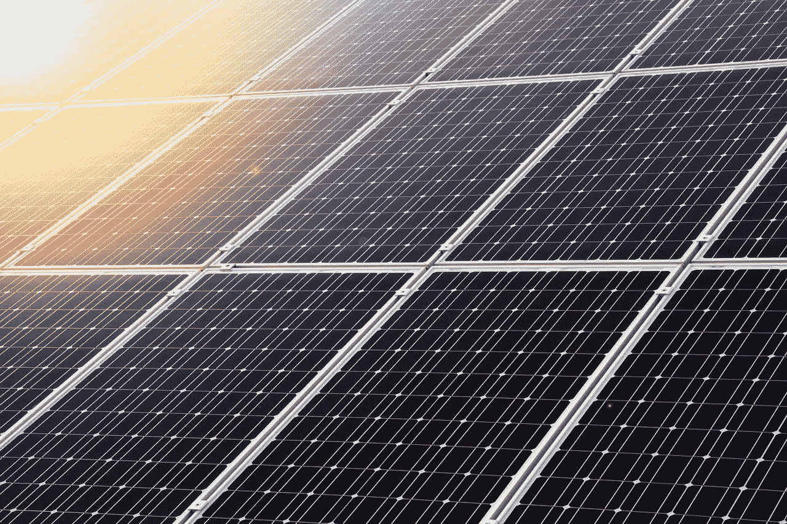
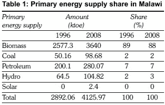

# 我们有动力吗？！哦，糟糕——不，我们没有！

> 原文：<https://medium.datadriveninvestor.com/weve-got-the-power-oh-snap-no-we-don-t-bb6e18d9874a?source=collection_archive---------30----------------------->

# 公用事业合作社能解决马拉维的电气化挑战吗？

Image by [Comfreak](https://pixabay.com/users/Comfreak-51581/?utm_source=link-attribution&utm_medium=referral&utm_campaign=image&utm_content=503881) from [Pixabay](https://pixabay.com/?utm_source=link-attribution&utm_medium=referral&utm_campaign=image&utm_content=503881)

在马拉维，我们唯一的电力供应商,[马拉维电力供应委员会(ESCOM)提议在 2018 年年中再次提高电价。这意味着终端消费者的成本增加了 68%,从每千瓦时 73 克瓦时增加到 123 克瓦时。当时，有人认为我们需要用发电机来运行这个国家，而我们已经有了水力发电系统。这些发电机的价格为每千瓦/小时 191 克朗。](https://mwnation.com/escoms-68-tariff-proposal-faulted/)令大多数马拉维人感到沮丧的是，最近电力的购买价格有所上涨。最近的增长是因为半国营企业认为我们的水电电网需要柴油发电机的支持，以产生必要的电力供应不足。看起来涨价是不够的，因为他们[亏损了 42%](https://mwnation.com/escoms-68-tariff-proposal-faulted/)。事实上，[今年他们要求新政府救助他们。这个被否定了](http://conrema.org/2020/08/26/no-bail-out-for-escom/)。对于那些有幸访问过我们美丽的非洲国家的人来说，你会发现一些社区一直受到供电问题的困扰。然而，马拉维的电气化率目前只有 10%,峰值电力需求比供给多出近 100 兆瓦。

“整个昂贵的柴油发电机”的事情显然是为了解决我们的电力供应问题。在我看来，我们最初所做的是正确的，首先，作为一个国家，我们有一个可再生能源系统。我们真的应该为此表扬一下自己。似乎有理由相信，与试图通过提炼化石燃料的产品来部分和(似乎)永久地为一个国家提供能源相比，现在增加能源将是一个更具成本效益的解决方案，因为就其本质而言，化石燃料是有限和昂贵的。[当然，似乎确实有增加水电供应的努力，提到了几个政府项目，但似乎都处于可行性和研究阶段(从 2016 年到 2020 年)。与此同时，消费者将不得不苦笑着忍受这一切，在社交媒体上表达他们义不容辞的愤怒(比如我自己)。谢天谢地，马拉维消费者协会(Cama)试图在这件事上为公众争取权益。想想如果他们不存在，在马拉维会发生什么或不会发生什么是很可怕的。](https://www.export.gov/article?id=Malawi-Energy)

似乎这里的一切都是厄运和黑暗。毕竟，我上面说的没有什么特别令人愉快的，也许除了那些供应燃料和为进口发电机服务的公司。他们一定玩得很开心。除此之外，对于这个发展中国家的人民来说，这是一个昂贵的时代。说到这里，我想起了三个我非常喜欢的精彩的 ted 演讲。我从他们那里收集到的信息让我理想化地相信，也许我们有办法解决我们的能源问题。我认为这些选择不仅适用于马拉维，甚至适用于电力供应有问题的非洲其他地区。然而，我将提出的建议将需要非常开放的思想和愿意以非常不同的方式思考。所以现在，我们不仅要跳出盒子去思考，我们真的要走出盒子，把柴油倒在盒子上，扔出火柴，看着它烧到天上去。

你准备好了吗？？？开始了。

Image by [PublicDomainPictures](https://pixabay.com/users/PublicDomainPictures-14/?utm_source=link-attribution&utm_medium=referral&utm_campaign=image&utm_content=21581) from [Pixabay](https://pixabay.com/?utm_source=link-attribution&utm_medium=referral&utm_campaign=image&utm_content=21581).

作为一个 ted 演讲迷，我最近被我之前看过的三个 ted 演讲所感动。是的，这仍然与供电问题有关，请听我说。首先， [Ngozi Okonji Iweala 介绍了如何通过在非洲做生意来帮助非洲](https://www.ted.com/talks/ngozi_okonjo_iweala_on_doing_business_in_africa)。我看的第二个演讲是一位精力充沛的创新者，名叫凯特·莱恩(T5)。第三，丹比萨·莫约(我是他的超级粉丝)谈到中国是非洲的榜样。这三个演示让我相信了三件事(尽管与他们具体提出的观点相去甚远):

*   许多非洲政府效率太低/腐败/故意无能(选你的毒药)以至于不能盈利地经营营利性企业。主要原因是，他们不应该这样做。这直接包括 ESCOM 这样的公司。
*   企业家和整个社区有机会提供现实和持久的清洁能源解决方案。我特别想到的是在其他国家运作良好的公用事业合作社，例如美国、德国和海地。我们稍后会谈到公用事业合作社。
*   如果 ESCOM 是高绩效的，那么国有企业将是一个很好的解决方案。这对中国有用。事实上，中国让我想起 Jay Z(说唱歌手)曾经说过的一句名言:“我不是商人。我是做生意的，伙计”。在我看来，中国似乎不只是在“经营企业”，事实上，它本身就是一个企业。不幸的是，按照马拉维主要电力供应商目前的心态，国家资本主义在马拉维行不通。这个概念本身在其他地方也很适用，但在这里，挑战不是一个系统“问题”。我们面临的挑战是“人/管理”问题。也许，我们可以从肯尼亚做得对的事情中学习。[肯亚显然为高达 75%的人口提供电力。](https://www.economist.com/middle-east-and-africa/2017/12/14/more-africans-have-electricity-but-they-are-using-less-of-it)[这远远高于非洲整体的 42% (2016 年)](https://qz.com/africa/1271252/world-bank-recommendations-on-electricity-in-sub-saharan-africa/)和[马拉维的 10%](https://www.export.gov/article?id=Malawi-Energy) 。

那么，你这么慢吞吞地想说明什么，麦克？

**我认为马拉维的电力解决方案最好通过社区和个人的参与来解决:**

*   社区拥有的公用事业合作社的建立和运作
*   使用生物燃料和其他类型的可再生能源

 [## 不见面就做交易？风投和企业家的 5 个指南|数据驱动…

### 自从 covid 六个月前登陆美国以来，全球的风险投资家和企业家都不得不适应新的现实…

www.datadriveninvestor.com](https://www.datadriveninvestor.com/2020/09/20/doing-deals-without-meeting-in-person-5-guidelines-for-vcs-and-entrepreneurs/) 

基本上，我相信非洲的电力问题，尤其是马拉维的电力问题是可以解决的。很多时候，非洲把西方世界视为自己的榜样。本着这种精神，我们也将这样做，希望你们会和我一起注意到一些有趣的发现，当涉及到给西方，特别是美国和德国通电时。然而，我们现在要看的解决方案从来没有被使用过。即使是那些非常清楚自己国家情况的组织，我将要提出的建议也更加可行。我无论如何也不明白为什么会这样。

然而，马拉维政府知道电力供应需求正以每年 6-8%的速度增长(GoM，2010a)。 [在这个非常现代的时代，整个欧洲大陆仍有超过 6 亿人等待用上电！](http://www.scielo.org.za/scielo.php?script=sci_arttext&pid=S1021-447X2015000200003)

> 6 亿多非洲人仍在等待权力！

回到马拉维，利益相关方知道，与整个地区相比，我们的电力供应状况尤其糟糕，而且这在许多层面上影响了人民的发展:

[人类发展指数(HDI)和人均用电量之间有很强的相关性。根据开发署《2013 年人类发展报告》，马拉维的人均消费和相应的人类发展指数 0.418 远低于撒哈拉以南地区和全球平均水平。](http://www.scielo.org.za/scielo.php?script=sci_arttext&pid=S1021-447X2015000200003)

## *那么，什么能起作用呢？*

# **公用事业合作社**

Image by [truthseeker08](https://pixabay.com/users/truthseeker08-2411480/?utm_source=link-attribution&utm_medium=referral&utm_campaign=image&utm_content=1917895) from [Pixabay](https://pixabay.com/?utm_source=link-attribution&utm_medium=referral&utm_campaign=image&utm_content=1917895).

是什么或谁给了美国力量？嗯，在写这篇文章之前，我发现联合国支持的现代发展转型工具之一——**合作社** ，不仅有利于为当地社区创收，也有利于提供公用事业。这种情况:**电源**。

然而，就电力而言，仅在美利坚合众国，一个与马拉维相比具有无比高的电力需求的国家，美国主要由……你猜对了:合作社提供服务。

因此，基本上，电力合作社构成了一个渴求电力和能源的超级富裕国家的支柱。

值得称赞的是，马拉维有许多农业企业合作社提供这个国家急需的产品和服务。然而，我不明白为什么我们没有对公用事业采取同样的做法。我们看到 ESCOM 和马拉维水务局一直提供很差的服务。我们发牢骚，畏缩，哭泣，变得愤怒。利隆圭的 18A 区的水中有污水，我们很生气，我们起诉和抱怨，他们付钱，我们又回到不正常的服务。

# 我们从不认为:

> 嘿，我们试试完全不同的东西怎么样？

因此，我的观点是，如果我们可以建立自给自足的农业企业合作社，生产惊人的咖啡豆、烟草、豆类等，并在本地和国际上进行交易，那么有什么能阻止我们不仅为自己提供足够的电力，还出口电力呢？我知道技术细节很宽泛，我们正试图将苹果与橙子进行比较，但这是一项比另一座足球场或议会大楼更有益的“投资”。

国际劳工组织(劳工组织)合作社股简明扼要地阐述了公用事业合作社为何没有在非洲(特别是马拉维)兴起的最佳理由:

"[鉴于上述情况，家庭获得现代能源的机会似乎受到限制，这不仅是因为其经济成本，还因为缺乏资金和政治机构、治理和政策、缺乏公司组织和企业，以及缺乏熟练的企业家和技术人员、教育和人力资源。](http://www.uwcc.wisc.edu/pdf/Providing%20clean%20energy%20through%20cooperatives.pdf)

因此，如果我们缺乏技术专长和资源，我们都知道技术专长可以通过人获得，我们可以在同一个地方获得我们的体育场、议会大楼和酒店。(嗨，中国！).领导们为了在地上建一个体育场而经历的董事会议，也可能是为了让大型可再生能源解决方案得以实施而经历的……但是，嘿，我知道什么呢？我只是一个企业家；) .

更有趣的是，前总统说因为权力状况而无法存在的工作实际上可以因为权力状况而部分创造**。如果你认为这是我瞎编的，这里有一些东西让我们思考一下，国际劳工组织也说:**

**"[除了在地方一级创造就业机会(包括绿色工作)之外，能源合作社还可以从单一用途转向多用途。它们可以通过提供额外服务，如小额信贷、改善基础设施或技术培训，以及在创新和生产性最终用途方面的援助，促进当地发展。提供负担得起的清洁能源可以导致微型和小型企业的建立，特别是在发展中国家，这将促进当地经济和增加总体电力需求，从而有助于改善能源供应商的业绩。](http://www.uwcc.wisc.edu/pdf/Providing%20clean%20energy%20through%20cooperatives.pdf)”**

> ****公用事业合作社会创造大量就业机会。****

**因此，在我看来，马拉维确实需要其受过教育的大众和散居的公民开始与这个新政府一起解决现实世界的问题。**

**事实上，已经以效率著称的德国也越来越多地转向合作社发电。猜猜是谁推动了变革？**

# **公民们。**

**德国 46%的能源是由其合作社生产的。像你我这样的人创办和经营的组织。[虽然他们的目标是逐步淘汰核能的使用](https://www.dw.com/en/energy-cooperatives-are-booming-in-germany/a-16076317)，而我们的目标只是为所有人“获取”能源，但这种方法仍然适用于马拉维。[然而，自 2011 年以来，德国成立了超过 159 个新能源合作社，并使用不同的能源解决方案来满足他们的需求，包括风能、太阳能和热能。](https://www.dw.com/en/energy-cooperatives-are-booming-in-germany/a-16076317)累积起来，这些能源合作社提供了全国近 50%的需求。这似乎是一个“积少成多”的美丽案例。**

****生物燃料****

**[马拉维人已经将生物质作为他们的主要燃料来源(用于烹饪、寒冷月份的取暖、洗澡用的开水等)。这包括木柴、砖(作物残渣)和木炭。](http://www.scielo.org.za/scielo.php?script=sci_arttext&pid=S1021-447X2015000200003)据研究，**

****

**Image from: [http://www.scielo.org.za/scielo.php?script=sci_arttext&pid=S1021-447X2015000200003](http://www.scielo.org.za/scielo.php?script=sci_arttext&pid=S1021-447X2015000200003)**

**然而，我不会第一个提出有机会生产生物燃料。我现在逐字逐句地复述我之前在利隆圭的一家公司所听到和看到的，这家公司专注于开发柴油的竞争能源。这是从当地生长的一种植物的种子中提取的油。这种植物本身叫做 Jathropa。这些人做了所有的测试和研究。他们制造了不同于乙醇的产品(顺便说一下，如果我们没有弄错的话，我们有其他非政府组织在某个时候生产乙醇)。在测试中，这种 jathropa 油为许多传统上需要柴油的车辆提供动力。售价会比柴油便宜。这将减少出口外汇购买燃料的压力。此外，任何副产品都是有用的:作为肥料或砖块燃烧的纤维，而不是煤或木柴。不幸的是，据我所知，事情从来没有得到很好的结果。然而，这是在以前的政治体制下:也许我们会看到一些进展。**

**最后，我想和你分享一篇网络文章中让我印象深刻的一段话:**

> **美国各地的农村社区建立了非营利性的农民合作社，从新成立的农村电气化管理局(REA)获得低息贷款。在不到 20 年的时间里，93%的美国农场实现了电气化，贷款违约率不到 1%。今天，897 个合作社为 4200 万人服务。**

**二十年后。仅仅二十年。**

**是的，根据德国的说法，一些合作社是由私营企业资助的。幸运的是，非洲在海外有忠实的信徒，有受过教育的当地群众/中产阶级，还有我们新的打点卡萨诺瓦——理论上可以资助一切的中国。**

**反正只是我的想法，你的呢？**

***想了解更多关于麦克莱恩·姆伯普拉的信息吗？在 Linkedin* *上找到* [*她或者在 Medium*](https://mw.linkedin.com/in/macleanmbepula) *上找到* [*。她的*](https://medium.com/@macleanmbepula) [*写了 3 本书(一本从草根的角度看创业(《接受挑战》)和两本诗集，可以在亚马逊*](https://www.amazon.com/author/macleanmbepula) *上买到。请随时支持她的工作，成为她在 Patreon* *的顾客之一。***

## **访问专家视图— [订阅 DDI 英特尔](https://datadriveninvestor.com/ddi-intel)**