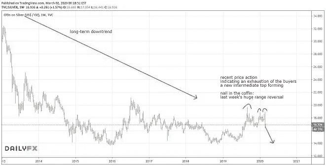
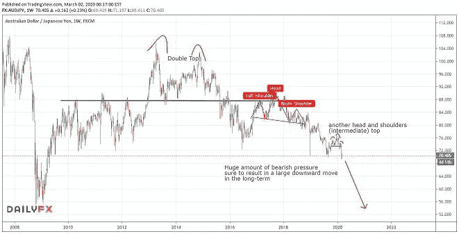

# 2020 年的波动对日元意味着什么

> 原文：<https://medium.datadriveninvestor.com/what-2020-volatility-means-for-the-japenese-yen-1ae1178f761d?source=collection_archive---------23----------------------->

我们上周在市场上看到了异常的一周，几乎所有的东西都被大量抛售！正如预期的那样，2020 年已经变得非常有趣，现在才是二月底……不幸的是，我对影响世界和市场之外的人们的周期的研究清楚地表明，这种全球不确定性的趋势至少将在今年剩余时间内持续。

做好相应准备。

虽然我在这里分享的交易(以及我知道你们正在进行的许多交易)上周获利颇丰，**这种波动性和机会在未来还会提供更多。**

在上周的[文章](https://mangrovetrading.com/a-big-opportunity-in-the-eurozone/)中，我分享了我对欧元英镑的做空想法。虽然我已经从市场中获利，但我计划在回撤后增加更多的空头。然而，重要的是我们要倾听市场告诉我们的信息。我们没有看到价格走势表明这一对货币准备再次下跌，我们只看到价格走势显示力量和一个强大基础的形成。因此，我没有坚持我的计划。

 [## 2019 年即将改变世界的技术|数据驱动的投资者

### 很难想象一项技术会像去年的区块链一样受到如此多的关注，但是……

www.datadriveninvestor.com](https://www.datadriveninvestor.com/2019/01/17/the-technologies-poised-to-change-the-world-in-2019/) 

永远对市场的行为做出反应，因为市场永远是正确的。一旦事情发生变化，不要坚持或执着于你最初的分析。

我想特别指出的一点是黄金、贵金属矿商和白银的大规模抛售。这清楚地表明了该行业趋势的变化，我正在退出一些长期持有的股票(目前)。这个领域的游戏现在是**逢高卖出**，然而一旦抛售平静下来，我们可能会找到另一个低价买入这些资产的绝佳机会。

Trading View Indicating Price Action

我们现在看到的，或许即将看到的，让我想起了 2008 年发生的事情，当时贵金属随着股市下跌，但一旦触底，价格就会大幅上涨。在这样的恐慌环境下，投资者经常接到追加保证金的通知，不得不迅速筹集资金。这导致他们被迫出售一切可能的东西来筹集资金，并导致所有资产的抛售，暂时使它们与通常的相关性脱钩。这就是为什么通常被认为是避风港的黄金和白银本周与股市一道遭到抛售。

Trading View Chart

我认为目前外汇市场上最大的机会是买入日元，尤其是兑澳元、新西兰元以及可能很快会兑美元等弱势货币。注意，买入日元意味着卖出澳元等。因为日元是该货币对中的第二种货币。

Trading View Australian Dollar/Japanese Yen

我上周从我的空头 NZDJPY 头寸中获得了不错的利润，但我认为日元才刚刚开始，并将寻求在日元对的任何反弹中增加头寸。我不愿意在目前的价格下追逐它们，尽管在这种环境下它们可能会继续下跌。

我会仔细观察股票市场的价格走势——如果市场能够建立一个基础，我们可能有很大的机会做空或买入。

最近的市场波动将持续到 2020 年。虽然它给投资者带来了风险，但如果你知道如何交易，它会提供难以置信的机会*……*如果你想充分利用这个机会，[点击此处免费试用我们的辅导服务](https://go.mangrovetrading.com/2weekfreetrial)。

*—*

请注意，一如既往，这不是投资建议，您应该在做出任何投资决定之前咨询您的财务顾问。我不是财务顾问，提供这些信息只是为了提供信息和教育目的。