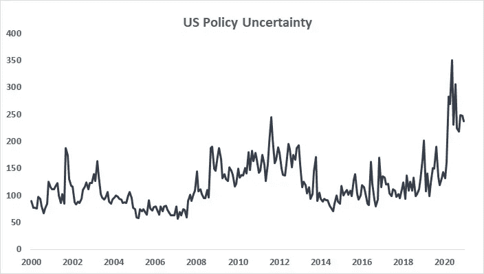
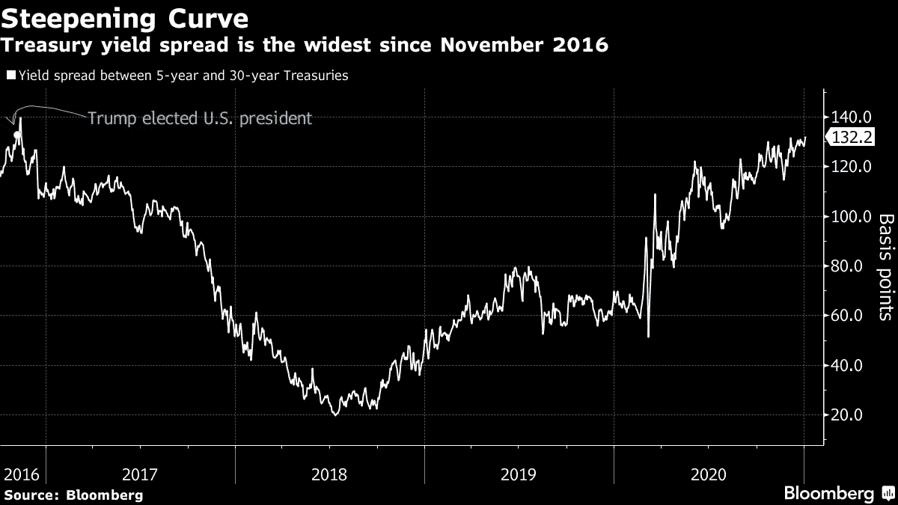

# 蓝色风暴对市场意味着什么

> 原文：<https://medium.datadriveninvestor.com/what-a-blue-sweep-means-for-markets-518bd9655af1?source=collection_archive---------8----------------------->

## 市场展望

## 民主党在佐治亚州决胜选举中获胜后，金融市场的五个重要主题

Photo by [MIKE STOLL](https://unsplash.com/@bmpskier?utm_source=medium&utm_medium=referral) on [Unsplash](https://unsplash.com?utm_source=medium&utm_medium=referral)

美国参议院两个席位的决胜选举似乎将以民主党候选人的胜利告终，拉斐尔·沃诺克击败凯利·洛夫勒，乔恩·奥索夫可能接替大卫·珀杜的席位。

这一结果意味着事实上民主党在国会两院都占多数，这是当选总统乔·拜登的一大胜利。民主党在国会两院的多数席位意味着拜登可以开始工作了。

但选举结果对市场意味着什么？以下涵盖五大主题及其对股票、债券收益率和流动性需求的影响。

## 不确定性下降

如果有什么东西是投资者不喜欢的，那就是不确定性。至少如果没有回报溢价的话。

最近不确定性一直在增加。在很大程度上是由于新冠肺炎疫情和美国政府的不协调和自由放任的反应。

另一个推动因素是 11 月的选举。唐纳德·特朗普总统在总统任期内对中国态度强硬，废除了贸易协议，并向制药公司和大型科技公司等美国中坚力量宣战，他尽了自己的职责，使不确定性居高不下。

风险意识的增强让预防性机构投资者保持了流动性。作为现金等价物持有的资产数量正处于创纪录高位。

 [## 创纪录的兼职现金可以刺激当前的牛市

### 几个因素表明牛市正处于初期阶段

medium.com](https://medium.com/datadriveninvestor/record-amounts-of-cash-on-the-sideline-can-fuel-the-current-bull-market-7a5c76374709) 

在乔·拜登(Joe Biden)于 11 月当选总统后，以及在疫苗方面不断传出利好消息后，投资者的不确定性有所下降。

佐治亚州选举后，不确定性预计将继续其下降趋势，随着民主党上台和疫情放松对经济的控制而逐渐下降。

这降低了预防性储蓄的必要性，因此投资者会将资金重新分配给风险资产。

因此，在未来 6 至 12 个月内，股票将受益于不确定性的逐渐减少。

Economic Policy Uncertainty, United States Jan 2000 — Dec 2020\. Source: policyuncertainty.com

## 税收和监管增加的风险

由于民主党在美国参议院占据多数席位，2021 年股票回报的风险之一是增税。当选总统乔·拜登多次主张提高公司税和资本利得税。

一些人猜测，他甚至可能会考虑增加最富裕人群税收的措施——这项政策主要受到民主党中更左倾部分的支持。

税收可以为公共投资提供资金，并在一年的超高支出后缓解政府财政，以减轻新冠肺炎疫情对经济的负面影响。

这可能是合理的，而且对美国经济有潜在的好处，但是股票在短期内将会因为税收的增加而遭受损失。

随着许多民主党人面临 2022 年即将到来的中期选举，拜登政府可能会选择放松他们最初的增税措施。

如果疫苗和经济重新开放的前景是积极的，税收的微小变化不太可能打击投资者。

除了更高的税收，美国公司还将面临更多的监管。这将影响大型科技公司，其中几家已经受到美国联邦政府的反垄断和竞争诉讼。

 [## 打破大技术对创新意味着什么

### 针对脸书和谷歌的反垄断案件标志着竞争政策的新时代。对创新的影响是…

medium.com](https://medium.com/discourse/what-breaking-up-big-tech-means-for-innovation-c4d9515694af) 

另一个可能因监管压力增加而遭受损失的行业是医疗保健。由于医疗保健，尤其是科技公司在标准普尔 500 权重很大，基准可能会看到蓝色扫描的初期痛苦。

## 额外刺激

在过去的六个月里，民主党人和共和党人在国会就刺激计划发生了几次冲突。最新的刺激协议是在 12 月下旬签署的。

在谈判过程中，现任参议院多数党领袖、共和党人米奇·麦康奈尔(Mitch McConnell)在刺激计划方面踩了刹车，限制了刺激计划的规模。

 [## 当谈到刺激检查时，经济学家站在米奇·麦康奈尔一边

### 学者呼吁更有针对性的政策干预来帮助那些有需要的人

medium.com](https://medium.com/discourse/when-it-comes-to-stimulus-checks-economists-take-mitch-mcconnells-side-c765e55c66b0) 

拜登政府将推动额外的刺激措施，并将更容易与民主党领导的参议院进行谈判。

增加刺激将有利于股票。具体如何取决于未来刺激政策的设计。

T2 共同基金 Leuthold Group 的首席投资策略师 James Paulsen 在大选前告诉美国消费者新闻与商业频道，他预计越来越多的刺激措施将主要体现在价值股上。

周期股、小盘股和外国市场也是受益者。反过来，他预计美元将进一步走软。

## 公共投资和绿色新政

民主党控制的参议院将成为能源和基础设施的顺风。

拜登政府可以推动绿色新政——拜登的大环境计划，旨在减少二氧化碳排放——并在可再生能源和绿色技术方面进行大量投资。

选举结果的消息传出后，绿色股票上涨。然而，对于 ESG 投资者来说，可能会有更多的机会。目前，这一势头是由预期推动的。

具体的投资计划将进一步推动当前的势头。如果拜登说到做到，绿色股票可能会成为 2021 年表现最好的股票之一。

## 债券收益率、通货膨胀和利率

更多的政府支出，无论是由于刺激还是投资，如果不能通过税收抵消，将会增加政府赤字。虽然税收可能会增加，但拜登政府不太可能提高到足以支付所有支出的水平。

更大的赤字导致更多的国债供应。更高的供应量会导致产量增加(与价格相反)。因此，美国国债收益率曲线可能会进一步变陡。

如下图所示，短期(5 年)和长期(10 年)美国国债之间的利差在 2020 年已经上升。进一步变陡将导致对美国国债的重新配置。

Source: Bloomberg

与此同时，美国市场 10 年盈亏平衡通胀率已升至 2%以上，这是美联储(美联储)的目标。这是自 2018 年以来的第一次，标志着货币宽松政策的结束比投资者所贴现的更近。

美联储致力于帮助美国经济从封闭型衰退中复苏。虽然他们的目标是保持低失业率，但他们被要求将通胀率保持在接近目标水平的范围内。

由于失业率可能会低于其 NAIRU，投资者不能排除美联储在 2021 年期间加息一次甚至几次的可能性。

美联储正在走钢丝，因为超过目标的通胀预期似乎有利于就业。

更高的利率导致未来利润的贴现率更高，这意味着估值将更少地依赖于未来的收入，而更多地依赖于近期。

因此，加息往往是行业从增长型股票转向价值型股票的催化剂。周期性股票(当通胀预期为正时，定价能力增强)和金融类股将受益，而美国科技公司可能会陷入困境。

轮换可能很快就会发生，因为它是由预期驱动的。投资者应密切关注美联储主席杰罗姆·鲍威尔(Jerome Powell)即将举行的新闻发布会。

## 前进

对投资者来说，2021 年将是有趣的一年。人们的注意力将集中在疫苗的持续分发和西方经济体最终的逐步重新开放上。

一个新的政府——与现在的非常不同——将制定新的政治路线。由于参众两院都占多数席位，乔·拜登的手脚被松开了。

对市场的净影响尚不清楚，但投资者将充分考虑刺激措施、税收和监管改革、主要公共投资项目以及不断上升的通胀预期。

**访问专家视图—** [**订阅 DDI 英特尔**](https://datadriveninvestor.com/ddi-intel)

 [## CAPE 比率表明股票市场是有吸引力的

### 坎贝尔和诺贝尔奖得主席勒发明的这一指标预示着股市的乐观前景

medium.com](https://medium.com/datadriveninvestor/the-cape-ratio-suggests-the-stock-market-is-attractive-7eb3fc22816b)