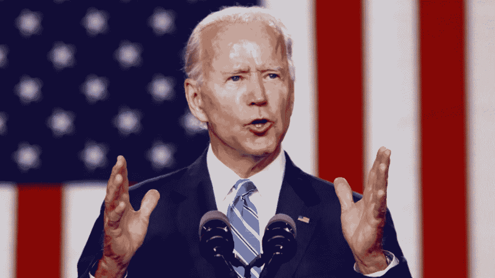

# 乔·拜登当选总统对比特币意味着什么

> 原文：<https://medium.datadriveninvestor.com/what-a-joe-biden-presidency-could-mean-for-bitcoin-d0ede301e07c?source=collection_archive---------20----------------------->

预计拜登将聘请加里·詹斯勒(Gary Gensler)，他在麻省理工学院教授区块链技术和数字货币。

在美国大选后的几天里，我们看到比特币的股价出现反弹，这不一定是因为谁赢了，而是因为它结束了困扰市场的一些不确定性。此外，价格上涨不是由于零售销售，而是可能来自公司的需求，仅上个月 gray 就购买了 4 万多枚新比特币。

# 但乔·拜登(Joe Biden)当选总统对加密货币及其监管意味着什么？

唐纳德·特朗普(Donald Trump)毫不掩饰他对加密的怀疑，去年他在推特上表示，“……他不喜欢比特币和其他非货币的加密货币，这些货币的价值非常不稳定，缺乏基础”。

然而，许多人希望拥有精通技术的顾问的拜登政府能够对密码更加友好。这可能是 FTX 和阿拉米达创始人萨姆·班克曼-弗里德的感受，他为拜登竞选捐赠了 500 多万美元。

华尔街日报周五报道称，拜登将邀请前 CFTC 老板加里·詹斯勒(Gary Gensler)担任他的华尔街监管顾问。Gensler 是一名麻省理工学院的教授，他讲授了一门名为“区块链和货币”的课程，内容是区块链如何应用于金融业。去年，他还为 Coindesk 撰写了一篇专栏文章，将加密货币和区块链描述为“变革的催化剂”

 [## 稳定币会危及比特币在加密领域的地位吗？数据驱动的投资者

### Stablecoin 是一种加密货币，主要用于维持稳定的市场价值。它可以通过…

www.datadriveninvestor.com](https://www.datadriveninvestor.com/2020/06/08/can-a-stablecoin-jeopardize-the-position-of-bitcoin-in-the-crypto-space/) 

虽然有些人担心 Gensler 过去关于加密货币市场监管必要性的评论，但该监管将消除政府试图禁止加密货币的风险，并增加公众对加密货币的信心。然而，Gensler 也表示，比特币应该保持在监管控制之外。

至于副总统当选人卡玛拉·哈里斯，她的团队包括萨克拉门托国王队的前首席技术官瑞安·蒙托亚。国王队是现存的最具创新性和比特币友好的 NBA 球队之一。他们是第一个拆除加密货币的职业运动队，并在去年宣布了粉丝奖励的加密令牌。蒂姆·德雷珀还说哈里斯“……可以学习密码”。

拜登和哈里斯没有过多谈论他们对加密货币的看法，毫无疑问，他们上任后将不得不关注许多其他事情。然而，他们的顾问中有几个对加密友好的人可能意味着比总统更积极的态度，据报道，总统告诉他的财政部长史蒂夫·姆努钦“以欺诈罪起诉比特币”。

我在每月的[时事通讯中分享了更多私密的想法，你可以在这里查看](https://mailchi.mp/bf8f8e8ed697/keep-in-touch-with-lukas)。请在评论中告诉我，并在各种社交媒体平台上加入我:

[推特](https://twitter.com/WiesfleckerL) ● [Instagram](https://www.instagram.com/lukaswiesflecker/) ● [脸书](https://www.facebook.com/lukaswiesfleckerr)●[Snapchat](https://www.snapchat.com/add/luggooo)●[LinkedIn](https://www.linkedin.com/in/lukas-wiesflecker-1b11251a5/)

无论你做什么，都要带着爱和激情去做！

**访问专家视图—** [**订阅 DDI 英特尔**](https://datadriveninvestor.com/ddi-intel)