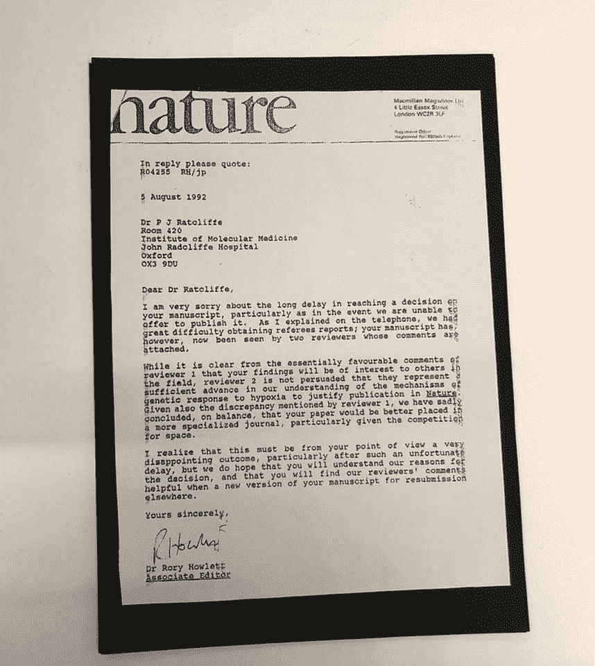

# 关于拒绝写作，诺贝尔科学奖能教会我们什么

> 原文：<https://medium.datadriveninvestor.com/what-a-nobel-prize-for-science-can-teach-us-about-writing-rejection-833f6b87eeb9?source=collection_archive---------33----------------------->

Photo by [jesse orrico](https://unsplash.com/@jessedo81?utm_source=unsplash&utm_medium=referral&utm_content=creditCopyText) on Unsplash

让我们回到过去——是的，暂时离开 2020 年。2019 年 10 月，又一轮诺贝尔奖得主揭晓。

奇怪的是，我今天写的不是其中一个写作类别(尽管，伙计，那里有一些[丑闻*T3！)*](https://time.com/5696202/nobel-prize-literature-2019/)

*相反，它是关于诺贝尔生理学或医学奖，获奖者之一:牛津大学教授彼得·j·拉特克利夫爵士。*

*彼得爵士和他的合作者似乎已经发现并验证了细胞如何感知和适应氧气供应的变化。这有点重要，因为大多数动物(包括人类)需要氧气来将食物转化为能量。*

*以及无数其他依赖氧气的生物功能(*请注意，我不是科学家，可能会与“亿万”估计不符*)。*

*该奖项颁发后不久，互联网上出现了一封很久以前来自《自然》科学杂志的退稿信，内容是彼得爵士提交的一篇关于他对缺氧的早期发现的文章。*

*对于那些像我一样不是科学家的人来说，缺氧是身体或身体某个区域缺乏足够氧气供应的一种状态。谢谢维基百科。*

*在拒绝信中(包含在下面，但您可以通过单击[此处](https://www.craftyourcontent.com/rejection_nobel-prize/)查看更大的版本)，我们可以看到编辑关于他们为什么不能接受他的提交的注释:*

**“虽然从审稿人 1 的基本上有利的评论中可以清楚地看出，该领域的其他人会对你的发现感兴趣，但审稿人 2 并不认为它们代表了我们对缺氧遗传反应机制的理解的足够进步，足以证明在[Nature]上发表是合理的。”**

**

*让我们把这种拒绝稍微分解一下。*

*第一，是 1992 年的。因此，很有可能当时的研究还不够先进。这是大约 28 年前的事了。*

*第二，其中一个评论者看到了作品的优点和观众的兴趣，但另一个评论者看不到。因为他们是科学家，我的猜测是评审者 1 的观点不能赢得反对评审者 2 的异议决定数据的争论。*

*我们能从这次经历中学到什么？*

1.  *仅仅因为你的工作现在还没有准备好*并不意味着它永远不会准备好——可以肯定地说，从 1992 年以来，这个项目已经做了一些工作。否则，彼得爵士会被授予 20 世纪 90 年代的诺贝尔奖，而不是随便你怎么称呼 20 世纪 20 年代的诺贝尔奖。如果你知道某件事是对的，就不断地去做，不管是一件作品还是你的整个写作生涯。**
2.  ****这个世界可能还没有为你做好准备，然而**——虽然这项工作可能没有达到保证缺氧研究“足够进步”的水平，但也有可能科学研究没有达到理解彼得爵士在做什么的水平。生理学是一个快速变化的领域，因为新的发现(如验证细胞如何感知和适应氧气可用性的变化)可以完全改变公认的知识。**
3.  **不要让一次拒绝阻止你——回到我“我不是科学家，我只是真的热爱科学”的专业领域，我不知道这项研究对这个领域到底有什么帮助。但如果它获得了诺贝尔奖，我想它可能意义重大。**

**你今天被拒绝的事情，明天可能会改变世界。**

**不要放弃它。**

****不要放弃自己。****

***喜欢更长的消息吗？这是来自我的每周简讯，* [的写作纲要](http://www.craftyourcontent.com/twr-welcome)，*，如果你想要更多，你可以加入这个行动！在这里输入你的信息***，我会在你意识到之前把它放入你的收件箱。*👨‍🔬***