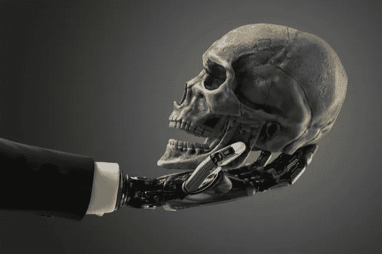

# 人工智能在不久的将来能做什么，我们还没有准备好

> 原文：<https://medium.datadriveninvestor.com/what-ai-could-do-in-the-near-future-and-were-not-ready-1ee3fc7cca?source=collection_archive---------29----------------------->

## 人工智能可以在很多领域发挥巨大作用。

Photo by [Willyam Bradberry](https://www.shutterstock.com/g/willyam) on [Shutterstock](https://www.shutterstock.com/image-photo/business-robotic-arm-holding-human-skull-508983325)

人工智能有可能在很大程度上改变我们现在生活的环境。

在不久的将来，很大一部分标准化工作可能会由机器代替人类来完成。

人工智能可以在很多领域发挥巨大作用。

人工智能是科学技术的一个迷人的翅膀，正在慢慢塑造我们的未来。众所周知，再过几年，人工智能将比人类聪明得多。

# 未来的人工智能——下一步是什么

人工智能的发展令人兴奋。虽然随着它改变工作场所，生产力可能会大幅提高，但人们总是担心人工智能在不久的将来会做什么。

我们需要研究如何将人工智能整合到许多不同的领域:不仅仅是医疗保健，还有教育、材料设计、城市规划等等。

当然，在技术方面还有更多工作要做，包括制造更好的算法，但我们正在将这项技术引入高度监管的环境，我们还没有真正研究如何做到这一点。

> 人工智能将在 2029 年左右达到人类水平。如果继续这样下去，比方说，到 2045 年，我们的智慧——我们文明的人类生物机器智慧——将会增加十亿倍。
> 
> —雷·库兹韦尔

当人工智能完全成形时，未来将会更加壮观。我们预计人工智能的未来将不亚于最好的科幻电影。

目前，谷歌、苹果、IBM 等技术领导者以及许多其他公司正在深入研究人工智能，并投资数百万美元。结果同样令人震惊，无人驾驶汽车在凤凰城的街道上漫游，足球形状的机器人在国际空间站(ISS)中游览天堂。

 [## 为什么我们投资 Totient，也就是人工智能如何帮助我们生产抗癌药物和 Covid | Data…

### 9 月 10 日，一家人工智能驱动的药物研发公司宣布与……建立关键合作伙伴关系，从此悄然出现

www.datadriveninvestor.com](https://www.datadriveninvestor.com/2020/09/13/why-we-invested-in-totient-aka-how-ai-can-help-us-produce-drugs-against-cancer-and-covid/) 

# AI 能预测人类的未来吗？

我们被对人工智能和机器人未来的歇斯底里所包围。有人歇斯底里地担心它们会变得多么强大，会以多快的速度变得多么强大，还有人歇斯底里地担心它们会对乔布斯造成什么影响。

南加州大学 T2 信息科学研究所人工智能部主任阿拉姆·高尔斯蒂安(Aram Galstyan)不得不选择一项超级能力，那就是预测未来的能力。

Galstyan 在 ISI 领导了一个名为地缘政治事件协同预测(SAGE)的项目，试图使用非专家来预测未来。

Photo by [Victor Garcia](https://unsplash.com/@victor_g?utm_source=medium&utm_medium=referral) on [Unsplash](https://unsplash.com?utm_source=medium&utm_medium=referral)

SAGE 项目依赖于人类参与者与机器学习工具进行交互，以预测未来事件。他们的目标是让人类+人工智能组合的预测比人类单独的预测更准确。

事实证明，他们的研究非常有用，人们的预测基本上是准确的。ISI 的弗雷德·莫斯塔特(Fred Morstatter)是南加州大学维特比研究计算机科学的助理教授，他说，非专家在 4 月份准确地预测到朝鲜将在 7 月份之前进行导弹试验；朝鲜于 5 月发射。

这是该国 7 个月来的首次导弹发射，就在这个问题出现在 SAGE 上的几天后。“我不认为我们中的任何人会想到会发生这样的事情，”莫尔斯塔特说。

SAGE 由[情报高级研究项目活动](https://www.iarpa.gov/) (IARPA)资助，该活动投资于高风险、高回报的研究项目，以造福美国情报界。

IARPA 对开发基于大量人类用户做出预测的[预测](https://www.iarpa.gov/index.php/working-with-iarpa/requests-for-information/forecasting)技术很感兴趣，这种技术比单个人类学科专家更准确、更快速。

预测将变得非常先进和准确。你甚至可以预测人类的行为——谁会开始约会或离婚。它会不会发展到准确知道今天、明天和 10 年后会发生什么？

> 人们倾向于认为，有了我们，就有了计算机。但我认为那完全不是真的，我认为人类和计算机真的，真的很快成为一个紧密结合的认知单位。
> 
> 西蒙·怀特森

在今天，这一切意味着什么？技术每年都在以更快的速度变化，而且在未来几年还会加速发展。

由于社会的各个方面都需要时间来适应变化，可能不会有什么极端的事情在一夜之间发生。然而，有些人和企业能够更快地调整，预见到机遇，并从这些转变中获益。

## 访问专家视图— [订阅 DDI 英特尔](https://datadriveninvestor.com/ddi-intel)