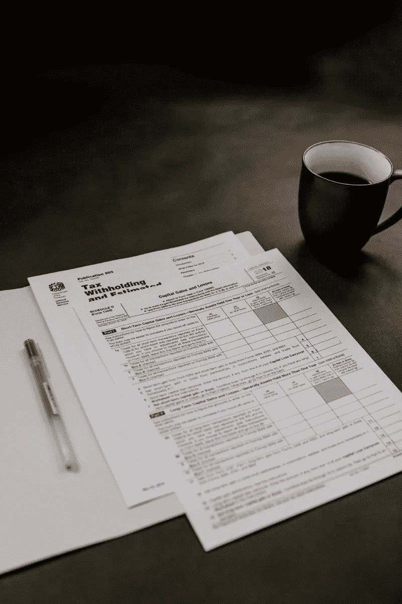
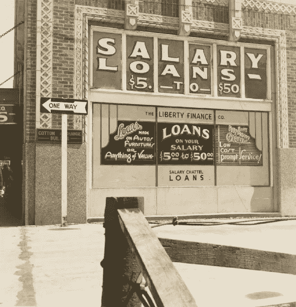
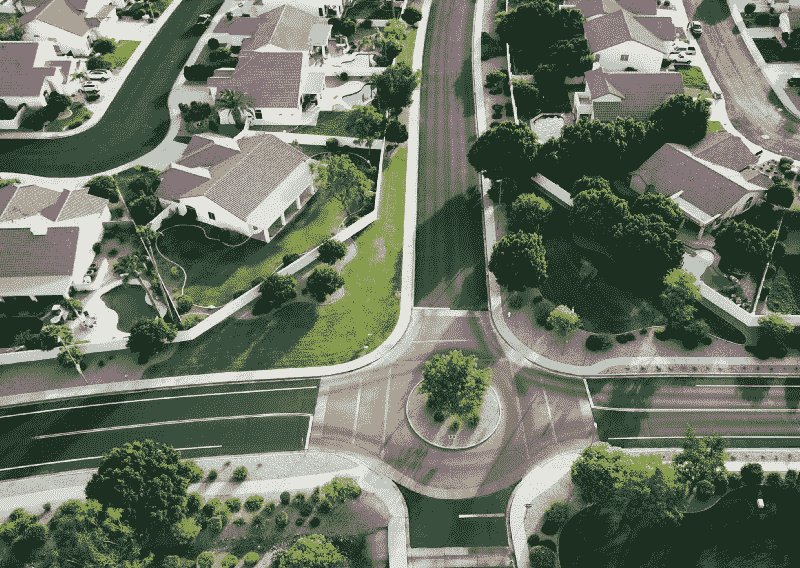

# 每个投资者都需要知道的 3 个房地产内幕技巧是什么？

> 原文：<https://medium.datadriveninvestor.com/what-are-3-insider-real-estate-tips-every-investor-needs-to-know-88dba6a6f27a?source=collection_archive---------7----------------------->

## 如何在不提高房租的情况下提高自己的现金流？

Photo by [Ярослав Алексеенко](https://unsplash.com/@webaliser?utm_source=medium&utm_medium=referral) on [Unsplash](https://unsplash.com?utm_source=medium&utm_medium=referral)

买房子出租和拥有并经营投资房产是有区别的。 ***为了最大限度地利用你的资产，你需要像经营企业一样经营它*** ，这意味着你不仅要努力在市场允许的情况下增加租金，还要像激光一样专注于支出，以确保你的现金流最大化。

有三个经常被忽视的领域，每个投资者都应该花一些时间和精力来降低他们的成本:财产税，抵押贷款支付，以及对你的物业管理公司的监管，这将在下面讨论。

# 财产税

财产税在一些州比其他州更重要，但在我的家乡德克萨斯州，财产税非常高(有些地方超过 3%！)因此在投资租赁物业时，这是成功的关键。

当你购买房产时，你需要考虑到第二年税收可能会增加。大多数评估区会注意到销售已经发生，这将触发新的评估。通常县评估价值低于市场价值，所以如果你以市场价值购买一所房子，他们会利用提高评估价值到销售价格。如果你没有提前考虑到这一点，并将其纳入计算，你可能会有一个糟糕的惊喜！

在美国，我们有一个很大的能力就是抗议我们的财产税评估。 ***每个人都有权利反推县估价所，企图降低自己房产的计税价值*** (商业房产也是如此)。这是一个保持你的财产税开支低的好方法。

当我刚开始拥有出租房产时，我不是很有商业头脑，所以我没有足够关注我的财产税是如何增加的。有一年，我注意到我在休斯顿拥有的一处房产的应缴税款上涨了近 20%！我最终决定对此做些什么，并提交了一份抗议，但立即遭到拒绝，因为我不知道自己在做什么，也没有整理出正确的信息。

Photo by [Kelly Sikkema](https://unsplash.com/@kellysikkema?utm_source=medium&utm_medium=referral) on [Unsplash](https://unsplash.com?utm_source=medium&utm_medium=referral)

第二年，我决定雇用一名专业人员，他们能够从上一年的大幅增长中收回一些。无数的财产税律师事务所会代表你抗议，然后只收取你他们节省的百分之一。如果他们没有为你实现任何储蓄，他们就不会得到报酬。

所以现在我每年都抗议我所有的八处房产。 ***我每年在多处房产*** 上节省了数百美元，随着时间的推移，这种节省越来越多，同时抗议活动也让税收逐年下降(降低了这项支出的复合年增长率)。这基本上是免费的钱，帮助我控制我的运营费用。

# 融资成本

我们目前正处于历史低位的利率环境中。尽管单户出租房屋的贷款利率通常高于主要住宅(高达+/- 0.5%)，但目前 30 年期贷款的利率不到 4%。

如果你在这些低利率可用之前购买了你的租赁物业，你应该评估再融资。对于一笔 20 万美元的贷款，将你的利率从 4.5%降至 3.375%，你每月的还款将减少 130 美元。此外，由于你已经支付了一些本金，你会将剩余的余额再分散到 30 年，这将进一步减少你的付款。

Photo by [The New York Public Library](https://unsplash.com/@nypl?utm_source=medium&utm_medium=referral) on [Unsplash](https://unsplash.com?utm_source=medium&utm_medium=referral)

此外，由于你可以选择将成交成本计入贷款，从而在不需要现金的情况下获得额外的现金流。今年，我为七套房子进行了再融资，将它们的 30 年期贷款利率都降至 3.375%。我每月的收入增加了 1000 多美元，而我没有现金投资。再次， ***这基本上是你口袋里的闲钱，因为你只需完成向贷款公司发送一些财务信息的工作。***

当然，这并不是真正的免费资金——你的债务增长很小，而且是在 30 年内偿还的，所以需要更长的时间来偿还，但是如果你是为了现金流而投资，这是减少每月成本的一个很好的方法。

如果你想更快地还清贷款，你总是可以用额外的收入来支付额外的本金。如果你把每月 130 美元的额外现金流全部用于额外的本金支付，你将提前六年还清新贷款。这将弥补甚至超过你以前的付款时间表，取决于你贷款的具体情况。

 [## 100 年来，这些红利珍珠一直在说服投资者

### 你想要支付可靠红利的股票吗？那你应该看看这两个车厂。有些股票有…

www.datadriveninvestor.com](https://www.datadriveninvestor.com/2020/08/24/these-dividend-pearls-have-been-convincing-investors-for-100-years/) 

# 物业管理公司

确保谨慎处理日常维护成本的最佳方式是什么？你可以花时间和精力自己管理你的财产，或者你可以雇佣一个好的管理公司为你做这件事。当然，你必须牺牲一些月现金流来找人管理你的财产，但如果你打算在全职工作的同时拥有一两处以上的房产，这是值得考虑的事情。他们应该有一份专业维修公司的名单，这些公司会在短时间内为他们工作，并提供优惠价格。

然而，并不是所有的管理公司都是平等的。他们的收费结构不同，他们的经验和专业水平不同，他们的结果也不同。作为小型投资物业企业的所有者，管理经理是你的工作。小心选择你的人，观察他们的表现，并在需要的时候更换他们。

在以很高的价格购买后，你的财产管理将是这场游戏成败的最重要因素。想了解更多如何以优惠价格购买房产的信息，请阅读这篇文章:

 [## 积累财富的秘密

### 当我通过寻求价值购买投资性房地产时，我如何产生权益。

medium.com](https://medium.com/datadriveninvestor/the-secret-to-building-wealth-cab646114422) 

然而，廉价的物业管理公司并不总是正确的答案，所以你需要考虑总成本。如果你的低成本物业管理公司意味着，由于租户流动，你每年的维护和再租赁成本会高得多，那么你会后悔“省钱”的决定。

Photo by [Avi Waxman](https://unsplash.com/@aviosly?utm_source=medium&utm_medium=referral) on [Unsplash](https://unsplash.com?utm_source=medium&utm_medium=referral)

# 结论

拥有独栋出租房屋并不困难，即使对于忙碌的专业人士来说也是如此，但这也不是 100%的被动。这包括管理财产税，为你的财产再融资，管理管理公司以确保你的成本保持在低水平。这将使你的现金流和投资回报最大化。

一旦你掌握了它的窍门，并看到它是如何工作的，我敢打赌你会喜欢它的结果。我知道我有！但是永远记住，首先要通过阅读、观看视频和向以前做过的人学习来接受教育。在任何投资中，知识是你抵御损失的最佳武器。

## [看看我的电子书《积累财富的内幕指南》](https://buildingarks.gumroad.com/l/mmrro)

image by author

*本文仅供参考。不应将其视为财务或法律建议。并非所有信息都是准确的。在做任何重大财务决定之前，先咨询财务专家。*

## 访问专家视图— [订阅 DDI 英特尔](https://datadriveninvestor.com/ddi-intel)