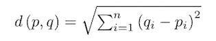
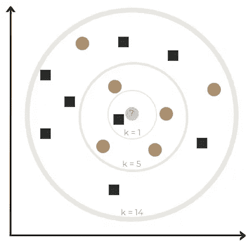

# 什么是 K 近邻？

> 原文：<https://medium.datadriveninvestor.com/what-are-k-nearest-neighbors-8ee761730d98?source=collection_archive---------21----------------------->

## K 近邻指南

## 第 1 部分:定义模型

> ***算法是什么？***

**K-最近邻(KNN)** 是一种**监督机器学习**和懒惰学习算法。KNNs 的目的是通过依赖被分成几个类别的标记输入数据来预测查询样本的分类。寻找的最佳值的最流行的参数之一是 **k，**，它指的是要包括在多数投票过程中的最近邻的数量。

> ***算法是如何工作的？***

步骤 1:确定参数 k(最近邻的数量)。

步骤 2:计算查询样本和所有训练样本之间的距离(例如:欧几里德距离)。

*The Euclidean Distance Equation*

第三步:从最小到最大排列距离。

步骤 4:在排序的距离集合中选择前 k 个条目。

步骤 5:获取所选 k 个条目的类别标签。

第六步:返回类别标签的模式→查询样本的预测！

> ***算法的例子***

K-Nearest Neighbors (KNN) Algorithm

Class A

Class B

Query Sample

*   当 k = 1 时，有 1 个-A 类邻居和 0 个-B 类邻居→查询样本因多数票被分类为 A 类。
*   当 k = 5 时，有 1 个-A 类邻居和 4 个-B 类邻居→查询样本由于多数投票被分类为 B 类。
*   当 k = 14 时，有 8 个 A 类邻居和 6 个 B 类邻居→查询样本因多数票被分类为 A 类。

假设查询样本实际上属于 B 类，当 k = 1 和 k = 14 时的预测是不正确的。因此，可以理解，随着 k 值的减小，预测变得不太稳定，而随着 k 值的增加，预测变得更加稳定(直到某一点由于误差增加)。

注意:在分类问题中，将 k 指定为奇数，以避免在进行多数投票时出现平局。

*接下来——*[*如何实现 K 近邻？第二节:用 Python*](https://kopaljain95.medium.com/how-to-implement-k-nearest-neighbors-4c46da0396fb) *…* 建立模型