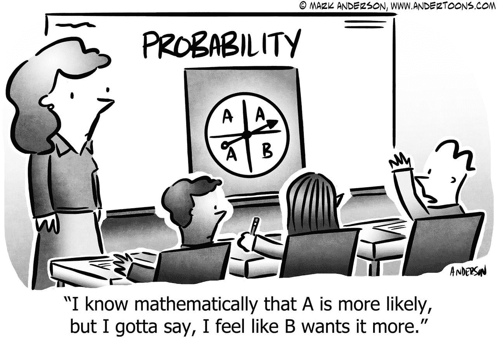
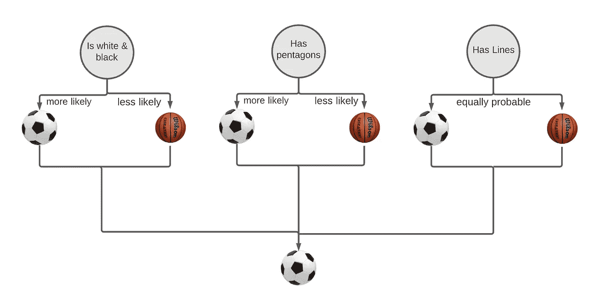
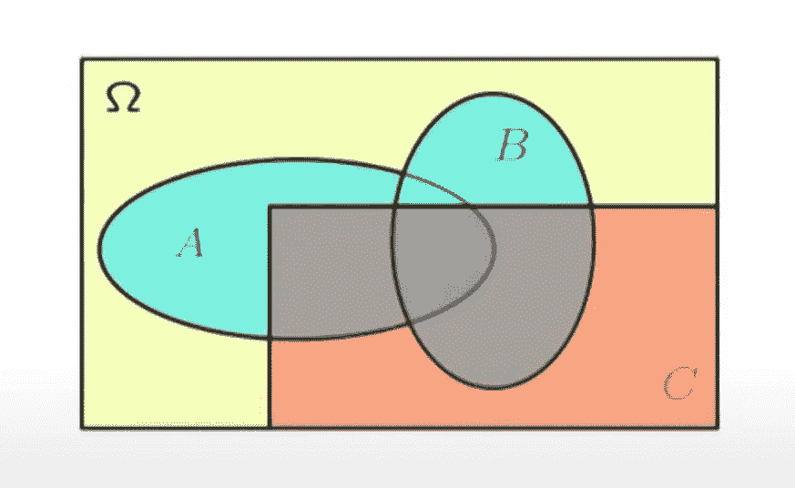

# 朴素贝叶斯分类器介绍—机器学习 101

> 原文：<https://medium.datadriveninvestor.com/what-are-naive-bayes-classifiers-dd8bc49db817?source=collection_archive---------6----------------------->

Source: Anderton Cartoons

# 基础知识:

假设有人走近你，对你说:

> “想玩游戏吗？我的包里有一个足球或一个篮球。我的球有线条，有五边形，黑白相间。能告诉我我有什么球吗？”

你的答案是什么？如果你说足球，我真的不会感到惊讶。让我们再深入一点。让我们分析一下我们的方法。

This decision tree visualizes our classification process

为了得到答案，我们使用每条信息推断的概率(物体是足球还是篮球)。所有这些计算出的概率最终导致我们最终决定这确实是一个足球。

本质上，这也是**朴素贝叶斯**(奈 **eev 贝兹** ) **分类器**的工作原理。**分类器**是一个 [**监督学习**](https://en.wikipedia.org/wiki/Supervised_learning) **模型**，它将输入数据映射到离散/分类输出。朴素贝叶斯分类器可以用来分类很多东西，如垃圾邮件，甚至乳腺癌！

在本文中，我们将更多地讨论 Naives Bayes 分类，并深入讨论分类器如何工作的细节。

# 重要概念；解释“朴素”和“贝叶斯”如何适合朴素贝叶斯；

## 条件独立:(解释“幼稚”)

朴素贝叶斯的“朴素”部分来自于模型如何在其预测者中保持条件独立性。

 [## 什么是数据目录，它如何使机器学习取得成功？数据驱动的投资者

### 数据目录是机器学习和数据分析的燃料。没有它，你将不得不花费很多…

www.datadriveninvestor.com](https://www.datadriveninvestor.com/2020/08/27/what-is-a-data-catalog-and-how-does-it-enable-machine-learning-success/) 

在讨论朴素贝叶斯时，条件独立性是一个重要的术语。它指的是一个假设(A)如何拥有观测值 B 和 C，其中 B 和 C 相互独立。

对于朴素贝叶斯，条件独立性意味着当模型分类时，它单独评估每个观察值/预测值，“天真地”假设所有预测值相互独立。

visualization of conditionally independent A and B given C

给定 a 和 B 是有条件独立的:

> Pr (A ∩ B | C) = Pr (A | C) Pr (B | C)

> A ∩ B= A 相交 B
> 
> A | B = A 给定 B
> 
> pr( ) =的概率

朴素贝叶斯分类器保持条件独立性是恰当的，就像我们要分析预测因子之间的关系一样，分类器需要计算预测因子和分类的特定出现的概率。为了准确地实现这一点，需要有许多创建特定分类的预测因子的特定组合的例子。这导致需要非常大的数据集，当考虑到由于条件独立性的简化而导致的不显著的准确度损失时，这通常是不可行的或者根本不值得采购。

## 贝叶斯定理:(解释“贝叶斯”)

朴素贝叶斯分类器中的“贝叶斯”来自贝叶斯定理，这是分类器工作的主要部分！那是什么呢？

贝叶斯定理是一个**概率定理**，考察一个事件的**条件概率**。条件概率是在给定其他事件的情况下，一个事件(A)的概率。(二)简单来说，贝叶斯定理就是在给定一个事件或多个事件发生的情况下，求一个事件发生的概率的一种方法。

可以这样表述:

Bayes theorem

> ***A =*** *事件*
> 
> ***B*** *=事件*
> 
> ***P(A)，P(B)****=概率 A，概率 B*
> 
> ***P(B | A)****= B 给定 A 的概率*
> 
> ***P(A | B)****=给定 B 的概率*

*当涉及朴素贝叶斯分类时，A 和 B 也可以分别表示为 y 和 x。*

举例说明贝叶斯定理的用法是，假设你去散步，其中(A)代表好天气,( B)代表散步，找出有好天气的概率。

# 它是如何工作的:

朴素贝叶斯分类器使用贝叶斯定理对数据进行分类。

*Bayes theorem where A refers to the class variables and B refers to the predictors (B1, B2, …BN)*

然而，使用的函数被重写以适应不同的输入类型。(例如。布尔、离散和连续数据)

朴素贝叶斯分类器使用训练数据作为参考来替换 P(A)，P(B)和 P(B|A)。

通过这样做，模型能够在给定预测值的情况下估计类(A)的概率。(B)因此，朴素贝叶斯分类器能够推断最可能的类别，从而对数据进行分类。

对于大型多元数据集的分类，特定的分类可能没有特定的预测数据。在这种情况下，朴素贝叶斯分类器将无法进行分类，因为它无法计算零值。

# 利弊:

## 优点:

*   朴素贝叶斯分类器由于相对不复杂而分类迅速。(过程的)
*   朴素贝叶斯分类器需要较少的数据来训练功能模型(如果协变量保持一定程度的条件独立性)
*   朴素贝叶斯分类器能够很好地处理离散数据，并且可以有效地应用于多类分类

## 缺点:

*   如果分类类型的预测值在训练数据中，但不在测试中，将给出零概率，这将阻止模型分类。这就是所谓的 [**零频率**或**零因子**T5。当这个问题出现时，我们可以使用](https://datascience.stackexchange.com/questions/15526/how-to-handle-a-zero-factor-in-naive-bayes-classifier-calculation)[平滑技术](https://medium.com/@ODSC/a-short-summary-of-smoothing-algorithms-3cfbbf396d2d)，比如[拉普拉斯估计](https://iksinc.online/tag/laplace-smoothing/)。
*   朴素贝叶斯假设其所有预测的条件独立性。然而，在现实世界中，协变量之间经常存在关系。因此，朴素贝叶斯分类器没有使用数据必须提供的所有潜在信息。

# 应用:

朴素贝叶斯主要应用于:

*   **实时分类-** 朴素贝叶斯的速度允许它对事物进行实时分类
*   **文本分类-** 朴素贝叶斯在多类分类中表现良好。因此，它非常适合文本分类。它通常用于识别垃圾邮件和非垃圾邮件。

# TL；博士:

*   朴素贝叶斯分类器用于离散和连续预测值的单变量和多变量分类
*   贝叶斯定理定义了事件的条件概率
*   朴素贝叶斯分类器假设条件独立性
*   朴素贝叶斯分类器使用贝叶斯定理在给定某些协变量的情况下查找最可能的类
*   朴素贝叶斯由于其在多类分类中的快速性和灵活性，可以应用于实时分类和文本分类。

我希望你对这篇文章感兴趣。感谢阅读！

*请随时通过我的电子邮件联系我:martintin@rogers.com*

## 访问专家视图— [订阅 DDI 英特尔](https://datadriveninvestor.com/ddi-intel)