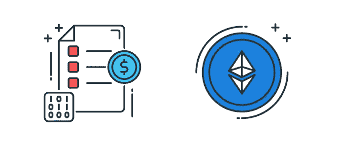

# 什么是智能合约？

> 原文：<https://medium.datadriveninvestor.com/what-are-smart-contracts-af62557d08b9?source=collection_archive---------9----------------------->

智能合约是区块链的功能延伸。它们是自动触发的合同，与双方的固定条件挂钩。这些条件不可改变地记录在协议代码中。执行智能合约最流行的平台是以太坊。

# 智能合约是如何工作的？

智能合约是在区块链上运行的小程序，基于简单的 if-then 函数，可以自动执行。类似于经典的合同，条件和动作被定义。智能合约受益于区块链的特性，并且是不可更改的、透明的，并且不需要中介来处理。

相反，区块链的功能保证以最小的成本安全地执行合同。优势是多方面的。智能合同可以自动执行，无需时间，无需依赖中介或高昂的交易成本。

 [## iota 可能成功的 6 个应用领域

### IOTA 是物联网的安全通信和支付协议

medium.com](https://medium.com/datadriveninvestor/6-possible-areas-of-application-where-iota-could-become-successful-e28394d41224) 

在区块链中，智能合约就像一个有公共地址的独立帐户，但没有所有者。几乎没有人有这个账户的私钥。一旦创建，任何人都不能访问或更改它。相反，合同内容是以条件和动作的形式制定的，帐户会自动执行这些条件和动作。它还可以连接到应该与之互动的其他基金。为此，各账户持有人必须使用他们的数字指纹提前接受合同。

 [## 人工智能、区块链和智能合约:为什么我们都需要拥抱创新|数据驱动的投资者

### 区块链是一个抓住了我的想象力的行业，有助于为更大的利益改造社会。我开始…

www.datadriveninvestor.com](https://www.datadriveninvestor.com/2020/08/03/ai-blockchain-and-smart-contracts-why-we-all-need-to-embrace-innovation/) 

# 如何使用智能合约？

智能合约的应用领域非常广泛。在下文中，描述了一些简单的使用示例。

重复支付的表示应该有助于使这种功能清晰。例如，在经典的区块链系统中，莎拉可以通过向她的房东转移两个比特币来支付每月的租金，作为回报，她可以获得搬进公寓的权利。然而，她每个月都必须重复这个过程，类似于指示银行转账。通过智能合同，Sarah 可以与她的房东签订一份定期自动付款的合同。为此，她定义了一个条件，即每个月的第一天必须是该月的第一天。当满足该条件时，从她的账户经由智能合约账户向房东的账户发起交易。如果房东和 Sarah 同意该契约，智能契约将连接到各自的商店。

 [## 什么是 NEM (XEM)？

### NEM XEM 是一个分布式加密平台。它代表了一个独立的生态系统

medium.com](https://medium.com/datadriveninvestor/what-is-nem-xem-9025050fbc69) 

这听起来像银行的长期订单一样简单，但多亏了区块链技术，不涉及任何中介；在这种情况下，银行。理论上，额外的室友可以在智能合同中实现。或者可以定义服务费还款保留在智能合同账户上，以抵消未来的租金。

> 以太坊智能合约以太坊是最受欢迎和最知名的智能合约区块链

另一个有趣的例子是分散式发电，即私人太阳能发电商和消费者在没有中介的情况下进行互动。在这里，区块链可以以分散和防篡改的方式记录消费者的能源消耗量和太阳能发电量。例如，这是通过智能灯泡来实现的，智能灯泡可以将功耗信息直接输入区块链。智能合同可以自动启动消费者向生产商的相应支付。在这样一个系统中，电力公司将是多余的，因为区块链创造了信任，智能合同将接管合同条件和自动支付流程。

智能合约的实际可能性远远超出了所描述的例子。智能合同可以设计得尽可能复杂，并且包含许多当事人和条件。一旦条件和行动可以被定义和数字化，智能合同就可以接管这项工作。

例如，在逐步数字化的过程中，律师、公证人或当局的工作将变得更加容易，甚至变得多余。物联网可以使用区块链的接口来实时进行自动结算和支付。

# 最初的硬币发行和 DApp 的

智能合约已经被用于 ICO(首次发行硬币)领域。这些是公司的群体融资，向个人账户付款直接启动股票(代币)还款。理论上，智能合同甚至可以让整个公司实现自动化。

如果将几个智能合同结合起来，就可以构建由区块链分散的复杂程序。这些应用程序被称为分散应用程序，或 DApp(分散应用程序)。其中一个例子就是假人，一个用于出租计算能力的分散式网络。

许多没有区块链基础设施的加密货币只是复杂的 DApp，作为一个程序在现有的区块链上运行。

您可以将这种模式与您付费使用的在线 web 服务的模式进行比较。以太坊区块链就是一个很好的例子，它提供了一个叫做以太坊虚拟机(EVM)的复杂操作系统。为了让租户在 EVM 上运行他们的程序或应用程序，他们必须支付所谓的汽油费。通过 EVM，气体以以太坊(ether)的货币产生，之后应用的程序代码在整个以太坊网络中执行，租户可以在 EVM 上运行他们的程序。

此外，由于大多数区块链技术都是基于开源原则，因此创新的 DApps 对所有人开放。因此，看到未来哪些操作系统上的哪些去中心化应用将影响私人和职业环境将是令人兴奋的。

我在每月一期的 [**简讯中分享了更多私密的想法，你可以在这里**](https://mailchi.mp/bf8f8e8ed697/keep-in-touch-with-lukas) 查看。请在评论中告诉我，并在各种社交媒体平台上加入我:

[**推特**](https://twitter.com/WiesfleckerL)●[**insta gram**](https://www.instagram.com/lukaswiesflecker/)●[**脸书**](https://www.facebook.com/lukaswiesfleckerr)●[**Snapchat**](https://www.snapchat.com/add/luggooo)**●[**LinkedIn**](https://www.linkedin.com/in/lukas-wiesflecker-1b11251a5/)**

**无论你做什么，都要带着爱和激情去做！**

****访问专家视图—** [**订阅 DDI 英特尔**](https://datadriveninvestor.com/ddi-intel)**