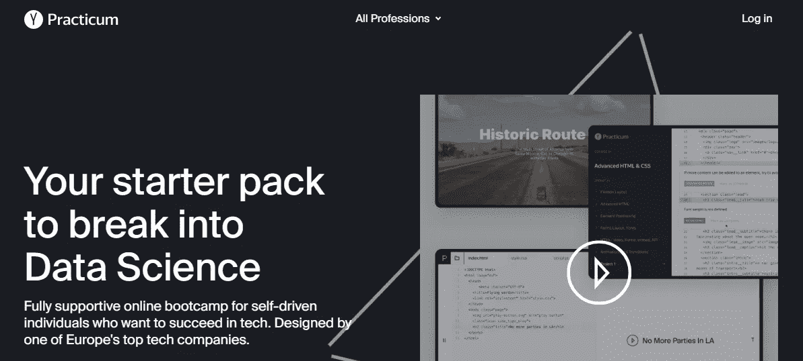
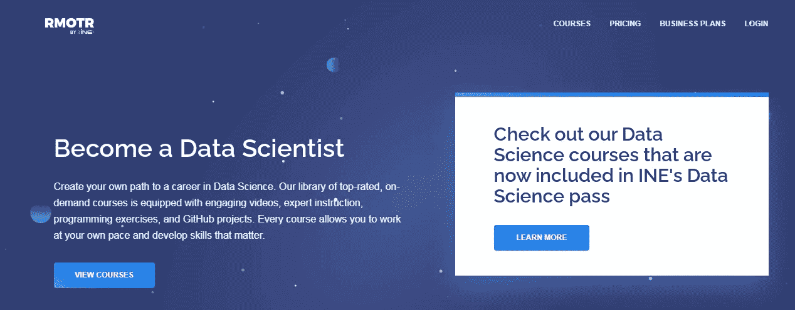
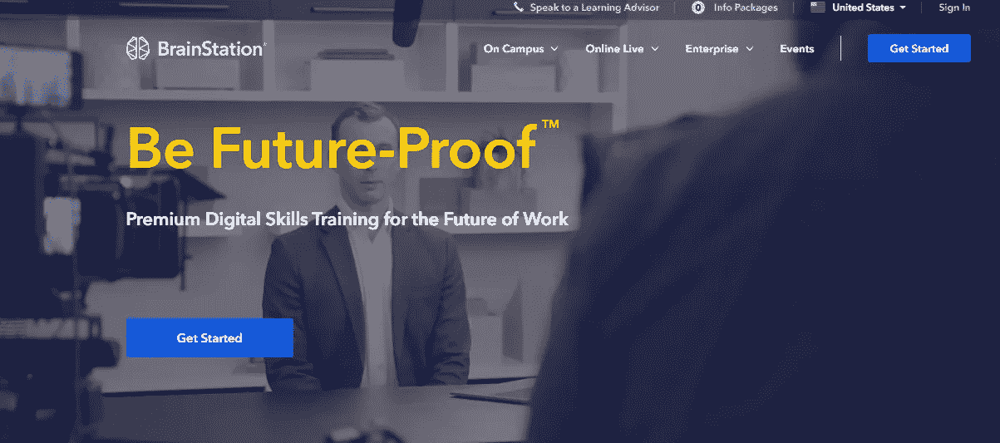
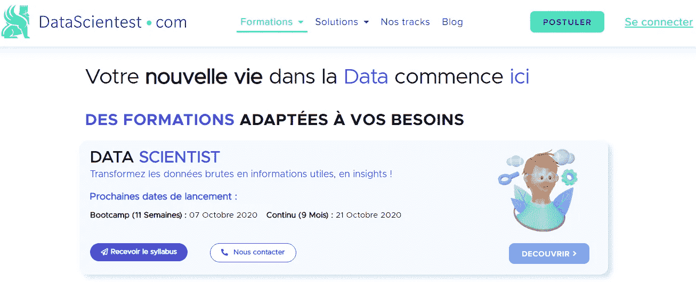
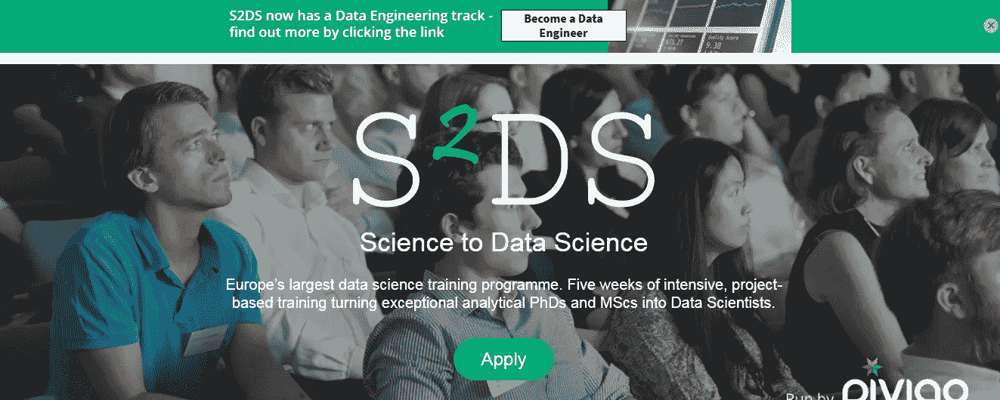
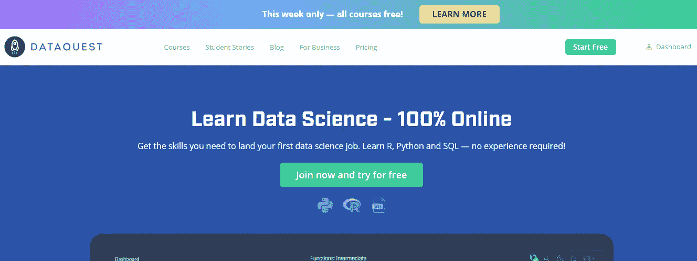
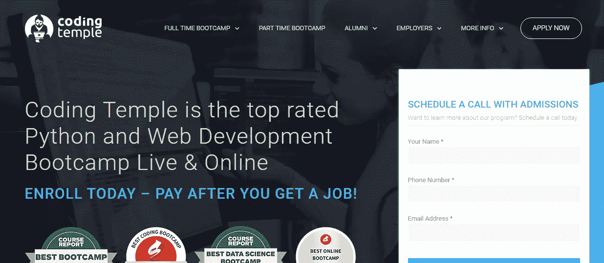
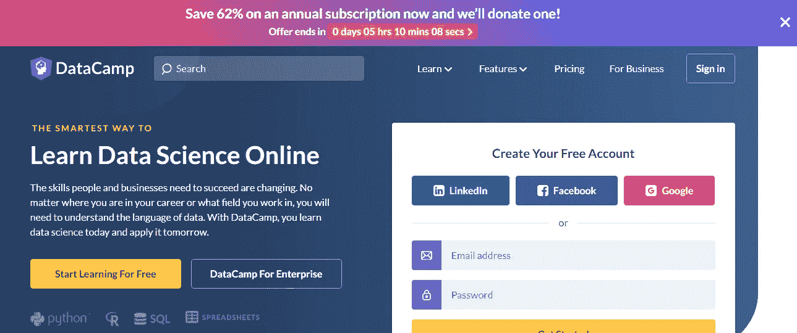
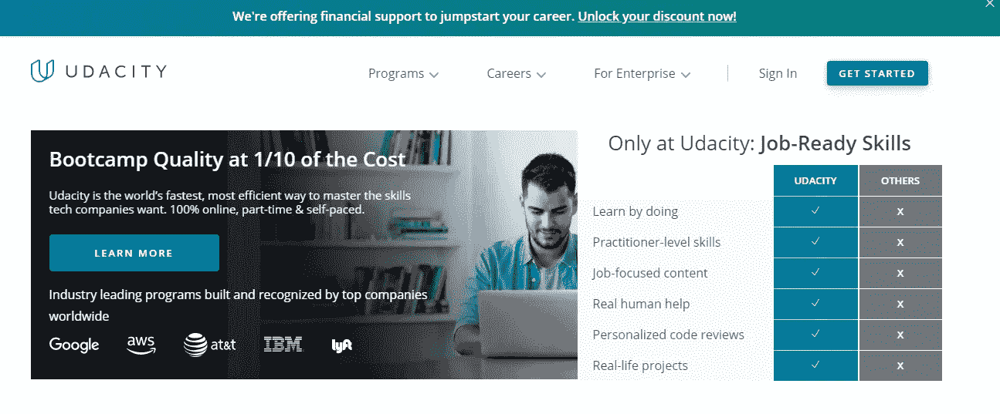
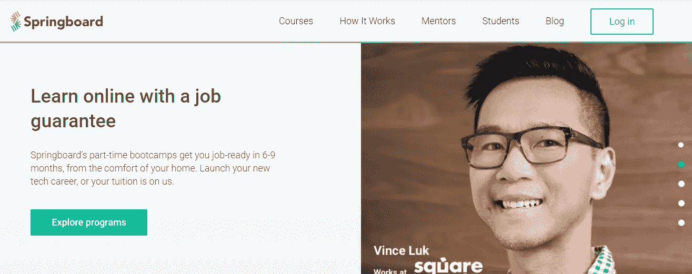

# 2021 年 10 大最佳数据科学训练营是什么？

> 原文：<https://medium.datadriveninvestor.com/what-are-the-10-best-data-science-bootcamps-of-2021-61f638ff9ca?source=collection_archive---------4----------------------->

## 数据科学训练营—通过排名、评论和评级

Image by [rawpixel.com](http://rawpixel.com/)

训练营主要提供指导和辅导的机会。此外，基于当前技术和行业相关工具的实践培训和真实世界挑战是其主要优势。由于培训通常由现场专家准备和提供，您可以更快地获得现场经验。这些无疑是获得新观点的大好机会。

使数据科学训练营具有吸引力的另一个因素是职业服务，它通常提供社交机会、工作面试准备、招聘会议和研究生职业指导。

## 那么数据科学训练营的成本是多少呢？

费用一般在 7，000 美元到 17，000 美元之间。然而，大多数高需求的训练营都在范围的上端。虽然可以选择提前支付，但是资助选项，****ISAs**和**奖学金**一般都有。**

**是的，现在是时候检查一下预计明年会越来越受欢迎的数据科学训练营了。**在开始之前，最好知道:****

*   **训练营根据评分、星级、附加观看次数、参与者的参与程度进行排名**
*   **每种方法的利弊当然会因环境而异。**
*   **对任何网络平台来说，说它“完美”都没那么容易。**

## ****开始吧！****

# **1.Yandex 实习**

****

****地点:** [在线](https://practicum.yandex.com/)**

****课程:**数据科学家**

****主题:**数据分析、数据科学、JavaScript、网络开发**

****内容:**为期 8 个月、600 小时的训练营的教学大纲包括 Python 及其库、数据和统计分析、机器学习和计算机视觉方面的指导和培训。学生在 Yandex 的互动学习平台上完成数据任务，并在专家导师的指导下完成整个课程共 15 个开放式作品集项目。**

*   **成本:1.600 美元**
*   **持续时间: 30 周**
*   **每个节目的前 20 个小时是免费的。**
*   **如果他们在完成课程后的六个月内没有找到新的工作或升职，实习课将退还学费。**

# **2.RMOTR**

****

****地点:** [在线](https://rmotr.com/)**

****课程:**数据科学与 Python**

****主题:** A/B 测试、Android、数据分析、数据科学、数据可视化**

****内容:**学生主要通过做来学习；每门课程都包括测验、练习和 GitHub 项目，允许真实世界的理解和应用。RMOTR 提供多个数据科学领域和应用的课程，包括 Python、面向对象编程(OOP)、HTTP、NumPy 计算、数据库和 Panda。**

*   ****费用:** 1.099 美元**
*   ****持续时间:** 16 周**

# **3.大脑站**

****

****地点:** [在线](https://brainstation.io/)，波士顿，芝加哥，纽约，多伦多，温哥华**

****课程:**数据分析证书课程、数据科学证书课程、数据科学文凭课程**

****主题:** A/B 测试、敏捷、算法、API、业务**

****内容:**全日制数据科学文凭完全是在线的，尽管在纽约、多伦多和温哥华也有校园课程。这些课程由讲师指导，由 Synapse 系统提供支持，旨在为每个学习者提供个性化的课程。灵活的支付选择，如每月付款计划，雇主赞助和奖学金是可用的。**

*   **成本: 3.150 美元**
*   **持续时间: 10 周**

## **数据科学文凭项目**

*   **费用:14.500 美元**
*   ****持续时间:** 12 周**

** [## 从数据科学的角度看资本主义成功的秘密|数据驱动的投资者

### 数据科学家将世界视为数据处理系统，这一观点正越来越多地被经济学采纳…

www.datadriveninvestor.com](https://www.datadriveninvestor.com/2019/10/18/secret-of-capitalisms-success-from-data-sciences-perspective/) 

# 4.数据科学测试

**地点:** [在线](https://datascientest.com/)，巴黎

**课程:**数据科学家——11 周/ 9 个月，数据工程师——11 周/ 9 个月

**科目:**人工智能(AI)、大数据、数据分析、数据挖掘、数据科学

**内容:**Data scientiest 提供在线和面对面的数据科学家、数据分析师和数据工程师课程。他们的数据科学家课程包括为期 11 周的训练营培训和为期 9 个月的继续教育课程。

## 数据科学家— 11 周/ 9 个月

*   费用: 4.495 €
*   11 周内每周 35 小时或 9 个月内 6 小时。
*   每周课堂时数: 5.0

## 数据分析师— 9 周/ 6 个月

*   **费用:** 3.795 €
*   9 周每周 35 小时或 6 个月 5 小时
*   **每周课时:** 5.0

# 5.科学到数据科学

**地点:** [在线](http://www.s2ds.org/)，伦敦

**课程:** S2DS 伦敦 2018，S2DS 虚拟

**学科:**数据科学

**内容:**科学到数据科学是一门为期五周的强化课程，围绕基于项目的培训展开。Science to Data Science 主要致力于将来自许多背景的经验丰富、成就卓著的科学家引入数据科学领域，同时提供伦敦课程和虚拟课程，欢迎国际学生。在“科学到数据科学”课程中，学生将在三到四人的团队中完成真实的、由公司领导的项目。

## 伦敦

*   **成本:** 1.000
*   **持续时间:** 5 周

## 虚拟的

*   **成本:**1000
*   **持续时间:** 5 周

# 6.Dataquest

**地点:** [上线](https://www.dataquest.io/)

**课程:** Python 为数据分析，R 为数据分析

**科目:**数据分析、数据科学、数据可视化、数据库设计、Jupyter 笔记本

Dataquest 提供 R、Python、SQL 和其他数据科学方面的教育，100%在线。Dataquest 在自学课程中提供互动课程和指导项目。学生登录，根据 Dataquest，他们应该在五分钟内编程，因为课程的主要重点是让学生尽可能快地编程。有四个离散的路径可用:Python 中的数据工程师、数据科学家、Python 中的数据分析师和 r 中的数据分析师。

## 用于数据分析的 Python

*   **费用:**每月 49 美元，或每月 29 美元的基本费用
*   **持续时间:** 8 周

## r 代表数据分析

*   **费用:**每月 49 美元，或每月 29 美元的基本费用
*   **持续时间:** 8 周

# 7.编码圣殿

**地点:** [在线](https://codingtemple.com/)，波士顿，芝加哥，达拉斯

**课程:**全日制 Python +数据科学 10 周课程//线上全日制 Python +数据科学 10 周课程//线上非全日制 Python +数据科学 10 周课程

**题材:**。NET，A/B 测试，算法，AngularJS，ASP.NET MVC

**内容:**学生周一至周五 9:30-17:00 上课，共 10 周，参与课堂授课和讨论，编程练习，数据项目。在课程结束时，学生通过将数据科学和分析、数据挖掘、机器学习和 Python 技术中的概念综合并应用到现实世界的行业实践中来完成毕业设计。

## 全日制 Python +数据科学 10 周课程

*   **费用:** 12.495 美元
*   **持续时间:** 10 周

## 在线全日制 Python +数据科学 10 周课程

*   成本: 9.000 美元
*   **期限:** 10 周

# 8.数据营

**地点:** [在线](https://www.datacamp.com/)

**课程:**数据科学 Python 入门，R 入门

**学科:**数据科学、数据可视化、机器学习、Python、R 编程

**内容:** DataCamp 共有 336 门在线数据科学课程，分别对应 52 个技能方向和 14 个职业方向。对数据科学感兴趣的学生可以选择他们最感兴趣的途径，并选修适用的课程。这些课程的示例包括 Python 的数据科学(88 小时和 23 门课程)、R 的数据科学家(76 小时和 19 门课程)以及面向所有人的数据科学(100 小时和 26 门课程)。

## 面向数据科学的 Python 简介

*   **费用:**免费

## R 简介

*   成本:免费

# 9.乌达城

**地点:** [在线](https://www.udacity.com/?utm_source=switchup&utm_medium=ads_n)

**课程:**数据结构与算法，数据工程师

**科目:**算法、人工智能(AI)、区块链、区块链和密码、商业

内容:作为自我指导的在线课程，它们非常灵活，可以在学生希望的时间框架内完成。所有 Udacity 纳米学位项目都提供职业服务，包括求职信和简历评论、LinkedIn 评论和 GitHub 评论，为学生找工作做准备。

## 用 Python 进行人工智能编程

*   成本: 1.077 美元
*   **持续时间:** 12 周

## 数据可视化

*   成本:1.436 美元
*   **持续时间:** 16 周

## 机器学习工程师

*   **费用:** 1.077 美元
*   **持续时间:** 12 周

# 10.跳板

**地点:** [上线](https://www.springboard.com/?utm_source=switchup&utm_medium=course_listing&utm_campaign=branded_link)

**课程:**数据科学职业生涯预科、数据科学职业生涯、机器学习工程职业生涯

**科目:** A/B 测试、AJAX、人工智能(AI)、CSS、数据分析

**内容:**兼职在线课程包括导师支持、实践经验(有 14 个真实项目)、职业支持。先决条件包括至少六个月的编程经验和对统计分析的一般熟悉。

## 数据科学职业道路

*   成本: 7.500 美元
*   **持续时间:** 24 周

## 数据分析职业轨迹

*   成本: 5.500 美元
*   **持续时间:** 24 周

## 访问专家视图— [订阅 DDI 英特尔](https://datadriveninvestor.com/ddi-intel)**