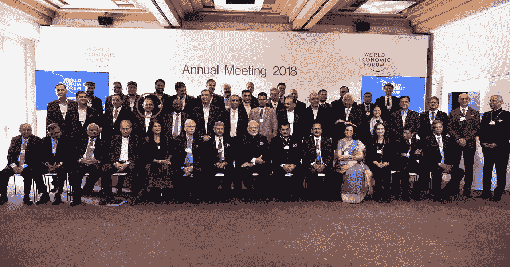
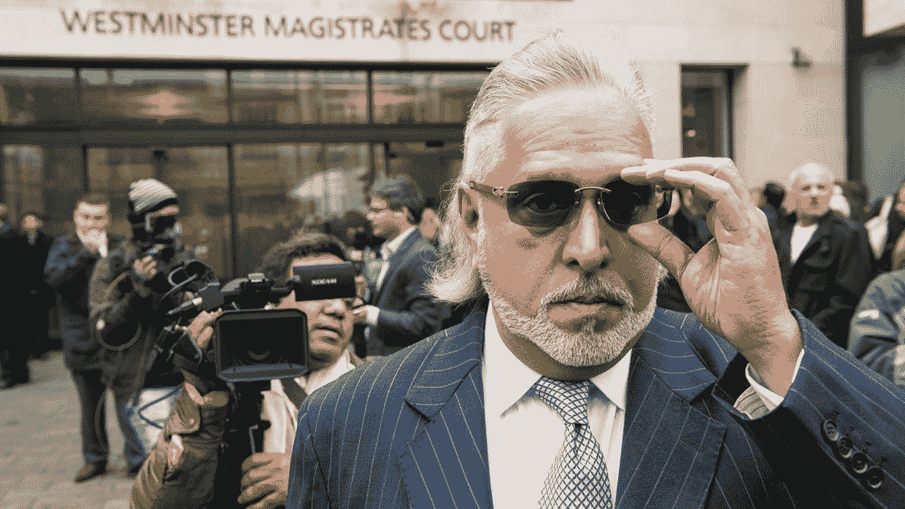
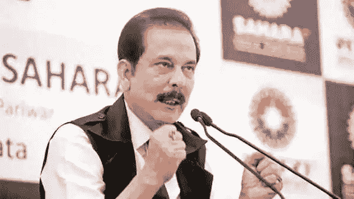

# 哪一个坏男孩亿万富翁在故事中被忽略了

> 原文：<https://medium.datadriveninvestor.com/what-bad-boy-billionaire-conveniently-leaves-out-from-its-narrative-a09c6f3910a5?source=collection_archive---------19----------------------->

## 政治角度——地球上所有问题的根源

Photo by [George Becker](https://www.pexels.com/@eye4dtail?utm_content=attributionCopyText&utm_medium=referral&utm_source=pexels) from [Pexels](https://www.pexels.com/photo/black-and-white-dark-decoration-faces-134402/?utm_content=attributionCopyText&utm_medium=referral&utm_source=pexels)

你一看就知道。

在过去十年中，企业、政府和政治家之间的关系只是呈指数增长。

由于两极分化的加剧，这种“搔我背，我也搔你背”的态度变得相当普遍。

最新的网飞纪录片《大男孩亿万富翁》展示了印度三位最富有的商业大亨的兴衰。讲故事，叙述，和他们的真实生活的写照是在现场。它让你想要更多。

我很惊讶地发现，还有一集的主角是拉姆林根·拉朱，他是超级著名的 **2G 骗局**的幕后黑手，这个骗局标志着印度国大党的垮台。

虽然纪录片系列恰当地描述了这些亿万富翁的艰难历程，但它巧妙地忽略了拼图中最重要的部分——政客和政府的参与使他们得以逃脱——所有这些都是不容错过的重要部分。

让我们深入研究一下。

# 尼拉夫·莫迪

虽然该骗局于 2018 年 2 月曝光，但政府至少在八个月前就知道了。

Nirav Modi photographed along with the PM during the Davos summit Credit — [PIB](https://thewire.in/politics/narendra-modi-nirav-modi-chowkidar-escape)

所得税部门[在 2017 年 3 月](https://www.huffingtonpost.in/2018/12/02/nirav-modi-scam-i-t-dept-found-irregularities-in-2017-didnt-share-it-with-other-agencies_a_23606727/)发现了他的欺诈行为，并在给政府的报告中说明了他的欺骗程度。

根据他们的调查——他创建了空壳公司，夸大了他的资产，并在他的资产负债表上显示了虚假交易——后来成为公共知识的一切都被官僚们报道了

有趣的是，这些危险信号从未与其他执法机构共享——你可能会问这是为什么——因为共享信息的协议当时并不存在。但是所得税部门不是一个独立的机构。它向属于中央政府权限范围的中央直接税委员会报告。

只是当旁遮普国家银行的银行家退休后，骗局才爆发。同样有点令人惊讶的是，只有当事情发展到顶点时，银行才发现了在其眼皮底下酝酿的不正当贷款行为。

该银行不仅纵容欺诈性贷款行为，还在中央调查局(CBI)开始调查此案时向莫迪通风报信。自 2016 年 12 月以来，钻石王老五一直在[计划退出，然而，去货币化阻碍了他的计划。](https://www.wionews.com/india-news/pnb-scam-this-is-how-nirav-modi-planned-his-safe-exit-from-india-33071)

一晃一年过去了，虽然他离开这个国家的计划仍然存在，但原因已经发生了变化——他需要在被抓住之前逃离当局。他在逃跑，不再飞行。在 CBI 正式开始调查之前，他在 2017 年 1 月的第一周迅速实施了他的计划。或者这一切都是在加州调查局的默许下策划的。

一名显然被莫迪欺骗的商人在 2015 年给包括项目管理办公室在内的不同执法机构写了几封信。但是政府选择忽视它。

政府一直都知道。它选择了装聋作哑。)

更糟糕的是，在他离开这个国家仅一个月后，加调局就登记了这个案子。就在他在达沃斯峰会上会见[纳伦德拉·莫迪的几天后。](https://thewire.in/politics/narendra-modi-nirav-modi-chowkidar-escape)

# 维贾伊·马尔雅

Source — [Chris J Ratcliffe — The Times](https://www.thesun.co.uk/wp-content/uploads/2020/10/NINTCHDBPICT000418156074.jpg?w=1240)

他两次当选为联邦院议员，一次是在 2002 年以国会议员身份当选，另一次是在 2010 年以 BJP 议员身份当选。

从政后，他充分利用了自己的地位。他持有外交护照。这使得出国变得相当容易。在得到消息称银行已经要求对他本人发出禁止令后，这位白酒大亨[已经于 2016 年 3 月离开了这个国家。](https://www.dailyo.in/business/vijay-mallya-kingfisher-airlines-money-laundering-uk-extradition-defaulter-cbi/story/1/18599.html)

虽然禁止令尚未送达，但加州调查局早在 2015 年 11 月就发布了对他的监视通知。然而，一份了望通知不允许官员拘留他。他经常因公务飞往国外。所以指责移民局是不公平的。

通知只要求移民当局通知 CBI。但是谁是那个案子的真正罪犯。一旦他逃离这个国家，指责游戏就开始了。银行对最高法院花了很长时间才发布对他的限制令感到愤怒。CBI 对银行没有提交针对他的初步调查报告感到愤怒，不得不提交索座右铭的案件。公众感到愤怒，这是理所当然的，因为该系统未能控制逃犯逃离该国。

通常，没有人愿意承担责任或解决这些问题。像马拉雅这样的诈骗犯继续利用系统中的漏洞。

# Subroto Roy

[Source — Live Mint](https://www.newsclick.in/Sahara-Group-Crisis-Suspicious-Nexus-Between-Cooperative-Socities-and-Aamby-Valley-in-Spotlight)

我的朋友告诉我这是这个系列中最好的一集。我同意他们的观点。事实是——你故事的中心人物越糟糕，故事就越精彩。

政治角度又一次被巧妙地从叙述中剔除了。但不需要夏洛克·福尔摩斯也能发现撒哈拉和“BJP-RSS”策略的相似之处，后者利用核心民族主义在情绪上操纵大众。普通的印度人本质上是一个爱国者&他的爱国主义被用来误导他们远离主要问题。

保释出狱后，他立即组织了一次晚宴，几位政治家、板球运动员和业内几位有影响力的人士出席了晚宴。虽然举办晚宴本身不是犯罪，但利用政治关系逃避法律制裁才是。

他的政治关系可以追溯到 90 年代。他不仅资助了 1996 年大选，还公开支持社会党候选人拉吉·巴巴尔。撒哈拉集团的近 3000 名员工为他助选。

他利用自己的政治影响力避开了监狱。猜猜谁是为他辩护的法律顾问——是卡皮尔·西巴尔——国大党中的一个知名人物。

截至目前，索波诺·罗伊仍在保释中。他还没有向公众支付他的一大部分会费。让罗伊成为三人中最坏的一个的是，他偷了穷人中最穷的人的东西，现在却逍遥法外。

我们的法律不能处罚他，但可以毫无理由地把一个无辜的医生送进监狱。它还可以利用[的严苛法律](https://amnesty.org.in/injustice-in-the-courts-four-indian-laws-that-should-have-never-existed/)，如*国家证券法*或*非法活动预防法*来回避任何来自活动人士、学生和抗议者的不同意见。但是当涉及到诈骗的亿万富翁时，没有多少法律可以给他们定罪。即使我们使用现有的法律，执法是如此薄弱，他们几乎总是设法逃脱。

法律对富人来说是不同的。

他们认为自己凌驾于法律之上。我们已经一次又一次地看到了这一点——萨尔曼·可汗、谢特尔·马法特拉尔、拉利特·莫迪，以及更多。根据 RTI 的调查，在过去五年中，有超过 50 名商人故意拖欠 的贷款。更糟糕的是，总计 93 亿美元的贷款被注销，而[的贫困农民却因为无法支付区区 135 美元而受到骚扰。](https://economictimes.indiatimes.com/news/politics-and-nation/the-lockdown-killed-my-father-farmer-suicides-add-to-indias-virus-misery/articleshow/78002359.cms?from=mdr)

这些亿万富翁不会半夜就跑了。没有政府最高官员的支持，他们不可能消失。

# 更大的问题是，政府为什么支持这样的罪犯？

要回答这个问题，我们需要了解这个政府。
在已经注销的 93 亿美元债务中，包括一些著名品牌，如 **Rotomac、Patanjali 和 Adani enterprises，这些企业为莫迪政府提供资金。**

众所周知，政府与这些实业家关系密切。他们通过选举债券资助他们，作为回报，政府免除了他们的债务。

他们一起把普通大众变成了傻瓜。

虽然“Jan Dhan Yojana”是他们为赢得公众投票而展示的，但实际上这些计划是为富人设计的。2014 年至 2019 年间，印度首富凯什·安巴尼的财富翻了一番，从 230 亿美元增加到 550 亿美元。安巴尼不是唯一受益于莫迪政府的人。有几个商人在他的统治下靠牺牲穷人的利益而发迹。

让我们看看他们中的一些人，以及他们是如何利用自己的影响力达成交易的(否则他们将无法达成交易。)他们使用了不道德的策略，破坏了竞争，尽管财务表现不佳，他们还是站在了政府的一边，获得了巨额借款的批准。

# 凯什·安巴尼

安巴尼是莫迪的另一个自我。虽然首相可能是政治背后的代言人，但商业大亨是保持政治运转的大脑。他们合在一起对我们国家的民主结构来说变得太强大和危险了。

不幸的是，竞争正在慢慢消失，我们因初创企业的增长而获得的一点点创新正在黯然失色。

Reliance 利用其雄厚的财力和对现政府的影响力，而不是一种优质的产品或服务，将网撒向了各个行业——Jio mart——其零售部门在推出仅两周后就被从质量低劣到送货不规范的投诉淹没了。这使消费者处于极大的劣势。

早在 2016 年，当他们推出电信部门 Jio 时，它被定位为**低成本电信运营商**，以进军竞争激烈的电信市场。

然而，鲜为人知的是，这些公司必须为其用户连接到其他网络付出代价。最初，在获得更多客户之前，这一成本对任何新进入者来说都是巨大的。

但对 Jio 来说不是。猜猜谁来救它了？

巧合的是， **TRAI 在 Jio 推出仅一个月后就降低了电信公司需要支付的互连费用**。虽然这极大地帮助 Jio 减少了开支并扩大了用户群，但对沃达丰-Idea 和 Airtel 来说却是一个主要的劣势。我只是在陈述事实——好了，你很聪明，能把事情联系起来。

# 高塔姆·阿达尼

阿达尼是莫迪政府恩惠的另一个主要受益者。

莫迪上台后做的第一件事就是多次出访。其中一次去澳大利亚是为了获得昆士兰的煤矿项目。

不用猜谁包了这个项目——是的，阿达尼企业。

在该交易的其它几项违规行为中，最突出的一项是这个 150 亿美元项目的融资方式。它在 2014 年从印度国家银行获得了一笔 10 亿美元的贷款(这家 PSU 银行被用作奶牛，向莫迪的朋友提供廉价而便捷的贷款)，尽管它已经被深度杠杆化了。简而言之，莫迪政府把项目和资金放在盘子里端给了阿达尼。

然而，在不到一年的时间里，阿达尼企业的债务激增到了不可持续的程度，三分之一的债务无法收回。

这远不是唯一一笔被不公正对待的交易——在电力、国防和物流行业有超过 15 笔这样的交易。还有人声称阿达尼通过虚开发票转移了超过 5000 亿卢比。

虽然该公司的债务正被用纳税人的钱勾销，但他们已能将很大一部分利润转移到海外避税天堂。

# 巴巴·拉姆德夫

好吧，当我们谈论裙带资本主义时，我们怎么能不谈论巴巴亿万富翁呢？他因开发了一个名为“帕坦伽利”的国内品牌而受到认可——这是一种民族主义、招魂术和超自然主义的独特混合物，适用于这个国家的爱国、轻信和敬畏上帝的大众。

与其他亿万富翁不同，巴巴是一位白手起家的亿万富翁，他在不到五年的时间里就掌握了权力。从一名瑜伽大师到成为一名企业家和该国最富有的人之一，巴巴为我们展示了一条道路——但不幸的是，这并不是通过制造高质量的产品或开发突破性的创新。只是通过拍马屁。

当你只要和政府做朋友就能得到你想要的一切时，为什么还要努力去做这些呢？帕坦加利的产品进入了议会餐桌[。它也在政府拥有的 Kendriya Bhandars 和军队食堂中找到了自己的位置。在 BJP 统治的各州，它也通过平价商店出售。](https://www.newsclick.in/BJP-Schemes-Modi-Ambani-Adani-Baba-Ramdev-Indian-Billionaire)

帕坦贾利的所有者阿查里亚·巴尔克里什纳(Acharya Balkrishna)是印度第 15 大富豪，净资产总额为 50 亿美元。

虽然 Mallya，Modi 和 Roy 可能看起来像是唯一的坏男孩亿万富翁，但他们远不是唯一的。每有一个成功逃脱法律制裁的亿万富翁，就有一百个其他的亿万富翁正在酝酿之中。

总的来说，这三个人似乎不太犯罪——在他们看来，他们唯一的罪行可能是在其他人设法欺骗系统的时候被发现了。

或者也许是体制偏爱他们——就像我们在阿达尼、安巴尼和巴巴·拉姆德夫的案例中看到的那样。企业不得不游说政府来完成工作的时代已经一去不复返了。

我们生活在这样一个时代，政府自己挑选他们喜欢的人，给他们大量的好处，以换取他们在选举中获得资金，并让他们继续掌权。

有几个这样的裙带资本家以这样或那样的形式受益——大幅度减税、贷款豁免、绕过采购协议、破坏竞争和反垄断法，等等。

在莫迪的新印度，穷人越来越穷，富人越来越富。

> “如果人民容忍私人权力增长到比民主国家本身更强大的程度，民主的自由是不安全的。
> 
> 这在本质上是法西斯主义:由个人、团体或任何控制的私人力量拥有政府。"
> 
> ― **富兰克林·罗斯福**

*希望保持联系——让我知道你的* [*电子邮件在这里*](https://mailchi.mp/3cdd4fa4e652/subscribe-to-a-monthly-feed) *我会寄给你我每个月的前 5 篇文章，没有垃圾邮件。*