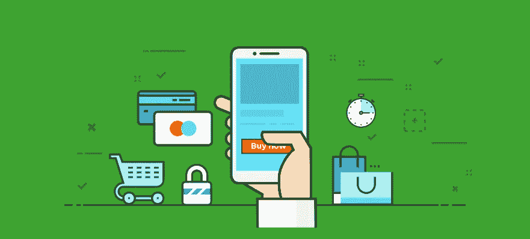
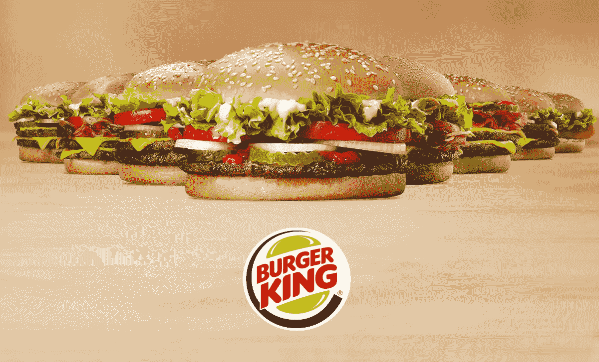
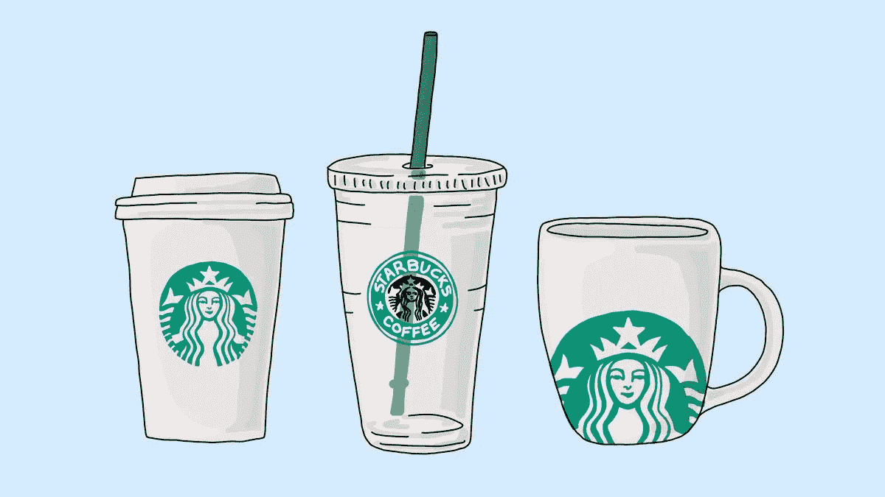
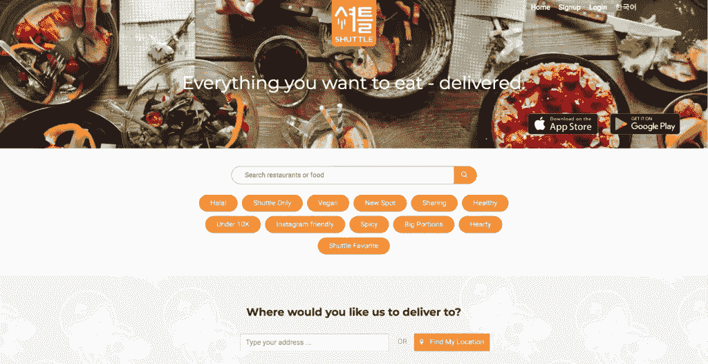

# 用比特币可以买什么？

> 原文：<https://medium.datadriveninvestor.com/what-can-i-buy-with-bitcoin-eddaee847502?source=collection_archive---------14----------------------->

所有加密货币爱好者都知道，比特币是最安全、最简单的支付方式之一。但很多人不知道，用比特币购买自己喜欢的东西并付款是可能的。

在其存在的很大一部分时间里，比特币(BTC)社区对加密货币寄予了很大的信心，认为它会成为市场上现有的许多集中支付系统的可行替代方案。然而，BTC 目前主要被用作长期投资——一种很像黄金或股票的资产。

如今，接受比特币和其他加密货币的市场和零售商的数量明显增加，为加密爱好者提供了更多在现实世界中购买的选择。

 [## 总部位于瑞士的 ETP 进入加密交易市场|数据驱动的投资者

### 虽然金融市场几乎没有沉闷的时刻，特别是在引入…

www.datadriveninvestor.com](https://www.datadriveninvestor.com/2019/03/10/swiss-based-etp-enters-the-crypto-trading-market/) 

这里有一些领先的零售商、商家和公司，可以让你预订航班和酒店，购买咖啡或披萨，甚至可以用 crypto 去太空。

## **汉堡王**

快餐连锁店汉堡王的德国分公司现在声称接受比特币作为其在线订单和交付的支付方式，但这并不是汉堡王第一次热衷于比特币作为一种支付方式。

该公司总部位于美国佛罗里达州，其俄罗斯分公司于 2017 年宣布将开始接受比特币支付，但最终没有成功。

## 星巴克

为了让加密支付获得牵引力，商家需要实施能够快速轻松地进行加密货币消费的系统。星巴克是通过美国支付初创公司 Flexa 利用这一概念的公司之一，该公司正在帮助这家咖啡馆巨头以及其他几十家公司接受加密货币支付。

该公司开发了一个名为 Spedn 的应用程序，使密码持有者能够与星巴克等商家进行购买。该公司的首席执行官认为，通过使加密货币成为主流消费货币，商业将在全世界实现区块链技术的全部好处。

## **库帕咖啡馆**

硅谷帕洛阿尔托(美国)的密码爱好者可能已经熟悉了 Coupa Cafe，除了咖啡和食物之外，还有其他原因。通过与脸书软件开发商的合作，Coupa Cafe 自 2013 年以来一直接受比特币作为支付方式。

## 穿梭运送

你可以用比特币现金购买食物，并让它送货上门。一家韩国平台 Shuttledelivery 是韩国第一家接受比特币作为支付方式的送餐公司。通过比特币现金支付，穿梭巴士不收取额外费用。

你可以使用手机上的任何钱包。所有价格瞬间从韩元兑换成比特币现金，几乎没有交易费！

## 利费兰多

德国最大的食品交付门户网站 Lieferando.de 拥有超过 11，000 家合作餐厅，自 2017 年以来接受比特币支付。该公司由世界上最大的在线食品订购网站之一 Takeaway.com 所有。Lieferando 声称拥有 390 万用户和 1730 万订单，平均订单价值为€19.68 英镑。

## TravelbyBit

如果一个旅行者只有比特币可以支配，这个商家会很乐意提供服务来换取比特币。机票和酒店预订服务 TravelbyBit 接受比特币、币安币和莱特币(LTC)等加密货币作为支付方式。该平台拥有 300 多家支持加密的商家，是采用加密技术的最大支持者之一。

其他使用 crypto 预订航班的平台包括 Destinia、CheapBizClass、CheapAir、AirBaltic 和比特币。旅游和 ABitSky，等等。

## Gyft

Gyft 是一个允许用户购买、发送和兑换礼品卡的数字平台，是首批支持加密货币在现实世界中获得牵引力的商家之一。移动礼品卡应用程序允许使用比特币从几家零售商那里购买礼品卡，其中一些零售商包括汉堡王、赛百味、亚马逊和星巴克。

## 五星级酒店和水疗 Dodler Grand

如果你去瑞士苏黎世旅行，BTC 或 ETH 都可以用来支付在苏黎世五星级酒店的住宿费用。2019 年 5 月，五星级酒店和水疗中心 Dodler Grand 宣布，将开始接受比特币和以太作为支付方式。

## 新蛋

对于所有的小工具爱好者来说，有一堆平台允许用加密货币进行电子购买。例如，新蛋是一家电子零售巨头，接受数字货币支付。尽管购买比特币不能获得退款，但新蛋在高质量商品方面有着良好的声誉。其他面向小工具爱好者的平台包括 Eyeboot(一个出售加密采矿设备以换取加密的平台)、微软、FastTech 和 Alza(一家总部位于英国的销售手机和美容产品的在线商店)。

似乎很明显，越来越多的零售商开始接受加密货币的想法，但在完全采用之前还有很长的路要走。

***如果您想了解更多，请访问 BIDITEX 页面并提出您的问题，关注我们的*** [***推特***](https://twitter.com/biditex_com) ***，*** [***脸书***](https://www.facebook.com/biditex/) ***，*** [***中型***](https://medium.com/@biditex) ***，*** 用[***bidi tex***](http://www.biditex.com/)***投标你的空格。***