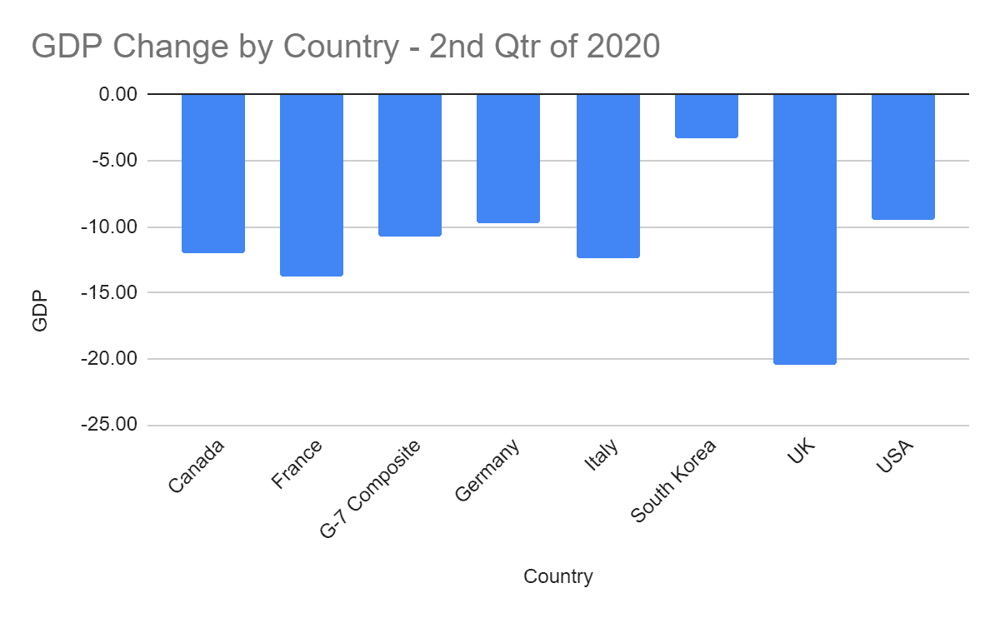
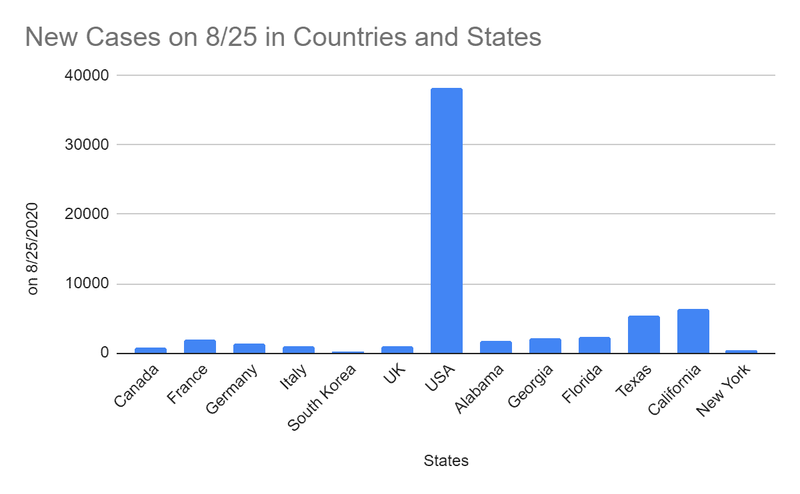
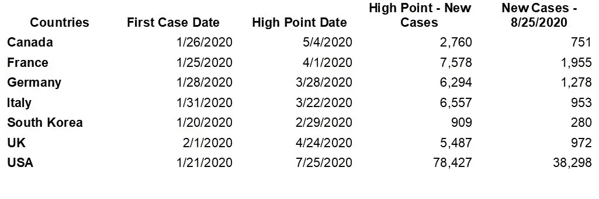
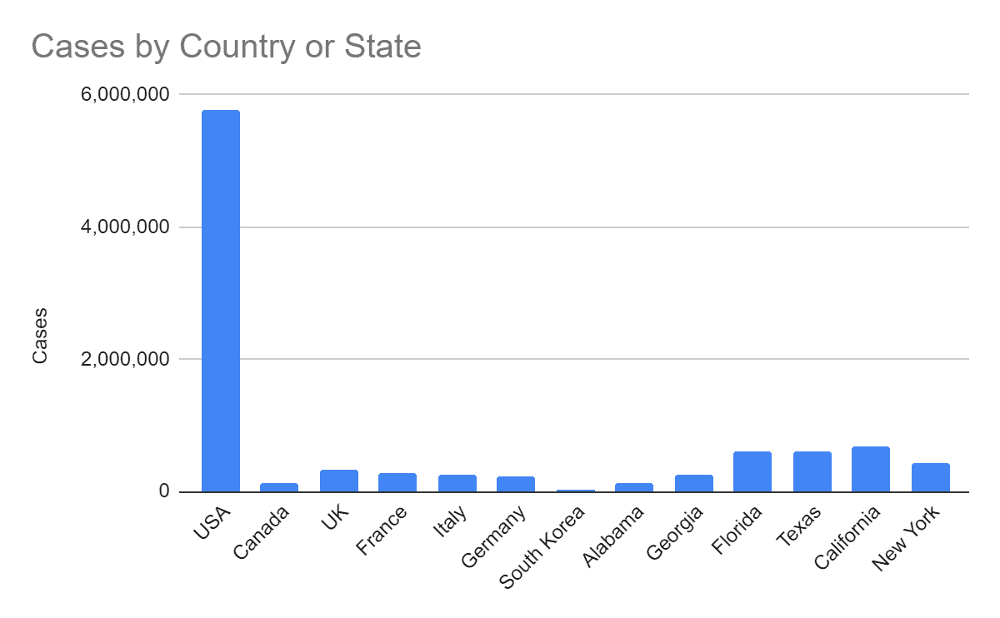
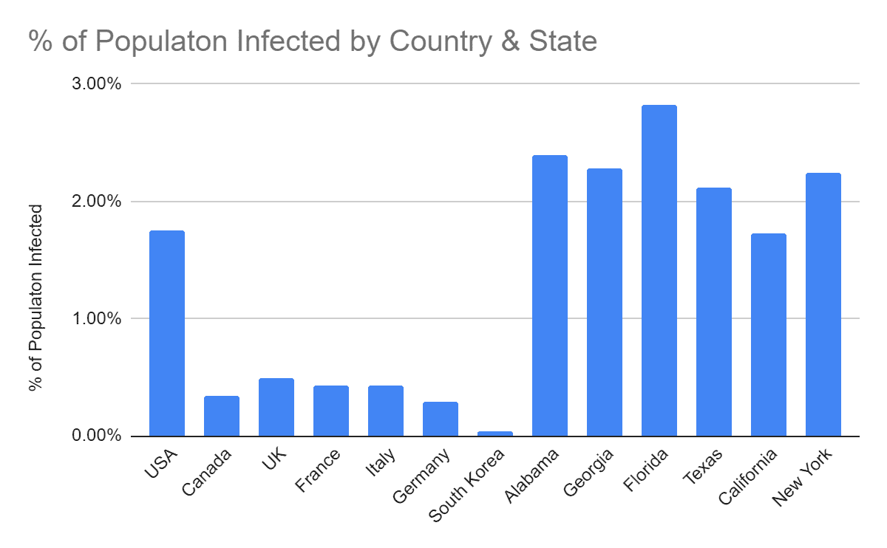
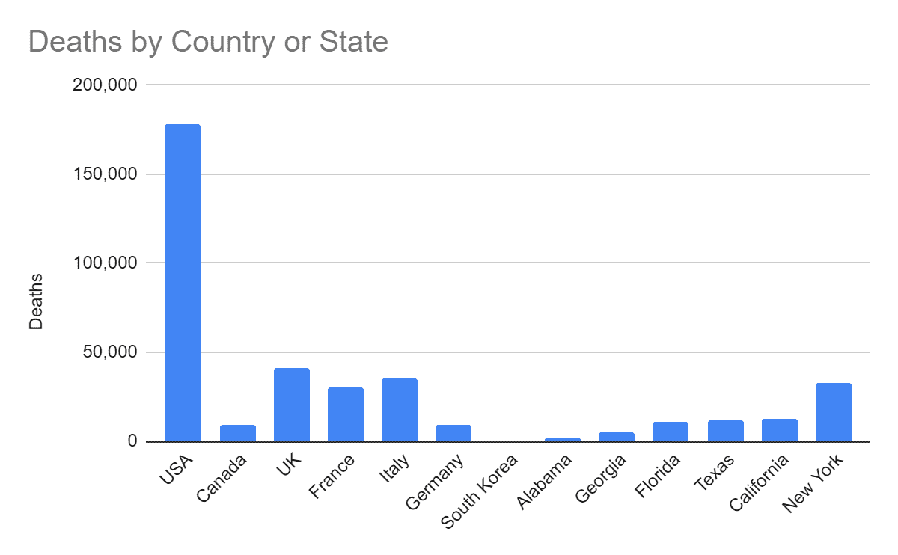
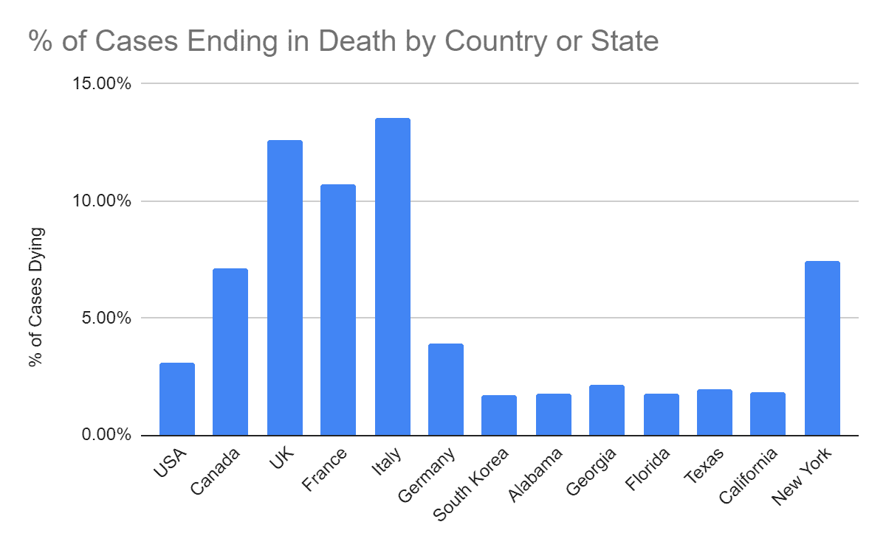
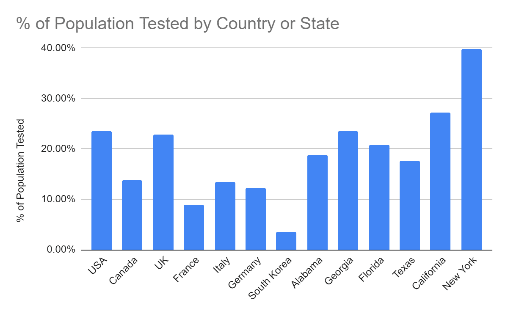
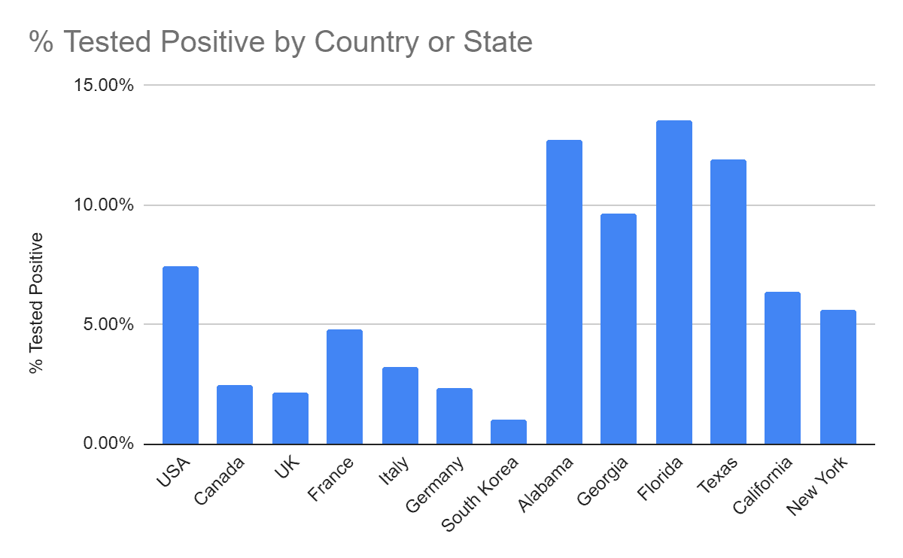
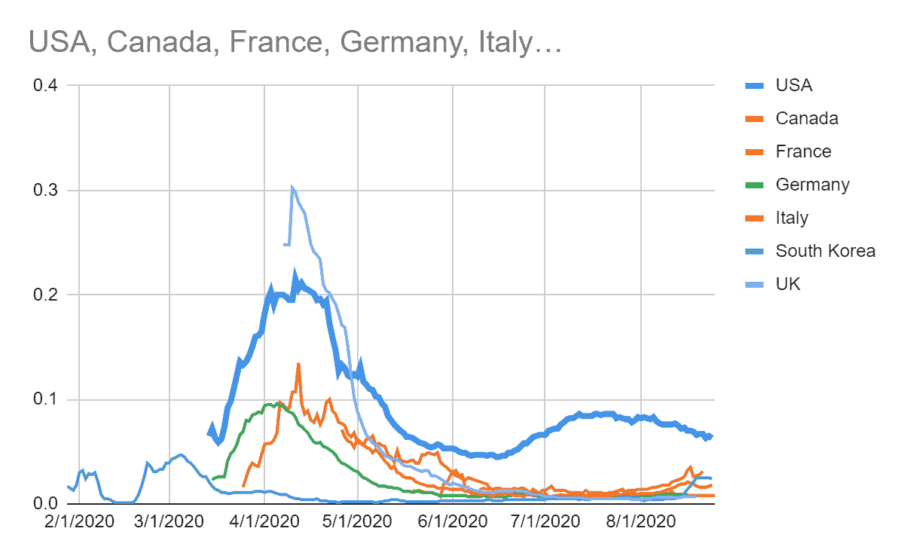

# 未来六个月，我们能从川普的经济政策和新冠肺炎政策中期待什么？

> 原文：<https://medium.datadriveninvestor.com/what-can-we-expect-from-trumps-economic-policy-and-covid-19-policy-over-the-next-six-months-95dc563414d7?source=collection_archive---------14----------------------->

经济与政治和新冠肺炎息息相关。

Photo by [Alec Favale](https://unsplash.com/@alecfavale?utm_source=medium&utm_medium=referral) on [Unsplash](https://unsplash.com?utm_source=medium&utm_medium=referral)

要回答这些问题，我们所要做的就是看看我们已经从特朗普和他的推动者那里看到了什么。来自威斯康星州的特朗普主义参议员罗恩·约翰逊(Ron Johnson)是开始这一分析的最佳人选。在这个故事中，我将使用“特朗普主义者”一词来区分特朗普和传统共和党人的主要推动者。

罗恩·约翰逊说，只有 3.4%的人口会死于冠状病毒。2020 年 3 月 18 日*华盛顿邮报*报道，共和党参议员称只有一小部分人可能死于冠状病毒。谷歌快速搜索显示，我们只有 3.282 亿美国人。所以 3.4%只是死了 1115.88 万。特朗普党在应对冠状病毒危机方面的悲惨失败，只是掩盖了约翰逊声明对人类生命的无情漠视。特朗普主义者试图过快推动经济，因为他们知道这有助于他们的选举机会。但正是他们自己在管理病毒方面的可悲无能摧毁了经济。那么我们现在应该期待他们做什么呢？

# 判断接下来会发生什么的最好方法是，首先看看自疫情开始以来人们说了什么，做了什么

认为特朗普主义者会改变他们的方式是愚蠢的。他们的连任比你的生命或修复我们的经济更重要。他们认为，如果他们能在选举前提振经济，将有助于他们的连任机会，人们将会忘记新冠肺炎。这样的刺激只会让经济在接下来的几个月里变得更糟。

民主党于 2020 年 5 月 15 日通过了英雄法案。特朗普派共和党人直到 7 月中旬才开始实施新的刺激计划。我要指出的是，另一项刺激计划是必要的，因为特朗普共和党人浪费了旧的刺激计划，而只有在我们控制住新冠肺炎的时候，才需要旧的刺激计划。特朗普政府未能采取任何行动来控制新冠肺炎的传播，而第一个刺激措施正在实施，这导致了第二个刺激措施的必要性。

 [## 卡玛拉·哈里斯的经济政策到底有多有限？数据驱动的投资者

### 大多数人多少知道唐纳德·特朗普的企业减税、反全球主义贸易政策和保护主义…

www.datadriveninvestor.com](https://www.datadriveninvestor.com/2020/08/28/just-how-limited-are-kamala-harriss-economic-policies/) 

特朗普战略的主要目标似乎是降低失业率。因此，他们不想对失业补偿做任何事情。他们不想要新的直接刺激检查，因为他们认为“不工作”的钱会让人们不回去工作。这是同一个古老的共和党理论，人们天生懒惰。因此，他们会试图迫使你在疫情中期重新工作，以便在选举前让经济数据变得更好。他们希望孩子们能回到学校，这样父母们就能在疫情期间回去工作了。然而，有数据显示，孩子是新冠肺炎病毒的携带者。请看[儿童可能携带高水平冠状病毒，研究发现](https://www.nytimes.com/2020/07/30/health/coronavirus-children.html)来自*纽约时报，*和[较大的儿童传播冠状病毒与成人一样多，大型研究发现](https://www.nytimes.com/2020/07/18/health/coronavirus-children-schools.html)来自*纽约时报*。专家们对新冠肺炎对儿童的长期影响提出了质疑。

但特朗普主义者不在乎。他们只是想在选举前提高经济数字，他们认为他们可以让人们相信死亡是必然的。他们会说强迫孩子去学校和父母去不安全的工作环境是必要的。特朗普威胁要扣留那些不会重新开放面对面学习的学校的联邦教育资金。见[特朗普威胁说如果学校不完全重新开放](https://www.nytimes.com/2020/07/08/us/politics/trump-schools-reopening.html)来自*纽约时报*。我要再次指出，如果川普政府像其他国家一样有效地管理新冠肺炎，我们就不需要政府关门和第二次刺激。

## 美国对新冠肺炎的反应花费了多少？

与我们的同行国家相比，我们在新冠肺炎对策上花了多少钱？我们的数万亿支出换来了什么？在整个故事中，我将把某些经济规模与我们相当的民主国家称为“对等国家”。本文的大部分分析将美国的成本和结果与加拿大、法国、德国、意大利、韩国和英国进行了比较。除了韩国，这些其他国家是组成七国集团的其他国家。我漏掉的 G7 国家是日本。日本的成绩比名单上的欧洲国家要好，但是韩国的成绩是世界上最好的。将美国的成绩与世界上最好的成绩进行比较是很重要的。

下面的图表清楚地显示了我们与其他国家相比的成本。我不看名义货币量，而是看国内生产总值的下降和失业率的上升，以确定我们国家与其他国家相比花费了多少。所有图表都提供了到数据源的链接。如果你想查看另一个国家，比如日本，你也可以使用这些链接来查看日本。

下图 1 显示了每个国家因新冠肺炎应对措施而导致的国内生产总值下降。

**图表-1**

An interactive version of Chart-1 can be found [here](https://docs.google.com/spreadsheets/d/1FLGcVtf7Fv96dGQj1_DX-Jaa4mIeP084_rfDgIuCfhA/edit?usp=sharing).

图表 1 的数据来自经济合作与发展组织(OECD)，可以在[这里](https://data.oecd.org/gdp/quarterly-gdp.htm)找到。

下面的图表 2 显示了 2020 年第二季度各国的失业率。

**图表-2**

An interactive version of Chart-2 can be found [here](https://docs.google.com/spreadsheets/d/1FLGcVtf7Fv96dGQj1_DX-Jaa4mIeP084_rfDgIuCfhA/edit?usp=sharing).

图表 2 的数据来自经合组织，可以在这里找到。

根据图表 1 和图表 2，美国在 GDP 方面损失比其他国家少，而在就业方面损失比其他国家多。显而易见的结论是，与其他国家相比，美国工人是最大的输家，而美国公司损失较少。

# 与其他国家相比，美国从其经济痛苦中获得了什么？

图表 3 和表 1 给出了美国新冠肺炎应对政策的投资回报。

**图表-3**

An interactive version of Chart-3 is available at [here](https://docs.google.com/spreadsheets/d/1FLGcVtf7Fv96dGQj1_DX-Jaa4mIeP084_rfDgIuCfhA/edit?usp=sharing).

图表 3 中的国家数据来自 OurWorldInData.org。各州的数据来自《T2 时报》。图表 3 的国家数据的互动版本可以在[这里](https://ourworldindata.org/covid-cases?country=USA~CAN~FRA~DEU~KOR~ITA~GBR)找到。

看看美国和其他国家相比花了多少钱。甚至在 2020 年 8 月 25 日，我们一些较小的州的新增病例也比我们的其他州多。只有法国在 2020 年 8 月 25 日新增了 1955 例病例，超过了阿拉巴马州的 1650 例。我不必告诉你阿拉巴马的人口比法国少得多。

**表-1**

表 1 显示，图 3 中的所有国家在八天内都出现了首例新冠肺炎确诊病例。数据来源是[OurWorldInData.org](https://ourworldindata.org/covid-cases?country=USA~CAN~FRA~DEU~KOR~ITA~GBR)。除了美国，所有这些国家在 2020 年 5 月 4 日都达到了每日病例的最高点。除了英国和加拿大，其他国家在 4 月 1 日达到最高点。

英国首相鲍里斯·约翰逊对这种病毒视而不见。看[鲍里斯·约翰逊应该吃他自己的药](https://www.nytimes.com/2020/03/27/opinion/boris-johnson-coronavirus.html)来自*纽约时报*。然后在 2020 年 3 月 27 日，约翰逊的新冠肺炎检测呈阳性。4 月，约翰逊住进医院，一度濒临死亡。他康复了，英国开始认真对待这种病毒。请看首相的新冠肺炎时间表:从“轻微症状”到与死神擦肩而过。在他自己与死亡擦肩而过之前，约翰逊正在遵循特朗普式的病毒应对措施。

为什么加拿大花了这么长时间才控制住病毒？我最大的猜测是，加拿大的问题源于它靠近美国。美国和加拿大之间的旅行限制于 2020 年 3 月 21 日生效。然而，美国人试图非法进入加拿大的问题时有发生。我想知道加拿大人是否在考虑建一堵墙。见[加拿大对美国游客:请不要从*偷偷越过边境*](https://www.nytimes.com/2020/08/07/travel/Canada-border-crossings-coronavirus.html)

为什么与其他国家相比，美国对新冠肺炎的反应有这样的问题？答案很简单。我们的领导层完全不称职。如果我们的总统像英国首相约翰逊那样与死神擦肩而过，也许他会对新冠肺炎采取严肃的态度。我再说一遍，甚至我们一些较小的州每天的新冠肺炎病例也比我们的其他国家多。更糟糕的是，我们的伙伴国家最近出现了新的日常病毒。即使情况好转，他们每天看到的病例也比我们一些较小的州要少。

如果不注意到美国正在经历每日新增病例的下滑，那将是不公平的。这种下滑与联邦政府的行为无关。人们已经看够了死亡，他们终于害怕了。他们最终试图保护自己，而不是相信特朗普的愚蠢。

我们的总统为可怕的新冠肺炎反应找了许多借口。如果新冠肺炎不是对我们的生活和经济构成如此严重的威胁，这些借口是如此的荒谬可笑。我会系统地拆穿特朗普所有的借口。我会给你看真实的数据。在展示了我们到目前为止所做的工作之后，我将进入我对未来几个月的预期。我的预测是基于观察到的历史模式。我将把我分离出来的变量应用到即将到来的事件中，比如选举和流感季节。

## 仔细看看美国新冠肺炎反应的结果

共和党全国代表大会似乎在吹捧川普对新冠肺炎的英勇回应。他们表现得好像病毒从我们身边经过却没有受到什么伤害。与其他政府相比，特朗普政府表现如何？关于美国和美国一些州的病例与我们其他国家的疫情范围的比较，见下面的图表 4。

**图表-4**

An interactive version of Chart-4 is available [here](https://docs.google.com/spreadsheets/d/1FLGcVtf7Fv96dGQj1_DX-Jaa4mIeP084_rfDgIuCfhA/edit?usp=sharing).

图表 4 的数据来自约翰·霍普金斯冠状病毒资源中心的国家数据和来自 T2 的纽约时报的州数据。数据采集于 2020 年 8 月 25 日。

图表 4 显示阿拉巴马州的病例数与加拿大相当，而病例数是韩国的许多倍。图表的其余部分显而易见，无需进一步分析。感染占国家或州总人口的百分比是多少？参见下面的图表 5:

**图表-5**

An interactive version of Chart-5 is available [here](https://docs.google.com/spreadsheets/d/1FLGcVtf7Fv96dGQj1_DX-Jaa4mIeP084_rfDgIuCfhA/edit?usp=sharing).

每个州的人口数据来自[谷歌公共数据](https://www.google.com/publicdata/directory?hl=en&dl=en)。病例数来自与图 4 相同的来源。

根据图表 5，感染水平看起来比图表 4 还要糟糕。显然，美国的病例数更多并不是因为我们人口多。

就新冠肺炎死亡人数而言，美国做得怎么样？参见下面的图表 6:

**图表-6**

An interactive version of Chart-6 is available [here](https://docs.google.com/spreadsheets/d/1FLGcVtf7Fv96dGQj1_DX-Jaa4mIeP084_rfDgIuCfhA/edit?usp=sharing).

图表 6 的数据来自约翰霍普金斯冠状病毒资源中心的国家数据和纽约时报的州数据。

图表 6 显然对美国不利。然而，它确实需要额外的分析。请注意“阳光地带”各州的死亡率比纽约低得多。一个合乎逻辑的假设是，纽约是“新型冠状病毒”的早期中心我们的医护人员从纽约和其他国家发生的事情中吸取了教训。因此，我们的医护人员从过去的错误中吸取了教训，并能够提高他们的护理水平。这就是科学。有了科学，人们可以从错误中学习，提高应对能力。不幸的是，与前线的医疗专业人员不同，特朗普政府没有从错误中吸取教训。底线是医疗专业人员越来越好，但医疗政策制定者越来越差。谈到新冠肺炎病毒感染者的死亡率，美国做得怎么样？参见下面的图表 7:

**图表-7**

An interactive version of Chart-6 can be found [here](https://docs.google.com/spreadsheets/d/1FLGcVtf7Fv96dGQj1_DX-Jaa4mIeP084_rfDgIuCfhA/edit?usp=sharing).

图表 6 的数据来自约翰霍普金斯冠状病毒资源中心的国家数据和 T2 纽约时报的州数据。

图表 6 显示了死亡人数占病毒感染者的百分比。图表 6 看起来不错，除非你考虑到美国总人口中受感染的比例要高得多。回到表 1，你会看到，在美国开始看到持续下降之前的三到四个月，我们所有的对等国家都降低了感染率。美国的感染率仍然远远低于其他国家。这一观点得到了来自纽约的数据的支持，纽约是美国最早的主要震中。随着我们的医疗保健专业人员对这种病毒了解得越来越多，他们对抗这种病毒的能力也越来越强。

## 特朗普说我们测试更多，导致我们的数字更高，他说的对吗？

川普说，美国有这么多新冠肺炎病例，因为我们检测的病例比任何人都多。我甚至不会去探究这个断言有多愚蠢可笑，但我会验证它。参见下面的图表 8:

**图表-8**

An interactive version of Chart-8 is available [here](https://docs.google.com/spreadsheets/d/1FLGcVtf7Fv96dGQj1_DX-Jaa4mIeP084_rfDgIuCfhA/edit?usp=sharing).

图表-8 的数据来自于 [WorldOmeter](https://www.worldometers.info/coronavirus/#countries) 。

乍一看，图表 8 似乎支持特朗普的说法。美国正在测试更高比例的人口。请注意，此图表是基于每个测试只给一个人一次的假设。我们知道这不是真的，因为有些人被测试了多次。然而，这是看待这个问题的最保守的方法，因为我们没有所有国家和各州进行测试的实际人数的一致数据，只有进行测试的人数。所以，我提供的数据是最不支持我的观点的。

下一个要问的问题是，为什么我们检测的人口比例比其他国家高？下面的图表 9 回答了这个问题。

**图表-9**

An interactive version of Chart-9 is at this [link](https://docs.google.com/spreadsheets/d/1FLGcVtf7Fv96dGQj1_DX-Jaa4mIeP084_rfDgIuCfhA/edit?usp=sharing).

图表-9 的数据来自 [WorldOmeter](https://www.worldometers.info/coronavirus/#countries) 。

在美国，阳性检测率高得离谱。这在南方腹地的各州尤其如此。当你有更多的病人时，你会做更多的测试。与特朗普断言的相反，测试不会增加数字。数字已经在那里了。测试显示问题存在于何处。测试帮助我们了解我们对抗病毒的能力。测试让我们知道我们是否需要改变我们的公共卫生政策。在考虑政策问题之前，让我们看看为什么美国比其他国家测试得多的另一个方面。参见下面的图表 10:

**图表-10**

An interactive version of Chart-10 is available at this [link](https://docs.google.com/spreadsheets/d/1FLGcVtf7Fv96dGQj1_DX-Jaa4mIeP084_rfDgIuCfhA/edit?usp=sharing).

图表 10 数据来自 OurWorldInData.org。美国是深蓝色的粗线。

图 10 显示了不同国家不同日期的阳性率。其他国家的阳性率比美国下降得早得多。当你没有得到很多积极的结果，这意味着你不需要测试很多人。这是美国有如此多考试的另一个原因。在继续之前，我要指出的是，最近其他国家的乐观情绪略有上升。我的最佳猜测是为什么会发生这种情况，因为这些其他国家通常在八月休假。当人们去度假并放松警惕时。他们想玩得开心。2020 年新冠肺炎扩散的增加就是这种行为的结果。请参见下表 2，了解 2020 年 8 月 1 日我们的阳性率与其他国家相比的情况。

**表-2**

表 2 的数据来自 OurWorldInData.org 的。

最右边的一栏显示了美国的新冠肺炎阳性检测率比其他国家高多少。我们的阳性率比加拿大高十倍以上。我们比英国和韩国高出 20 多倍。关键是，美国人均测试更多，因为我们人均患病人数更多。

## 基于这一数据，特朗普政府会对测试做些什么？他们想增加测试吗？号码

特朗普政府想对测试做些什么？特朗普希望减少测试。见[川普政府旨在阻止来自*纽约时报*的用于冠状病毒检测和追踪](https://www.nytimes.com/2020/07/18/world/coronavirus-news.html)的新资金。在 YouTube 上看这个来自美国消费者新闻与商业频道的[短视频](https://www.youtube.com/watch?v=J56q43rb558)，在这个视频中，这位白痴总司令发表了他总统任期内最愚蠢的声明。是的，他的许多其他声明都有很多竞争，但我不得不提名这个为“最愚蠢”奖。人们正在死去，因为我们有一个白痴负责。当你考虑了上面表格和图表中的数据，然后看了这个视频，你就有确凿的证据证明川普是个白痴。感谢上帝，我们的医疗专业人员，因为总统没有做任何帮助。他浪费了数万亿美元的救济资金，因为他没有解决问题，而其他国家却解决了。现在，他不想承认自己的错误，也不想为美国人民因他的失败而遭受的苦难提供救济。

数万名美国人丧生可以直接归咎于特朗普的愚蠢。我不会计算可归因于特朗普无能的死亡人数。我确实相信，通过比较美国人均死亡人数和我们其他国家的人均死亡人数，可以以很高的统计可信度估算出特朗普造成的准确死亡人数。南朝鲜代表了如果我们有世界上最好的新冠肺炎应对措施，美国的死亡人数会有多少。其他七国集团代表了如果我们的表现和其他发达经济体一样好，我们应该达到的水平。任何不及欧洲的表现都可以归功于一个人:特朗普。特朗普不应对美国所有的 18 万人死亡负责。他对这 180，000 人的死亡负有很大一部分责任。特朗普应该感谢美国的每一位医护人员。那些医疗工作者从在美国之前是热点的其他国家的经验中学习。特朗普政府什么也没学到，什么也没做。

# 为什么美国的反应如此糟糕，我们应该期待它会很快好转吗？号码

显然，美国对疫情冠状病毒的反应是迄今为止世界上最糟糕的。是的，一些国家的表现和美国一样糟糕。然而，这些国家不是发达国家。大多数是贫穷的第三世界国家。俄罗斯和巴西与美国竞争全球最糟糕的应对措施。这两个国家都没有美国的财富和发展水平。俄罗斯和巴西与美国的主要共同点是极端右翼领导层不重视人类生命。

虽然韩国、意大利、法国和德国等与美国处于类似的财富/发展水平的国家迅速应对病毒并将其控制住，但美国却无所作为。特朗普表示，天气转暖时，它就会消失。特朗普表示，他在执政初期解散了美国的疫情应急小组，因为他不想让人们无所事事。见 [Trump 努力解释为什么他解散了来自 *MSNBC* 的全球健康团队](https://www.msnbc.com/rachel-maddow-show/trump-struggles-explain-why-he-disbanded-his-global-health-team-n1153221)。对于那些需要比 MSNBC 更“可靠”的消息来源的人，你可以从[白宫的网站](https://www.whitehouse.gov/briefings-statements/remarks-president-trump-vice-president-pence-members-coronavirus-task-force-press-conference/)上获得同样的信息。按照特朗普的逻辑，我们为什么不解散军队？

川普早些时候在疫情发表的这些愚蠢声明已经够糟糕了。更糟糕的是，他的反戴口罩声明和推广庸医治疗。他的追随者实际上相信他的愚蠢。听从特朗普的建议导致病毒进一步传播。记得他在塔尔萨的集会吗？见[在 Trump 的塔尔萨集会三周后，俄克拉荷马州报道了创纪录的新冠肺炎数字](https://time.com/5865890/oklahoma-covid-19-trump-tulsa-rally/)来自*时代杂志*。我打赌赫尔曼·凯恩幸存的家人还记得塔尔萨集会。请看赫尔曼·凯恩，他参加了川普的塔尔萨集会，与新冠肺炎一起住院，来自*华盛顿邮报，*和[前共和党总统候选人赫尔曼·凯恩在与*今日美国*的新冠肺炎](https://www.usatoday.com/story/news/politics/2020/07/30/herman-cain-dies-after-battle-covid-19/5544484002/)战斗后死亡。

我可以不停地谈论特朗普迄今为止的回应，但我不会。迄今为止的回应是桥下的水。我担心的是未来的反应。预计疫苗会在选举前不久被抢购一空。该不该打这样的疫苗？大概不会。美国以前也经历过这种情况。杰拉尔德·福特于 1976 年将猪流感疫苗推向市场。有副作用。它被从市场上撤下。见[上一次政府寻求“曲速”疫苗，这是一个惨败](https://www.washingtonpost.com/history/2020/05/01/vaccine-swine-flu-coronavirus/)来自*华盛顿邮报*。让我告诉你，在我信任川普之前，我会信任杰拉尔德·福特。特朗普喜欢在选举前做出荒谬的承诺——甚至比其他时候都更喜欢。

事实是，即使有疫苗，你也可能没有机会接种。在这个国家真正需要检测的地区，很难进行检测。高阳性率表明了这一点。进入疫情已经六个月了，我们仍然严重缺乏个人防护设备和清洁用品。基于这些短缺，如果现在的政府生产了足够的疫苗给整个国家，我不会感到惊讶，但是忘记了注射疫苗需要注射器。

我们还没有达到每天一百万次测试。即使每天接种 100 万次疫苗，也需要将近一年的时间来为整个国家接种疫苗。我怀疑任何疫苗都需要每年至少注射两次才会有效。我这样说是基于第二次被新冠肺炎病毒感染的人数不断上升。参见[你会得两次冠状病毒吗？](https://www.thecut.com/2020/08/what-we-know-about-covid-19-reinfection.html)来自*纽约杂志*。对于一种存在时间如此之短的病毒来说，第二次被病毒感染似乎是极不寻常的。

## 接下来的六个月我们应该期待什么？

我们有一位总统，他说我们需要放慢检测速度，因为检测会增加新冠肺炎病例的数量。他想压低这些数字，因为这让他看起来很糟糕。参见*华盛顿邮报*川普关于可能被“高估”的冠状病毒测试的持续奇怪评论。基于我们对特朗普的了解，我们可以假设他会按照自己的最佳利益行事。他坚信詹姆斯·卡维尔的格言，“愚蠢的是经济。”他想提高他的经济数据，并认为这样做会从他那里赢得选举。他希望美国会忘记所有的死者，不要把我们的情况和其他国家相比。

如果特朗普竞选失败，我们能期待什么？我们来看看川普的一贯模式。他是一个非常小气的人。他很有可能会对美国人民进行报复，做他最喜欢的事情:什么都不做。当美国人以前所未有的速度死亡时，他会打高尔夫球，继续同样的“拉小提琴”的行为。如果你认为这不是他的策略，考虑一下他冷酷的声明，“测试只会伤害他的数据。”你认为他这种糟糕的行为会损害他在选民中的声望吗？不。那些人把他当神一样崇拜。到目前为止，没有什么改变他们的想法，所以认为特朗普的任何行为都会改变他们的想法是愚蠢的。

那么，特朗普选后撅嘴会对你造成怎样的伤害？11 月和 12 月可能会有第二波新冠肺炎袭击该国。特朗普又什么都不会做了。将不会有全国性的口罩规定。《T4 国防生产法案》不会有太大用处。是的，会有一些与国防生产法案相关的小行政命令。但特朗普不会走得足够远，让我们的国家走到它需要的地方。最近有人能找到来苏湿巾吗？为什么直到 7 月份，医院还在抱怨个人防护设备(PPE)短缺？请看纽约时报 7 月 8 日版*的随着 COVID 案例激增，防护装备的严重短缺再次爆发。*

*那么，会发生什么呢？病毒将会扩散，各州将会被迫再次关闭所有设施。这些停工对经济将是毁灭性的。需要数年时间才能恢复。真的就这么简单。*

*为什么我觉得会有第二波？这不是因为专家们这么说。早在四月份，我就从《T2 纽约时报》的《T3》中读到过冠状病毒如何在一家餐馆感染了一些人，但不是所有人。室内气流和通风可能是最大的病毒风险。四月以来我所看到的一切更加坚定了我的信念。当北部各州仍然寒冷时，病毒在那里传播得更快。由于天气原因，人们更多地呆在室内。当天气变得太热而不能在户外呆的时候，病毒在那里疯狂传播。在武汉餐馆研究的四个月后，[“一把烟枪”:从医院空气中提取的传染性冠状病毒](https://www.nytimes.com/2020/08/11/health/coronavirus-aerosols-indoors.html)出现在*纽约时报*。因此，新冠肺炎病毒确实通过空气传播，它可能来自感染者的呼吸——不需要打喷嚏。我会注意到在 7 月，一组科学家向世界卫生组织(世卫组织)请愿，要求承认这是一种空气传播的病毒。请看 [239 位专家的一个大主张:冠状病毒是空气传播的](https://www.nytimes.com/2020/07/04/health/239-experts-with-one-big-claim-the-coronavirus-is-airborne.html)来自*纽约时报*。迫于压力，世卫组织承认病毒可以通过空气传播。世界卫生组织称，冠状病毒可以在室内通过空气传播。*

*我个人对这个信息的回应是，从 4 月份开始我就没有不带口罩进入过公共建筑。我也没有让任何人进入我的车或家。我没坐过别人的车，也没进过别人的家。当我不得不去商店的时候，我会快速进出。我很幸运有一份在家工作——至少目前是这样。我的大部分食品杂货都是送货上门的。除了 CDC 的其他指导方针，我还遵循这些实践。*

*基于越来越多的室内空气传播证据，我对美国其他地区的展望是，当天气变得太冷而无法外出时，第二波疫情将在北部各州爆发。人们会聚集在室内，病毒就会传播。如果孩子们去上学，他们会把它带回家。对于南部各州来说，除非他们强迫孩子们去上学，否则在初秋会有所下降。不幸的是，我预计他们会强迫孩子上学，这样父母就可以工作，改善特朗普的经济数据。而且，事情还会变得更糟。只要看看大学的数据就知道了，那里的孩子们已经回到了密集的室内环境——尤其是在南方，那里仍然很热。如果你需要自从我开始写这篇文章以来这个预言成真的证据，请看阿拉巴马大学报道的来自 AL.com*的超过 500 例确诊的新冠肺炎病例。那篇文章的日期是 8 月 24 日。阿拉巴马大学于 8 月 19 日复课。孩子们通常在复课前一周左右回到校园。在这么短的时间内，这所大学新增了 539 例确诊病例。阿拉巴马大学在正常时期有将近 39，000 名学生。我认为由于病毒，今年会有更少的学生参加。即使校园里学生满员，539 例也是一个令人难以置信的高感染率。那是 1.4%的感染率。这仅仅发生在几天之内——而不是像上面图表中显示的州和国家百分比那样发生在整个疫情。**

*阿拉巴马州的公立学校系统更糟糕。他们不像大学那样经常考试。从 AL.com 的*到*看[蔻驰打破沉默做出“不合情理”的踢球决定](https://www.al.com/coronavirus/2020/08/coach-breaks-silence-on-unconscionable-decision-to-play-football.html)。那篇文章是关于阿拉巴马州一所高中的足球教练，他说孩子们不应该在这种情况下踢足球。足球是一种不可能有社交距离的运动。在全国范围内，各学区似乎有不同的学校重新开放政策。把孩子们塞进教室是一场迟早会发生的灾难。*

*流感季节对这一切有什么影响？专家称新冠肺炎加流感季节是灾难的方程式。我不是专家，常识也不能帮助我处理这种违背直觉的情况。我最大的猜测是流感季节通常会导致医院需求激增。流感和另一波冠状病毒将使我们的医院不堪重负。这意味着更高的死亡率。只有这么多的卫生保健专业人员和这么多的物资来应对激增。一个负担过重的系统会导致低于标准的护理。*

## *事情会变得更糟吗？是的。*

*特朗普会对此做些什么？无论选举是赢是输，他都不会做任何事。他会告诉州长们他们只能靠自己了。参见*纽约时报*上的。如果他落选，他会更加无能残忍。也许他会进一步破坏邮政服务，从而降低递送速度，增加运输成本。邮政服务对需要药品递送的人来说是必要的。为了避免去公共商店购物，邮政服务对于在网上订购商品的人来说是必要的。足不出户，网上订购，是必要的病毒防护措施。*

*无论是赢、输还是平，你可以打赌特朗普会阻止任何刺激措施。他将使国会中的共和党人处于不合理的地位。他会发布毫无价值的行政命令，让人们觉得只有他一个人在做事。*

*我要指出，我们不能把这一切都归咎于特朗普。佐治亚州的布莱恩·坎普(Brian Kemp)和佛罗里达州的罗恩·德桑蒂斯(Ron Desantis)等特朗普主义州长仍然无所作为。这些州的数量开始减少。我不确定这是因为这些官员在玩弄数据，还是因为人们现在感到害怕。当州长让他们失望时，害怕的人们会听负责任的市长说些什么。在过去的两周内，佛罗里达州和佐治亚州的每日冠状病毒病例分别减少了 44%和 27%。当然，疫情不应该在这些州失去控制。他们有几个月的时间来观察世界各国和美国各州，如纽约。这些南方州长什么也没做。南方右翼人士普遍认为新冠肺炎是一个“蓝州”问题。参见[警报、否认、指责:亲特朗普媒体的冠状病毒扭曲](https://www.nytimes.com/2020/04/01/us/politics/hannity-limbaugh-trump-coronavirus.html)摘自*纽约时报*。当新冠肺炎对红州的打击比对蓝州的打击更大时，他们只是找到了其他借口。我就不赘述这些借口了，因为它们带有种族主义色彩。*

*事实是，当其他国家大大减少了病毒的传播时，美国政府却浪费了击退病毒的机会。我们的支出几乎没有得到回报，因为美国重新开放的时间比预期的要早。由于加快了进程，我们浪费了数万亿美元。如果我们不得不再次关门，对经济的破坏性会更大。经济完全复苏已经需要数年时间。国会预算办公室(CBO)表示这将需要大约十年的时间。CBO 表示，新冠肺炎对美国经济的复苏将需要大约 10 年的时间。我要说的是，最近的经济亮点，比如来自彭博的一些报道，可能是沙漠中的海市蜃楼，因为病毒在很长一段时间内不会扩散到任何地方。参见[经济反弹挑战美国福利削减，并从*彭博*广泛保持](https://www.bloomberg.com/graphics/recovery-tracker/)。比尔·盖茨从事病毒和疫苗研究已经将近 20 年了。他预计美国要到 2021 年末才能控制住病毒。《经济学家》杂志的比尔盖茨说，新冠肺炎疫情将于 2021 年底结束。冠状病毒挥之不去，如果我们想拯救我们的经济，我们最好让我们的反应达到标准。这意味着掩盖命令和对我们做事方式的大量改变。我们，人民，如果我们适应了，就能拯救我们的经济。我们至少还得再等六个月才能从联邦政府得到大量帮助。*

# *结论*

*由于特朗普无所作为，我们都将遭殃。如果他输了，我们的痛苦将持续到拜登总统就职之后。我相信拜登总统会迅速采取行动解决这个问题。但是，这需要时间。公众要到二月底才会开始感觉到不同。短缺开始结束需要那么长时间。新政策开始阻止这一趋势还需要那么长时间。随着刺激资金到达有需要的人手中，我们的经济将很快开始好转。这是任何有能力的总统在没有疫苗的情况下都会做的事情。即使是乔治·w·布什也会做到这一点。*

*如果特朗普获胜，并且一种有效的疫苗在 12 月前上市，我们将在明年夏天之前开始看到对冠状病毒数量的重大影响。我这么说是基于特朗普迄今为止的表现。为了美国人民，特朗普必须下台。如果特朗普是任何一种正派的人，他会承认他已经超出自己的能力范围并辞职。即使是迈克·彭斯也会比川普做得更好。问题是，特朗普会让我们尽可能长时间地忍受他的无能。出于这个原因，我怀疑事情会变得比我们目前所看到的更糟——无论是新冠肺炎的高数据还是糟糕的经济数据。*

*基于跨国公司在海外的利润，以及救助努力不成比例地流向未能重新雇用员工的公司，股市可能会继续表现良好。对于普通美国人来说，我们正面临着一场经济萧条，一场疫情，以及一个像伊迪·阿明这样智力超群的人担任我们的总统。*

*无论选举结果如何，在我们对任何事情感到乐观之前，这种痛苦至少还要持续六个月。没有疫苗，拜登总统会比川普有疫苗更快地控制住新冠肺炎。当我们等待拜登 2021 年 1 月的就职典礼时，我们只能做一件事:祈祷最好的结果。*

## *获得专家视图— [订阅 DDI 英特尔](https://datadriveninvestor.com/ddi-intel)*