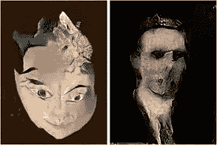
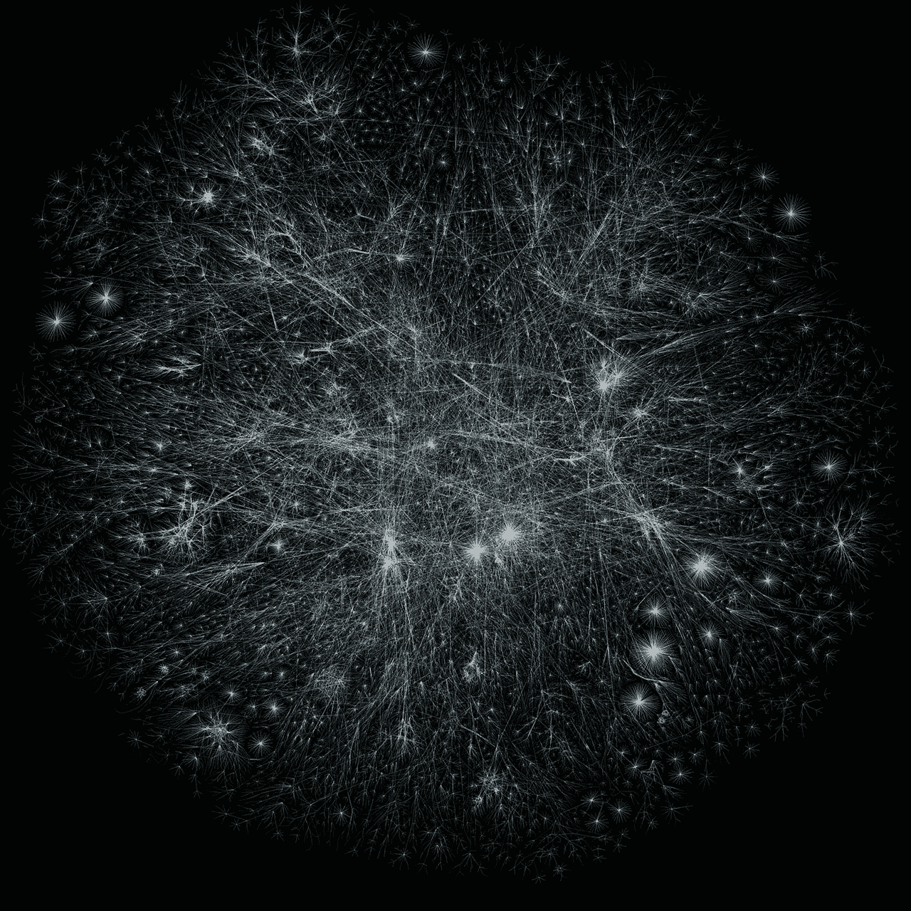

# 什么不能自动化？

> 原文：<https://medium.datadriveninvestor.com/what-cant-be-automated-fe95093ea8e3?source=collection_archive---------14----------------------->

Photo by [Franck V.](https://unsplash.com/@franckinjapan?utm_source=unsplash&utm_medium=referral&utm_content=creditCopyText) on [Unsplash](https://unsplash.com/s/photos/artificial-intelligence?utm_source=unsplash&utm_medium=referral&utm_content=creditCopyText)

画家、摄影师、记者、音乐家、学者，这些都是你可能认为机器永远不会做的工作。每天当我浏览科技文章时，很大一部分都是关于人工智能正在做什么，或者将能够做什么。我认识的编程和艺术领域的每个人都想学习如何构建人工智能，但当这些工作留给没有灵魂的机器时，会失去什么？计算机真的能有创造力吗？当他们所想的只是别人告诉他们的，当对他们来说一切都是黑与白，1 或 0 时，他们能总是知道正确的答案吗？

人工智能正在所有这些新领域出现，随着这项技术的发展，它做了一些我们以前没有真正见过的事情，它犯了错误。我记得小时候看过 IBM 的 Watson 在 Jeopardy 上的比赛，对它毫无意义的答案感到非常困惑。然而，几周之内，它就答对了所有的问题。但是沃森真的在学习吗？它是自己学习的吗？不可能，人工智能通过被人类训练来学习，给人工智能看一些图片并告诉他们是什么，这是真的这是假的，这是一只狗，这是一只猫。人工智能必须学习很多东西，才能形成对人类有意义的句子，必须向它展示数百万种假设的情况，才能实现人类大脑能够实现的心理模型。

art made by A.I.in 2019

人工智能已经融入了我们的日常生活。很大一部分人看过广告，这些广告让他们质疑科技对他们到底了解多少，有些人甚至开始认为科技可能在通过他们的电话麦克风监听他们。这个广告人工智能已经看到了和你买同样东西的人也买了什么，并且断定你确实会想买这些产品。但是它会出错，它可能会向你展示你不感兴趣的东西，或者你已经拥有的东西。我们真的不怎么想它，因为唯一的后果是我们不买这个东西。我们只是把它归因于错误的技术。但有时人工智能的笨拙真的会表现出来，这让我怀疑它是否真的能够很好地自主完成这些工作。

 [## 2019 年即将改变世界的技术|数据驱动的投资者

### 很难想象一项技术会像去年的区块链一样受到如此多的关注，但是……

www.datadriveninvestor.com](https://www.datadriveninvestor.com/2019/01/17/the-technologies-poised-to-change-the-world-in-2019/) 

当人工智能被整合到风险更高或与机器的交互更私人的情况下，它不能做的事情变得更加明显。当我们看到人工智能制作的一些艺术或广告时，我们只是看到了它'思维'的一个产品，我们并没有在它的学习过程中与之互动，这似乎很神奇。当我们直接看到人工智能并与之互动时，比如和沃森互动，或者当这个人工智能扮演记者的角色并采访比莉·艾利什时，人工智能的获奖性质就变得更加明显。

特别是在这个视频的开始，人工智能犯了很多错误，需要人工干预来纠正。对于大多数问题，Billie 会稍微增加计算机问她的问题的含义。有些问题没有意义，她不得不跳过它们。总的来说，这些问题看起来像是面试官会问的问题，或者是典型面试问题的混搭。视频非常有趣，让我想知道从这些怪异的准问题中是否有所收获。Billie Eillish 在推特上评论了这次经历，她说以这种新的方式接受采访开拓了她的思维方式。的确，人工智能想出的一些东西类似于我们自己的抽象想法或梦想。

人工智能是一个时髦的词，也是现在的热门话题，这就是为什么大部分文章都提到了它。历史上有很多发明和创新，让人们担心他们的工作会被“不会犯错”的自动化机器取代。然而，人工智能被用来做机器从未做过的事情，如为画廊创作艺术，赢得危险和采访著名艺术家的方式才是真正有趣的。这些是我们认为永远不会被机器取代的职业。那么，是什么让人工智能尝试这些他们似乎只擅长的工作，或者在人类的帮助下？我认为人工智能的部分吸引力在于让计算机做它们以前从未做过的事情。

让计算机做人类能做的事情，实际上是编程自诞生以来一直在做的事情。这一切都是从分析引擎开始的，它是一台通用计算机，能够接收程序和数据并输出解决方案。这个想法是由查尔斯·巴贝奇在 1837 年提出的。从那以后，计算机和互联网蓬勃发展，我们一直在推动技术做我们做的事情，但更快更有效。

Map of the Internet

这张互联网地图看起来很像我们大脑中的神经网络地图，虽然我们可能越来越接近建立模拟和帮助我们理解大脑如何工作的技术，但我们仍然有很长的路要走。我认为实现这一目标的一个至关重要的敲门砖是努力将技术推向以前从未涉足的领域。就目前而言，这项技术还远远不足以让它在这些领域自主发展，仍然需要人类的参与。我们已经看到了当我们让这项蓬勃发展的技术自己做决定时会发生什么，它的范围从热闹到太危险。

作为一名程序员，我总是试图重构我的代码，直到它尽可能的精简、高效和自动化。现在，人工智能不是用来干这个的。人工智能应该被试验，尽可能地放在更多的位置上，但它不应该接管人类的工作，或为我们做决定。人工智能应该犯错，毕竟我们是这样学习的。与人工智能一起学习将是我们如何实现下一次技术突破，这将帮助我们更好地了解自己。