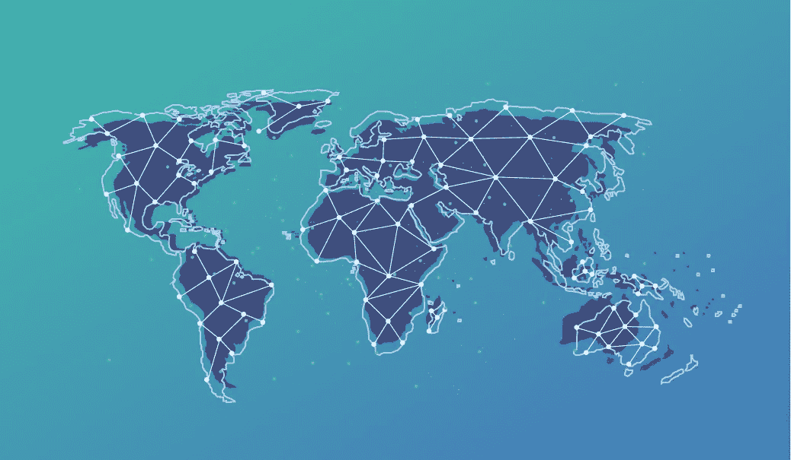

# 卡尔达诺为发展中国家做了什么，从非洲开始

> 原文：<https://medium.datadriveninvestor.com/what-cardano-is-doing-for-the-developing-world-starting-with-africa-43e94511e792?source=collection_archive---------8----------------------->

让我们从画一幅画开始。假设你是一名难民，由于战争或动乱被迫离开你的国家。许多年后，和平降临了，就像往常一样，你回到了自己的国家。只是在你回来的时候，你发现有人住在你的家里和你的土地上。你去了土地注册处，但它不存在或被篡改。现在没有证据证明你拥有这块土地，也没有任何方法可以把它拿回来。

让我们描绘另一幅画面。想象一下你，就像菲律宾或印度的许多其他人一样，离开你的家庭去一个更发达的国家工作。每周，你会把一部分收入寄回给家人。除了每一次转账，你都要从你已经很少的收入中支付很大一部分。

这是发展中国家的人们经常面临的许多问题中的两个。这正是卡尔达诺着手探索为这些国家提供电力以解决其问题所需的基本能力的原因。

卡尔达诺认为，要真正实现变革，需要建立一个基础，并向该国有动机关心并真正了解技术如何工作的人群进行投资。

Cardano 开始向雅典和巴巴多斯的成长中的开发者提供 Haskell 编程语言的课程。这些开发者被雇佣来为卡尔达诺做贡献，或者将他们的才能投资到当地经济中。下一次课程是在埃塞俄比亚进行的。

正在努力证明一些概念，展示为什么区块链技术是一种更便宜、更有效的做事方法，并且是使区块链在非洲得以使用的关键。通过自然资源、劳动力和财产的象征化，区块链技术在释放像非洲这样的国家的财富方面具有巨大的潜力。然而，这并不容易。非洲参差不齐的互联网覆盖和当地货币兑换点是一些需要跨越的障碍。IOHK 已经在探索通过蓝牙进行卫星覆盖和非连锁交易，以及安装一个可以脱离电网运行的负担得起的 ATM 终端网络。与法定货币挂钩的价值稳定货币的一系列实验和研究也正在进行中，可以为企业提供稳定和保护，免受加密货币波动的影响。

> “如果你算上这些国家锁定的流动性，那就是数万亿美元。这是一个很大的悖论，有些地方有巨大的潜在价值，如果人们可以通过某种途径获得并获得这些价值，那么贫困就会消失，这些国家就会成为最富裕的国家。”—卡尔达诺公司创始人查尔斯·霍金森

2020 年 4 月 7 日，卡尔达诺基金会成立了南非国家区块链联盟(SANBA)。这是朝着采用区块链和实现整个地区经济一体化迈出的重要一步。SANBA 得到了南非政府、国家科学与创新部以及许多其他机构的支持。未来的目标是关注非洲每个国家的区块链治理、金融科技行为、智能合同框架和教育。已经开始努力扩大区块链的治理，以保证该地区未来的增长和发展。

作为世界上第一个第三代区块链，卡尔达诺的目标是通过允许非洲国家和其他发展中国家摆脱传统的银行系统、昂贵的中间商和既定的政治结构，来改变这些国家。有了这样的开端，非洲其他地区和其他发展中国家的权力下放比以往任何时候都更加接近了。

 [## 卡尔达诺对非洲和发展中国家的目标- IOHK 博客

### 伦敦经济学院与非洲有着悠久的联系。成立于 1895 年，在…爆发前四年

iohk.io](https://iohk.io/en/blog/posts/2018/02/24/cardanos-goals-for-africa-and-the-developing-world/)  [## 桑巴催化区块链在南非的应用

### 2020 年 4 月 7 日，Bakyt Azimkanov 全球公关和传播总监 ZUG。卡尔达诺基金会欢迎…

cardanofoundation.org](https://cardanofoundation.org/en/news/sanba-to-catalyze-blockchain-use-in-south-africa/)