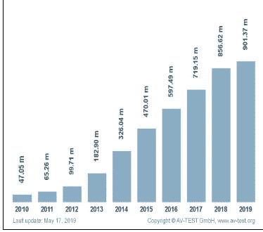
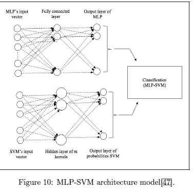

# 哪种卷积神经网络架构最适合对恶意软件图像进行分类

> 原文：<https://medium.datadriveninvestor.com/what-convolutional-neural-network-architecture-works-best-for-classifying-malware-images-5a1215542f6a?source=collection_archive---------3----------------------->

## 显然，我们现在可以通过将病毒转换成图像来检测它们

随着世界走向数字化，网络安全变得极其重要。手动编写规则来捕捉病毒速度很慢，而且永远赶不上不断变化的恶意软件。这就是为什么将恶意软件二进制文件表示为图像的想法是开创性的。该过程相对简单，通过以下过程完成:

How to catch malware

这种方法有几个好处。对图像的准确转换将允许我们在图像分类中使用各种基于深度学习的 CNN。可视化恶意软件将让我们发现模式。所有这些都可以在不运行恶意软件的情况下完成。这对于安全性来说是一大利好。[Bensaoud 等人使用卷积神经网络模型对恶意软件图像进行分类](https://arxiv.org/abs/2010.16108)对此进行了深入研究。在对恶意软件图像进行分类时，它比较了几种图像分类体系结构的性能。在本文中，我将解释所比较的不同模型，并阐述结果。像往常一样，我将谈论任何影响和延伸。在这篇文章的最后，将是这篇论文的注释版本，这样你就可以更好地理解其中的一些细微差别。

# 对基于 ML 的检测的需求

有些人可能想知道为什么基于 ML 的检测会有用。这比传统方式要贵得多。管理费用是否合理？在图表中:

这个迅速增加的数字足以证明。这个疫情加速了在线转变。随着自动化改变生活的许多领域，这一数字将继续增加。构建健壮和通用的模型不仅适用于现有的所有类型的恶意软件，还适用于未来的恶意软件(在扩展部分有更多介绍)。

# 结果和了解不同的协议

以上是对不同类型病毒分类预测结果的总结。我们发现有两个模型的准确率低于 30%。另外 4 个都 90 多岁了。盗梦空间 V3 是赢家。如果你不知道这些模型，没关系，我现在将解释它们。除非另有说明，所有建筑图片均取自图片。

## VGG 16

VGG 16 是一个非常有趣的模型。它通过应用小的 3x3 卷积滤波器来优先考虑深度而不是宽度。这使得他们可以将层数从 16 层增加到 19 层。它是由牛津大学的一个团队在论文“用于大规模图像识别的非常深的卷积网络[中首次提出的。它在 ImageNet 数据集上表现非常好，击败了更复杂的模型。然而，在这种情况下，它无法有效地对恶意软件进行分类。](https://arxiv.org/abs/1409.1556)

## 盗梦空间 V3

Inception V3 是对 GoogleNet Inception V1 的改进。这是一个令人印象深刻的模型，尽管使用的参数比 VGGNet 少 20 倍。这个模型有 42 层深，减少了误差。这结合了 5 个初始模块 As、4 个初始模块 Bs、2 个初始模块 Cs，它们与 2 个网格尺寸缩减和最终辅助分类器相结合。这使得它非常强大，尽管参数数量很少。更多信息可以通过阅读论文[重新思考计算机视觉的初始架构](https://arxiv.org/abs/1512.00567)找到。它在这次任务中的成绩不言自明。

## ResNet 50

图像识别领域的另一个重量级人物。该模型使用快捷连接，在不连续的卷积层之间提供了“*额外的连接。”*这允许模型跳过层来处理消失梯度，以实现更低的损失和更好的结果。这个网络有 152 层，(T6)比可比较的 VGG 网络深 8 倍。然而，它在这项任务中也表现不佳。在这里阅读更多:[用于图像识别的深度残差学习](https://arxiv.org/abs/1512.03385)

## CNN SVM 频道

CNN-SVM 给一个熟悉的模式增加了一个新奇的转折。"*对于分类，深度学习模型通常使用 softmax 激活函数作为顶层，用于预测和最小化交叉熵损失。Tang[42]将 softmax 层替换为线性 SVM* “将 softmax 替换为 CNN 最后一层的线性 SVM，允许使用线性 SVM 提取输入图像的特征。这对于面部表情识别非常有效。然而，与 CNN-Softmax 相比，它似乎表现不佳，这让我很好奇为什么在这里使用它。论文:[一种结合卷积神经网络(CNN)和支持向量机(SVM)进行图像分类的架构](https://arxiv.org/abs/1712.03541)。我会阅读更多关于这方面的内容，并更新我学到的任何东西。如果你知道这件事，一定要在评论里分享。

## GRU-SVM

Agarap 和 Pepito[17]修改了门控递归单元(GRU) RNN 的架构，使用 SVM 作为其最终输出层，用于二进制、非概率分类任务(见图 8)。他们在 Malimg 数据集上使用 GRU-SVM 算法，达到了 84.92%的准确率。“这就是报纸上说的全部内容。所以我深入调查了一下。GRU 是最近发展起来的长短期记忆(LSTM)单位的变体。这是一种递归神经网络。它在翻译、自然语言处理和语音识别等领域表现出色。GRU-SVM 模型实际上优于使用 softmax 作为最后一层的传统网络。我找到的关于它的论文是:[一种结合门控递归单元(GRU)和支持向量机(SVM)的神经网络架构，用于网络流量数据中的入侵检测](https://arxiv.org/abs/1709.03082)。

## MLP-SVM

另一个 SVM 的附加物。这一次我们没有用 SVM 代替多层感知器的最后一层。相反，我们平行运行了 SVM 和 MLP，并结合它们的结果得到我们的分类。这项技术本质上是两个模型的集合。做得好的话，集合可以非常强大，因为可以选择覆盖彼此弱点的模型。这表现在 MLp-SVM 的性能上，它在架构中具有第二好的性能。它甚至在对某些恶意软件家族的分类上击败了盗梦空间模型。

A more detailed look at the performance

如果你喜欢图表:

# 关闭

由于各种原因，这篇论文非常激动人心。这结合了我对 ML 的热爱，打破常规的思考，和恶意软件检测来创造一篇完美的论文。我肯定会仔细阅读索引中提到的论文，以了解更多关于实际过程的信息。

我很好奇为什么某些 CNN 架构会被选中。此外，预测应该通过将噪声包括到恶意软件图像中来扩展。在我早期的一篇文章中:[谷歌的研究人员是如何用更少的资源打败 ImageNet 的？](https://medium.com/datadriveninvestor/how-did-google-researchers-beat-imagenet-while-using-fewer-resources-267243071ee4?sk=812b1b772b2254a41a8930fada21b504)我们看到了噪声是如何让模型更健壮、更通用的，以及**训练起来要便宜得多**。通过在这里添加噪声，我们可能会创建不仅针对现有恶意软件而且针对未来恶意软件的模型。

# 向我伸出手

感谢您阅读本文。我会把我所有相关的社交媒体都放在下面。关注任意(或全部)以跨不同平台查看我的内容。我喜欢利用不同平台的优势。留下你可能有的任何反馈，因为它确实帮助像我这样的成长中的内容创作者。如果你觉得这很有用，请分享这篇文章。

我用这个[伟大的服务](https://free-url-shortener.rb.gy/)缩短了网址。他们做得很好，所以给他们一些爱。这不是赞助的，但是宣传有用的工作总是好的。

查看我在 Medium 上的其他文章。:【https://rb.gy/zn1aiu 

我的 YouTube。这是一个正在进行中的工作哈哈:【https://rb.gy/88iwdd 

在 LinkedIn 上联系我。我们来连线:[https://rb.gy/m5ok2y](https://rb.gy/m5ok2y)

我的推特:[https://twitter.com/Machine01776819](https://twitter.com/Machine01776819)

我的子任务:[https://devanshacc.substack.com/](https://devanshacc.substack.com/)

如果你想和我一起工作，请发邮件给我:devanshverma425@gmail.com

twitch 现场对话:[https://rb.gy/zlhk9y](https://rb.gy/zlhk9y)

获取我的内容更新-insta gram:[https://rb.gy/gmvuy9](https://rb.gy/gmvuy9)

获得罗宾汉的免费股票:[https://join.robinhood.com/fnud75](https://www.youtube.com/redirect?redir_token=QUFFLUhqa0xDdC1jTW9nSU91WXlCSFhEVkJ0emJvN1FaUXxBQ3Jtc0ttWkRObUdfem1DZzIyZElfcXVZNGlVNE1xSUc4aVhSVkxBVGtHMWpmei1lWWVKNzlDUXVJR24ydHBtWG1PSXNaMlBMWDQycnlIVXNMYjJZWjdXcHNZQWNnaFBnQUhCV2dNVERQajFLTTVNMV9NVnA3UQ%3D%3D&q=https%3A%2F%2Fjoin.robinhood.com%2Ffnud75&v=WAYRtSj0ces&event=video_description)

# 纸

按照承诺，下面是下面的注释文件。请务必亲自阅读，以便更好地理解这项研究。