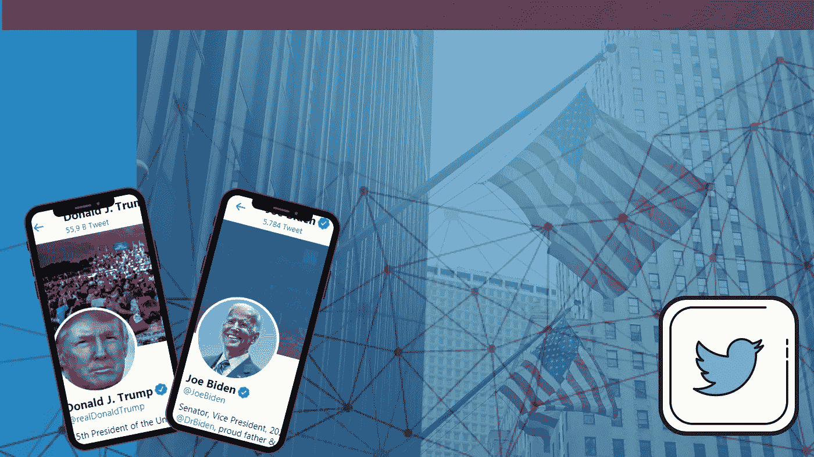
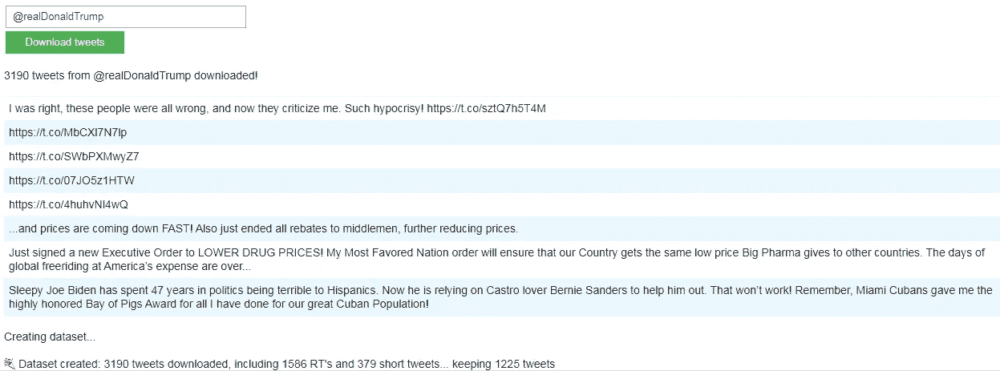
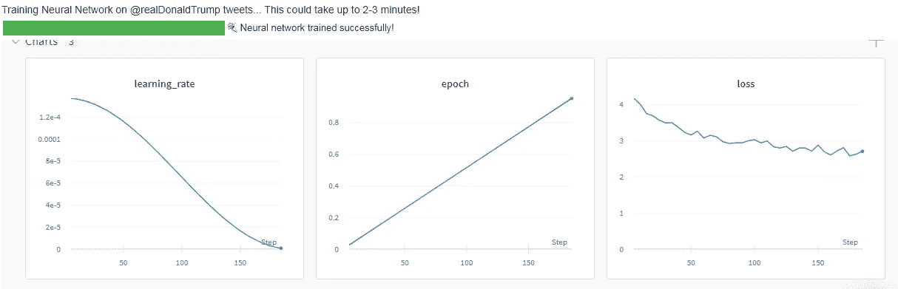
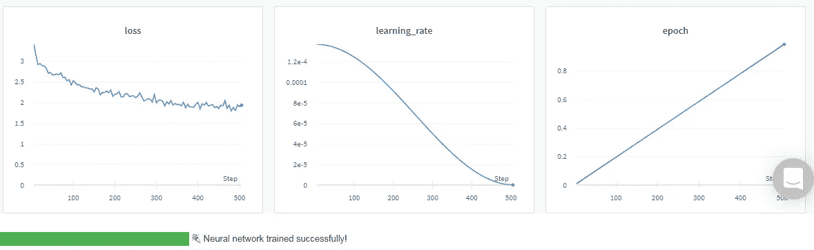
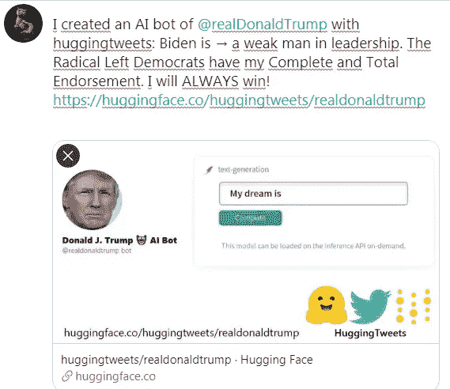
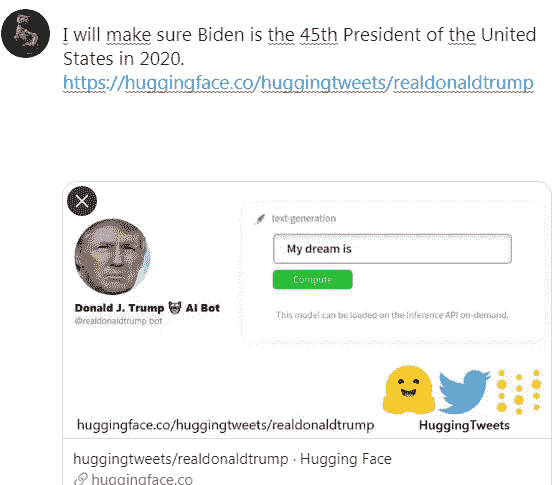
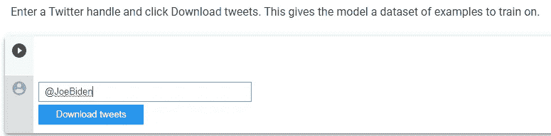
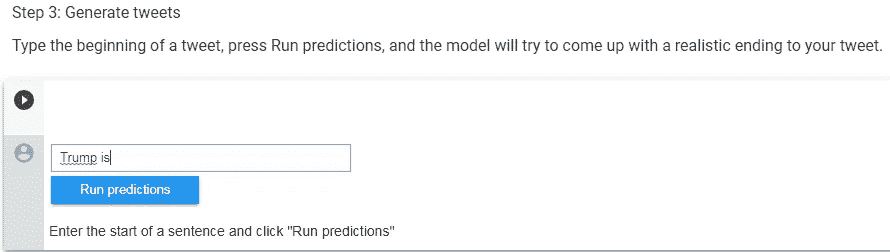
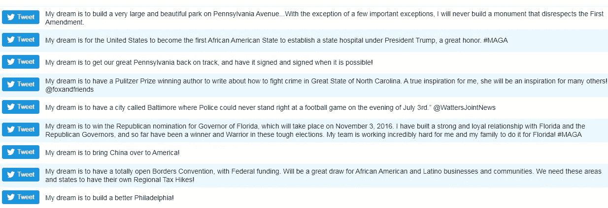
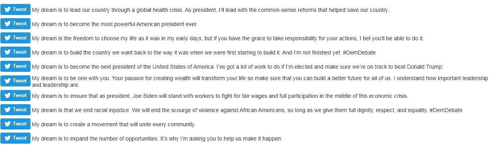

# 特朗普和拜登在他们的人工智能生成的 Twitter-Bot 账户上说了对方什么？

> 原文：<https://medium.datadriveninvestor.com/what-did-trump-and-biden-say-about-each-other-on-twitter-generated-by-their-artificial-960e76b8d52b?source=collection_archive---------12----------------------->

image created by the author

## 如果“机器人总统”参与总统竞选会发生什么？

当我们看到一些句子时，我们可以知道它属于谁。然而，如果我们真正看到的不是我们预期的那样…随着我们了解人工智能可以做什么，这是唯一令人惊讶的选择！

我们可以用一种简单的方法识别我们在 Twitter 上的关注者。然后，在几天内，我们可以实际观察语法规则，主要思想，以及它们对现有趋势的反应，即使我们不知道它们的真实身份。我们不难预测一个追随者或我们经常关注的一个账户，即使面对有时出人意料地发展的事件，也能发展出什么样的反应。

> 我这个项目的主要目标是:1-实验如何在生产中训练、部署和维护神经网络；2-让每个人都能接触到人工智能— *鲍里斯·戴玛*

Boris Dayma 用他的 AI Colab 拥抱推文演示研究讨论了人工智能如何在文本上产生魔力。今天，它通过与 twitter 上的个性化数据集合作来进行特殊预测，Twitter 已经成为一个重要的平台，在这里猜测经常被批准或拒绝。那么，让我们从更近一点来检查这个结构开始。

这项研究预载于 Colrab Google，由 3 个标题组成。这个模型真的很神奇。因为该模型在造句时会学习@ rementations、标签甚至表情符号，这些句子似乎可以抓住推特用户的思维！这是如此真实，鲍里斯不得不补充说:

> **免责声明:本项目不用于发布任何虚假生成信息，而是用于进行自然语言生成研究**

> 要开始演示，点击顶部的菜单，“运行时间”→“全部运行”

# 第一步——输入 Twitter 账号

它是从特朗普的大约 5 万条推文中收集的 3190 条最新推文的数据集。(Twitter API 只允许这么多。但是因为我们有最新的，没问题！)正如你在最后一行看到的，发布的推文被分类列出。因此， **379** 条推文可以被标记为短推文。—据总裁说，也许公众更喜欢这个！—和 **1586** RT

# 第二步——训练你的神经网络

当我们运行神经网络时，它开始从 tweet 集合中调整语言模型来生成预测。
模型从自然语言处理开源库 HuggingFace transformers 下载，通过权重和偏差记录训练。该过程将在 2-3 分钟内完成..

 [## 全民或跨州的国营保险私人医疗保险:经济学…

### 我们目前生活在一个所有非医疗行业都痴迷于…

www.datadriveninvestor.com](https://www.datadriveninvestor.com/2020/05/21/state-run-insurance-for-all-or-across-the-state-lines-private-healthcare-coverage-economics-politics-social-mix-up/) 

## 三幅图出现在我们面前:

*   **learning_rate :** 学习率对于正确的相关性很重要。
*   **损失:**不同时刻模型与真实数据之间的损失值。从图形上看，我们在第一次和第二次分别进行的测量中获得了 D. Trump 的不同损失图。
*   **历元:**对不同人的实验表明，经过 4 个历元后，我们有更多过拟合的机会。

Neural Training tweets of D.Trump

Neural Training tweets of J.Biden

# 第三步:生成推文

现在我们开始在 D.Trump 的 bot 账号上造句，其实我们的目标不应该是写出一个完整的句子。相反，我们希望我们的模型能够做到这一点。因此，让我们首先键入“Biden is”来显示关于 J.Biden 的陈述:

当我们键入 ***“拜登是”*** 并说 run predict 时，我们可以在短时间内看到总统的新推文！

我们可以通过单击其中一个按钮旁边的“共享”按钮来共享它:

Some words are much bigger, just like President Trump used. “ALWAYS”

当然，并不是所有的都是完美的。看看这个:

It seems that the presidential race will not get too hot after this statement :)

# 和结果

## 如果我们分析 Bot-Trump 的突出句子:

## 1-他对他的对手采取了羞辱和居高临下的态度。例如:

*   “拜登是个不折不扣的骗子。”
*   “拜登是一个软弱的支持者。”
*   “拜登一点头绪都没有！”
*   “拜登是最坏的罪犯，他还没有兑现承诺。”

## 2-他自信会在选举前被选中

*   “我认为，到 2020 年，我们会收到越来越多的邮件”
*   “我永远都会赢！”

> 这个样本在“总是”形式上的大写与特朗普总统的句子结构一致。

## 3- Bot-Trump 引用了与希拉里·克林顿和奥巴马有关的过去:

*   “拜登将会给奥巴马金钱和精力。他不喜欢称自己为保守派。”
*   “拜登试图找到一种方法，让媒体不要报道俄罗斯、俄罗斯和乌克兰过去的故事——而不要揭露虚假的虚假民主党民调&由不诚实的希拉里·克林顿竞选团队运作的虚假激进左翼正在摧毁美国。”

## 现在让我们用同样的方法为拜登做一个机器人分析。首先，让我们在请求的空白处输入用户名，以便从 Biden 的官方帐户中检索他的数据:

**3225** tweet 文件已被访问。你也可以将这些 tweet 数据下载到你的电脑上。拜登和特朗普的一个明显区别是，J .拜登只有 **21** 条短推文和 **112** 条转发。

如果我们在我们独特的推文中微调一个语言模型来为拜登的数据生成预测:

我们输入的句子为 ***“川普是”******【运行预测】***:

让我们根据 Bot-Biden 详细检查一下他关于特朗普的一些推文:

## 1-他对特朗普的批评往往是关于他是历史上最糟糕的总统:

*   “特朗普是我们有史以来最无能的总统。”
*   “特朗普是带领我们的国家回到民权、就业和经济繁荣新时代的最差人选。”
*   “特朗普非常不稳定。如果我们不做他的工作，他将永远从根本上改变这个国家的性格。”

## 2-它还涉及健康和流行病问题:

*   “特朗普是最不可能采取下一步措施从数百万人手中夺走医疗保险的人。”
*   “川普对新冠肺炎没有责任，但他应该为缺乏测试而受到指责。”

## 3-Bot-拜登指责特朗普破坏美国，甚至叛国:

*   “特朗普正在利用他的总统职位来破坏工会，破坏美国。我们不能让这种情况发生。”
*   “特朗普试图驱逐这么多已经在这里的人。太恶心了。彻底的背叛。他没有什么可以给我们的。”

这样的辩论可能会进一步推动总统选举进程。同样，每次我们用每位总统的名字开始造句，twitter 上的信息就会变成一种更具攻击性的语言。

# 现在让我们用“我的梦想……”做另一个分析，让两个机器人总统完成句子的其余部分。

## 评价 Bot-Trump 这句话的突出标题:

## 现在我们来看看拜登，他对自己未来的想法有什么看法？

## 关于“我的梦想是”的预言，我们可以这样说:

## 1.Bot-Biden 关注以下问题:

*   医疗改革
*   选择的自由
*   工人的收入公正
*   反对种族主义
*   增加各种机会

## 2.机器人特朗普演讲的亮点是:

*   在市中心建造一个巨大的公园
*   在宾夕法尼亚州的投资
*   建设一个新费城
*   强调减少北卡罗来纳州的暴力事件
*   强调显示总统个人抱负的努力
*   用军事力量支持卫生服务

## 3.另外:

Bot-Trump 的讲话更适合执行政府的讲话方式，因为一些投资和实践是在最近的赞扬中进行的。

但拜登采用了一种演讲风格，通过说“如果我被选中”，强调较少关于未来的历史。在他对过去的批评中，他只针对他的对手特朗普总统的性格。

# 结论

我们一起分析了一个智能系统的预测，这要感谢机器学习，其中整个数据集是通过从开源 twitter 地址发送的消息获得的。

**然而**，这种模式还不可能表现出与其他语言同样的和谐。据了解，要达到同样的效率，需要对它进行更多的其他语言的训练。随着最近出现的更复杂的 **NLP** 模型的成功，这可以更快地实现完整性。多语言支持无疑将把机器学习带入一个新时代。
**毕竟**，所有这些都是在人工智能的帮助下产生的信息。然而，它与现实的密切关系也将成为今后更好研究的有力参考。

**总的来说**，这一结果的质量(与预训练模型相比)归因于:

*   **85%** →管理数据集(需要额外的思考和手动探索)
*   **15%** →微调(简单且自动，仅使用 W & B 扫描)

在 5 分钟内，你可以将任何人的推文微调到一个预先训练好的转换器。看到结果可真是[激动人心](https://colab.research.google.com/github/borisdayma/huggingtweets/blob/master/huggingtweets-demo.ipynb)！

祝贺 [**鲍里斯**](https://medium.com/@koushkov/highlights) 的出色工作！**🙏**

> Boris Dayma_HuggingTweets —训练一个模型生成推文[https://colab . research . Google . com/github/Boris Dayma/hugging tweets/blob/master/hugging tweets-demo . ipynb # scroll to = tvhawm 78 ag 9](https://colab.research.google.com/github/borisdayma/huggingtweets/blob/master/huggingtweets-demo.ipynb#scrollTo=tvHAWMW78AG9)

**访问专家视图—** [**订阅 DDI 英特尔**](https://datadriveninvestor.com/ddi-intel)