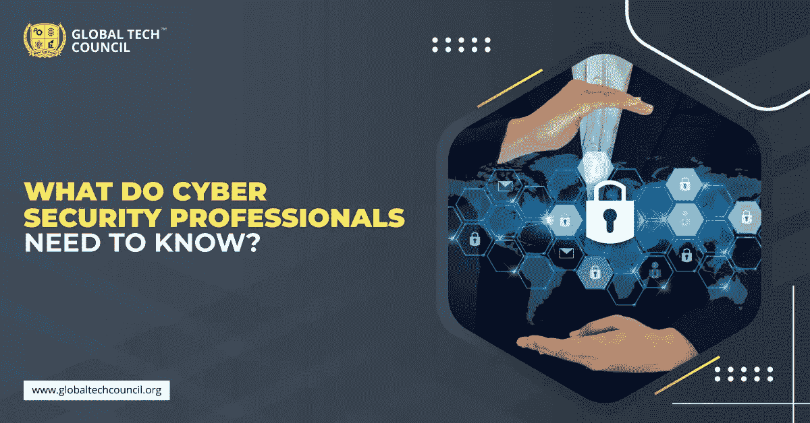

# 网络安全专家需要知道什么

> 原文：<https://medium.datadriveninvestor.com/what-do-cyber-security-professionals-need-to-know-be0d6d4a053b?source=collection_archive---------35----------------------->

网络安全是现在流行的职业选择。尽管各公司都在积极寻找网络安全专业人士，但这样的专业人士并不多。网络安全已经成为每个组织的使命。有很多公司依赖于数字平台。所有这些平台都有大量的数据，就像虚拟世界中的 astray。数据为王，拥有这个的才是一切的主宰。因此，对数据的攻击越来越多。易受攻击的网络可能会吸引网络攻击者。因此，对网络安全专家 的需求越来越大，他们可以利用这项技术来确保网络和数据的绝对安全。要成为一名网络安全专家，你需要参加网络安全培训，或者参加网络安全认证项目。

## **网络安全专家应该知道什么？**

网络安全确实是一个有利可图的职业选择，有一些领先的平台提供网络安全方面最好的在线证书课程。但是，在继续之前，你必须知道一些关于网络安全认证的事情。要成为一名网络安全专家，需要掌握一定的技能。这些是:

 [## 提高网络安全的最低成本和最有效途径|数据驱动型投资者

### 在组织在 2020 年面临的诸多挑战中，网络安全(或缺乏网络安全)已成为新闻报道的焦点…

www.datadriveninvestor.com](https://www.datadriveninvestor.com/2020/09/04/the-lowest-cost-most-effective-path-to-better-cybersecurity/) 

技术技能- 你需要掌握的第一件事就是技术技能。这是一份技术简介，作为一名网络安全专家，您需要掌握一定的技术技能，这将有助于您了解网络的漏洞，并且基于此，网络安全专家可以建议对系统进行必要的改进和更改，最终提高系统的性能。那么，这些技术技巧是什么呢？让我们提前探索一下:

**1。学习编程语言-** 你需要学习的第一件事就是编程语言。Python 是最受欢迎的选择。这是一种高度通用的编程语言，带有许多库，可以帮助你成为一名网络安全专家。你将被要求做渗透测试，为此，编码是必需的。Python 不仅简单易学，同时，它还是一种通用的编程语言，因此，你必须花时间学习它。除此之外，你还需要学习像 Java、C++、汇编语言这样的编程语言，像 PHP、Shell 这样的脚本语言。

**2。编程效率**——一旦你学会了一门编程语言，你需要在编程时变得高效。像全球技术委员会这样的在线平台提供了一个用 [**Python 编程**](https://www.globaltechcouncil.org/course/python-programming-crash-course/?utm_source=Article&utm_medium=kmpost&utm_campaign=September) 语言的在线认证项目。有了这个认证，你不仅可以学习 Python，同时还可以学习如何高效地编程。所有这些将最终帮助你成为一名网络安全专家。

**3。参加网络安全认证** -你成为网络安全专家的下一步是参加一个好的网络安全认证项目。全球技术委员会提供在线网络安全认证计划。事实上，他们的认证项目是最好的在线网络安全认证项目之一。因此，如果你想掌握这个领域，这个认证课程是必须的。

## **软技能-**

现在你已经了解了技术技能和认证计划，这将使你掌握技术方面，这是同样重要的，你磨练你的软技能。作为一名网络安全专家，你需要向客户解释网络安全的必要性以及它如何帮助企业。最好的网络安全在线证书课程将提供技术和软技能的发展。

## **你需要掌握的一些技能有:**

1.表达技巧

2.领导技能

3.小组管理

4.积极倾听技巧

5.良好的沟通技巧

有了这些技能的帮助，你将成为任何公司的潜在候选人。公司现在正在寻找网络安全专业人士，他们不仅是技术极客，同时也能够很好地展示自己。一个好的认证计划将帮助你做到这一点。

## **结论**

到目前为止，您已经了解了成为一名网络安全专家需要做些什么。你的下一步应该是参加一个网络安全项目，你可以选择的最佳平台是全球技术委员会。它是一个著名的门户网站，提供最好的 [**网络安全认证项目**](https://www.globaltechcouncil.org/cybersecurity-certifications/?utm_source=Article&utm_medium=kmpost&utm_campaign=September) 。成功完成该计划后，您将有资格申请该行业中的一些领先公司。

网络安全将在未来不断发展，想要成为这一领域专家的人不应该再犹豫，现在就加入全球技术委员会的网络安全认证计划。

## 获得专家观点— [订阅 DDI 英特尔](https://datadriveninvestor.com/ddi-intel)