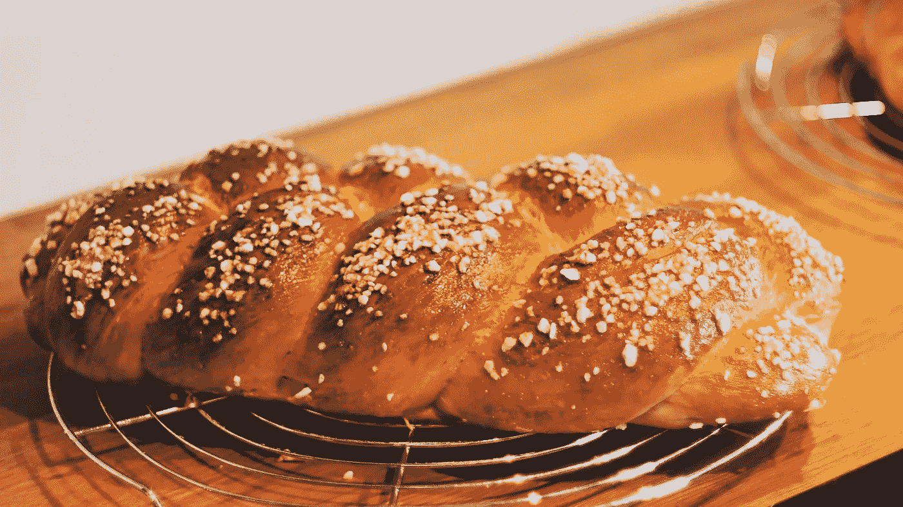

# 我奶奶编的面包和分解有什么共同点？

> 原文：<https://medium.datadriveninvestor.com/what-do-my-grandmas-braided-bread-and-decomposition-have-in-common-6d34b88506ec?source=collection_archive---------15----------------------->

## *计算思维*:分解

Photo by [Jens Mahnke](https://www.pexels.com/@atomlaborblog?utm_content=attributionCopyText&utm_medium=referral&utm_source=pexels) from [Pexels](https://www.pexels.com/photo/close-up-photography-of-bread-1002322/?utm_content=attributionCopyText&utm_medium=referral&utm_source=pexels)

我最美好的童年记忆始于我在小学一天结束时打开前门。我会被黄油面包的温暖舒适的味道所包围。我立刻知道我们的祖父母又来了一次意外的拜访。

在我 10 岁生日的时候，我问妈妈她是否能做出美味的面包。她打电话给我奶奶要食谱。“哦，天哪，我不知道怎么做面包。我从来没有食谱。”我妈妈不想让我失望，让我奶奶用分解法解决了“编织面包的配方问题”。

> 精确、明确、循序渐进的说明

什么是分解？简而言之，分解就是将一个问题或任务分解成精确的、明确的、逐步的指令的能力。

现在，举个无聊的例子。三个孩子正在用两个骰子玩游戏。第一个孩子掷骰子，然后所有的孩子尽可能快的说出一个数字。通常，第一个说出数字的孩子会赢，但并不总是这样。每个玩耍的孩子都模仿第一个孩子的动作。看了一会儿游戏后，你开始推断游戏的步骤:

第一步:一个孩子掷出两个骰子
第二步:所有的孩子尽可能快地将两个掷出的数字相乘
第三步:第一个说出正确答案的人赢得那一轮
第四步:所有的孩子轮流

这种搞清楚步骤的行为就是分解。

> 算法和分解之间的联系

上周关于[算法](https://medium.com/datadriveninvestor/what-do-algorithms-and-your-favourite-barista-have-in-common-3307608dc64d)的文章的读者，可能已经确定了算法和分解之间的联系。分解有助于您推断解决问题、完成任务或确定算法所需的步骤。下一次你点平常的饮料时，观察你的咖啡师，试着学习你的饮料是如何制作的。使用你的分解技巧，找出你可以在家模仿的明确的、一步一步的指示。

「辫面包食谱问题」是如何解决的？我妈妈让我奶奶烤面包，并仔细记下每一步。试了几次之后，我祖母终于能够给我母亲邮寄精确的一步一步的食谱说明。生日面包近乎完美，但又不完全一样。我的祖母总是在她为我们做的每样东西里加入一些特别的东西——你可能会猜到那是什么——而那种成分是不可能分解的。

 [## 算法和你最喜欢的咖啡师有什么共同点？

### 计算思维:算法

medium.com](https://medium.com/datadriveninvestor/what-do-algorithms-and-your-favourite-barista-have-in-common-3307608dc64d)  [## 篝火故事和抽象思维有什么共同点？

### 计算思维:抽象思维

medium.com](https://medium.com/@neysakoizumi/what-do-campfire-stories-and-abstract-thinking-have-in-common-46516c7685e9)