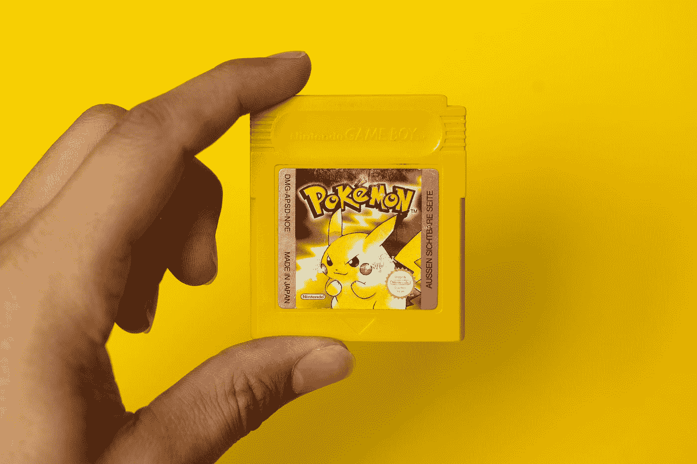
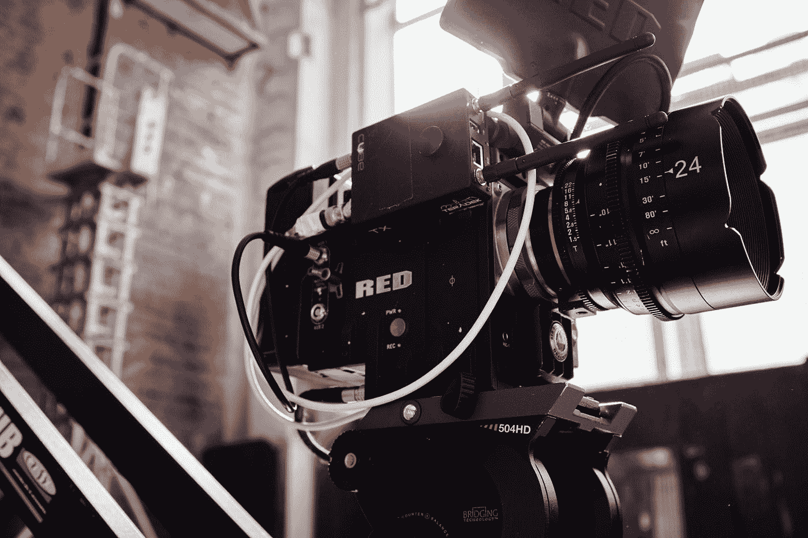

# 你长大后想做什么？

> 原文：<https://medium.datadriveninvestor.com/what-do-you-want-to-be-when-you-grow-up-85b445322d39?source=collection_archive---------36----------------------->

## 18 年后我对这个问题的感受

Photo by [Estée Janssens](https://unsplash.com/@esteejanssens?utm_source=medium&utm_medium=referral) on [Unsplash](https://unsplash.com?utm_source=medium&utm_medium=referral)

这篇文章和我的许多其他文章一样，是写给那些 20 多岁的年轻人的，他们感到迷茫，不知道该如何对待自己的生活。

在成长过程中，至少在美国，我们在学校内外被问了很多次这个问题:

> 你长大后想做什么？

我记得早在我 7 岁的时候，老师和其他成年人就问过我这个问题。现在回想起来是极其怪异的。你究竟为什么要问这么年轻的人他们想要什么职业，而他们的年龄使他们能够合法地拥有这份工作？

我认为这个问题更多的是问孩子他们当时对什么感兴趣。我记得我班上的许多其他孩子都清楚地脱口而出一个答案。这可能是因为他们家里有人做了这份工作，或者他们在电视或电影上看到一个很酷的消防员，然后想:“哦，我的天哪！作为未来的工作，我可以一直在火和水的周围？我想那么做！”

即使是小时候，我也不记得曾经这样过。我不知道我父亲是做什么的，我母亲是图书管理员。为什么我要一辈子都和书在一起？我也不知道自己想成为什么样的人，尤其是在我 7 岁的时候。你的兴趣基于你的经历。我已经活了七年了，是什么样的经历改变了我的生活，让我觉得“我想这么做”？

我现在要诚实地告诉你:我不记得在我 10 岁之前我对这个问题说过什么。我不知道我想成为什么，因为我觉得这个问题很可怕。我不像其他孩子在提出问题时会很兴奋。我会停下来，迅速想出一个答案来回避这个问题。

因为我一生都在纠结这个问题，所以今天我将带你们走一趟我从中学开始就给出的每一个答案的旅程。这些是按时间顺序排列的。

## 视频游戏设计师

Photo by [Mika Baumeister](https://unsplash.com/@mbaumi?utm_source=medium&utm_medium=referral) on [Unsplash](https://unsplash.com?utm_source=medium&utm_medium=referral)

从 5 岁左右开始，我就一直在玩电子游戏。我玩过并爱上的第一个游戏是口袋妖怪。这可能是游戏机颜色的红色或黄色。对我来说，这不仅仅是浪费时间，即使是在那个时候。我喜欢去任何地方发现新的生物，然后阅读他们的 Pokedex 条目，并对这种生物的存在或有人创造的生物着迷。

我记得我很小的时候，打开 Pokedex，一遍又一遍地阅读每个口袋妖怪的信息，一读就是几个小时。

在后来有更多颜色和更好图形的视频游戏中，比如 GameCube，我被某人如何创造整个世界迷住了。有人创造了艺术，银幕上的文字，声音，角色和故事。我太想成为这个社区的一员了，我做到了。

Adam Sessler and Morgan Webb from X-Play on G4TV: [Source](https://www.theouterhaven.net/2020/07/x-play-and-g4-appear-to-be-coming-back-in-2021/)

我会和我的朋友谈论他们几个小时，我甚至会看 G4 频道，当它第一次出现时，我惊讶地发现有一个完整的电视频道专门为像我这样的成年人服务！还有其他成年人对这些游戏着迷。亚当·塞斯勒和摩根·韦伯会观察一场比赛的每一个小细节，然后根据精彩程度或糟糕程度给它打分。这给了我希望，这是一个可行的职业。

随着年龄的增长，我开始尝试艺术。无论我画得多努力或多长，我都不擅长。现在，是的，艺术是主观的，但它远不是我这个年龄或更年轻的大多数人所能创造的，甚至在我的一生中参加艺术课程似乎也没有帮助。

当我告诉父母和其他成年人这是我想做的事情时，我失去了希望，他们会告诉我这不是一个可行的职业选择，我必须像他们一样找到一份更“正常”的工作。现在我很聪明，不会听他们的，但作为一个孩子，真的很难做到这一点，并坚持自己的信仰。

这仍然是我感兴趣的事情，我想最终，我会在某种程度上从事与电子游戏相关的职业。

## 厨师/宴会承办人/生产线厨师

Photo by [Sebastian Coman Photography](https://unsplash.com/@sebastiancoman?utm_source=medium&utm_medium=referral) on [Unsplash](https://unsplash.com?utm_source=medium&utm_medium=referral)

我喜欢食物。我也喜欢烹饪。我从小到大都是妈妈在厨房做饭。每当她做晚饭或烤新东西时，她都会让我和她一起在厨房做饭。我会帮助品尝测试新的食谱，做一些孩子能做的小事，比如打开好时巧克力饼干或者搅拌意大利面。

即使在高中，我也会在课堂上幻想为一家大餐厅做饭，并在专业的厨房里与同样热爱美食的志趣相投的人一起学习烹饪。

这一直是电子游戏生涯中的 B 计划，而电子游戏一直是我真正的激情所在。我很快开始了解到很多厨师的收入并不高。由于压力或其他原因，他们中的许多人似乎对自己的工作不满意。

真正让我恼火的是，当我在高中毕业后的第一所社区大学报名参加课程时，我发现烹饪艺术课长达六个小时，每周有多天。我可以这么做，但是不用了，谢谢。我决定去做另一个专业，也是我至今还在思考的最后一个专业:

## 制片

Photo by [Andrej Lišakov](https://unsplash.com/@lishakov?utm_source=medium&utm_medium=referral) on [Unsplash](https://unsplash.com?utm_source=medium&utm_medium=referral)

啊电影课。高中对我来说非常好，选修明智。我和几个朋友一起上了电影课，还上了工程设计技术课，这是我第二喜欢的课。

在电影课上，老师允许我们使用索尼摄像机，它有很好的自动对焦功能，需要时有麦克风插孔和录音按钮。老师会给我们一个提示，我们和几个朋友一起为整个班级拍摄，然后在 Adobe Premiere Pro 中一起编辑我们的剪辑，这是一款我至今仍在使用的软件。不幸的是，我们三个人必须共用一台电脑，所以我们必须轮流编辑来学习这个程序。

当我想用正常的*溶解*过渡过渡到下一个剪辑时，我们会以争吵结束，我的朋友会加入一个*立方体旋转，*我会让**非常**激动。

这门课仍然非常有趣。我们可以制作几乎任何我们想要的东西，我可以自己做额外的项目，我学到了很多关于什么让一些视频很棒，什么让另一些很糟糕。

直到今天，我还保留着一台用来拍摄视频的相机。有时我独自做，或者和我的一些朋友一起做，他们也是有创造力的有趣的人。我发现我想保持这只是一种激情。有时我听说电影业有多棒，有时我听说让你的激情成为你的工作会永远毁了它。我会一直把制作视频作为我的激情，如果我最终通过自主创业来赚钱，那对我来说也没什么。

# 我今天在哪里

Photo by [Becca Tapert](https://unsplash.com/@beccatapert?utm_source=medium&utm_medium=referral) on [Unsplash](https://unsplash.com?utm_source=medium&utm_medium=referral)

我今年 25 岁。在一年没有卖出一套房子后，我刚刚退出房地产行业，并开始理解这对我的心理健康有多么有害。我在 2020 年的整个时间里都很迷茫，直到我决定我应该试着回到学校。

我热爱学习，我想选择一个能给我在感兴趣的公司提供很多工作选择的学位，那就是**工程**。我也一直和我的朋友一起拍摄令人惊叹的照片，这已经成为我的一种激情。我终于找到了一份汽车摄影师的工作，这份工作非常棒。我还在一个科技博客找到了一份作家的工作，这已经成为我的另一个爱好了！

我仍然不知道大学毕业后几年我会在哪里，但我对我的职业道路充满希望，也许那时我就能负担得起一个住的地方。

> 马萨诸塞州的工资和生活水平

无论你生活在哪里，我希望这个故事能给你一些视角，让你了解其他同龄人是如何应对他们的千禧年生活危机的。继续坚强，做自己喜欢的事情，继续奋斗。这是我们学习的方式。