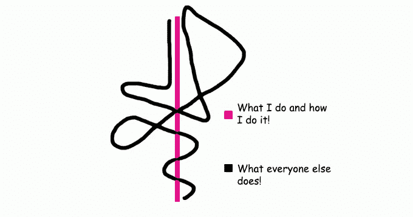

# 品牌个性对提供服务的人意味着什么？

> 原文：<https://medium.datadriveninvestor.com/what-does-brand-personality-mean-to-someone-providing-a-service-1f2ca33f6240?source=collection_archive---------17----------------------->

JUST BE YOURSELF BECAUSE EVERYONE ELSE IS TAKEN

你还记得你有过的最好的客户吗？你能回忆起让双方都满意的经历的细节吗？你遇到过的最差的客户呢？你还记得为什么他们不合适吗？

你喜欢那个完美客户的什么？他们喜欢你什么？哪些独特的环境包含了不理想的客户，阻碍他们从你提供的服务中获益？

你很可能没有意识到这些答案，但是正是这种意识让“赋予女性权力”、“激发激情”和“采取大规模行动”变得毫无意义。有时候，客户用来描述吸引他们并把他们与我们的业务联系在一起的词语甚至与他们真正的意思无关。因此，为了控制你提供的服务所创造的体验，有必要了解你所服务的人所表达的内容，以及你不服务的人的反应。

一旦你对自己是谁、自己是什么有了切实的认识，并且已经坚定不移地向客户展示了几次，那就是你可以退一步，将自己的个性定义为一个品牌，并在行动中变得更有目的性的时候了，不管发生什么。

那么，你是一个讨人喜欢的人吗？你是一个反对或拒绝流行观点的人吗？是什么让你对自己充满自信？挑战你自己，只考虑你正在做的事情，来帮助你测试你人格的真实性。

# 个性是有经验的

对于提供令人垂涎的服务的人来说，他们的个性也是一种真诚的、可区分的特质，他们的理想客户认为这种特质在行业中是不常见的。

最近，我的一个客户告诉我，她喜欢我从她所做的事情中提取精华的能力，因为这种能力产生了艺术的清晰度、她表达自己的真实性，以及为未来的努力做出正确决定的信心。最初，她说重视我在这个她个人认为缺乏诚信的行业中的诚实和热情。

但是，你抓住了重要的一课吗？

你的品牌的个性可以和你自己的个性有一些重叠，但是，它也可以像东方和西方一样遥远。此外，如果你做的事情背后没有意图或想法，你可能最终会拒绝合适的人，因为你的个性很糟糕！

# 不要低估品牌个性的微妙优势

多种因素促使我投资 5000.00 美元 TTD 在一个在线课程上，而我并不认识投稿人，也没有对他们做任何研究。直到今天，他们的赃物是迄今为止最让我兴奋的东西。这感觉就像看着一面镜子，认同那些我无法用语言表达的内在特质，直到我看到了自己的外在。但是，说出被认为令人震惊的事情的信心来自于经验，知道你为谁服务最好，并且谦逊地接受别人不理解你的观点甚至拒绝它。

我看到当地的小企业主很难发展这种特性，因为他们更喜欢数字带来的虚假的确认感，而不是少数忠实买家的 4 位数和 5 位数的支出。因此，他们会有很好的想法，会引起很多人的兴趣，但不会给潜在买家留下采取行动的印象。

想象一下，选择打捞一个 97 人不与你做生意的电子邮件列表，超过 3 人与你做生意！当别人喜欢你的时候，和一个明显不喜欢你的人在一起有什么意义呢？这些不安全感阻碍了许多人减轻负担，因为这些数字给人一种错觉。这使得他们看起来比他们真正的对手更受欢迎。

努力理解你服务的对象，这样你的方法就能符合他们的需求，了解他们是谁，摆脱那些明显浪费你时间的人。那些通过他们提供的服务持续获得成功的小企业主分享了这条共同的线索。我的意思是，他们通过做自己来建立自己的品牌；以他们想要的方式做事；而不是像其他人一样。

如果你想吸引那种会因为你的真实身份而深深爱上你的客户，拥有一个有魅力的个性(对你来说是真实的，与外界的不同)**是关键**。但是，如果你对实现它感到迷茫，只需点击[这里](https://bit.ly/whatbrandpersonalitymeans)，这 20 个问题将帮助你开始寻找可以揭示你的品牌个性的地方。

我是 [**品牌桶**](http://bit.ly/TheBrandTUB) 的创始人和视觉品牌策略师