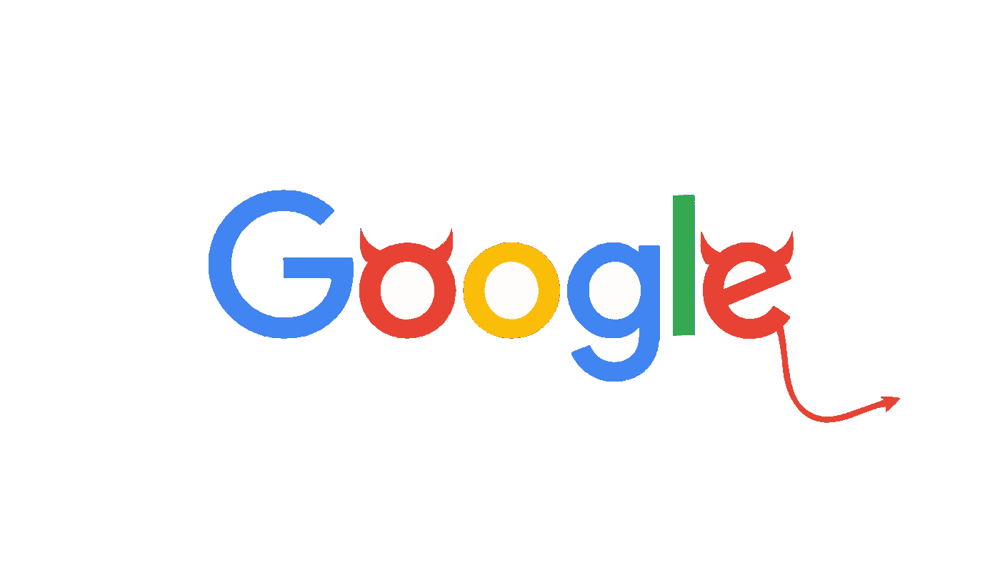

# 谷歌到底了解你什么

> 原文：<https://medium.datadriveninvestor.com/what-does-exactly-google-know-about-you-353b4922a5c?source=collection_archive---------17----------------------->

## 意见

## 我用什么来换取“免费”服务？

Source: [Medium Article](https://medium.com/@stewofkc/google-removes-dont-be-evil-from-its-code-of-conduct-c636bf18be1c)

嘿，谷歌一下，明天早上 6 点叫醒我。

*嘿谷歌*，今天天气怎么样？

*嘿谷歌*’，叫妈妈。

从醒来到入睡，以及这之间的一切，谷歌都是我不变的伴侣。它处理我所有的无聊任务，比如维护待办事项列表、设置闹钟、为我安排日程等等。我相信这对你也一样。

但是代价是什么呢？为了得到这样一个**免费**的无价服务，我放弃了什么？

我知道这是我的数据，但到底是什么呢？谷歌到底用它做什么？我怎样才能安全？

> 如果你不为产品付费，你就是产品
> 
> 安德鲁·刘易斯

# 这是你要送出的东西

你可能没有意识到，但你的日常决策是由谷歌做出的，或者至少是受谷歌影响的。

现在你们中的一些人可能认为隐私和数据没什么大不了的。为什么谷歌会关心我今天做了什么？，'*我不在乎谷歌知道我什么时候醒来。*

我以前也这么想。

这就是我们都**错**的地方。在看了网飞上的[社交马得利之后，我震惊了，我的意思是他们不能控制我；我知道我在做什么。](https://www.netflix.com/in/title/81254224)

我不喜欢。

谷歌叫醒我我就醒了；然后，我通过谷歌查看我的 Gmail、天气、日程安排、点咖啡、健身、新闻、音乐，查看上班路线，以这样或那样的方式查看一切。

现在，我做这些事情的时候都没有想太多，一切似乎都很自然。他们毫不费力，这是关键。

他们知道我喜欢什么视频，我都买了什么，我用什么卡，我去哪里，我搜索什么，我喜欢什么东西，我给谁打电话最多，我接下来要做什么，等等等等…..

 [## 擅长谷歌是一种技能|数据驱动的投资者

### 擅长‘谷歌’是一种技能。是的，你听到了。知道什么和如何谷歌或搜索的东西是一个…

www.datadriveninvestor.com](https://www.datadriveninvestor.com/2020/08/11/being-good-at-google-is-a-skill/) 

**这还没有结束。**

当我使用他们的服务时，应用程序正在计算- [我移动光标的速度；下一步我要点击什么](https://www.theregister.com/2010/07/27/google_patents_mouse_movement_search_tweaks/)；我在哪个屏幕上花了多少时间，以及点击之间的时间间隔；什么产品会吸引我做广告；我现在在想什么？等等，等等，等等，他们能得到的每一点数据。

你可能还是会说‘*那又怎样？“这让我的生活更轻松了，不是吗，”*

是的，它让我们的生活变得更容易，我并不反对使用这项服务，我每天都在使用它，即使是现在。

我只是请你注意，三思，在你点击那个按钮之前，问问你自己'我真的想看，玩，读，或者买那个东西吗？你可能不想这样做，但是因为算法在建议你这样做。

记住，算法的工作是让你留在平台上；以获得更多的点击量、浏览量和数据。你的工作是知道什么对你最好。

**更加自觉。**

当你使用谷歌或任何服务时，数据只是其中的一部分。你真正给他们的是你宝贵的时间、注意力和一些你永远无法收回的控制权。

> 互联网是一个巨大的社会实验，我们都是实验品，自我反省是逃避

# 谷歌怎么处理你的数据？

谷歌用你的数据来吸引广告商。你的数据允许谷歌向你展示相关广告——你最有可能点击的广告。但是还有更多。

现在没有一个头脑正常的人会点击谷歌显示的所有广告，事实上，我们忽略了大部分广告。

在看 YouTube 视频的时候，如果有广告出现，我就把手机倒过来，去冰箱里拿些冰淇淋，等我回来的时候，广告已经不见了。如果我在谷歌上搜索，我会忽略前 3 个搜索；如果我正在阅读某篇文章，我几乎看不到左右窗格。

**谷歌知道**。因此，他们多次向你展示同一个广告。目标不仅仅是获得点击；如果你点击它很好，如果不是，他们想把这个东西植入你的大脑。

假设我收到一个 Udemy 课程的广告，现在我不会第一次点击它，它会一次又一次地显示给我。现在，当我想学习新的东西时，只有一个选择:Udemy。下次广告来的时候，我会点击它。

## 谷歌服务

谷歌从我们这里收集的数据被用来改善他们的服务:它使地图、搜索、照片、助手、推荐系统和他们的算法变得更好。

你可能认为你正在接受所有这些免费的服务，但你不是。Google home 使用 google assistant、搜索地图和其他服务，我们都已经训练了多年。现在，我们以谷歌手机、谷歌主页和谷歌巢的形式为这些服务付费。

谷歌也向其他公司出售这些服务，你可以[购买地图 API](https://cloud.google.com/maps-platform/pricing/?_ga=2.189875375.568933301.1601544997-588175692.1601544997) 在你自己的应用程序或游戏中使用。他们收集的所有数据都被用来创造更好的人工智能，然后卖给其他[公司](https://www.nytimes.com/2018/01/17/technology/google-sells-ai.html)、[军方](https://www.vox.com/technology/2018/10/18/17989482/google-amazon-employee-ethics-contracts)和[政府](https://www.cnbc.com/2019/07/17/google-china-what-businesses-the-search-giant-has-in-the-country.html)。

 [## 苹果虚拟专用网是下一件大事

### 忘记智能手机和笔记本吧，隐私是新的竞技场

medium.com](https://medium.com/datadriveninvestor/apple-vpn-is-the-next-big-thing-efac18a3a678) 

**也不全是黑暗，也有一线希望**。谷歌使我们能够做我们以前从未想象过的事情，你知道它是如何改变你的生活的。

它让残疾人的生活变得更加轻松和快乐。 [Google Euphoria](https://venturebeat.com/2019/05/07/google-ai-accessibility-project-euphonia-diva-live-relay/) 旨在帮助有语言障碍的人更有效地交流。谷歌的另一个项目是现场转播，旨在帮助有听力问题的人。 [Project Diva](https://venturebeat.com/2019/05/07/google-ai-accessibility-project-euphonia-diva-live-relay/) 是为那些不能用声音触发谷歌助手的人准备的。

# 你如何拯救自己

问题是，谷歌并不是被设计成邪恶的。没有人想让互联网变得有害，在社会上分裂我们，或者控制我们。

它之所以成为所有这些东西，是因为这是唯一能够维持所有这些公司(如谷歌、脸书或 Snapchat)的商业模式；他们通过广告赚钱，收集你的数据来展示相关广告是提供最佳服务和实现利润最大化的唯一途径。

谷歌也在努力改善你的数字福祉。他们发布了 Android 数字福利计划。所以你只在需要的时候用手机。

出于隐私考虑，他们允许你从谷歌上删除你的数据。你还可以使用[谷歌外卖](https://takeout.google.com/settings/takeout)查看谷歌拥有的所有关于你的数据。

这些举措很棒，我很高兴至少有几家公司正在这么做，**，但这还不够。**

每天，我们都受到来自所有感官的信息轰炸，在这一点上，我们无法逃避。这不是关于谷歌或脸书或任何公司。任何有网络连接的人都可以创造内容来影响你。

> 自己做选择，不要让任何算法控制你。

我们只能做一件事，更加清醒。意识到我们的喜好、厌恶、偏好、想法、观点、心态、知识来源和我们的周围环境。

当谷歌、脸书或任何这些公司拥有我们的数据时，它不会影响我们大多数人。当我们无法为自己做出决定和选择时，它会影响我们所有人，而算法会为我们做这件事。

## 访问专家视图— [订阅 DDI 英特尔](https://datadriveninvestor.com/ddi-intel)