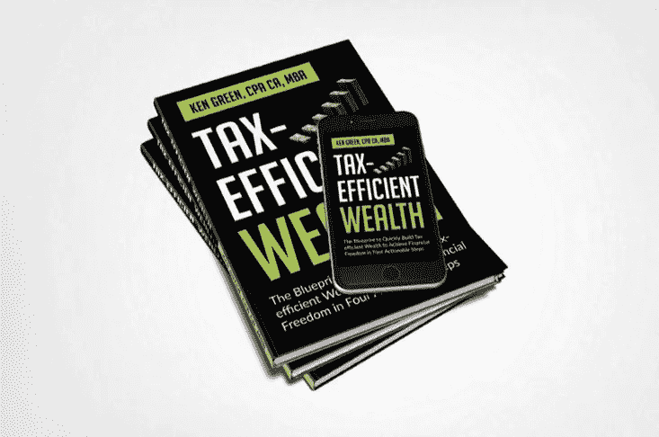

# 财务独立对你来说意味着什么？

> 原文：<https://medium.datadriveninvestor.com/what-does-financial-independence-mean-to-you-3674b03e3b1f?source=collection_archive---------23----------------------->

## 你能从肖恩·库珀身上学到什么？他用三年时间还清了抵押贷款，走向了经济独立

Photo by [Fernando Brasil](https://unsplash.com/@nandovish?utm_source=unsplash&utm_medium=referral&utm_content=creditCopyText) on [Unsplash](https://unsplash.com/s/photos/financial-freedom?utm_source=unsplash&utm_medium=referral&utm_content=creditCopyText)

最近，我有机会采访两位 30 多岁就实现了经济独立的加拿大人。

我很想直接听到他们的声音，并更好地了解他们是如何做到的，需要付出什么，以及他们在通往财务独立的道路上的经历。

在这些采访中，有一件事引起了我的注意:尽管他们通过部署不同的策略实现了财务独立，但他们是通过专注于一个基本概念来实现的——在很早的时候增加他们的储蓄率。

 [## 金融顾问今天应该拥抱虚拟实践模式的 5 个理由|数据驱动…

### 随着对办公空间长期租赁的需求在新冠肺炎疫情时代彻底崩溃，办公空间的需求也在下降

www.datadriveninvestor.com](https://www.datadriveninvestor.com/2020/05/21/5-reasons-why-financial-advisors-should-embrace-the-virtual-practice-model-today/) 

今天，我分享肖恩·库珀的故事，他是一个普通的加拿大工人阶级，和我们大多数人一样。肖恩，选择一条财务独立的道路，集中精力在 3 年内还清抵押贷款。不仅仅是抵押贷款，他在 3 年内还清了大约 30 万美元的抵押贷款。这太不可思议了，你知道吗，他是靠着日常工作不到 10 万美元的年薪做到这一点的。

你可以在下面听听他的惊人故事，以及他是如何做到的:

By Author: Exclusive Interview with Sean Cooper

财务独立每个人都不一样。然而，在我继续之前，让我们定义一下财务独立。

谷歌搜索会发现许多答案。根据维基百科的定义，财务独立是指拥有足够的收入来支付自己余生的生活费用，而不必被雇佣或依赖他人的状态。

在北美，有一个越来越流行的运动(财务独立，提前退休)。他们对财务独立的定义与上面维基百科的定义一致。

我完全同意这一点，我喜欢火运动所教授的所有基本概念。为了在更深层次上更好地理解财务独立，让我们来探讨一下它不是什么。

要做到这一点，探索每当我们听到或想到财务独立时脑海中浮现的图像是有帮助的。想到了什么？

大赚一笔？

继承一笔财富？

中奖了？

异国旅行？

住豪宅？

花哨的珠宝、汽车和名牌服装？

这是我的想象。正如 Vicki Robin 在她杰出的著作《你的钱还是你的生活》中指出的那样，我们大多数人都认为财务独立是一种遥不可及的幻想，拥有取之不尽的财富。这是物质层面的财务独立。

她接着指出，如果我们从物质层面看待财务独立，它只会要求我们变得富有。但是到底什么才算富有呢？

富裕只存在于与某物或某人的比较中。这意味着你可能永远都不够富有。

> ***“男人不渴望富有，只渴望比其他男人更富有。”约翰·斯图亚特·米尔***

根据维基的说法，财务独立与富有无关。这是一种拥有足够多的经历。

Photo by [Simon Migaj](https://unsplash.com/@simonmigaj?utm_source=unsplash&utm_medium=referral&utm_content=creditCopyText) on [Unsplash](https://unsplash.com/s/photos/exotic-travel?utm_source=unsplash&utm_medium=referral&utm_content=creditCopyText)

当你达到满足曲线的顶点时，就足够了。换句话说，你有足够的钱来生存，并获得所有你需要的舒适和奢侈品来体验生活的充实。

这是可以量化的。这是可以实现的。对你来说足够和对你的邻居来说足够可能是不同的，因为满足你的不一定满足你的邻居。

这种经济独立的概念会让你更深入地去发现什么能满足你。它会让你计划和设计满足你的生活方式。更重要的是，它将把你从所有与邻居攀比的麻烦中解救出来。

# 结论

我是财务独立的粉丝，我的承诺是帮助尽可能多的人达到财务独立的目标——拥有足够的体验。

实现财务独立需要清晰的思路。它需要目标。这需要改变金钱观念。这需要仔细的计划。这需要一定的知识水平。这需要使用对你有意义的策略来有意识地执行。

***附注:我的使命是用金融教育武装你。这是我开始在媒体上写作的一个原因，也是我写节税型财富的原因。这本书将帮助你以节税的方式加速你的财富。拿一本我的新书《节税型财富》*** ***的免费电子书版本，来学习如何利用能帮你省下一吨税的策略快速积累财富。***

Image Credit: Author

**访问专家视图—** [**订阅 DDI 英特尔**](https://datadriveninvestor.com/ddi-intel)